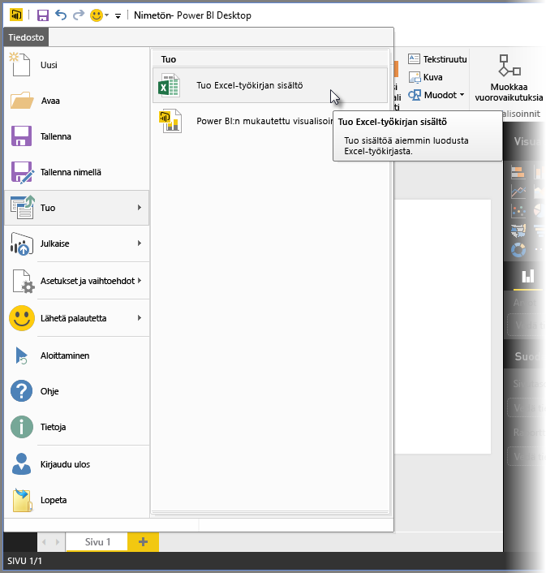
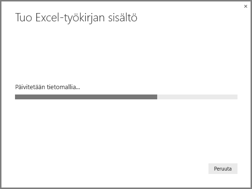
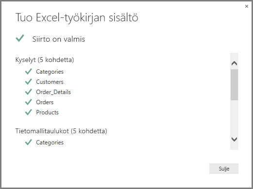
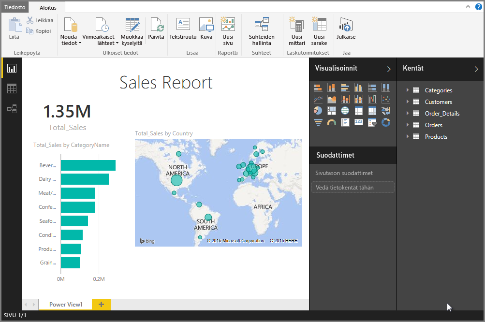

# Excel-työkirjojen tuominen Power BI Desktopiin
**Power BI Desktopin** avulla voit helposti tuoda Power BI Desktopiin Excel-työkirjoja, joihin sisältyy Power Query -kyselyitä, Power Pivot -malleja ja Power View -laskentataulukoita. Raportit ja visualisoinnit luodaan automaattisesti Excel-työkirjan perusteella, ja kun ne on kerran tuotu, voit edelleen parantaa ja tarkentaa kyseisiä raportteja Power BI Desktopin avulla käyttämällä olemassa olevia ominaisuuksia ja uusia ominaisuuksia, jotka julkaistaan Power BI Desktopin kunkin kuukausipäivityksen yhteydessä.

Tulevaisuudessa on tarkoitus tarjota lisää tietoliikennettä Excelin ja Power BI Desktopin välille (kuten tuonti tai vienti); nykyinen mahdollisuus tuoda työkirjoja Power BI Desktopiin mahdollistaa nykyisille Excelin käyttäjille Power BI Desktopin käytön aloittamisen.

## Miten Excel-työkirja tuodaan?
Voit tuoda työkirjan valitsemalla Power BI Desktopista **Tiedosto -\> Tuo -\> Excel-työkirjan sisältö**.

Näyttöön tulee ikkuna, josta voit valita tuotavan työkirjan. Tällä hetkellä työkirjan objektien kokoa tai määrää ei ole rajoitettu, mutta Power BI Desktopilla kestää kauemmin suurten työkirjojen analysoinnissa ja tuonnissa.

> [!NOTE]
> Voit ladata tai tuoda Excel-tiedostoja **jaetuista OneDrive for Business** -kansioista tai **Office 365 -ryhmän** kansioista käyttämällä Excel-tiedoston URL-osoitetta ja syöttämällä sen Power BI Desktopin **Verkko**-tietolähteeseen. Sinun on suoritettava muutama vaihe, jotta **OneDrive for Business** -URL-osoitteen muotoilu olisi oikein, joten katso [OneDrive for Business -linkkien käyttö Power BI Desktopissa](desktop-use-onedrive-business-links.md) lisätietoja ja vaiheiden oikeaa järjestystä varten.
> 
> 

Kun työkirja on valittu, Power BI Desktop analysoi työkirjan ja muuntaa sen Power BI Desktop -tiedostoksi (.pbix). Tämä toiminto on kertaluonteinen tapahtuma; kun Power BI Desktop -tiedosto on näiden vaiheiden myötä luotu, Power BI Desktop -tiedoston ja alkuperäisen Excel-työkirjan välillä ei ole riippuvuutta, ja uutta tiedostoa voi muokata tai muuttaa (sekä tallentaa ja jakaa) vaikuttamatta alkuperäiseen työkirjaan.

Kun tuonti on tehty, esiin tulee **Yhteenveto**-sivu, jossa kuvataan muunnetut kohteet sekä luetellaan mahdolliset kohteet, joita ei voitu tuoda.

Kun valitset **Sulje**, raportti ladataan Power BI Desktopiin. Alla olevassa kuvassa on Power BI Desktop Excel-työkirjan tuonnin jälkeen: Power BI Desktop latasi raportin automaattisesti työkirjan sisällön perusteella.

Nyt kun työkirja on tuotu, voit jatkaa raportin parissa työskentelyä – esimerkiksi luoda uusia visualisointeja, lisätä tietoja tai luoda uusia raporttisivuja – minkä tahansa Power BI Desktopiin sisältyvien toimintojen ja ominaisuuksien avulla.

## Mitkä työkirjan elementit tuodaan?
Power BI Desktop voi tuoda seuraavat elementit, joita kutsutaan Excelissä yleisesti nimellä *objektit*.

| Objekti Excel-työkirjassa | Lopullinen tulos Power BI Desktop -tiedostossa |
| --- | --- |
| Power Query -kyselyt |Kaikki Excelin Power Query -kyselyt muunnetaan kyselyiksi Power BI Desktopissa. Jos Excel-työkirjaan oli määritetty kyselyryhmiä, sama organisaatio replikoidaan Power BI Desktopiin. Kaikki kyselyt ladataan, paitsi jos on määritetty Excelissä tilaan ”Luo vain yhteys”. Lataustoimintaa voi mukauttaa **Ominaisuudet**-valintaikkunassa Power BI Desktopin **Kyselyeditorin** **Aloitus**-välilehdellä. |
| Power Pivotin ulkoiset tietoyhteydet |Kaikki Power Pivotin ulkoiset tietoyhteydet muunnetaan kyselyiksi Power BI Desktopissa. |
| Linkitetyt taulukot tai nykyisen työkirjan taulukot |Jos Excelissä on laskentataulukon taulukko, joka on linkitetty tietomalliin tai kyselyyn (käyttämällä *Taulukosta* tai *Excel.CurrentWorkbook()*-funktiota M:ssä), näytetään seuraavat vaihtoehdot: 1. Tuo taulukko Power BI Desktop -tiedostoon. Tämä taulukko on kertaluonteinen tilannevedos tiedoista, jonka jälkeen et voi muokata taulukon tietoja Power BI Desktopissa. Tämän vaihtoehdon avulla luotujen taulukoiden kokorajoitus on miljoona merkkiä (yhteensä kaikki sarakeotsikot ja solut yhteen laskettuina). 2. Säilytä yhteys alkuperäiseen työkirjaan. Vaihtoehtoisesti voit säilyttää yhteyden alkuperäiseen Excel-työkirjaan, ja Power BI Desktop noutaa kyseisen taulukon uusimman sisällön kunkin päivityksen yhteydessä samaan tapaan kuin mikä tahansa muu kysely, joka on luotu Excel-työkirjaa vasten Power BI Desktopissa. |
| Tietomallin lasketut sarakkeet, mittayksiköt, suorituskykyilmaisimet, tietoluokat ja suhteet |Nämä tietomallin objektit muunnetaan Power BI Desktopin vastaaviksi objekteiksi. Huomaa, että on tiettyjä tietoluokkia, jotka eivät ole käytettävissä Power BI Desktopissa, kuten **Kuva**. Näissä tapauksissa tietoluokkaa koskevat tiedot palautetaan kyseessä olevien sarakkeiden osalta. |
| Power View -laskentataulukot |Uusi raporttisivu luodaan jokaiselle Excelin Power View -laskentataulukolle. Näiden raporttisivujen nimi ja järjestys vastaavat alkuperäistä Excel-työkirjaa. |

## Onko työkirjan tuomiselle rajoituksia?
Työkirjan tuomiselle Power BI Desktopiin on joitakin rajoituksia, jotka esitetään seuraavassa luettelossa:

* **Ulkoiset yhteydet Analysis Services -palveluiden taulukkomalleihin:** Excel 2013:ssa on mahdollista luoda yhteys SQL Server Analysis Services -palveluiden taulukkomalleihin ja luoda Power View-raportteja näiden mallien lisäksi ilman, että tietoja tarvitsee tuoda. Tätä yhteystyyppiä ei tällä hetkellä tueta osana Excel-työkirjojen tuomista Power BI Desktopiin. Vaihtoehtoisena menetelmänä sinun on luotava nämä ulkoiset yhteydet uudelleen Power BI Desktopissa.
* **Hierarkiat:** tämäntyyppistä tietomalliobjektia ei tällä hetkellä tueta Power BI Desktopissa. Näin ollen hierarkiat ohitetaan osana Excel-työkirjan tuomista Power BI Desktopiin.
* **Binaarista tietoa sisältävät sarakkeet:** tämäntyyppistä tietomallisaraketta ei tällä hetkellä tueta Power BI Desktopissa. Binaarista tietoa sisältävät sarakkeet poistetaan tuloksena olevasta taulukosta Power BI Desktopissa.
* **Power View -elementit, joita ei tueta:** on joitakin Power View -ominaisuuksia, jotka eivät ole käytettävissä Power BI Desktopissa, kuten teemat tai tietyntyyppiset visualisoinnit (pistekaavio, jossa PlayAxis, porautumistoiminnot jne.). Visualisoinnit, joita ei tueta, johtavat sanomiin *Visualisointia ei tueta* niitä vastaavissa Power BI Desktop -raportin sijainneissa; voit poistaa tai määrittää ne uudelleen tarpeen mukaan.
* **Nimetyt alueet, jotka käyttävät** ***Taulukosta*** **kohteessa Power Query tai**  ***Excel.CurrentWorkbook*** **kohteessa M:** näiden nimetyn alueen tietojen tuomista Power BI Desktopiin ei tueta tällä hetkellä, mutta se on Power BI Desktopin suunniteltu päivitys. Tällä hetkellä nämä nimetyt alueet ladataan Power BI Desktopiin yhteytenä ulkoiseen Excel-työkirjaan.
* **PowerPivot SSRS:ään:** PowerPivotin ulkoisia yhteyksiä SQL Server Reporting Servicesiin (SSRS) ei tueta tällä hetkellä, sillä kyseinen tietolähde ei ole tällä hetkellä käytettävissä Power BI Desktopissa.

