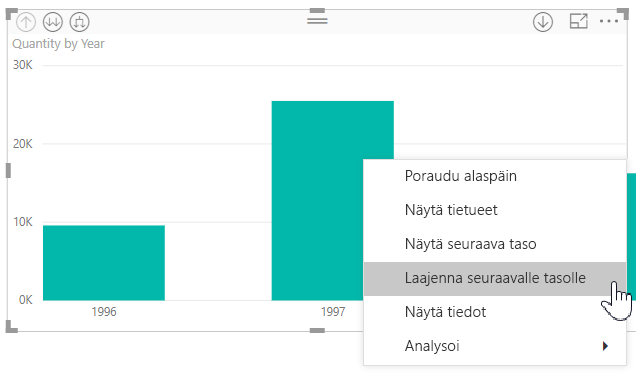
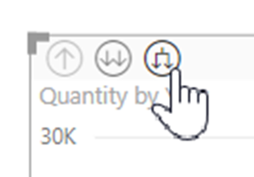
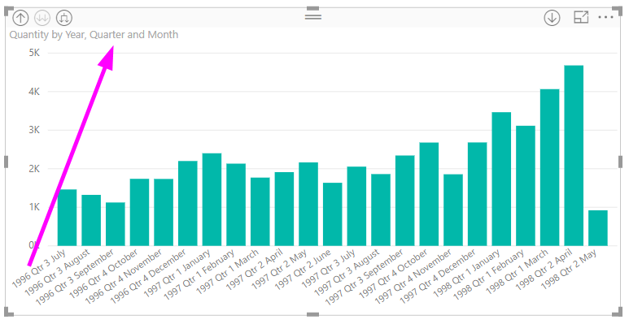
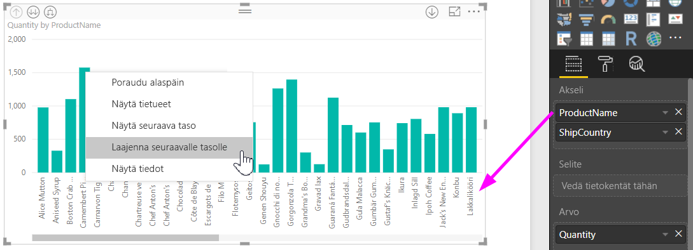
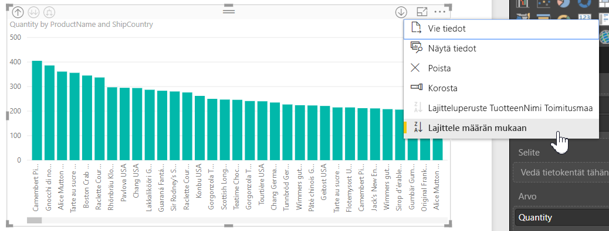
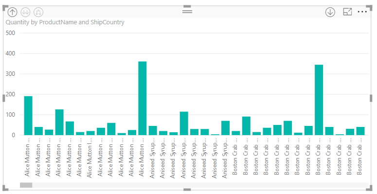

# Sidottujen hierarkiaselitteiden käyttö Power BI Desktopissa
**Power BI Desktop** tukee **sidottuja hierarkiaselitteitä**, joka on ensimmäinen kahdesta ominaisuudesta, joiden tarkoituksena on parantaa hierarkkista porautumista. Toisen ominaisuus, joka on tällä hetkellä kehityksen alla, on mahdollisuus käyttää sisäkkäisiä hierarkiaselitteitä (pysy kuulolla, sillä päivityksiä tehdään usein).   

## Sidottujen hierarkiaselitteiden toiminta
Sidottujen hierarkiaselitteiden avulla näet hierarkiaselitteet laajentaessasi visualisointeja **Laajenna kaikki** -ominaisuudella. Yksi hieno etu hierarkiaselitteiden näyttämisessä on se, että voit myös halutessasi **lajitella** näiden eri hierarkiaselitteiden mukaan laajentaessasi hierarkkisia tietoja.

### Sisäisen Laajenna-ominaisuuden käyttäminen (ilman lajittelua hierarkiaselitteiden perusteella)
Ennen kuin tarkastelemme sidottuja hierarkiaselitteitä toiminnassa, tutustumme siihen, miten oletusarvoinen **Laajenna seuraavalle tasolle** -ominaisuus toimii. Tämä auttaa ymmärtämään (ja arvostamaan) sitä, miten hyödyllisiä sidotut hierarkiaselitteet voivat olla.

Seuraavassa kuvassa näkyy palkkikaavion visualisointi vuosittaiselle myynnille. Kun napsautat palkissa hiiren kakkospainikkeella, voit valita **Laajenna seuraavalle tasolle** -vaihtoehdon.

> [!NOTE]
> Vaihtoehtona palkin napsauttamiselle hiiren kakkospainikkeella voit valita *Laajenna*-painikkeen visualisoinnin vasemmassa yläkulmassa.

  

Kun **Laajenna seuraavalle tasolle** on valittuna, visualisointi laajentaa päivämäärän hierarkian *vuodesta* *vuosineljännekseen* seuraavassa kuvassa esitetyllä tavalla.

Huomaa, että *Vuosi*- ja *Vuosineljännes*-otsikot näkyvät sidottuina yhdessä – tämä seliterakenne jatkuu, kun valitset **Laajenna kaikki** hierarkian alareunaan saakka.

Näin käyttäytyy sisäinen *Päivämäärä*-hierarkia, joka liittyy kenttiin, joiden tietotyyppinä on *päivämäärä/kellonaika*. Siirrytään sitten seuraavaan osaan ja katsotaan, miten uusi sidottujen hierarkiaselitteiden ominaisuus on erilainen.

### Sidottujen hierarkiaselitteiden käyttäminen
Tutustutaan nyt eri kaavioon - käyttämällä tietoja, joissa on epämuodollisia hierarkioita. Seuraavassa visualisoinnissa on pylväskaavio, jossa esitetään **Määrä** ja akselina on *TuotteenNimi*. Näissä tiedoissa *TuotteenNimi* ja *Toimitusmaa* muodostavat epäviralliset hierarkian. Täältä voit valita uudelleen *Laajenna seuraavalle tasolle* -vaihtoehdon porautuaksesi hierarkiaan.

Valitsemalla **Laajenna seuraavalle tasolle** -vaihtoehdon voit näyttää seuraavan tason sidotuilla hierarkiaselitteillä. Oletusarvon mukaan sidotut hierarkiat lajitellaan mittariarvon mukaan – tässä tapauksessa se on **Määrä**. Kun sidotut hierarkiaselitteet ovat käytössä, voit lajitella nämä tiedot myös hierarkian perusteella valitsemalla oikeassa yläkulmassa kolme pistettä ( **...** ) ja valitsemalla sitten **Lajitteluperuste TuotteenNimi Toimitusmaa** seuraavassa kuvassa esitetyllä tavalla.

Kun **Toimitusmaa** on valittuna, tiedot lajitellaan epämuodollisen hierarkiavalinnan perusteella seuraavassa kuvassa esitetyllä tavalla.

> [!NOTE]
> Sidotun hierarkiaselitteen ominaisuus ei vielä salli sisäisen aikahierarkian lajittelua arvon perusteella, ainoastaan hierarkiajärjestyksen perusteella.
> 
> 

## Vianmääritys
On mahdollista, että visualisoinnit jäävät jumiin laajennetun sidotun hierarkiatason tilaan. Joissakin tapauksissa saatat huomata, että jotkin visualisoinnit ovat jumissa tilassa, jossa ne laajennettiin, jolloin porautuminen ylöspäin ei toimi. Näin voi käydä, jos suoritit seuraavat vaiheet (korjaava toimenpide on näiden vaiheiden *alla*):

Vaiheet, joilla visualisoinnit saattavat jäädä jumiin laajennetussa tilassa:

1. Otat käyttöön **sidotun hierarkiaselitteen** ominaisuuden
2. Luot visualisointeja hierarkioita käyttämällä
3. Sitten valitset **Laajenna kaikki** ja tallennat tiedoston
4. Sen jälkeen *poistat käytöstä* **sidotun hierarkiaselitteen** toiminnon ja käynnistät Power BI Desktopin uudelleen
5. Sitten avaat tiedoston uudelleen

Jos suoritat nämä vaiheet ja visualisoinnit ovat jumissa laajennetussa tilassa, voit suorittaa vianmäärityksen seuraavalla tavalla:

1. Ota uudelleen käyttöön **sidotun hierarkiaselitteen** toiminto ja käynnistä Power BI Desktop uudelleen
2. Avaa tiedosto uudelleen ja poraudu takaisin alkuun asianomaisissa visualisoinneissa
3. Tallenna tiedosto
4. Poista **sidotun hierarkiaselitteen** toiminto käytöstä ja käynnistä Power BI Desktop uudelleen
5. Avaa tiedosto uudelleen

Vaihtoehtoisesti voit poistaa visualisoinnin ja luoda sen uudelleen.

