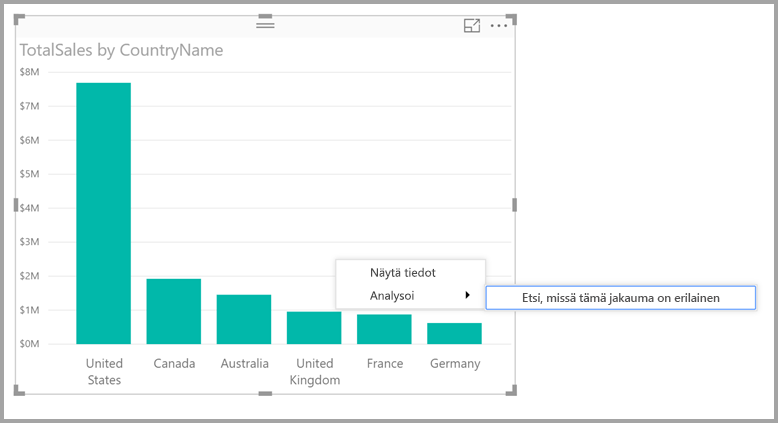
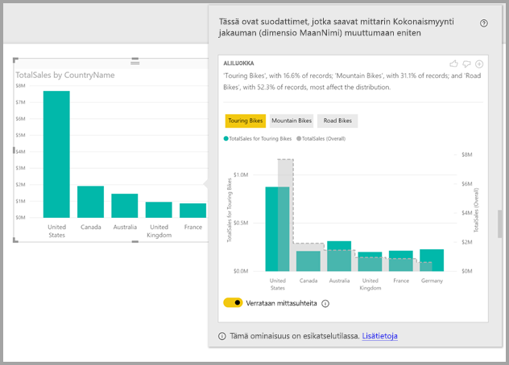

# Käytä Power BI Desktopin merkityksellisiä tietoja löytääksesi eriävät jakaumat (esikatselu)

Visualisoinneissa näkyy usein arvopiste, jonka jakaumaa olisi mielenkiintoista tutkia eri kategorioissa. **Power BI Desktopin** **merkityksellisten tietojen** avulla voit selvittää sen muutamalla napsautuksella.

Otetaan esimerkiksi seuraava visualisointi, joka näyttää *Kokonaismyynnin* *maittain*. Kaavion mukaan suurin osa kokonaismyynnistä (57 prosenttia) on peräisin Yhdysvalloista kun taas muiden maiden myynti on vähäisempää. Näissä tapauksissa on usein kiinnostavaa tutkia, näyttäytyykö jakauma samankaltaisena eri alapopulaatioissa. Pysyykö jakauma esimerkiksi samana eri vuosina, eri myyntikanavissa ja kaikissa tuoteluokissa?  Tämän selvittämiseen voi käyttää erilaisia suodattimia ja vertailla tuloksia sitten visuaalisesti, mutta menetelmä vie aikaa ja on altis virheille. 

Voit käyttää **Power BI Desktopia** löytääksesi eriävät jakaumat ja saada nopeasti ja automaattisesti merkityksellistä analyysia tiedoistasi. Napsauta vain arvopistettä hiiren kakkospainikkeella ja valitse **Analysoi > Etsi eriävä jakauma** ja merkityksellinen tieto toimitetaan sinulle helppokäyttöisessä ikkunassa.

Tässä esimerkissä automatisoitu analyysi näyttää nopeasti, että *Touring Bikesin* myyntien osuus on pienempi Yhdysvalloissa ja Kanadassa ja muiden maiden osuus taas suurempi.   

> [!NOTE]
> Tämä ominaisuus on esikatselutilassa, ja tiedot voivat muuttua. Ominaisuus on käytössä oletusarvoisesti (sinun ei tarvitse tarkistaa Esikatselu-ruutua käyttöönottoa varten) alkaen **Power BI Desktopin** syyskuun 2017 versiosta.
> 
> 

## Merkityksellisten tietojen käyttö
Selvitä merkityksellisten tietojen avulla, missä kohtaa kaavioiden jakaumat eroavat napsauttamalla mitä tahansa arvopistettä (tai visualisointia kokonaisuutena) hiiren kakkospainikkeella ja valitse **Analysoi > Etsi eriävä jakauma**.

**Power BI Desktop** suorittaa sitten koneoppimisen algoritmeja tiedoista ja täyttää ikkunan, jossa on visualisointi ja kuvaus, joka kuvaa, mihin luokkiin (sarakkeisiin) eriävät jakaumat keskittyvät ja mitkä kyseisten sarakkeiden arvot johtavat merkittävimpään eriävään jakaumaan. Merkitykselliset tiedot on esitetty pylväskaaviona seuraavan kuvan mukaisesti. 

Valitun suodattimen käyttämät arvot näytetään käyttämällä normaalia oletusväriä. Kokonaisarvot näytetään alkuperäisen aloitusvisualisoinnin mukaisesti harmaana vertailun helpottamiseksi. Voit sisällyttää kaavioon enintään kolme eri suodatinta (tässä esimerkissä *Touring Bikes*, *Mountain Bikes* ja *Road Bikes*) ja valita eri suodattimia napsauttamalla niitä (tai valita useita pitämällä Ctrl-näppäintä pohjassa).

Yksinkertaisten lisäarvojen, kuten tässä esimerkissä *Kokonaismyyntilukujen* vertailu perustuu absoluuttisten arvojen sijasta suhteellisiin arvoihin. Tästä johtuen, vaikka Touring Bikesien myynti on huomattavasti vähäisempää kuin kaikkien luokkien yhteismyyntiarvo, visualisointi käyttää oletusarvoisesti kaksoisakselia, jotta eri maiden Touring Bikesien myyntiosuuksien vertailu kaikkien muiden pyöräkategorioiden kanssa olisi mahdollista.  Visualisoinnin piilottaminen ja näyttäminen mahdollistavat näiden kahden arvon näkymisen samalla akselilla, jolloin absoluuttiset arvot ovat helposti vertailtavissa (kuten seuraavassa kuvassa).    

Kuvausteksti antaa myös viitteitä suodatinarvon tärkeydestä, suodatinta vastaavien tietueiden määrän mukaisesti. Tässä esimerkissä nähdään, että vaikka *Touring Bikesien* osuudet saattavat erota huomattavasti, vastaavat ne yhteensä vain 16,6 % tietueista.

*Peukalo ylös*- ja *Peukalo alas* -kuvakkeet sivun yläreunassa ovat visualisoinnin ja ominaisuuden palautetta varten. Näin voit antaa palautetta, mutta palaute ei tällä hetkellä opeta algoritmia niin, että sillä olisi vaikutusta tuloksiin, kun seuraavan kerran käytät ominaisuutta.

Ja ennen kaikkea **+**-painike visualisoinnin yläosassa mahdollistaa valitun visualisoinnin lisäämisen raporttiin, aivan kuin olisit luonut visualisoinnin manuaalisesti. Voit sitten muotoilla tai muuten säätää lisättyä visuaalisuutta samalla tavalla kuin mitä tahansa muuta visualisointia raportissasi. Voit lisätä valitun merkityksellisen tiedon visualisoinnin vain, kun muokkaat raporttia**Power BI Desktopissa**.

Voit käyttää merkityksellistä tietoa raportin ollessa luku- tai muokkaustilassa ja monipuolistaa sekä tietojen analysointia että helpottaa visualisointien luomista, jotka voit helposti lisätä raportteihisi.

## Palautettujen tulosten tiedot
Algoritmin toimintaa voidaan ajatella niin, että otetaan mallin kaikki muut sarakkeet ja näiden sarakkeiden kaikki arvot otetaan käyttöön alkuperäisen visualisoinnin suodattimina, ja katsomalla sitten mitkä kyseisistä suodatinarvoista tuottavat eniten alkuperäisarvosta *poikkeavia* tuloksia.

Mietit tietysti, mitä *poikkeavalla* tarkoitetaan. Oletetaan esimerkiksi, että USA:n ja Kanadan välinen kokonaismyyntijakauma olisi seuraavanlainen:

|Maa  |Myynti ($M)|
|---------|----------|
|Yhdysvallat      |15        |
|Kanada   |5         |

Tietyn tuoteluokan *”Road Bike*) myyntijakauma saattaisi olla:

|Maa  |Myynti ($M)|
|---------|----------|
|Yhdysvallat      |3        |
|Kanada   |1         |

Vaikka luvut eroavatkin kyseisissä taulukoissa toisistaan, USA:n ja Kanadan suhteelliset arvot ovat samat (kokonaismyynti sekä Road Bikesien myynti 75 % ja 25 %). Tämän vuoksi näitä ei katsota poikkeaviksi. Tästä syystä, tämänkaltaisten yksinkertaisten lisäarvojen kohdalla algoritmi etsii eroja *suhteellisista* arvoista.  

Sen sijaan sellaisten arvojen, kuten katteen kohdalla, josta lasketaan sekä tuotto että kustannukset, jos USA:n ja Kanadan kokonaiskatteet olisivat seuraavat

|Maa  |Kate (%)|
|---------|----------|
|Yhdysvallat      |15        |
|Kanada   |5         |

Tietyn tuoteluokan *”Road Bike*) myyntijakauma saattaisi olla:

|Maa  |Kate (%)|
|---------|----------|
|Yhdysvallat      |3        |
|Kanada   |1         |

Arvojen luonteesta johtuen arvoja *pidetään* merkittävästi poikkeavina. Ei-lisättävien arvojen ollessa kyseessä, kuten tässä esimerkissä kate, algoritmi etsii eroja absoluuttisten arvojen välillä.

Näytettävistä visualisoinneista on tarkoitus näkyä selvästi kokonaisjakaumissa havaitut erot (alkuperäisen visualisoinnin mukaisesti) ja arvot tiettyä suodatinta käyttämällä.  

Lisättävien arvojen, kuten edellisessä esimerkissä *myynnin* ollessa kyseessä, käytetään pylväs- ja kaavioita, joissa asianmukaisesti skaalattu kaksoisakseli tekee suhteellisten arvojen vertailusta helppoa. Sarakkeissa näkyvät suodattimen mukaiset arvot ja rivillä kokonaisarvo (normaalisti sarakeakseli vasemmalla ja riviakseli oikealla). Rivin näytetään *porrastetulla* tyylillä, jossa on harmaalla täytetty katkoviiva. Edelliseen esimerkkiin viitaten, jos sarakeakselin enimmäisarvo on 4 ja riviakselin enimmäisarvo on 20, tekee se USA:n ja Kanada suodatettujen kokonaisarvojen suhteellisten arvojen vertailun helpoksi. 

Samalla tavalla ei-lisättäville mittayksiköille, kuten edellisen esimerkin *katteelle* käytetään pylväs- ja viivakaaviota, jossa yksittäisen akselin absoluuttiset arvot ovat helposti vertailtavissa. Viiva (harmaalla täytetty) näyttää taas kokonaisarvon. Vertailtiinpa sitten todellisia tai suhteellisia arvoja, jakaumien eroavaisuuden määrittäminen ei ole yksinkertaisesti vain arvojen eroavaisuuksien laskemista. Esimerkki:

* Populaation koko otetaan huomioon, koska eroavaisuus on vähemmän tilastollisesti merkittävä ja mielenkiintoinen kun sitä sovelletaan kokonaispopulaation pienempään osuuteen. Esimerkiksi myyntijakauma eri maiden välillä saattaa olla hyvin erilainen jollekin tietylle tuotteelle. Tätä ei pidetä kiinnostavana jos kyseessä on tuhansia eri tuotteita, koska yksittäinen tuote muodostaa vain pienen prosenttiosuuden kokonaismyynnistä.

* Sellaisten luokkien muutoksia, joiden alkuperäiset arvot ovat erittäin suuria tai hyvin lähellä nollaa, painotetaan enemmän kuin muita. Jos esimerkiksi maan kokonaisosuus on vain 1 % myynnistä, mutta jonkin tietyn tyypin tuotteen osuus on 6 %, on se tilastollisesti merkittävämpi ja siksi myös mielenkiintoisempi kuin maa, jonka osuus muuttui 50 %:sta 55 %:iin. 

* Merkittävimpien tulosten valintaan käytetään monenlaista heuristiikkaa, ja valinnassa otetaan huomioon esimerkiksi tietojen väliset muut suhteet.
     
Eri sarakkeiden ja kyseisten sarakkeiden arvojen tarkastelun jälkeen valitaan suurimmat eroavaisuudet omaava arvojoukko. Ymmärtämisen helpottamiseksi, nämä ryhmitellään sarakkeisiin, joista ensimmäiseen listataan suurimmat eroavaisuudet omaavat arvot. Saraketta kohti näytetään enintään kolme arvoa, paitsi jos arvojen joukossa on vähemmän kuin kolme suuren eroavaisuuden omaavaa arvoa, tai jotkin arvoista ovat paljon merkittävämpiä kuin toiset. 

Kaikkia mallin sarakkeita ei välttämättä ehditä tarkastella käytettävissä olevassa ajassa, joten ei voida taata, että merkittävimmät sarakkeet ja arvot näytettäisiin. Eri heuristiikkoja käytetään kuitenkin varmistamaan, että todennäköisimmät sarakkeet tarkastetaan ensin. Oletetaan esimerkiksi, että sen jälkeen kun kaikki sarakkeet on tarkistettu, määritetään, että seura jakauman kannalta suurin merkittävyys, suurimmasta pienimpään:

    Subcategory = Touring Bikes
    Channel = Direct
    Subcategory = Mountain Bikes
    Subcategory = Road Bikes
    Subcategory = Kids Bikes
    Channel = Store

Nämä laitettaisiin seuraavanlaiseen sarakejärjestykseen:

    Subcategory: Touring Bikes, Mountain Bikes, Road Bikes (only three listed, with the text including “...amongst others” to indicate that more than three have a significant impact) 

    Channel = Direct (only Direct listed, if it’s level of impact was much greater than Store)

## Huomioitavat asiat ja rajoitukset
Seuraavassa luettelossa on esitetty tilanteita, joissa **merkityksellistä tietoa** ei tällä hetkellä tueta:

* TopN-suodattimet
* Mittayksikkösuodattimet
* Muu kuin numeeriset mittayksiköt
* ”Näytä arvo muodossa” -toiminnon käyttö
* Suodatetut mittayksiköt - Suodatetut mittayksiköt ovat visuaalisen tason laskutoimituksia, joihin liittyy tietty suodatin (esimerkiksi *Ranskan kokonaismyynti*), ja niitä käytetään joissakin merkitykselliset tiedot -toiminnon visualisoinneissa

Lisäksi seuraavia mallityyppejä ja tietolähteitä ei tueta tällä hetkellä merkityksellisten tietojen osalta:

* DirectQuery
* Live connect
* On-premises Reporting Services
* Upottaminen

## Seuraavat vaiheet
Saat lisätietoja **Power BI Desktopista** ja käytön aloittamisesta tutustumalla seuraaviin artikkeleihin.

* [Mikä on Power BI Desktop?](desktop-what-is-desktop.md)
* [Power BI Desktopin kyselyiden yleiskatsaus](desktop-query-overview.md)
* [Power BI Desktopin tietolähteet](desktop-data-sources.md)
* [Tietoihin yhdistäminen Power BI Desktopissa](desktop-connect-to-data.md)
* [Tietojen muotoilu ja yhdistäminen Power BI Desktopissa](desktop-shape-and-combine-data.md)
* [Yleiset kyselytehtävät Power BI Desktopissa](desktop-common-query-tasks.md)   

