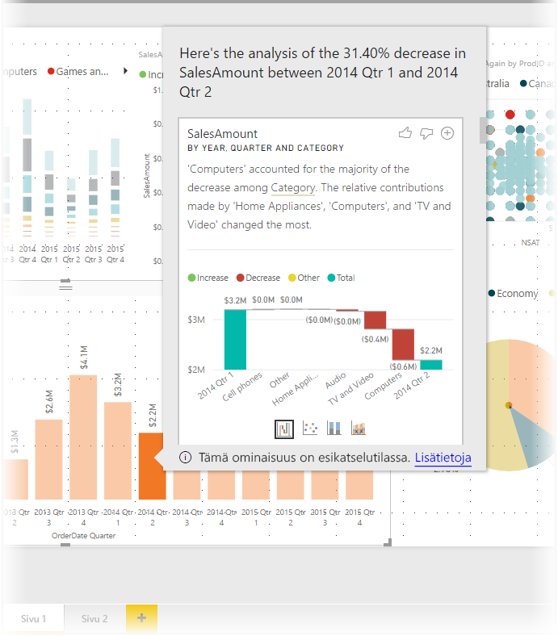
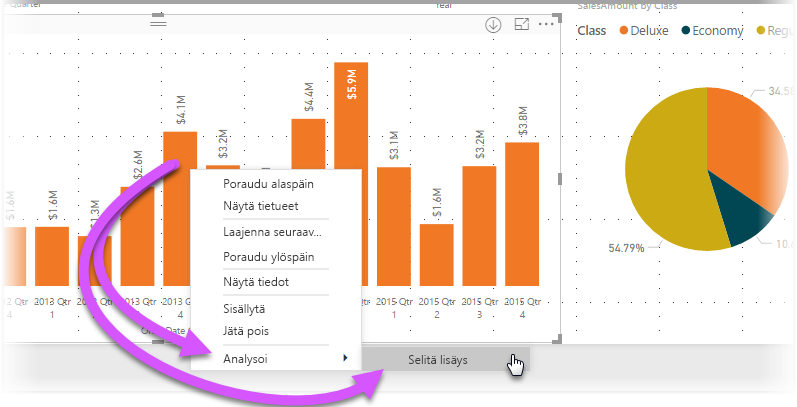
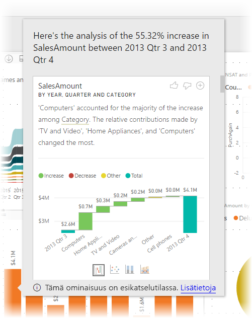
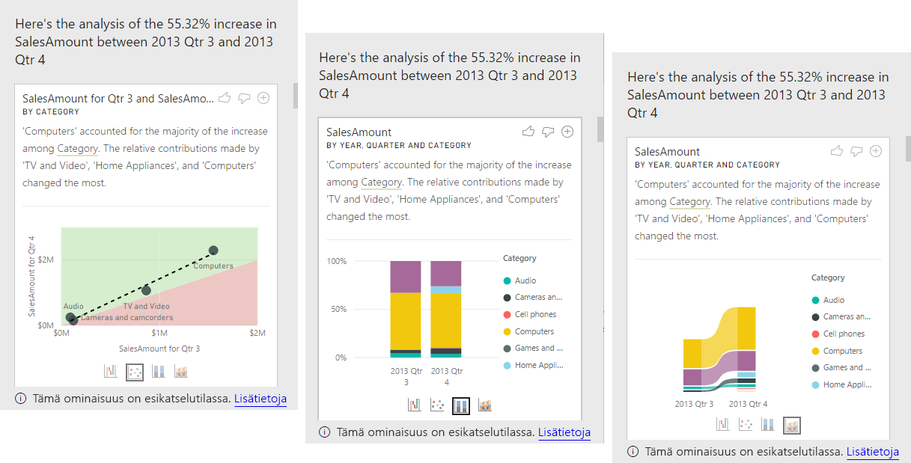

# Merkityksellisten tietojen käyttö Power BI Desktopissa (esikatselu)
Voit käyttää **Power BI Desktopia** selittämään nousut ja laskut kaavioissa ja saada nopeasti ja automaattisesti merkityksellistä analyysia tiedoistasi. Napsauta vain arvopistettä hiiren kakkospainikkeella ja valitse **Analysoi > Selitä lasku** (tai nousu, jos edellinen palkki oli pienempi) ja merkityksellinen tieto toimitetaan sinulle helppokäyttöisessä ikkunassa.

Ominaisuus on tilannekohtainen ja perustuu sitä edeltävään arvopisteeseen – kuten edelliseen palkkiin tai sarakkeeseen.

> [!NOTE]
> Tämä ominaisuus on esikatselutilassa, ja tiedot voivat muuttua. Ominaisuus on käytössä oletusarvoisesti (sinun ei tarvitse tarkistaa Esikatselu-ruutua käyttöönottoa varten) alkaen **Power BI Desktopin** syyskuun 2017 versiosta.
> 
> 

## Merkityksellisten tietojen käyttö
Voit käyttää merkityksellisiä tietoja napsauttamalla hiiren kakkospainikkeella mitä tahansa arvopistettä palkissa tai visualisoinnissa valitsemalla **Analysoi > Selitä lisäys** (tai *Selitä vähennys*, koska kaikki merkitykselliset tiedot perustuvat edellisen arvopisteen muutokseen).

**Power BI Desktop** suorittaa sitten koneoppimisen algoritmeja tiedoista ja täyttää ikkunan, jossa on visualisointi ja kuvaus, joka kuvaa, mihin luokkiin nousut ja laskut ovat vaikuttaneet eniten. Oletusarvon mukaan merkitykselliset tiedot on esitetty *vesiputous*-visualisointina seuraavassa esitetyllä tavalla.

Valitsemalla pienet kuvakkeet vesiputouksen alareunasta voit valita merkityksellisten tietojen näyttämisen pistekaaviona, pinottuna pylväskaaviona tai nauhakaaviona.

*Peukalo ylös*- ja *Peukalo alas* -kuvakkeet sivun yläreunassa ovat visualisoinnin ja ominaisuuden palautetta varten.

Ja ennen kaikkea **+**-painike visualisoinnin yläosassa mahdollistaa valitun visualisoinnin lisäämisen raporttiin, aivan kuin olisit luonut visualisoinnin manuaalisesti. Voit sitten muotoilla tai muuten säätää lisättyä visuaalisuutta samalla tavalla kuin mitä tahansa muuta visualisointia raportissasi. Voit lisätä valitun merkityksellisen tiedon visualisoinnin vain, kun muokkaat raporttia**Power BI Desktopissa**.

Voit käyttää merkityksellistä tietoa raportin ollessa luku- tai muokkaustilassa ja monipuolistaa sekä tietojen analysointia että helpottaa visualisointien luomista, jotka voit helposti lisätä raportteihisi.

## Huomioitavat seikat ja rajoitukset
Koska merkitykselliset tiedot perustuvat edellisen arvopisteen muutokseen, ne eivät ole käytettävissä, kun valitset visualisoinnin ensimmäisen arvopisteen. 

Seuraavassa luettelossa on esitetty tilanteita, joissa **merkityksellistä tietoa** ei tällä hetkellä tueta:

* TopN-suodattimet
* Sisällyttää tai jättää pois suodattimet
* Mittayksikkösuodattimet
* Lisäämättömät mittayksiköt ja koosteet
* Näytä arvo muodossa
* Suodatetut mittayksiköt (uusi asia, jota käytämme merkityksellisten tietojen pistekaaviossa)
* X-akselin luokitellut sarakkeet, elleivät ne määritä lajittelua sarakkeen mukaan, joka on skalaarisia. Jos käytät hierarkiaa, aktiivisen hierarkian jokaisen sarakkeen on vastattava tätä ehtoa
* Muu kuin numeeriset mittayksiköt

Lisäksi seuraavia mallityyppejä ja tietolähteitä ei tueta tällä hetkellä merkityksellisten tietojen osalta:

* DirectQuery
* Live connect
* On-premises Reporting Services
* Upottaminen

## Seuraavat vaiheet
Saat lisätietoja **Power BI Desktopista** ja käytön aloittamisesta tutustumalla seuraaviin artikkeleihin.

* [Power BI Desktopin käytön aloittaminen](desktop-getting-started.md)
* [Power BI Desktopin kyselyiden yleiskatsaus](desktop-query-overview.md)
* [Power BI Desktopin tietolähteet](desktop-data-sources.md)
* [Tietoihin yhdistäminen Power BI Desktopissa](desktop-connect-to-data.md)
* [Tietojen muotoilu ja yhdistäminen Power BI Desktopissa](desktop-shape-and-combine-data.md)
* [Yleiset kyselytehtävät Power BI Desktopissa](desktop-common-query-tasks.md)   

