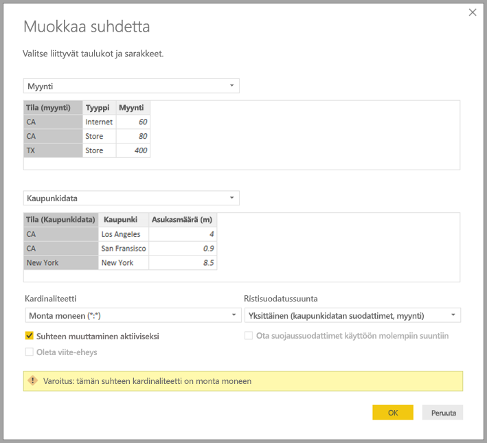

# Monta moneen -yhteyksien käyttäminen Power BI Desktopissa

Power BI Desktopin *moni-moneen-kardinaliteetin sisältävien suhteiden* avulla voit liittää taulukoita, jotka käyttävät *moni-moneen*-kardinaliteettia. Voit helposti ja intuitiivisesti luoda tietomalleja, jotka sisältävät kahden tai useamman tietolähteen. *Moni-moneen-kardinaliteetin sisältävät suhteet* ovat osa Power BI Desktopin laajempia *yhdistelmämallien* ominaisuuksia.

Power BI Desktopin *moni-moneen-kardinaliteetin sisältävät suhteet* koostuvat kolmesta toisiinsa liittyvästä ominaisuudesta:

* **Yhdistelmämallit**: *Yhdistelmämalli* antaa mahdollisuuden sisällyttää raporttiin kaksi tietoyhteyttä tai enemmän (kuten DirectQuery-yhteydet tai tuonnin) minä tahansa yhdistelminä. Jos haluat lisätietoja, katso [Yhdistelmämallien käyttäminen Power BI Desktopissa](desktop-composite-models.md).

* **Moni-moneen-kardinaliteetin sisältävät suhteet**: Yhdistelmämallien avulla voit määrittää taulukoiden välille *moni-moneen-kardinaliteetin* sisältävät suhteet. Tämä lähestymistapa poistaa vaatimuksen siitä, että taulukoiden arvojen pitäisi olla yksilöllisiä. Se myös poistaa edelliset ratkaisut, kuten uusien taulukoiden lisäämisen vain yhteyksien muodostamiseksi. Ominaisuutta kuvataan tarkemmin myöhemmin tässä artikkelissa.

* **Tallennustilan tila**: Voit nyt määrittää, mitkä visualisoinnit edellyttävät kyselyä taustatietolähteisiin. Visualisoinnit, jotka eivät edellytä kyselyä, tuodaan, vaikka ne perustuisivat DirectQueryyn. Tämä ominaisuus parantaa suorituskykyä ja vähentää taustakuormitusta. Aiemmin jopa osittajien kaltaiset yksinkertaiset visualisoinnit aloittivat kyselyjä taustalähteisiin. Lisätietoja on kohdassa [Tallennustila Power BI Desktopissa](desktop-storage-mode.md).

## Mitä ongelmia moni-moneen-kardinaliteetin sisältävät suhteet ratkaisevat?

Ennen kuin *moni-moneen-kardinaliteetit sisältävät suhteet* olivat käytettävissä, kahden taulukon välinen suhde määritettiin Power BI:ssä. Ainakin yhdessä yhteyteen liittyvässä taulukon sarakkeessa oli oltava yksilöllisiä arvoja. Usein kuitenkin kävi niin, että yksikään sarake ei sisältänyt yksilöllisiä arvoja.

Kahdessa taulukossa saattoi olla esimerkiksi Maa-niminen sarake. Maa-sarakkeen arvot eivät olleet yksilöllisiä kummassakaan taulukossa. Tällaisten taulukoiden yhdistämiseksi täytyi luoda kiertotapoja. Yksi mahdollinen kiertotapa oli lisätä taulukkoja, jotka sisälsivät tarvittavat yksilölliset arvot. *Moni-moneen-kardinaliteetin sisältävien suhteiden* avulla tällaisia taulukoita voi liittää toisiinsa suoraan suhteella suhdetta, jonka kardinaliteetti on *moni-moneen*.

## Moni-moneen-kardinaliteetin sisältävien suhteiden käyttäminen

Kun määrität Power BI:ssä kahden taulukon välisen suhteen, sinun täytyy määrittää suhteen kardinaliteetti. Esimerkiksi taulukoiden Tuotemyynti ja Tuote&mdash;sarakkeilla Tuotemyynti[Tuotekoodi] ja Tuote[Tuotekoodi]&mdash;yhteys määritettäisiin *monta-yhteen*-yhteydeksi. Yhteys määritetään näin, koska kullekin tuotteelle on useita myyntejä ja sarake Tuote-taulukossa (Tuotekoodi) on yksilöllinen. Kun määrität suhteen kardinaliteetiksi *monta-yhteen*, *yksi-moneen* tai *yksi-yhteen*, Power BI varmistaa sen, jotta valittu kardinaliteetti vastaa varsinaisia tietoja.

Tutustu esimerkiksi tämän kuvan yksinkertaiseen malliin:

Kuvittele nyt, että **Tuote**-taulukosta näytettäisiin vain kaksi riviä seuraavanlaisesti:

Kuvittele myös, että Myynti-taulukossa on vain neljä riviä, mukaan lukien rivi tuotteelle C. Viite-eheyden virheen vuoksi C-tuotteen rivi ei löydy **Tuote**-taulukosta.

**Tuotenimi**- ja **Hinta**-tiedot (**Tuote**-taulukosta) sekä jokaisen tuotteen **Määrä**-tieto (Tuotemyynti-taulukosta) esitettäisiin seuraavalla tavalla:

Kuten yllä olevasta kuvasta näkyy, tuotteen C myyntitietoihin on liitetty tyhjä **Tuotenimi**-rivi. Tämä tyhjä rivi perustuu seuraaviin:

* **Tuotemyynti**-taulukon kaikki sellaiset rivit, joille ei ole vastaavaa riviä **Tuote**-taulukossa. Kyseessä on viite-eheyden ongelma, kuten näemme tuotteen C kohdalla tässä esimerkissä.

* **Tuotemyynti**-taulukon kaikki sellaiset rivit, joiden viiteavainsarake on arvoltaan null.

Näistä syistä tyhjä rivi selittyy molemmissa tapauksissa myynnillä, jossa **Tuotenimi**- ja **Hinta**-tietoja ei tunneta.

Joskus taulukot ovat yhteydessä toisiinsa kahdella sarakkeella, mutta kumpikaan sarake ei ole yksilöllinen. Otetaan esimerkiksi seuraavat kaksi taulukkoa:

* **Myynti**-taulukossa näkyy myyntitietoja **Osavaltio**-arvon mukaan, ja kukin rivi sisältää myyntisumman kyseisen osavaltion myyntityypin mukaan. Osavaltioihin sisältyy Kalifornian, Washingtonin ja Texasin osavaltiot.

    

* **Kaupunkidata**-taulukko näyttää tietoa kaupungeista, kuten asukasmäärän ja osavaltion (esimerkiksi Kalifornia, Washington ja New York).

    

Molemmissa taulukoissa on nyt **Osavaltio**-sarake. On kohtuullista haluta raportti sekä osavaltion kokonaismyynnistä että kunkin osavaltion väestömäärästä. Ongelma on kuitenkin se, että **Osavaltio**-sarake ei ole yksilöllinen kummassakaan taulukossa.

## Aiempi vaihtoehtoinen menetelmä

Ennen heinäkuun 2018 Power BI Desktop -versiota et voinut luoda suoraa suhdetta näiden taulukoiden välille. Yleinen tapa kiertää tämä ongelma oli toimia seuraavasti:

* Luodaan kolmas taulukko, joka sisältää vain yksilöllisiä Osavaltio-tunnuksia. Taulukko voi olla mikä tahansa tai kaikki seuraavista:
  * Laskettu taulukko (määritetty Data Analysis Expressionsin [DAX] avulla).
  * Kyselyeditorissa määritetty kyselyyn pohjautuva taulukko, joka voi näyttää yhdestä taulukosta haetut yksilöivät tunnukset.
  * Yhdistetty koko joukko.

* Alkuperäiset taulukot yhdistetään sitten tähän uuteen taulukkoon yleisillä *monta-yhteen*-yhteyksillä.

Voit jättää tämän kiertotavan taulukon näkyviin. Voit myös piilottaa sen siten, että se ei näy **Kentät**-luettelossa. Jos piilotat taulukon, *monta-yhteen*-yhteydet asetetaan yleensä suodattamaan molempiin suuntiin, jolloin voit käyttää Osavaltio-kenttää kummasta tahansa taulukosta. Myöhemmin tiedot välitetään toiseen taulukkoon ristiinsuodatuksella. Tämä lähestymistapa esitetään seuraavassa kuvassa:

Visualisointi, joka näyttää **Osavaltio**-tiedot (**Kaupunkidata**-taulukosta) **Asukasmäärä**-kokonaisarvon ja yhteenlasketun **Myynti**-arvon, näkyisi sitten seuraavasti:

> [!NOTE]
> Koska kiertotavassa käytetään osavaltioita **Kaupunkidata**-taulukosta, vain taulukossa olevat osavaltiot luetellaan, jonka vuoksi Teksas on jäänyt pois. Lisäksi toisin kuin *monta-yhteen*-yhteyksissä, summarivi sisältää kyllä kaikki **Myynti**-tiedot (myös Teksasin), mutta tietoihin ei sisälly tyhjää riviä, joka kattaa tällaiset ristiriitaiset rivit. Vastaavasti mukana ei olisi tyhjää riviä **Myynti**-tiedoille, joiden **Osavaltio**-arvo on null.

Oletetaan, että lisäät tähän visualisointiin Kaupunki-arvon. Vaikka kaupunkikohtainen asukasmäärä olisi toki tiedossa, mutta **Myynti**-tieto kaupungille vain toistaisi **Myynti**-tiedon vastaavalta **osavaltiolta**. Näin normaalisti käykin, kun sarakkeessa oleva ryhmittely ei liity johonkin koostettuun mittariin, kuten tässä:

Oletetaan, että määrität uuden Myynti-taulukon, joka on yhdistelmä kaikista osavaltioista tässä, ja määrität sen näkyväksi **Kentät**-luettelossa. Sama visualisointi näyttäisi **Osavaltio**-tiedot (uudessa taulukossa) ja **väestön** sekä **kokonaismyynnin**:

Tässä tapauksessa mukana olisivat Teksas&mdash;ja **Myynti**-tiedot, mutta tuntematon *väestömäärä*&mdash; ja New York&mdash;sekä tunnettu **väestömäärä**, mutta ei **Myynti**-tietoja&mdash;. Tämä kiertokeino ei ole paras mahdollinen ja se sisältää monia ongelmia. Moni-moneen-kardinaliteetin sisältävien suhteiden avulla nämä ongelmat on ratkaistu seuraavassa osiossa kuvatulla tavalla.

## Moni-moneen-kardinaliteetin sisältävien suhteiden käyttäminen kiertotavan sijasta

Power BI Desktopin heinäkuun 2018 versiosta alkaen voit yhdistää taulukoita suoraan ilman, että sinun tarvitsee turvautua edellisessä osiossa kuvattuihin kiertotapoihin. Nyt voit määrittää suhteen kardinaliteetiksi *monta moneen*. Tämä asetus ilmaisee, että kumpikaan taulukko ei sisällä yksilöllisiä arvoja. Tällaisissa suhteissa voit silti hallita sitä, mikä taulukko suodattaa toisen taulukon. Voit myös käyttää kaksisuuntaista suodatusta, jossa kumpikin taulukko suodattaa toista.

Power BI Desktopissa kardinaliteetin oletusarvoksi asetetaan *monta moneen*, kun havaitaan, ettei kumpikaan taulukko sisällä yksilöllisiä arvoja yhteyden sarakkeissa. Tällaisissa tapauksissa saat varoituksen, jossa varmistetaan, että haluat määrittää suhteen ja että muutos ei ole tahaton seuraus tietojen ongelmasta.

Jos luot esimerkiksi Kaupunkidata- ja Myynti-taulukoiden välille suoran yhteyden,&mdash;jossa tiedot suodatetaan Kaupunkidata-taulukosta Myynti-taulukkoon,&mdash;Power BI Desktop näyttää **Muokkaa suhdetta** -valintaikkunan:

Seuraava **suhdenäkymä** näyttäisi kyseisen kahden taulukon välisen suoran moni-moneen-yhteyden. Taulukoiden ulkoasu **Kentät**-luettelossa (sekä niiden myöhempi toiminta visualisointeja luotaessa) on samanlainen kuin kiertotapaa käytettäessä. Kiertotapaa käytettäessä ylimääräinen taulukko, joka näyttää erilliset Osavaltiotiedot, ei ole määritetty näkyväksi. Kuten aiemmin kerroin, tässä tapauksessa näytetään visualisointi, joka näyttää **osavaltion**, **väestömäärän** ja **myyntitiedot**:

*Moni-moneen-kardinaliteetin sisältävien suhteiden* ja yleisempien *monta-yhteen*-suhteiden tärkeimmät erot ovat seuraavat:

* Näytetyt arvot eivät sisällä toisen taulukon ristiriitaisista riveistä johtuvaa tyhjää riviä. Arvot eivät myöskään sisällä rivejä, joissa yhteydessä käytettävän toisen taulukon sarake sisältää null-arvoja.
* `RELATED()`-funktion käyttäminen ei ole mahdollista, koska useampi kuin yksi rivi voi olla liittyvä.
* `ALL()`-funktion käyttäminen taulukossa ei poista suodattimia, joita käytetään taulukkoon moni-moneen-yhteydellä yhdistetyissä muissa taulukoissa. Edellisessä esimerkissä mittari, joka on määritetty tässä esitetyllä tavalla, ei poistaisi yhdistetyn Kaupunkitiedot-taulukon sarakkeissa olevia suodattimia:

    

    Visualisointi, jossa näytetään **Osavaltio**, **Myynti** ja **Kokonaismyynti**, tuottaisi tällaisen grafiikan:

    

Näiden eroavaisuuksien vuoksi sinun tuleekin varmistaa, että `ALL(<Table>)`-funktiolla suoritetut laskutoimitukset, kuten *prosenttiosuus kokonaissummasta*, palauttavat tarkoitetut tulokset.

## Rajoitukset ja huomioitavat asiat

Tähän *moni-moneen-kardinaliteetin sisältävien suhteiden* versioon ja yhdistelmämalleihin liittyy joitakin rajoituksia.

Seuraavia Live Connectin monidimensioisia lähteitä ei voi käyttää yhdistelmämallien kanssa:

* SAP HANA
* SAP Business Warehouse
* SQL Server Analysis Services
* Power BI -tietojoukot
* Azure Analysis Services

Kun muodostat yhteyttä näihin monidimensioisiin lähteisiin DirectQuerylla, et voi muodostaa yhteyttä myös toiseen DirectQuery-lähteeseen tai yhdistää sitä tuotuihin tietoihin.

DirectQueryn olemassa olevia käyttörajoituksia sovelletaan edelleen, kun käytät *moni-moneen-kardinaliteetin sisältäviä suhteita*. Monet rajoituksista ovat nyt taulukkokohtaisia ja riippuvat taulukon tallennustilan tilasta. Esimerkiksi tuodun taulukon laskettu sarake voi viitata muihin taulukoihin, mutta DirectQuery-taulukon laskettu sarake voi viitata vain saman taulukon sarakkeisiin. Muut rajoitukset koskevat koko mallia, jos jokin mallin taulukoista on DirectQuery-taulukko. Esimerkiksi Nopeat merkitykselliset tiedot ja Q&A-toiminnot eivät ole käytettävissä mallissa, jos jollakin sen taulukoista tallennustilan tilana on DirectQuery.

## Seuraavat vaiheet

Seuraavissa artikkeleissa on lisätietoja yhdistelmämalleista ja DirectQuerysta:
* [Yhdistelmämallien käyttäminen Power BI Desktopissa](desktop-composite-models.md)
* [Tallennustilan tila Power BI Desktopissa](desktop-storage-mode.md)
* [DirectQueryn käyttö Power BI:ssä](desktop-directquery-about.md)
* [Power BI -tietolähteet](power-bi-data-sources.md)
