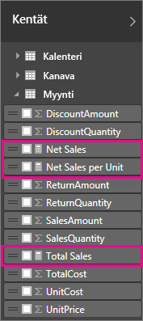
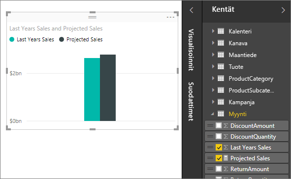
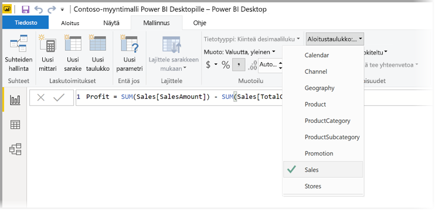
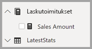

# <a name="create-measures-for-data-analysis-in-power-bi-desktop"></a>Tietoanalyysin mittareiden luominen Power BI Desktopissa

Power BI Desktopin avulla tiedoistasi voi saada paremman käsityksen muutamalla napsautuksella. Joskus nämä tiedot eivät kuitenkaan sisällä kaikkea sitä, mitä tarvitaan, jotta kaikkein tärkeimpiin kysymyksiin saataisiin vastauksia. Mittarit voivat auttaa tämän saavuttamisessa.

Mittareita käytetään joissakin yleisimmissä tietoanalyyseissa, Yksinkertaiset yhteenvedot, kuten summat, keskiarvot, pienimmät ja suurimmat arvot ja määrät, voidaan määrittää **Kentät**-ruudussa. Mittarien lasketut tulokset muuttuvat aina sen mukaan, miten raporttia käsitellään, mahdollistaen nopean ja dynaamisen tietojen tarkastelun. Menetelmien kuvailu on alla. Lisätietoja on kohdassa [Laskettujen mittarien luominen](/learn/modules/model-data-power-bi/4b-create-calculated-measures).

## <a name="understanding-measures"></a>Mittarien ymmärtäminen

Power BI Desktopissa mittareita luodaan ja näytetään *raporttinäkymässä* tai *tietonäkymässä*. Luomasi mittarit näkyvät **Kentät**-luettelossa laskinkuvakkeen kanssa. Mittarit voit nimetä miten tahansa ja niitä voi lisätä uuteen tai jo olemassa olevan raportin visualisointiin muiden kenttien tapaan.



> [!NOTE]
> *Pikamittarit* ovat valmiiksi luotuja mittareita, jotka ovat valittavissa valintaikkunoista. Niiden avulla on helppo luoda mittareita nopeasti, sekä oppia Data Analysis Expressions (DAX) -syntaksi, sillä niiden automaattisesti luodut DAX-kaavat ovat tarkasteltavissa. Jos haluat lisätietoja, tutustu [pikamittareihin](desktop-quick-measures.md).
> 
> 

## <a name="data-analysis-expressions"></a>Data Analysis Expressions

Mittarit laskevat lausekekaavasta tuloksen. Mittarin luomisessa käytetään [Data Analysis Expressions](/dax/) (DAX) -kaavakieltä. DAX sisältää kirjaston, jossa on yli 200 funktioita, operaattoria ja rakennetta. Sen kirjasto tarjoaa valtavan joustavuuden luotaessa mittareita lähes minkä tahansa tietoanalyysitarpeen tulosten laskemiseksi.

DAX-kaavat muistuttavat Excel-kaavoja. DAX sisältää jopa useita samoja toimintoja, kuten `DATE`, `SUM` ja `LEFT`. DAX-funktiot on kuitenkin tarkoitettu suhteellisten tietojen, kuten Power BI Desktopin tietojen, käsittelyyn.

## <a name="lets-look-at-an-example"></a>Tarkastellaan esimerkkiä

Jan on Contoson myyntipäällikkö. Jania on pyydetty esittämään jälleenmyynnin seuraavan tilivuoden myyntiennusteet. Jan päättää perustaa ennusteensa viime vuoden myyntilukuihin, joihin lisätään kuuden prosentin vuosittainen lisä. Se perustuu erilaisille seuraavaksi kuudeksi kuukaudeksi suunnitelluille kampanjoille.

Arvioiden ilmoittamiseksi Jan tuo viime vuoden myyntitiedot Power BI Desktopiin. Jan huomaa **jälleenmyyjän myyntitaulukossa** **Myyntimäärä**-kentän. Koska tuotavat tiedot sisältävät vain viime vuoden myyntimäärät, hän nimeää **Myyntimäärä**-kentän *Viime vuoden myynti* -kentäksi. Jan vetää sitten **viime vuoden myynnit** raporttipohjaan. Ne näytetään kaaviovisualisoinnissa yhtenä arvona, joka on kaikkien jälleenmyyjän viime vuoden myyntien summa.

Jan huomaa, että vaikka laskelmaa ei määritetty, se on annettu automaattisesti. Power BI Desktop loi oman mittarinsa laskemalla yhteen kaikki **viime vuoden myyntiarvot**.

Jan tarvitsee kuitenkin mittarin, jolla hän voi laskea tulevan vuoden myyntiennusteet, jotka perustuvat edellisen vuoden myyntiin kerrottuna 1.06:lla, joka vastaa odotettua kuuden prosentin nousua. Tätä laskentaa varten hän luo mittarin. Jan luo uuden mittarin käyttämällä *Uusi mittari* -toimintoa ja syöttää seuraavan DAX-kaavan:

```sql
    Projected Sales = SUM('Sales'[Last Years Sales])*1.06
```

Sitten Jan siirtää uuden Ennustettu myynti -mittarinsa taulukkoon.



Nopeasti ja pienellä vaivalla Janilla on nyt mittari, jolla hän voi laskea ennustetun myynnin. Jan voi edelleen analysoida ennusteitaan suodattamalla tiettyjä jälleenmyyjiä tai lisäämällä muita kenttiä raporttiin.

## <a name="data-categories-for-measures"></a>Mittarien tietoluokat

Voit myös valita mittarien tietoluokkia.

Tietoluokkien ansiosta voit muun muassa mittarien avulla luoda dynaamisesti URL-osoitteita ja merkitä tietoluokan verkon URL-osoitteeksi.

Voit luoda taulukoita, jotka näyttävät mittarit verkon URL-osoitteina, ja napsauttaa valintasi perusteella luotua URL-osoitetta. Tämä menetelmä on erityisen hyödyllinen, kun haluat linkittää muihin Power BI -raportteihin [URL-suodattimen parametrien](service-url-filters.md) avulla.

## <a name="organizing-your-measures"></a>Mittarien järjestäminen

Mittarit sisältävät *aloitus*taulukon, joka määrittää, mistä kohtaa kenttäluetteloa ne löytyvät. Voit muuttaa niiden sijaintia valitsemalla sijainnin mallin taulukoista.



Voit myös järjestää taulukon kenttiä *näyttökansioihin*. Valitse **Malli** Power BI Desktopin vasemmasta reunasta. Valitse **Ominaisuudet**-ruudusta kenttä, jonka haluat siirtää käytettävissä olevien kenttien luettelosta. Luo kansio antamalla **näyttökansion** uudelle kansiolle nimi. Kansion luominen siirtää valitun kentän kyseiseen kansioon.


Voit luoda alikansioita käyttämällä kenoviivaa. Esimerkiksi *Talous\Valuutat* luo *Talous*-kansion ja sen sisälle *Valuutat*-kansion.

Voit määrittää kentän näkymään useissa kansioissa käyttämällä puolipistettä kansioiden nimien erottamiseen. Esimerkiksi jos luot kohteen *Tuotteet\Nimet;Osastot*, kenttä näkyy sekä *Osastot*- että *Nimet*-kansiossa *Tuotteen*-kansiossa sisällä.

Voit luoda erikoistaulukon, joka sisältää vain mittareita. Tämä taulukko näkyy aina kohdan **Kentät** yläosassa. Voit tehdä tämän luomalla taulukon, jossa on vain yksi sarake. Voit luoda kyseisen taulukon käyttämällä **Anna tiedot** -toimintoa. Siirrä sitten mittarit kyseiseen taulukkoon. Piilota lopuksi luomasi sarake, älä taulukkoa. Valitse nuoli kohdan **Kentät** yläreunasta, jos haluat sulkea ja avata luettelon uudelleen ja tarkastella tekemiäsi muutoksia.



## <a name="learn-more"></a>Lisätietoja

Olemme esitelleet mittarit tässä vain lyhyesti. Ohjeita omien mittarien luomiseen on runsaasti. Jos haluat lisätietoja, tutustu [opetusohjelmaan: Omien mittarien luominen Power BI Desktopissa](desktop-tutorial-create-measures.md). Voit ladata mallitiedoston ja saada vaiheittaiset ohjeet mittarien luomiseen.  

Sukella syvemmälle DAX:n maailmaan katsomalla [DAX-perusteet Power BI Desktopissa](desktop-quickstart-learn-dax-basics.md). [Data Analysis Expressions -viite](/dax/) tarjoaa yksityiskohtaisia artikkeleita jokaisesta yksittäisestä funktiosta, syntaksista, operaattoreista sekä nimeämiskäytännöistä. DAX on ollut olemassa Excelin Power Pivotissa sekä SQL Server Analysis Servicessä useita vuosia. Hyviä resursseja on saatavilla runsaasti. Tutki esimerkiksi [DAX Resource Center Wikiä](https://social.technet.microsoft.com/wiki/contents/articles/1088.dax-resource-center.aspx), jonne BI-yhteisön vaikutusvaltaiset jäsenet ovat jakaneet DAX-tietojaan.
