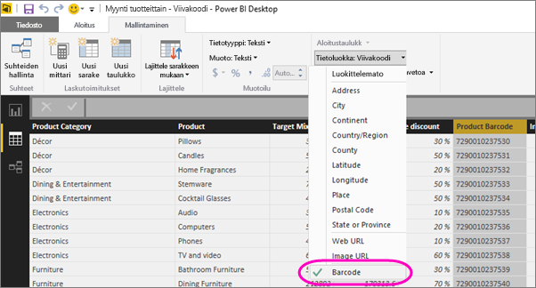

# Viivakoodien merkitseminen mobiilisovelluksia varten Power BI Desktopissa
Voit Power BI Desktopissa [luokitella sarakkeen tietoja](desktop-data-categorization.md), jolloin Power BI Desktop osaa käsitellä raportin visualisoinneissa olevia arvoja. Voit myös luokitella sarakkeen **viivakoodiksi**. Kun [tuotteen viivakoodi luetaan iPhonen Power BI -sovelluksessa](mobile-apps-scan-barcode-iphone.md), näet kaikki kyseisen viivakoodin sisältävät raportit. Kun avaat raportin mobiilisovelluksessa, Power BI näyttää viivakoodiin liittyvät tiedot raportissa automaattisesti.

1. Siirry Power BI Desktopissa Tiedot-näkymään.
2. Valitse viivakooditietoja sisältävä sarake. Katso alta [tuettujen viivakoodimuotojen](#supported-barcode-formats) luettelo.
3. Valitse **Mallinnus**-välilehdeltä **Tietoluokka** > **Viivakoodi**.
   
    
4. Lisää tämä kenttä Raportti-näkymässä visualisointeihin, jotka haluat suodattaa viivakoodin avulla.
5. Tallenna ja julkaise raportti Power BI -palveluun.

Nyt kun avaat lukijan [iPhonen Power BI -sovelluksessa](mobile-iphone-app-get-started.md) ja luet viivakoodin, näet tämän raportin raporttiluettelossa. Kun avaat raportin, sen visualisoinnit suodatetaan luetun tuotteen viivakoodin mukaan.

## Tuetut viivakoodimuodot
Power BI tunnistaa seuraavat viivakoodit, jos merkitset ne Power BI -raportissa: 

* UPCECode 
* Code39Code  
* A39Mod43Code 
* EAN13Code 
* EAN8Code  
* 93Code  
* 128Code 
* PDF417Code 
* Interleaved2of5Code 
* ITF14Code 

## Seuraavat vaiheet
* [Viivakoodin lukeminen iPhonen Power BI -sovelluksella](mobile-apps-scan-barcode-iphone.md)
* [Viivakoodin lukuongelmat iPhonessa](mobile-apps-scan-barcode-iphone.md#issues-with-scanning-a-barcode)
* [Tietojen luokittelu Power BI Desktopissa](desktop-data-categorization.md)  
* Ilmenikö kysyttävää? [Voit esittää kysymyksiä Power BI -yhteisössä](http://community.powerbi.com/)

