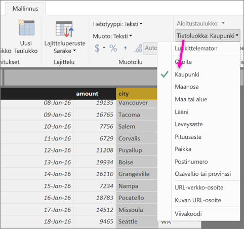
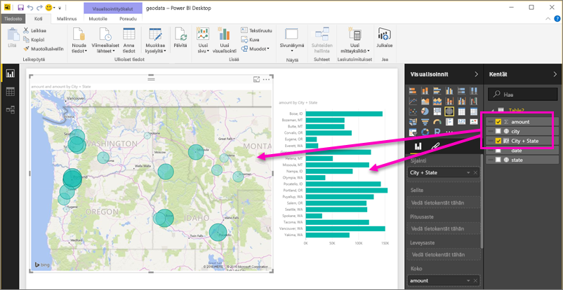
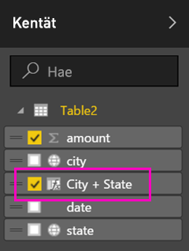
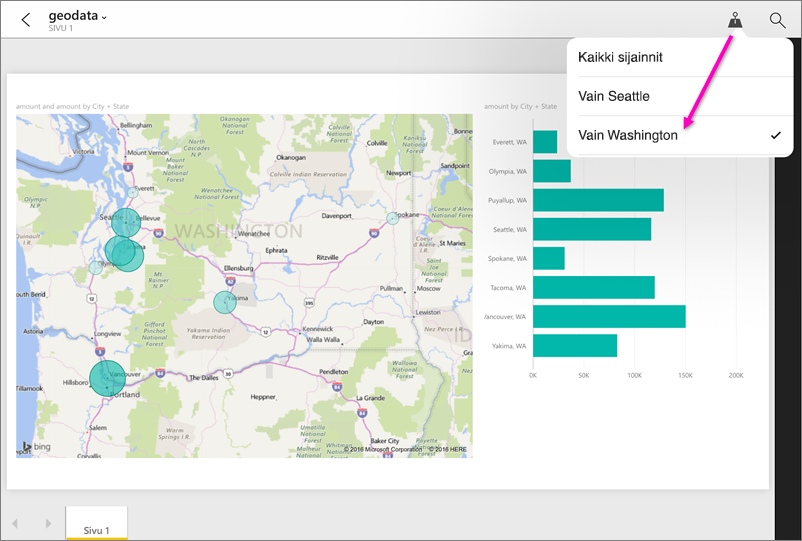

# Maantieteellisten suodattimien määrittäminen Power BI Desktopissa mobiilisovelluksille
Power BI Desktopissa voit [luokitella maantieteellisiä tietoja](desktop-data-categorization.md) saraketta kohden, joten Power BI Desktop tietää, miten käsitellä raportin visualisoinnissa olevia arvoja. Toinen etu on, että kun sinä tai työtoverisi tarkastelevat kyseistä raporttia Power BI -mobiilisovelluksissa, Power BI tarjoaa automaattisesti sijaintianne vastaavat maantieteelliset suodattimet. 

Oletetaan esimerkiksi, että olet myyntipäällikkö matkalla tapaamaan asiakkaita, ja haluat suodattaa nopeasti kokonaismyynnin ja tuoton sen asiakkaan osalta, jonka aiot tavata. Haluat eritellä tämänhetkistä sijaintiasi koskevat tiedot joko osavaltion, kaupungin tai todellisen osoitteen mukaan. Myöhemmin, jos sinulla on aikaa jäljellä, haluat käydä muiden lähistöllä toimivien asiakkaiden luona. Voit [suodattaa raportin sijaintisi mukaan kyseisten asiakkaiden löytämiseksi](consumer/mobile/mobile-apps-geographic-filtering.md).

> [!NOTE]
> Voit suodattaa mobiilisovelluksessa sijainnin mukaan ainoastaan, jos raportin maantieteelliset nimet ovat englanniksi &#150; esimerkiksi ”New York City” tai ”Germany”.
> 
> 

## Määritä raporttisi maantieteelliset tiedot
1. Siirry Power BI Desktopissa tietonäkymään .
2. Valitse sarake, jossa on maantieteelliset tiedot &#151; esimerkiksi Kaupunki-sarake.
   
    
3. Valitse **Mallinnus**-välilehdeltä **Tietoluokka** ja sitten oikea luokka &#151; tässä esimerkissä **Kaupunki**.
   
    
4. Jatka maantieteellisten tietojen luokkien määrittämistä muiden mallin kenttien osalta. 
   
   > [!NOTE]
   > Voit määrittää useita sarakkeita kullekin mallin tietoluokalle, mutta jos teet näin, malli ei voi suodattaa maantiedon mukaan Power BI -mobiilisovelluksessa. Voit käyttää maantieteellistä suodatusta mobiilisovelluksissa määrittämällä vain yhden sarakkeen kullekin tietoluokalle &#151; esimerkiksi vain yksi **Kaupunki**-sarake, yksi **Osavaltio tai Provinssi** -sarake ja yksi **Valtio**-sarake. 
   > 
   > 

## Luo visualisointeja maantieteellisillä tiedoilla
1. Siirry raporttinäkymään ja luo visualisointeja, jotka käyttävät tietojesi maantieteellisiä kenttiä. 
   
    
   
    Tässä esimerkissä malli sisältää myös lasketun sarakkeen, joka yhdistää kaupungin ja osavaltion yhteen sarakkeeseen. Lue aiheesta [laskettujen sarakkeiden luominen Power BI Desktopissa](desktop-calculated-columns.md).
   
    
2. Julkaise raportti Power BI -palveluun.

## Tarkastele raporttia Power BI -mobiilisovelluksessa
1. Avaa raportti missä tahansa [Power BI -mobiilisovelluksessa](consumer/mobile/mobile-apps-for-mobile-devices.md).
2. Jos olet maantieteellisessä sijainnissa, josta raportissa on tietoja, voit suodattaa sen automaattisesti sijaintiisi.
   
    

Lue lisää aiheesta [raportin suodattaminen sijainnin mukaan Power BI -mobiilisovelluksissa](consumer/mobile/mobile-apps-geographic-filtering.md).

## Seuraavat vaiheet
* [Tietojen luokittelu Power BI Desktopissa](desktop-data-categorization.md)  
* Ilmenikö kysyttävää? [Voit esittää kysymyksiä Power BI -yhteisössä](http://community.powerbi.com/)

