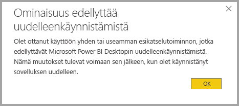
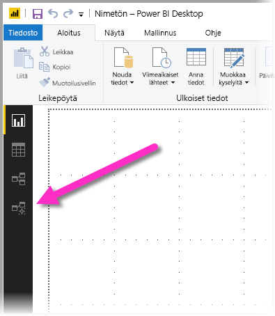
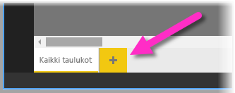
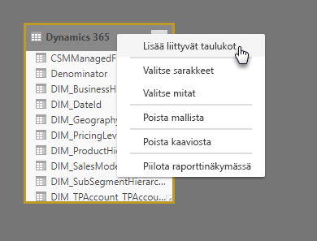
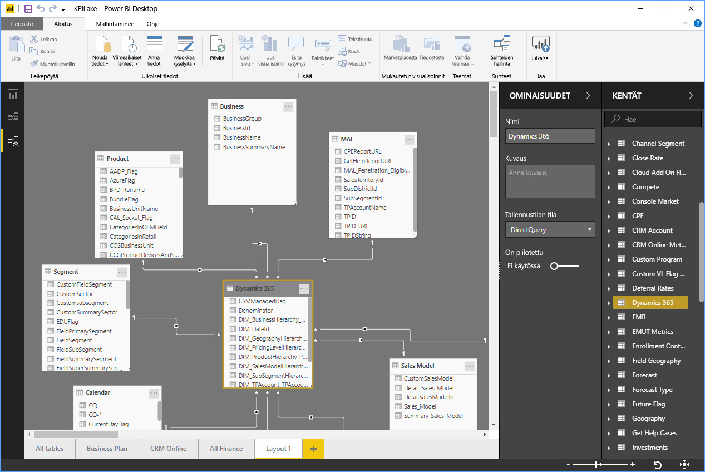
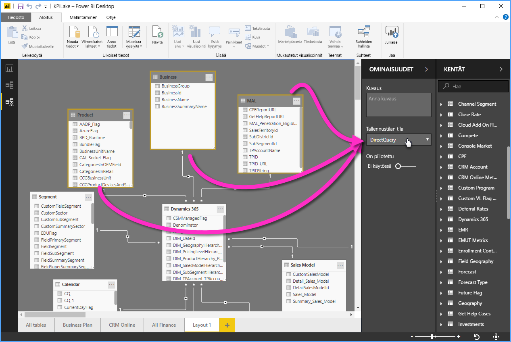

# Mallintamisnäkymä Power BI Desktopissa (esikatselu)

**Mallintamisnäkymän** avulla **Power BI Desktopissa** voit tarkastella ja käsitellä monimuotoisia tietojoukkoja, jotka sisältävät useita taulukoita. Voit tehdä seuraavia asioita mallintamisnäkymässä:

## Mallintamisnäkymän esikatselutoiminnon ottaminen käyttöön

Mallintamisnäkymä-ominaisuus on esikatseluvaiheessa. Sen täytyy olla käytössä **Power BI Desktopissa**. Voit ottaa mallintamisnäkymän käyttöön valitsemalla **Tiedosto > Asetukset ja vaihtoehdot > Asetukset > Esikatselutoiminnot** ja valitsemalla sitten **Mallintamisnäkymä**-valintaruudun seuraavassa kuvassa näkyvällä tavalla.

Esikatselutoiminnon käyttöönotto edellyttää **Power BI Desktopin** käynnistämistä uudelleen. Saat tästä kehotteen. 

## Mallintamisnäkymän käyttäminen

Voit käyttää mallintamisnäkymää valitsemalla mallintamisnäkymän kuvakkeen **Power BI Desktopin** vasemmasta reunasta seuraavassa kuvassa esitetyllä tavalla.

## Erillisten kaavioiden luominen

Mallintamisnäkymän avulla voit luoda mallista kaavioita, jotka sisältävät vain mallin taulukoiden alijoukon. Tämä voi tarjota selkeämmän näkymän taulukoihin, joita haluat käsitellä, ja helpottaa työskentelyä monimuotoisten tietojoukkojen parissa. Jos haluat luoda uuden kaavion vain taulukoiden alijoukolla, valitse **+** -merkki **Kaikki taulukot** -välilehden vieressä Power BI Desktop -ikkunan alaosassa.

Sitten voit vetää taulukon **Kentät**-luettelosta kaavion pinnalle. Napsauta taulukkoa hiiren kakkospainikkeella ja valitse sitten **Lisää liittyvät taulukot** avautuvasta valikosta.

Kun teet näin, alkuperäiseen taulukkoon liittyvät taulukot näkyvät uudessa kaaviossa. Seuraavassa kuvassa näytetään, miten liittyvät taulukot näytetään, kun olet valinnut **Lisää liittyvät taulukot** -valikkovaihtoehdon.

## Yhteisten ominaisuuksien määrittäminen

Voit valita useita objekteja kerralla mallintamisnäkymässä pitämällä **CTRL**-näppäintä painettuna samalla, kun valitset useita taulukoita. Kun valitset useita taulukoita, ne näkyvät korostettuina mallintamisnäkymässä. Kun useita taulukoita korostetaan, **Ominaisuudet**-ruudussa käyttöön otetut muutokset koskevat kaikkia valittuja taulukoita.

Voit esimerkiksi muuttaa [tallennustilan](desktop-storage-mode.md) useiden taulukoiden kohdalla kaavionäkymässä pitämällä **CTRL**-näppäintä painettuna, valitsemalla taulukoita ja muuttamalla sitten tallennustila-asetuksen  **Ominaisuudet**-ruudussa.

## Seuraavat vaiheet

Seuraavissa artikkeleissa kerrotaan lisää tietomalleista ja kuvataan myös DirectQuery yksityiskohtaisemmin.

* [Koosteet Power BI Desktopissa (esikatselu)](desktop-aggregations.md)
* [Yhdistelmämallit Power BI Desktopissa (esikatselu)](desktop-composite-models.md)
* [Tallennustilan tila Power BI Desktopissa (esikatselu)](desktop-storage-mode.md)
* [Moni-moneen-yhteydet Power BI Desktopissa (esikatselu)](desktop-many-to-many-relationships.md)

DirectQuery-artikkeleita:

* [DirectQueryn käyttäminen Power BI:ssä](desktop-directquery-about.md)
* [DirectQueryn tukemat tietolähteet Power BI:ssä](desktop-directquery-data-sources.md)
