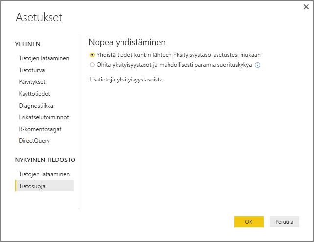
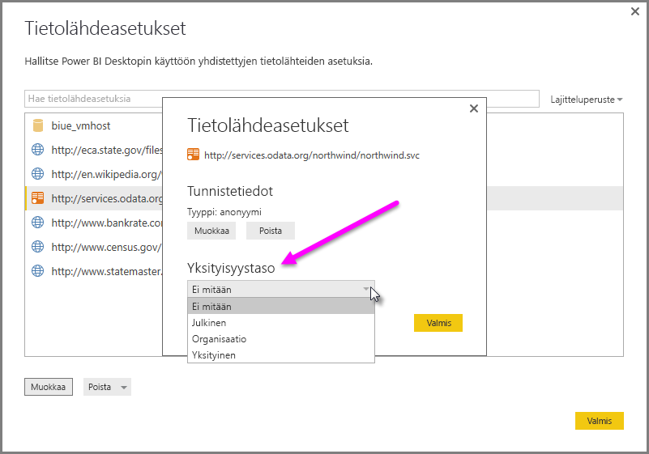

# Power BI Desktopin yksityisyystasot
**Power BI Desktopissa** yksityisyystasoilla määritetään eristystaso, jolla yksi tietolähde eristetään muista tietolähteistä. Rajoittava eristystaso estää tietojen vaihtamisen tietolähteiden välillä, mutta se voi myös rajoittaa toimintaa ja vaikuttaa suorituskykyyn.

**Yksityisyystasot**-asetus määrittää, käyttääkö Power BI Desktop Yksityisyystaso-asetuksiasi tietojen yhdistelemisessä. Näet asetuksen valitsemalla **Tiedosto > Asetukset ja vaihtoehdot > Asetukset** > **Nykyinen tiedosto > Tietosuoja**. Tämä valintaikkuna sisältää linkin Power BI Desktopin yksityisyystasoja koskeviin ohjeisiin (tämä artikkeli).

## Yksityisyystason määrittäminen
Yksityisyystason asetuksilla määritetään eristystaso, jolla yksi tietolähde eristetään muista tietolähteistä.

| Asetus | Kuvaus | Esimerkkejä tietolähteistä |
| --- | --- | --- |
| **Yksityinen tietolähde** |**Yksityinen** tietolähde sisältää luottamuksellisia tietoja, ja tietolähteen näkyvyys saattaa olla rajattu vain valtuutetuille käyttäjille. Yksityinen tietolähde on täysin eristetty muista tietolähteistä. |Facebook-tiedot, osakepalkkioita sisältävä tekstitiedosto tai työkirja, joka sisältää työntekijöiden arviointitietoja. |
| **Organisaation tietolähde** |**Organisaation** tietolähde rajoittaa tietolähteen näkyvyyden vain luotetuille henkilöille. **Organisaation** tietolähde on eristetty kaikista **julkisista** tietolähteistä, mutta se näkyy muille **organisaation** tietolähteille. |SharePoint-sivustossa oleva **Microsoft Word** -asiakirja, jonka käyttöoikeudet on myönnetty luotetuille henkilöille. |
| **Julkinen tietolähde** |**Julkinen** tietolähde antaa kaikille näkyvyyden tietolähteen sisältämiin tietoihin. Vain tiedostoja, Internetin tietolähteitä tai työkirjatietoja voi merkitä **julkisiksi**. |Microsoft Azure Marketplacen maksuttomat tiedot, Wikipedia-sivun tiedot tai julkiselta verkkosivulta kopioituja tietoja sisältävä paikallinen tiedosto. |

## Yksityisyystason asetusten määrittäminen
Jokaisen tietolähteen **Tietosuoja**-asetusten valintaikkunan näet valitsemalla **Tiedosto > Asetukset ja vaihtoehdot > Tietolähdeasetukset**.

Määritä tietolähteen yksityisyystaso valitsemalla tietolähde ja sitten **Muokkaa**. Näet **Tietolähdeasetukset**-valintaikkunan, jonka alaosan avattavasta valikosta voit valita sopivan tietosuojatason seuraavassa kuvassa esitetyllä tavalla.

> [!CAUTION]
> Jos tietolähde sisältää erittäin arkaluonteisia tai luottamuksellisia tietoja, valitse asetukseksi **Yksityinen**.
> 

## Yksityisyystasojen määrittäminen
**Yksityisyystasot** on asetus, jonka oletusarvona on **Yhdistä tiedot kunkin lähteen tietosuojatason asetusten mukaisesti**. Se tarkoittaa, että **Yksityisyystasot**-asetusta ei ole otettu käyttöön.

| Asetus | Kuvaus |
| --- | --- |
| **Yhdistä tiedot kunkin lähteen Yksityisyystaso-asetustesi mukaan** (oletusasetus, käytössä) |Yksityisyystason asetuksilla määritetään tietolähteiden välinen eristystaso tietoja yhdisteltäessä. |
| **Ohita yksityisyystasot ja mahdollisesti paranna suorituskykyä** (poissa käytöstä) |Yksityisyystasoja ei huomioida tietoja yhdisteltäessä. Tietojen toimivuus ja suorituskyky voivat kuitenkin parantua. |

> **Tietoturvahuomautus:** Jos otat **Yksityisyystasot**-asetuksen käyttöön valitsemalla **Ohita yksityisyystasot ja mahdollisesti paranna suorituskykyä** -asetuksen **Yksityisyystasot**-valintaikkunassa, arkaluontoisia tai luottamuksellisia tietoja voi mahdollisesti näkyä valtuuttamattomille henkilöille. Älä ota **Yksityisyystasot**-asetusta käyttöön, ellet ole varma, että tietolähde ei sisällä arkaluonteisia tai luottamuksellisia tietoja.
> 
> 

> [!CAUTION]
> **Ohita yksityisyystasot ja mahdollisesti paranna suorituskykyä** -asetusta ei voi käyttää Power BI -palvelussa. Jos luot Power BI Desktop -raportteja ja julkaiset niitä Power BI-palveluun, kun tämä asetus on käytössä, raporteissa *ei* kuitenkaan huomioida tätä asetusta, kun niitä käytetään palvelussa.
> 

**Yksityisyystasojen määrittäminen**

Valitse Power BI Desktopissa tai kyselyeditorissa **Tiedosto > Asetukset ja vaihtoehdot > Asetukset** > **Nykyinen tiedosto > Tietosuoja**.

a. Kun **Yhdistä tiedot kunkin lähteen tietosuojatason asetusten mukaisesti** -asetus on valittuna, tiedot yhdistellään Yksityisyystasot-asetuksesi mukaisesti. Kun tietoja yhdistetään tietoturva-asetuksissa määritettyjen eristysvyöhykkeiden välillä, saatat havaita jonkin verran tietojen puskurointia.

b. Kun **Ohita yksityisyystasot ja mahdollisesti paranna suorituskykyä** -asetus on valittuna, tietojen yhdistämisessä ohitetaan yksityisyystasot, jolloin arkaluontoisia tai luottamuksellisia tietoja voi mahdollisesti näkyä valtuuttamattomille henkilöille. Asetus voi parantaa suorituskykyä ja toimivuutta.

> **Tietoturvahuomautus:** **Ohita yksityisyystasot ja mahdollisesti paranna suorituskykyä** -asetuksen valitseminen voi parantaa suorituskykyä. Silloin Power BI Desktop ei kuitenkaan voi taata Power BI Desktop -tiedostoon yhdistettyjen tietojen yksityisyyttä.
> 
> 

