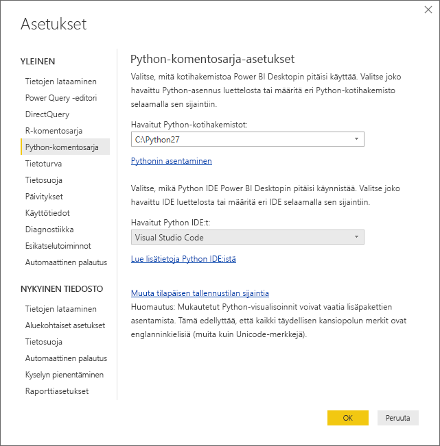
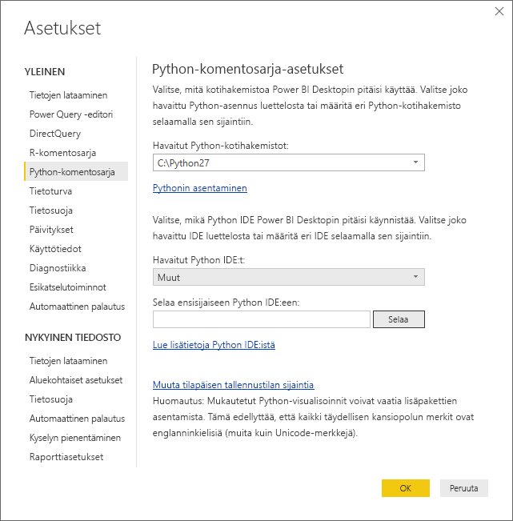
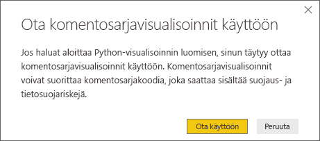
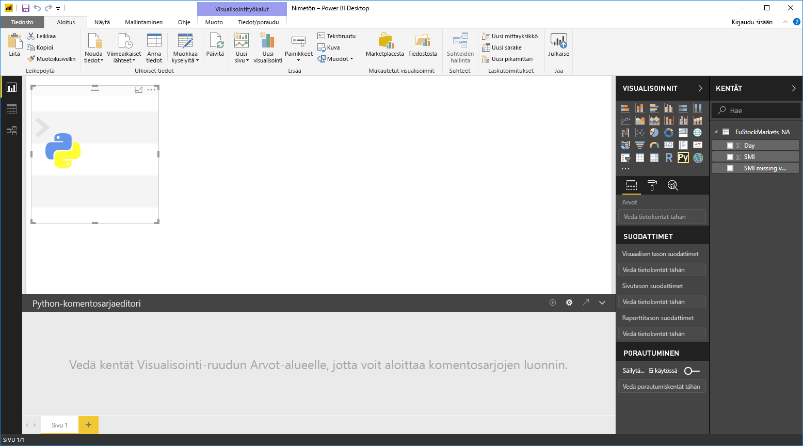
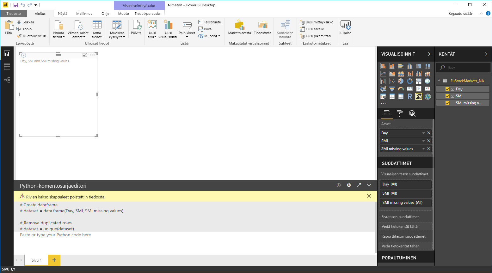
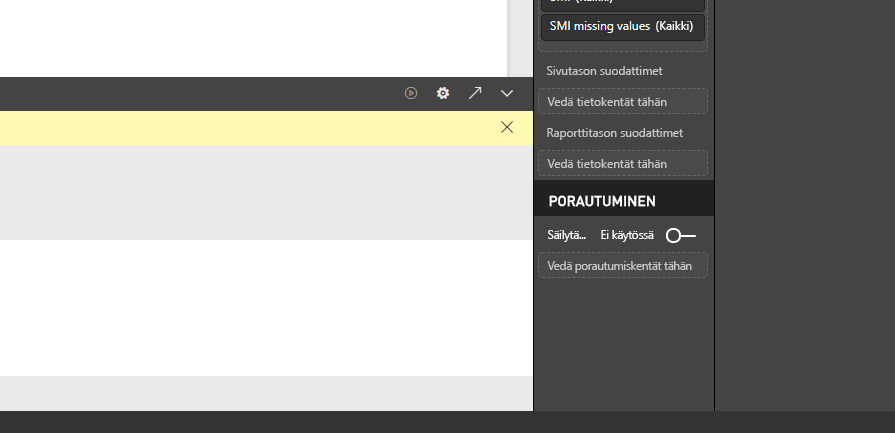
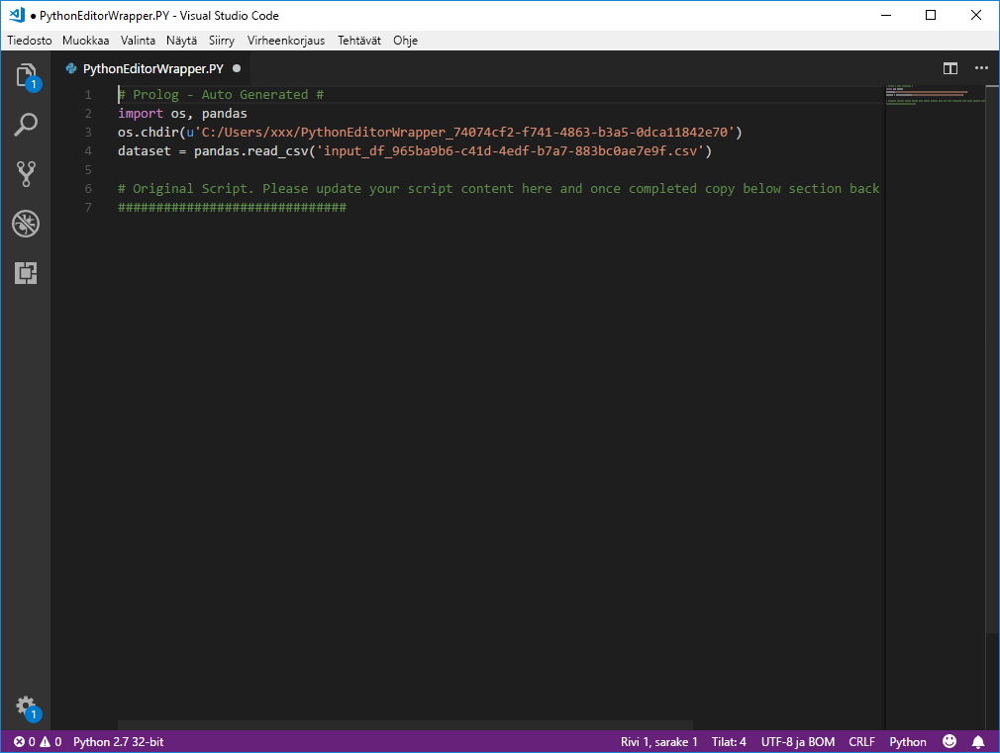

# Ulkoisen Python IDE:n käyttö Power BI:n kanssa
Voit käyttää ulkoista integroitua Python-kehitysympäristöä **Power BI Desktopin** avulla ja luoda ja tarkentaa Python-komentosarjoja ja käyttää kyseisiä komentosarjoja Power BI:ssä.

## Ulkoisen integroidun Python-kehitysympäristön ottaminen käyttöön
Voit käynnistää ulkoisen integroidun Python-kehitysympäristön **Power BI Desktopista**, jolloin tietosi tuodaan ja näytetään automaattisesti integroidussa Python-kehitysympäristössä. Siellä voit muokata kyseisen ulkoisen integroidun Python-kehitysympäristön komentosarjaa ja liittää sen takaisin **Power BI Desktopiin** Power BI -visualisointien ja raporttien luomista varten.

Voit määrittää, mitä integroitua Python-kehitysympäristöä haluat käyttää ja käynnistää sen automaattisesti **Power BI Desktopista**.

### Vaatimukset
Jos haluat käyttää tätä ominaisuutta, sinun on asennettava **integroitu Python-kehitysympäristö** paikalliseen tietokoneeseesi. **Power BI Desktop** ei sisällä, ota käyttöön tai asenna Python-moduulia, joten sinun on asennettava **Python** erikseen paikalliseen tietokoneeseesi. Voit valita seuraavista vaihtoehdoista, mitä integroitua Python-kehitysympäristöä käytät:

* Voit asentaa integroidun Python-suosikkikehitysympäristösi, joista monet ovat saatavilla maksutta esimerkiksi [Visual Studio Code -lataussivulta](https://code.visualstudio.com/download/).
* **Power BI Desktop** tukee myös **Visual Studiota**.
* Voit myös asentaa muun integroidun Python-kehitysympäristön ja saada **Power BI Desktopin** käynnistämään kyseinen **integroitu Python-kehitysympäristö** tekemällä jokin seuraavista:
  
  * Voit liittää **. PY**-tiedostoihin ulkoisen integroidun kehitysympäristön, jonka haluat **Power BI Desktopin** käynnistävän.
  * Voit määrittää .exe-tiedoston, joka **Power BI Desktopin** on käynnistettävä, valitsemalla **Asetukset**-valintaikkunan **Python-komentosarja-asetukset**-osiosta *Muu*. Voit tuoda **Asetukset**-valintaikkunan esiin valitsemalla **Tiedosto > Asetukset ja vaihtoehdot > Asetukset**.
    
    

Jos sinulla on useita integroituja Python-kehitysympäristöjä asennettuna, voit määrittää, mikä käynnistetään, valitsemalla sen **Asetukset**-valintaikkunan avattavasta *Havaitut integroidut Python-kehitysympäristöt* -luettelosta.

Oletusarvoisesti **Power BI Desktop** käynnistää **Visual Studio Coden** ulkoisena integroituna Python-kehitysympäristönä paikallisessa tietokoneessasi. Jos **Visual Studio Codea** ei ole asennettu ja sinulla on **Visual Studio**, se käynnistetään Visual Studio Coden sijaan. Jos kumpaakaan kyseisistä integroiduista Python-kehitysympäristöistä ei ole asennettu, käynnistetään **.PY**-tiedostoihin liittyvä sovellus.

Jos **.PY**-tiedostokytkentää ei ole tehty, on mahdollista määrittää polku mukautettuun integroituun kehitysympäristöön **Asetukset**-valintaikkunan *Selaa haluamaasi integroituun Python-kehitysympäristöön* -osiossa. Voit myös käynnistää muun integroidun Python-kehitysympäristön valitsemalla **Asetukset**-rataskuvakkeen **Käynnistä integroitu Python-kehitysympäristö** -nuolikuvakkeen vieressä **Power BI Desktopissa**.

## Integroidun Python-kehitysympäristön käynnistäminen Power BI Desktopista
Käynnistä integroitu Python-kehitysympäristö **Power BI Desktopista** seuraavasti:

1. Lataa tiedot **Power BI Desktopiin**.
2. Valitse **Kentät**-ruudusta joitakin kenttiä, joita haluat käsitellä. Jos et ole vielä ottanut komentosarjan visualisointeja käyttöön, sinua pyydetään tekemään niin.
   
   
3. Kun komentosarjojen visualisoinnit ovat käytössä, voit valita Python-visualisoinnin **Visualisoinnit**-ruudusta, jolloin luodaan tyhjä Python-visualisointi komentosarjasi tulosten näyttämistä varten. Näkyviin tulee myös **Python-komentosarjaeditori**-ruutu.
   
   
4. Nyt voit valita kentät, joita haluat käyttää Python-komentosarjassa. Kun valitset kentän, **Python-komentosarjaeditori**-kenttä luo automaattisesti komentosarjakoodin valitsemasi kentän tai kenttien perusteella. Voit joko luoda (tai liittää) Python-komentosarjan suoraan **Python-komentosarjaeditori**-ruutuun tai voit jättää sen tyhjäksi.
   
   
   
   > [!NOTE]
   > Python-visualisointien koostamisen oletustyyppi on *Älä tee yhteenvetoa*.
   > 
   > 
5. Voit nyt käynnistää integroidun Python-kehitysympäristön suoraan **Power BI Desktopista**. Valitse **Käynnistä integroitu Python-kehitysympäristö** -painike, joka on **Python-komentosarjaeditorin**-otsikkorivin oikealla puolella, kuten alla esitetään.
   
   
6. Power BI Desktop käynnistää määrittämäsi integroidun Python-kehitysympäristön seuraavassa kuvassa esitetyllä tavalla (tässä kuvassa **Visual Studio Code** on oletusarvoinen integroitu Python-kehitysympäristö).
   
   
   
   > [!NOTE]
   > **Power BI Desktop** lisää komentosarjan kolme ensimmäistä riviä, jotta se voi tuoda tiedot **Power BI Desktopista**, kun suoritat komentosarjan.
   > 
   > 
7. **Power BI Desktopin** **Python-komentosarjaeditori-ruudussa** luomasi komentosarjat näkyvät integroidun Python-kehitysympäristön riviltä 4 alkaen. Tässä vaiheessa voit luoda Python-komentosarjan integroidussa Python-kehitysympäristössä. Kun Python-komentosarja on valmis integroidussa Python-kehitysympäristössä, sinun on kopioitava ja liitettävä se takaisin **Power BI Desktopin** **Python-komentosarjaeditori**-ruutuun *lukuun ottamatta* komentosarjan kolmea ensimmäistä riviä, jotka **Power BI Desktop** loi automaattisesti. Älä kopioi komentosarjan kolmea ensimmäistä riviä takaisin **Power BI Desktopiin**. Kyseisten rivien käyttötarkoitus on vain tietojen tuominen integroituun Python-kehitysympäristöön **Power BI Desktopista**.

### Tunnetut rajoitukset
Integroidun Python-kehitysympäristön käynnistämiseen suoraan Power BI Desktopista liittyy joitakin rajoituksia:

* Komentosarjan viemistä automaattisesti integroidusta Python-kehitysympäristöstä **Power BI Desktopiin** ei tueta.

## Seuraavat vaiheet
Tutustu seuraaviin lisätietoihin, jotka koskevat Pythonia Power BI:ssä.

* [Python-komentosarjojen suorittaminen Power BI Desktopissa](desktop-python-scripts.md)
* [Power BI -visualisointien luominen Pythonin avulla](desktop-python-visuals.md)

