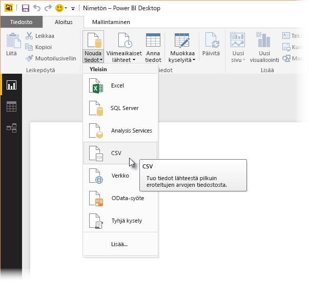
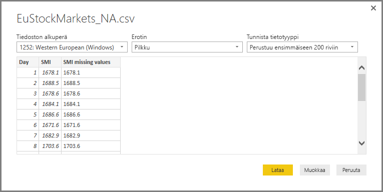
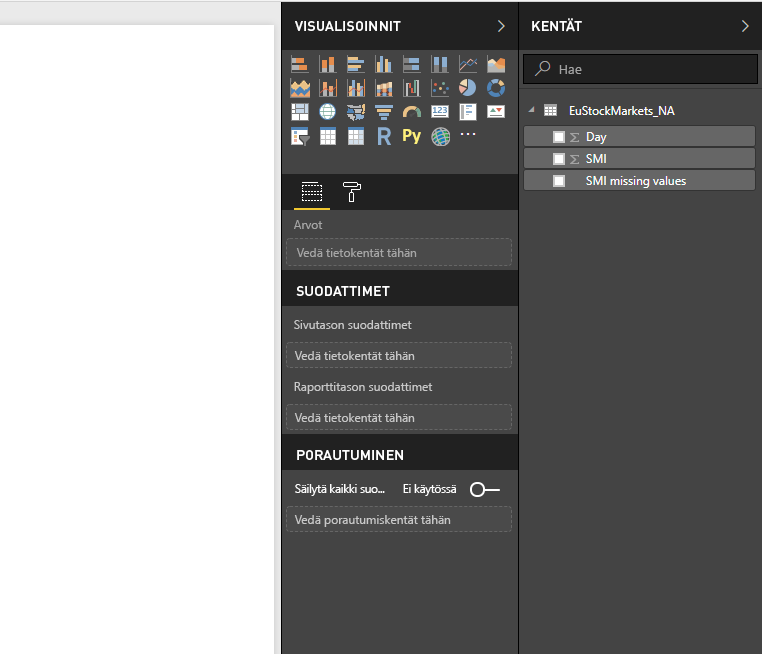
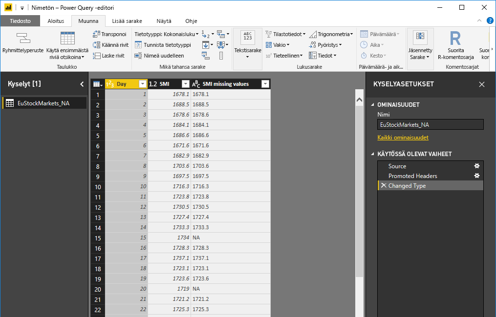
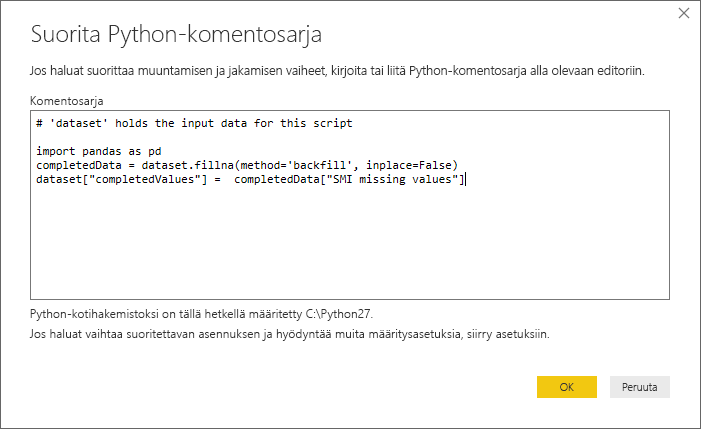
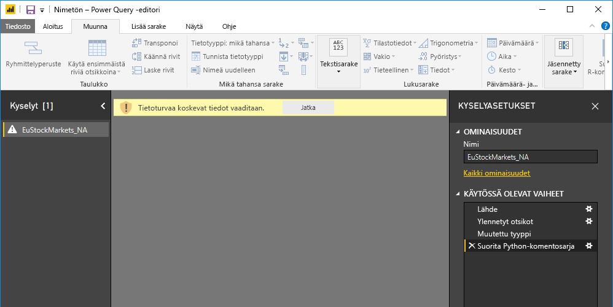
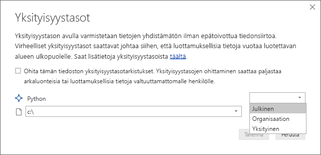
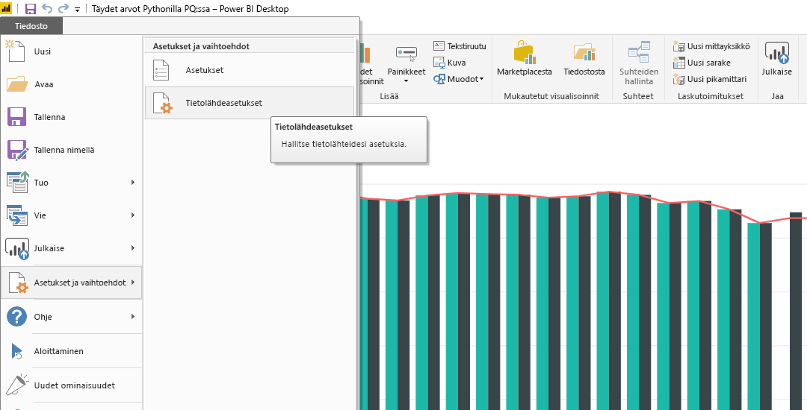
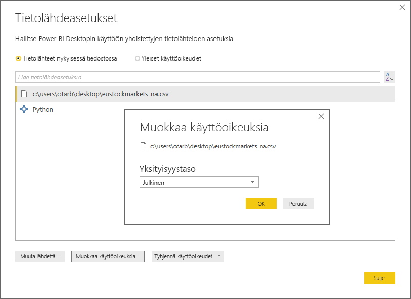

# <a name="use-python-in-query-editor"></a>Pythonin käyttö kyselyeditorissa
Voit käyttää tilastoijien, tiedemiesten ja tietoanalysoijien käyttämää **Python**-ohjelmointikieltä Power BI Desktopin **kyselyeditorissa**. Tämän Pythonin **kyselyeditoriin** integroinnin avulla voit suorittaa tietojen puhdistamisen Pythonilla ja suorittaa kehittynyttä tietojen muotoilemista ja analyysia tietojoukoissa, kuten puuttuvien tietojen täydentämistä, ennusteita ja klusterointia. **Python** on tehokas kieli, ja sitä voidaan käyttää **kyselyeditorissa** valmistelemaan tietomallisi ja raporttien luomiseen.

## <a name="installing-python"></a>Pythonin asentaminen
Jos haluat käyttää **Pythonia** Power BI Desktopin **kyselyeditorissa**, sinun on asennettava **Python** paikallisessa tietokoneessa. Voit ladata ja asentaa **Pythonin** maksutta useista sijainneista, mukaan lukien [Pythonin viralliselta lataussivulta](https://www.python.org/) ja [Anacondasta](https://anaconda.org/anaconda/python/).

## <a name="using-python-in-query-editor"></a>Pythonin käyttö kyselyeditorissa
Katso, miten **Pythonia** voi käyttää **kyselyeditorissa**, tutustumalla tähän pörssitietojoukon esimerkkiin, joka perustuu .CSV-tiedostoon, jonka voit [ladata täältä](https://download.microsoft.com/download/F/8/A/F8AA9DC9-8545-4AAE-9305-27AD1D01DC03/EuStockMarkets_NA.csv) ja jota voit seurata. Tämän esimerkin vaiheet ovat seuraavat:

1. Lataa ensin tiedot **Power BI Desktopiin**. Lataa tässä esimerkissä *EuStockMarkets_NA.csv*-tiedosto ja valitse **Power BI Desktopin** **Aloitus**-valintanauhasta **Nouda tiedot > CSV**.
   
   
2. Valitse tiedosto ja valitse **Avaa**. CSV näytetään **CSV-tiedosto**-valintaikkunassa.
   
   
3. Kun tiedot on ladattu, näet ne Power BI Desktopin **Kentät**-ruudussa.
   
   
4. Avaa **kyselyeditori** valitsemalla **Power BI Desktopin** **Aloitus**-välilehdestä **Muokkaa kyselyitä**.
   
   
5. Valitse **Muunna**-välilehdessä **Suorita Python-komentosarja**. **Suorita Python-komentosarja** -editori tulee näyttöön (näkyy seuraavassa vaiheessa). Huomaa, että riveiltä 15 ja 20 puuttuu tietoja samoin kuin muilta riveiltä, joita et näe seuraavassa kuvassa. Seuraavissa vaiheissa osoitetaan, miten Python voi täyttää (ja täyttää) kyseiset rivit puolestasi.
   
   
6. Anna tässä esimerkissä seuraava komentosarjakoodi:
   
    ```python
       import pandas as pd
       completedData = dataset.fillna(method='backfill', inplace=False)
       dataset["completedValues"] =  completedData["SMI missing values"]
   ```

   > [!NOTE]
   > Python-ympäristöön on oltava asennettuna *pandas*-kirjasto, jotta edellinen komentosarjakoodi toimisi oikein. Asenna pandas suorittamalla seuraava komento Python-asennuksessasi: |      > pip install pandas
   > 
   > 
   
   **Suorita Python-komentosarja** -valintaikkunaan annettuna koodi näyttää seuraavalta:
   
   
7. Kun olet valinnut **OK**, **kyselyeditori** näyttää tietoturvaa koskevan varoituksen.
   
   
8. Jotta Python-komentosarjat toimisivat oikein Power BI-palvelussa, kaikki tietolähteet on asetettava *julkisiksi*. Saat lisätietoja tietosuoja-asetuksista ja niiden vaikutuksista katsomalla [yksityisyystasot](desktop-privacy-levels.md).
   
   
   
   Huomaa **Kentät**-ruudun uusi sarake *completedValues*. Huomaa, että muutamia tietoelementtejä puuttuu, kuten rivillä 15 ja 18. Katso seuraavassa kohdassa, miten Python käsittelee sen.
   

Käyttämällä vain viittä Python-komentosarjan riviä **kyselyeditori** täyttää puuttuvat arvot ennakoivan mallin avulla.

## <a name="creating-visuals-from-python-script-data"></a>Visualisointien luominen Python-komentosarjatiedoista
Voimme nyt visualisoida, miten *pandas*-kirjastoa käyttävä Python-komentosarjakoodi täytti puuttuvat arvot, mikä on esitetty seuraavassa kuvassa:


Kun tämä visualisointi ja muut visualisoinnit, jotka haluat luoda **Power BI Desktopilla**, ovat valmiit, voit tallentaa **Power BI Desktop** -tiedoston (joka tallennetaan .pbix-tiedostona) ja käyttää sitten tietomallia ja sen osana olevia Python-komentosarjoja Power BI-palvelussa.

> [!NOTE]
> Haluatko nähdä valmiin .pbix-tiedoston, jossa nämä vaiheet on suoritettu? Voit ladata näissä esimerkeissä käytetyn valmiin **Power BI Desktop** -tiedoston [täältä](https://download.microsoft.com/download/A/B/C/ABCF5589-B88F-49D4-ADEB-4A623589FC09/Complete%20Values%20with%20Python%20in%20PQ.pbix).

Kun olet ladannut .pbix-tiedoston Power BI -palveluun, sinun on suoritettava muutama lisävaihe, jotta voit ottaa tietojen päivityksen käyttöön (palvelussa) ja sallia visualisointien päivittämisen palvelussa (tiedoilla on oltava Pythonin käyttöoikeus, jotta visualisoinnit voidaan päivittää). Lisävaiheet ovat seuraavat:

* **Ota tietojoukon ajoitettu päivitys käyttöön** – Jos haluat ottaa tietojoukon ja Python-komentosarjan sisältävän työkirjan päivittämisen käyttöön, katso kohta [Ajoitetun päivityksen määrittäminen](refresh-scheduled-refresh.md), jossa on myös tietoja **henkilökohtaisesta yhdyskäytävästä**.
* **Asenna henkilökohtainen yhdyskäytävä** – Sinulla on oltava **henkilökohtainen yhdyskäytävä** asennettuna koneeseen, jossa tiedosto sijaitsee ja johon Python on asennettu. Power BI-palvelun on käytettävä työkirjaa ja hahmonnettava päivitetyt visualisoinnit uudelleen. Saat lisätietoja siitä, miten voit [asentaa ja määrittää henkilökohtaisen yhdyskäytävän](personal-gateway.md).

## <a name="limitations"></a>Rajoitukset
Kyselyissä, jotka sisältävät **Kyselyeditorissa** luotuja Python-komentosarjoja, on joitakin rajoituksia:

* Kaikki Python-tietolähdeasetukset on määritettävä *julkisiksi* ja kaikkien muiden **kyselyeditorissa** luodun kyselyn vaiheiden on oltava julkisia. Siirry tietolähdeasetuksiin **Power BI Desktopissa** valitsemalla **Tiedosto > Asetukset > Tietolähdeasetukset**.
  
  
  
  Valitse **Tietolähdeasetukset**-valintaikkunassa tietolähteet, valitse **Muokkaa käyttöoikeuksia...**  ja varmista, että **Tietosuojataso** on määritetty arvoon *Julkinen*.
  
      
* Jos haluat ottaa Python-visualisointien tai tietojoukon ajoitetun päivityksen käyttöön, sinun on otettava **Ajoitettu päivitys** käyttöön ja asennettava **Henkilökohtainen yhdyskäytävä** tietokoneeseen, jossa työkirja ja Python-asennus ovat. Saat lisätietoja kummastakin tämän artikkelin edellisestä osasta, jonka linkeissä on lisätietoja kummastakin.
* Sisäkkäisiä taulukoita (taulukko taulukoista) ei tueta tällä hetkellä 

Voit tehdä kaikenlaisia asioita Pythonilla ja mukautetuilla kyselyillä, joten tutki ja muotoile tietoja sellaisiksi, miten haluat niiden näkyvän.

