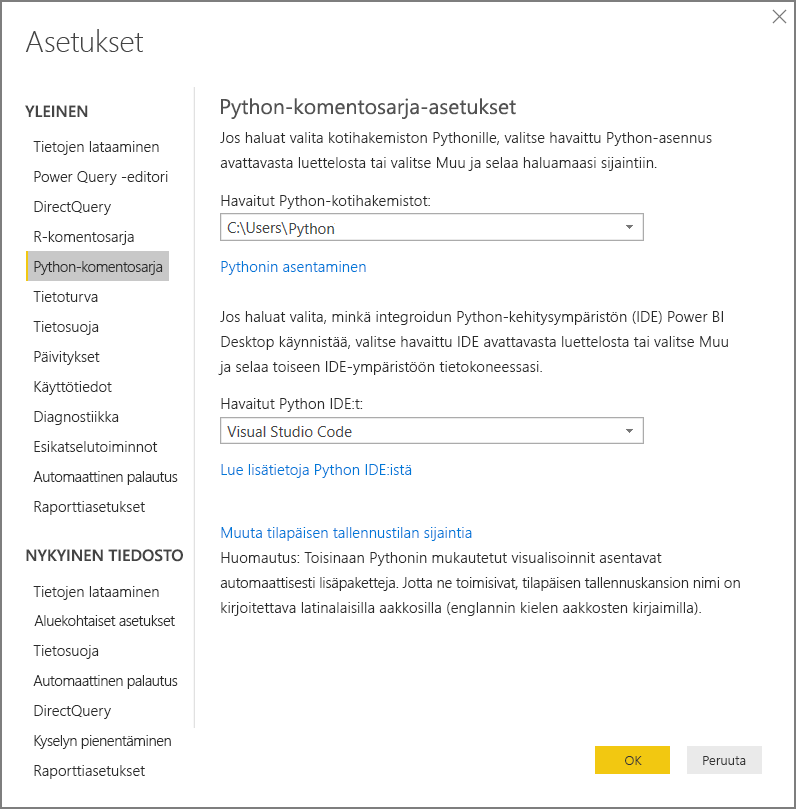
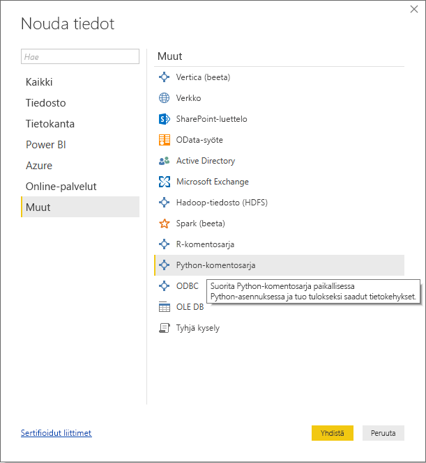
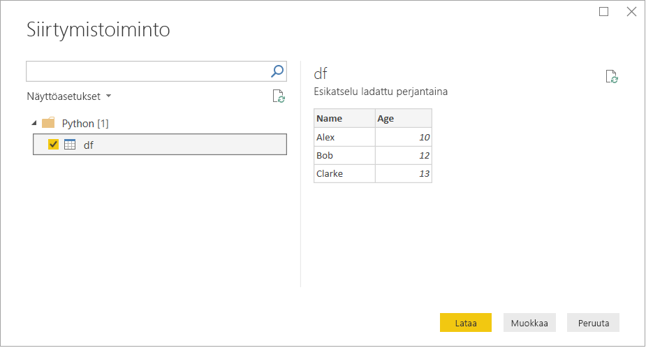
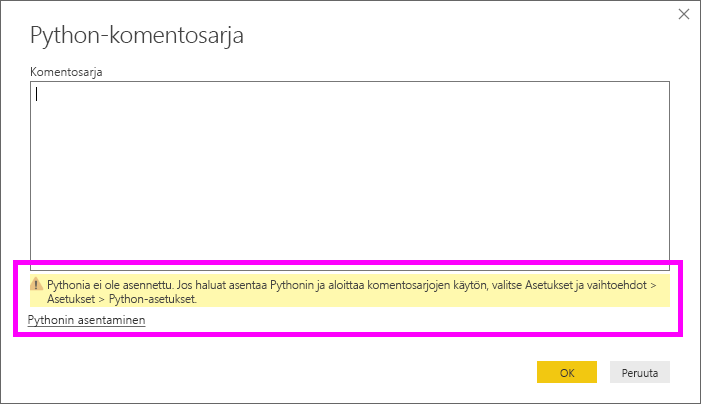

# <a name="run-python-scripts-in-power-bi-desktop"></a>Suorita Python-komentosarjoja Power BI Desktopissa

Voit suorittaa Python-komentosarjoja suoraan Power BI Desktopissa ja tuoda saatavat tietojoukot Power BI Desktopin tietomalliin.

## <a name="install-python"></a>Pythonin asentaminen

Jos haluat suorittaa Python-komentosarjoja Power BI Desktopissa, sinun on asennettava Python paikalliseen tietokoneeseen. Voit ladata Pythonin [Python-verkkosivustolta](https://www.python.org/). Nykyinen Python-komentosarjaversio tukee Unicode-merkkejä ja välilyöntejä asennuspolussa.

### <a name="install-required-python-packages"></a>Tarvittavien Python-pakettien asentaminen

Power BI:n Python-integrointi edellyttää kahden Python-paketin asentamista:

* [Pandas](https://pandas.pydata.org/). Ohjelmistokirjasto tietojen käsittelyä ja analysointia varten. Se tarjoaa tietorakenteita ja toimintoja numeeristen taulukoiden ja aikasarjojen muokkaamiseen. Tuotujen tietojen on oltava [pandas-tietokehyksessä](https://www.tutorialspoint.com/python_pandas/python_pandas_dataframe.htm). Tietokehys on kaksiulotteinen tietorakenne. Tiedot esimerkiksi tasataan taulukkomuotoisesti riveihin ja sarakkeisiin.
* [Matplotlib](https://matplotlib.org/). Pythonin piirtokirjasto ja sen numeerinen matematiikkalaajennus [NumPy](https://www.numpy.org/). Se tarjoaa objektipohjaisen ohjelmointirajapinnan piirtoalueiden upottamiseen sovelluksiin yleiskäyttöisten GUI-työkalupakettien avulla, kuten Tkinter, wxPython, Qt tai GTK+.

Asenna kaksi pakettia konsolissa tai liittymässä käyttämällä [pip](https://pip.pypa.io/en/stable/)-komentorivityökalua. PIP-työkalu sisältyy uusimpiin Python-versioihin.

```CMD
pip install pandas
pip install matplotlib
```

## <a name="enable-python-scripting"></a>Python-komentosarjojen ottaminen käyttöön

Ota Python-komentosarjat käyttöön seuraavasti:

1. Valitse Power BI Desktopissa **Tiedosto** > **Asetukset ja vaihtoehdot** > **Asetukset** > **Python-komentosarjat**. **Python-komentosarjan asetukset** -sivu tulee näkyviin.

   

1. Määritä tarvittaessa paikallinen Python-asennuspolku **Havaitut Python-aloitushakemistot** -kohdassa.

   Edellä olevassa kuvassa Python-asennuksen paikallinen polku on *C:\Python*. Varmista, että polku vastaa paikallista Python-asennusta, jota haluat Power BI Desktopin käyttävän.

1. Valitse **OK**.

Kun olet määrittänyt Python-asennuksesi, olet valmis aloittamaan Python-komentosarjojen suorittamisen Power BI Desktopissa.

## <a name="run-python-scripts"></a>Suorita Python-komentosarjoja

Voit suorittaa Python-komentosarjat ja luoda tietomallin helposti muutamassa vaiheessa. Tästä mallista voit luoda raportteja ja jakaa niitä Power BI -palvelussa.

### <a name="prepare-a-python-script"></a>Valmistele Python-komentosarja

Luo ensin komentosarja paikallisessa Python-kehitysympäristössä ja varmista, että se suoritetaan onnistuneesti. Tässä on esimerkiksi yksinkertainen Python-komentosarja, joka tuo pandoja ja käyttää tietokehystä:

```python
import pandas as pd
data = [['Alex',10],['Bob',12],['Clarke',13]]
df = pd.DataFrame(data,columns=['Name','Age'],dtype=float)
print (df)
```

Kun suoritat komentosarjan, saat tuloksesi seuraavan:

```python
     Name   Age
0    Alex  10.0
1     Bob  12.0
2  Clarke  13.0
```

Kun valmistellaan ja suoritetaan Python-komentosarjaa Power BI Desktopissa, myös muutamia rajoituksia on otettava huomioon:

* Vain Pandas-kehykset on tuotu, joten varmista, että Power BI:hin tuotavat tiedot esitetään tietokehyksessä
* Kaikki Python-komentosarjat, joita suoritetaan yli 30 minuuttia, aikakatkaistaan
* Python-komentosarjan interaktiiviset kutsut kuten odottaminen käyttäjän syötettä pysäyttää komentosarjan suorittamisen
* Työhakemistoa määritettäessä Python-komentosarjan sisällä *pitää* koko polku määrittää työhakemistoon suhteellisen polun sijaan
* Sisäkkäisiä taulukoita ei tueta tällä hetkellä

### <a name="run-your-python-script-and-import-data"></a>Python-komentosarjan suorittaminen ja tietojen tuonti

Voit suorittaa Python-komentosarjasi Power BI Desktopissa seuraavasti:

1. Valitse Aloitus-valintanauhasta **Nouda tiedot** > **Muut**.

1. Valitse **Muu** > **Python-komentosarja** seuraavassa kuvassa esitetyllä tavalla:

   

1. Valitse **Muodosta yhteys**. Paikalliseen tietokoneeseen asennettu uusin Python-versio valitaan Python-moduuliksi. Kopioi komentosarjasi näyttöön tulevaan **Python-komentosarja**-valintaikkunaan. Tähän kirjoitetaan aiemmin näytetty yksinkertainen Python-komentosarja.

   

1. Valitse **OK**. Jos komentosarjan suorittaminen onnistuu, näyttöön tulee **Siirtymistoiminto**, ja voit ladata tiedot ja käyttää niitä. Valitse esimerkissä **df** kuvan mukaisesti ja sitten**Lataa**.

    

### <a name="troubleshooting"></a>Vianmääritys

Jos Pythonia ei ole asennettu tai tunnistettu, näyttöön tulee varoitus. Näyttöön tulee varoitus myös, jos sinulla on useita paikallisia koneasennuksia. Lue uudelleen kohdat Pythonin asentaminen ja Python-komentosarjojen ottaminen käyttöön.



#### <a name="using-custom-python-distributions"></a>Mukautettujen Python-jakeluiden käyttäminen

Power BI suorittaa komentosarjoja suoraan käyttämällä python.exe-suoritustiedostoa käyttäjän valitsemasta hakemistosta (määritetty asetussivulla). Versioissa, jotka edellyttävät lisävaihetta ympäristön valmistelemiseen (esim. Conda), saattaa esiintyä suorituksen keskeytymiseen johtava ongelma.

Suosittelemme, että käytät virallista Python-versiota (https://www.python.org/ ), jotta vältyt tällaisilta ongelmilta.

Voit yrittää ratkaista ongelman käynnistämällä Power BI Desktopin mukautetun Python-ympäristön kehotteesta.

### <a name="refresh"></a>päivitys

Voit päivittää Power BI Desktopin Python-komentosarjan. Kun haluat päivittää, siirry **Aloitus**-valintanauhaan ja valitse **Päivitä**. Kun päivität Python-komentosarjan, Power BI Desktop suorittaa Python-komentosarjan uudelleen.

## <a name="next-steps"></a>Seuraavat vaiheet

Tutustu seuraaviin lisätietoihin, jotka koskevat Pythonia Power BI:ssä.

* [Python-visualisointien luominen Power BI Desktopissa](desktop-python-visuals.md)
* [Ulkoisen Python IDE:n käyttö Power BI:n kanssa](desktop-python-ide.md)
