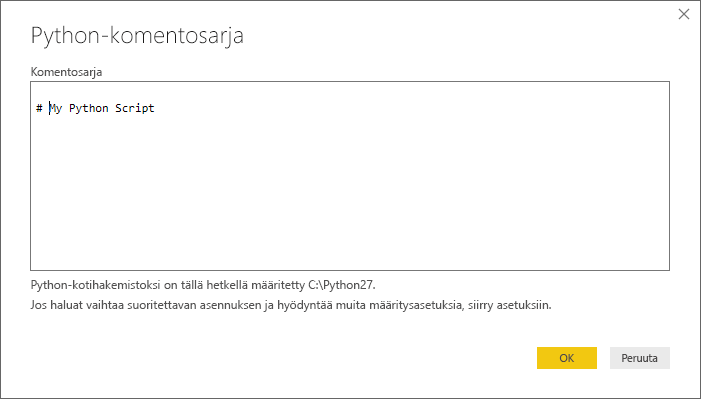
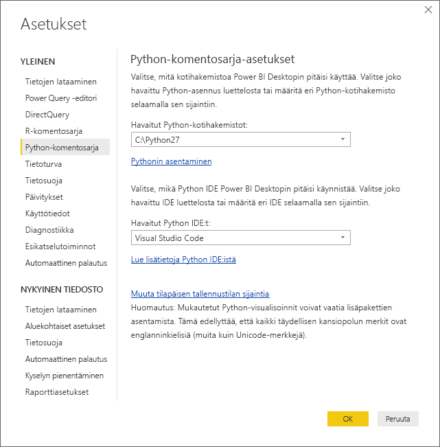

# <a name="run-python-scripts-in-power-bi-desktop"></a>Suorita Python-komentosarjoja Power BI Desktopissa
Voit suorittaa Python-komentosarjoja suoraan **Power BI Desktopissa** ja tuoda tietojoukot Power BI Desktopin tietomallin.

## <a name="install-python"></a>Pythonin asentaminen
Jos haluat suorittaa Python-komentosarjoja Power BI Desktopissa, sinun on asennettava **Python** paikalliseen tietokoneeseen. Voit ladata ja asentaa **Pythonin** maksutta useista sijainneista, mukaan lukien [Pythonin viralliselta lataussivulta](https://www.python.org/) ja [Anacondasta](https://anaconda.org/anaconda/python/). Nykyinen Python-komentosarjan versio Power BI Desktopissa tukee Unicode-merkkejä sekä välilyöntejä (tyhjiä merkkejä) asennuspolulla.

### <a name="install-required-python-packages"></a>Asenna tarvittavat Python-paketit
Power BI:n Python-integrointi edellyttää kahden Python-paketin (Pandas ja Matplotlib) asentamista.  Asenna seuraavat kaksi pakettia pip-komentorivityökalun avulla,

```
pip install pandas
pip install matplotlib
```

## <a name="run-python-scripts"></a>Suorita Python-komentosarjoja
Power BI Desktopin ensimmäisinä vaiheina voit suorittaa Python-komentosarjoja ja luoda tietomallin, josta voit luoda raportteja ja jakaa niitä Power BI -palvelussa.

### <a name="prepare-a-python-script"></a>Valmistele Python-komentosarja
Python-komentosarjan suorittamiseksi Power BI Desktopissa on luotava komentosarja paikalliseen Python-kehitysympäristöön ja varmistettava, että se suoritetaan onnistuneesti.

Jos haluat suorittaa komentosarjan Power BI Desktopissa, varmista, että komentosarjan suorittaminen onnistuu uudessa ja muokkaamattomassa työtilassa. Tämä tarkoittaa, että kaikki paketit ja niiden riippuvuudet on ladattava ja suoritettava eksplisiittisesti.

Kun valmistellaan ja suoritetaan Python-komentosarjaa Power BI Desktopissa, myös muutamia rajoituksia on otettava huomioon:

* Vain Pandas-kehykset on tuotu, joten varmista, että Power BI:hin tuotavat tiedot esitetään tietokehyksessä
* Kaikki Python-komentosarjat, joita suoritetaan yli 30 minuuttia, aikakatkaistaan
* Python-komentosarjan interaktiiviset kutsut kuten odottaminen käyttäjän syötettä pysäyttää komentosarjan suorittamisen
* Työhakemistoa määritettäessä Python-komentosarjan sisällä *pitää* koko polku määrittää työhakemistoon suhteellisen polun sijaan
* Sisäkkäisiä taulukoita (taulukko taulukoista) ei tueta tällä hetkellä 

### <a name="run-your-python-script-and-import-data"></a>Python-komentosarjan suorittaminen ja tietojen tuonti
1. Power BI Desktopissa Python-komentosarjan dataliitin löytyy kohdasta **Nouda tiedot**. Voit suorittaa Python-komentosarjan valitsemalla **Nouda tiedot &gt; Lisää...** , ja valitsemalla sitten **Muu &gt; Python-komentosarja** seuraavassa kuvassa esitetyllä tavalla:
   
   
2. Jos Python on asennettu paikalliseen tietokoneeseen, uusin asennettu versio valitaan Python-moduuliksi. Kopioi komentosarja ikkunaan ja valitse **OK**.
   
   
3. Jos Pythonia ei ole asennettu, sitä ei tunnistetta tai jos paikallisessa tietokoneessasi on useita asennuksia, näkyviin tulee varoitus.
   
   
   
   Python-asennusasetukset sijaitsevat keskitetysti Python-komentosarjat-osassa Asetukset-valintaikkunassa. Määritä Python-asennuksen asetukset valitsemalla **Tiedosto > Asetukset ja vaihtoehdot** ja valitse sitten **Asetukset > Python-komentosarja**. Jos käytettävissä on useita Python-asennuskertoja, esiin tulee pudotusvalikko, josta voit valita, mitä asennusta käyttää. Voit myös valita **Muu** ja antaa mukautetun polun.
   
   
4. Valitse **OK** Python-komentosarjan suorittamiseen. Kun komentosarjan suorittaminen onnistuu, voit sitten valita saatavat tiedot kehykset, voit lisätä Power BI-malliin.

### <a name="refresh"></a>Päivitä
Voit päivittää Power BI Desktopin Python-komentosarjan. Kun päivität Python-komentosarjaa, Power BI Desktop suorittaa Python-komentosarjan uudelleen Power BI Desktop -ympäristössä.

## <a name="next-steps"></a>Seuraavat vaiheet
Tutustu seuraaviin lisätietoihin, jotka koskevat Pythonia Power BI:ssä.

* [Python-visualisointien luominen Power BI Desktopissa](desktop-python-visuals.md)
* [Ulkoisen Python IDE:n käyttö Power BI:n kanssa](desktop-python-ide.md)
