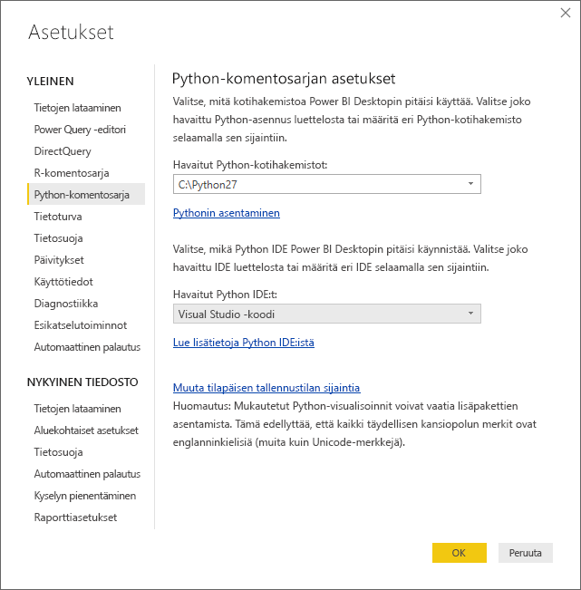
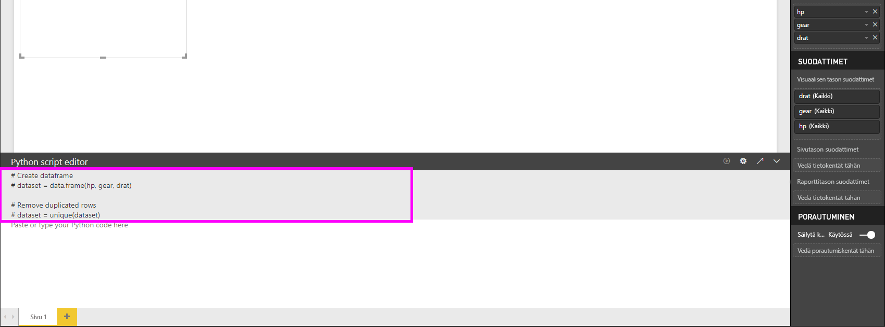
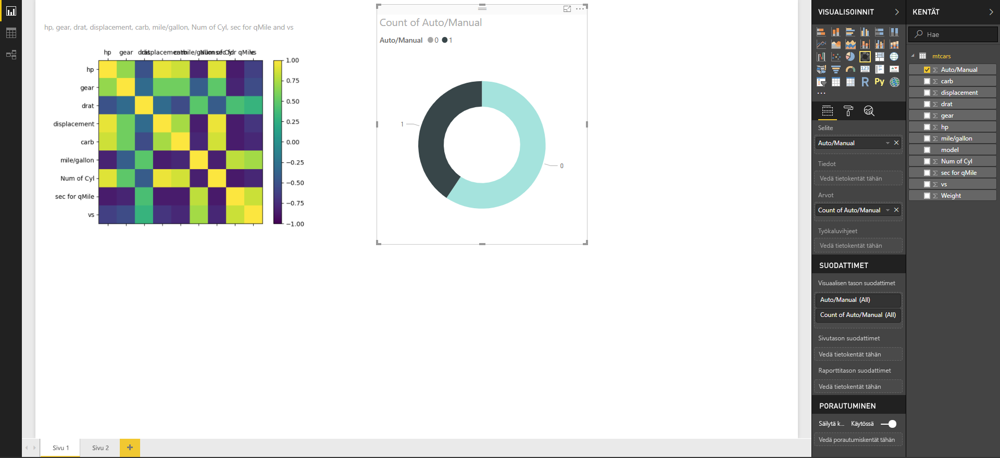
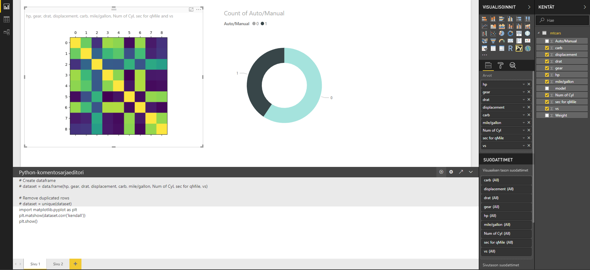
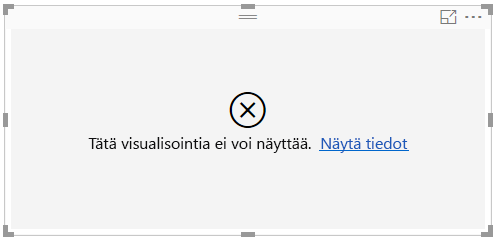

# Power BI -visualisointien luominen Pythonin avulla
**Power BI Desktopin** kanssa voit käyttää **Pythonia** tietojen visualisoimiseen.

## Pythonin asentaminen
**Power BI Desktop** ei sisällä, ota käyttöön tai asenna **Python**-moduulia. Jos haluat suorittaa Python-komentosarjoja **Power BI Desktopissa**, sinun on asennettava **Python** erikseen paikallisessa tietokoneessa. Voit ladata ja asentaa **Pythonin** maksutta useista sijainneista, mukaan lukien [Pythonin viralliselta lataussivulta](https://www.python.org/) ja [Anacondasta](https://anaconda.org/anaconda/python/). Nykyinen Python-komentosarjan versio Power BI Desktopissa tukee Unicode-merkkejä sekä välilyöntejä (tyhjiä merkkejä) asennuspolulla.

## Ota Python-visualisoinnit käyttöön
Ota Python-visualisoinnit käyttöön valitsemalla **Tiedosto > Asetukset ja vaihtoehdot > Asetukset** ja näkyviin tulevalla **Asetukset**-sivulla varmista, että paikallinen Python-asennus on määritetty **Python-komentosarjat**-osassa **Asetukset**-ikkunassa seuraavassa kuvassa esitetyllä tavalla. Seuraavassa kuvassa Pythonin paikallinen asennuspolku on **C:\Python27**, ja kyseinen polku on nimenomaisesti määritetty tekstiruudussa. Varmista, että polku näkyy oikein ja kuvastaa paikallista Python-asennusta, jota haluat **Power BI Desktopin** käyttävän.
   
   

Kun olet määrittänyt Python-asennukset, olet valmis aloittamaan Python-visualisointien luomisen.

## Python-visualisointien luominen Power BI Desktopissa
1. Valitse **Python-visualisointi**-kuvake **Visualisointi**-ruudussa seuraavassa kuvassa esitetyllä tavalla, jos haluat lisätä Python-visualisoinnin.
   
   

   Kun haluat lisätä raporttiin Python-visualisoinnin, **Power BI Desktop** toimii seuraavasti:
   
   - Python-visualisoinnin kuvan paikkamerkki tulee näkyviin raportin piirtoalustalle.
   
   - **Python-komentosarjaeditori** näkyy keskimmäisen ruudun alareunassa.
   
   

2. Lisää seuraavaksi kentät, joita haluat käyttää Python-komentosarjassa, **Arvot**-osioon **Kentät**-kohdassa samalla tavalla kuin muunkin **Power BI Desktop** -visualisoinnin. 
    
    Vain kentät, jotka on lisätty **Kentät**-kohtaan, ovat käytettävissä Python-komentosarjaasi varten. Voit lisätä uusia kenttiä tai poistaa tarpeettomia kenttiä **Kentät**-kohdasta käsitellessäsi Python-komentosarjaasi **Power BI Desktopin Python-komentosarjaeditorissa**. **Power BI Desktop** havaitsee automaattisesti, mitkä kentät on lisätty tai poistettu.
   
   > [!NOTE]
   > Python-visualisointien koostamisen oletustyyppi on *Älä tee yhteenvetoa*.
   > 
   > 
   
3. Nyt voit luoda piirron valitsemiesi tietojen perusteella. 

    Kun valitset kenttiä, **Python-komentosarjaeditori** luo tukevan Python-komentosarjan sidontakoodin harmaassa osassa editoriruudun yläosassa tekemiesi valintojen perusteella. Kun valitset tai poistat lisäkenttiä, tukikoodi Python-komentosarjaeditorissa luodaan tai poistetaan vastaavasti automaattisesti.
   
   Seuraavassa kuvassa olevassa esimerkissä valittiin kolme kenttää: hp, hammaspyörä ja drat. Näiden valintojen tuloksena Python-komentosarjaeditori loi seuraavan sidontakoodin:
   
   * Datakehys nimeltään**tietojoukko** luotiin
     * Kyseinen datakehys koostuu käyttäjän valitsemista kentistä
   * Koostamisen oletustyyppi on *Älä tee yhteenvetoa*
   * Samoin kuin taulukon visualisoinnit, kentät on ryhmitelty ja rivien kaksoiskappaleet näkyvät vain kerran
   
   
   
   > [!TIP]
   > Joissakin tapauksissa et ehkä halua automaattista ryhmittelyä tai haluat ehkä kaikkien rivien näkyvän, mukaan lukien kaksoisarvot. Tässä tapauksessa voit lisätä tietojoukkoosi indeksikentän, jonka takia kaikkia rivejä pidetään yksilöllisinä ja joka estää ryhmittelyn.
   > 
   > 
   
   Luotu tietokehys on nimeltään **tietojoukko**, ja voit käyttää valittuja sarakkeita niiden nimillä. Esimerkiksi hammaspyöräkenttää voi käyttää kirjoittamalla *tietojoukko[”hammaspyörä”]* Python-komentosarjaan.

4. Valitsemasi kentät luovat tietokehyksen automaattisesti, joten olet valmis kirjoittamaan Python-komentosarjan, joka johtaa piirron luomiseen Python-oletuslaitteeseen. Kun komentosarja on valmis, valitse **Suorita** **Python-komentosarjaeditorin** otsikkorivillä (**Suorita** on otsikkorivin oikealla puolella).
   
    Kun **Suorita** on valittuna, **Power BI Desktop** tunnistaa piirron ja esittää sen piirtoalustalla. Koska prosessi suoritetaan paikallisessa Python-asennuksessa, varmista, että tarvittavat paketit asennetaan.
   
   **Power BI Desktop** piirtää visualisoinnin uudelleen, kun jokin seuraavista tapahtumista tapahtuu:
   
   * Kun valitset **Suorita** **Python-komentosarjaeditorin** otsikkoriviltä
   * Aina kun tietoja muutetaan päivittämisen, suodattamisen tai korostamisen vuoksi

    Seuraavassa kuvassa on esimerkki korrelaation piirtokoodista, ja siinä piirretään korrelaatiot erityyppisten autojen määritteiden välillä.

    

5. Saat visualisointeja suurempaan näkymään pienentämällä **Python-komentosarjaeditorin**. Ja tietysti muiden visualisointien tapaan **Power BI Desktopissa** voit ristisuodattaa korrelaation piirron valitsemalla vain urheiluautot rengasvisualisoinnissa (pyöreä visualisointi oikealla yllä olevan esimerkin kuvassa).

    

6. Voit myös muokata Python-komentosarjaa visualisoinnin mukauttamiseksi ja hyödyntää Pythonin tehoa lisäämällä parametreja piirtokomentoon.

    Alkuperäinen piirtokomento oli seuraavanlainen:

    plt.matshow(dataset.corr('pearson'))

    Joidenkin Python-komentosarjan muutosten jälkeen komento on nyt seuraava:

    plt.matshow(dataset.corr('kendall'))

    Tuloksena Python-visualisointi piirtää nyt käyttäen Kendall Tau -korrelaatiokerrointa seuraavassa kuvassa esitetyllä tavalla.

    

    Suoritettaessa Python-komentosarjaa, jonka tuloksena on virhe, Python-visualisointia ei piirretä ja virhesanoma tulee näkyviin piirtoalustalle. Lisätietoja virheestä saat valitsemalla **Näytä tiedot** Python-visualisoinnin virheestä piirtoalustalla.

    

    > **Python-komentosarjojen suojaus:** Python-visualisointeja luodaan Python-komentosarjoista, joiden koodi voi sisältää suojaus- tai tietosuojariskejä. Kun yrität tarkastella tai käsitellä Python-visualisointia ensimmäistä kertaa, käyttäjälle esitetään suojauksen varoitussanoma. Ota Python-visualisoinnit käyttöön vain, jos luotat tekijään ja lähteeseen, tai sen jälkeen, kun olet tarkastanut Python-komentosarjan ja tutustunut siihen.
    > 
    > 

## Tunnetut rajoitukset
Python-visualisoinneilla **Power BI Desktopissa** on joitakin rajoituksia:

* Tietojen kokorajoitukset – Python-visualisointien piirtämiseen käyttämä tietomäärä on rajoitettu 150 000 riviin. Jos valittuna on yli 150 000 riviä, vain 150 000 ylintä riviä käytetään ja kuvassa näkyy sanoma.
* Laskenta-ajan rajoitus – jos Python-visualisoinnin laskenta kestää kauemmin kuin viisi minuuttia, suoritus aikakatkaistaan ja tuloksena on virhe.
* Yhteydet – muiden Power BI Desktop -visualisointien tavoin, jos eri taulukoista on valittuna tietokenttiä, joiden välille ei ole määritetty yhteyttä, tapahtuu virhe.
* Python-visualisoinnit päivitetään tietojen päivittämisen, suodattamisen ja korostamisen yhteydessä. Kuitenkin itse kuva ei ole vuorovaikutteinen, eikä sitä voi käyttää ristiinsuodatuksen lähteenä.
* Python-visualisoinnit reagoivat muiden visualisointien korostamiseen, mutta et voi napsauttaa Python-visualisointien elementtejä ristiinsuodattaaksesi muita elementtejä.
* Vain piirrot, jotka on piirretty Pythonin oletusarvoiseen näyttölaitteeseen, näkyvät oikein piirtoalustalla. Vältä nimenomaisesti eri Python-näyttölaitteen käyttämistä.

## Seuraavat vaiheet
Tutustu seuraaviin lisätietoihin, jotka koskevat Pythonia Power BI:ssä.

* [Python-komentosarjojen suorittaminen Power BI Desktopissa](desktop-python-scripts.md)
* [Ulkoisen Python IDE:n käyttö Power BI:n kanssa](desktop-python-ide.md)

