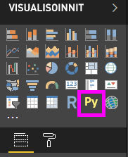
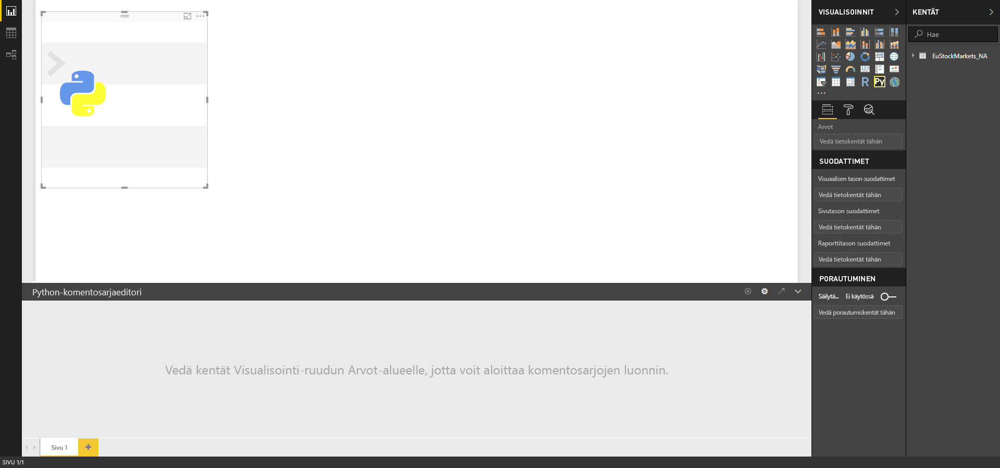
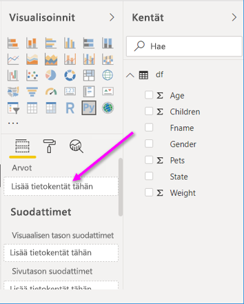
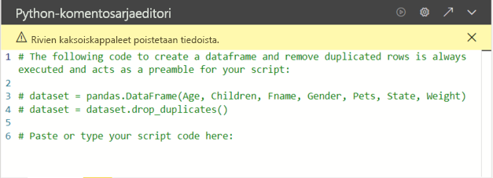
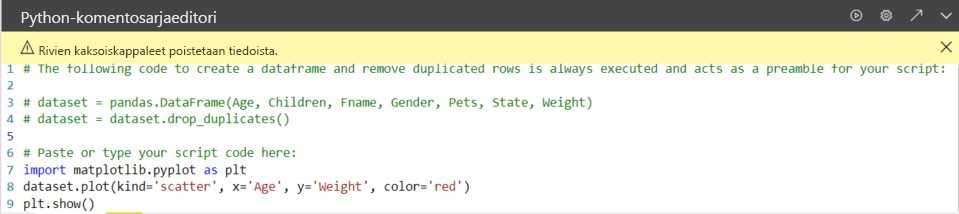

# <a name="create-power-bi-visuals-by-using-python"></a>Power BI -visualisointien luominen Pythonin avulla

Pythonia voi käyttää tietojen visualisointiin *Power BI Desktopissa*.

## <a name="prerequisites"></a>Edellytykset

Käy läpi [Python-komentosarjojen suorittaminen Power BI Desktopissa](desktop-python-scripts.md) -opetusohjelma käyttämällä seuraavaa Python-komentosarjaa:

```python
import pandas as pd 
df = pd.DataFrame({ 
    'Fname':['Harry','Sally','Paul','Abe','June','Mike','Tom'], 
    'Age':[21,34,42,18,24,80,22], 
    'Weight': [180, 130, 200, 140, 176, 142, 210], 
    'Gender':['M','F','M','M','F','M','M'], 
    'State':['Washington','Oregon','California','Washington','Nevada','Texas','Nevada'],
    'Children':[4,1,2,3,0,2,0],
    'Pets':[3,2,2,5,0,1,5] 
}) 
print (df) 
```

Artikkelissa [Python-komentosarjojen suorittaminen Power BI Desktopissa](desktop-python-scripts.md) kuvataan, miten voit asentaa Pythonin paikalliseen tietokoneeseesi ja ottaa sen käyttöön Python-komentosarjoja varten Power BI Desktopissa. Tässä opetusohjelmassa käytetään edellä olevan komentosarjan tietoja Python-visualisointien luomisen esittelyssä.

## <a name="create-python-visuals-in-power-bi-desktop"></a>Python-visualisointien luominen Power BI Desktopissa

1. Valitse **Python-visualisointi**-kuvake **Visualisoinnit**-ruudussa.

   

1. Valitse näkyviin tulevassa **Ota käyttöön komentosarjavisualisoinnit** -valinta ikkunassa **Ota käyttöön**.

    Kun lisäät raporttiin Python-visualisoinnin, Power BI Desktop toimii seuraavasti:

    - Python-visualisoinnin kuvan paikkamerkki tulee näkyviin raportin piirtoalustalle.

    - **Python-komentosarjaeditori** näkyy keskimmäisen ruudun alareunassa.

    

1. Vedä seuraavaksi **Ikä**-, **Lapset**-, **Etunimi**-, **Sukupuoli**-, **Lemmikit**-, **Osavaltio**- ja **Paino**-kentät **Arvot**-osaan, jossa on teksti **Lisää tietokentät tähän**.

    

   Python-komentosarjasi voi käyttää vain **Arvot**-osaan lisättyjä kenttiä. Voit lisätä tai poistaa kenttiä **Arvot**-osassa, kun käsittelet Python-komentosarjaa. Power BI Desktop tunnistaa kenttien muutokset automaattisesti.

   > [!NOTE]
   > Python-visualisointien koostamisen oletustyyppi on *Älä tee yhteenvetoa*.
   > 
   > 

1. Nyt voit luoda piirron valitsemiesi tietojen perusteella.

    Kun valitset tai poistat kenttiä, tukikoodi Python-komentosarjaeditorissa luodaan tai poistetaan automaattisesti. 

    Valintojesi perusteella Python-komentosarjaeditori luo seuraavan sidontakoodin.

    - Editori on luonut *tietojoukon* tietokehyksen, jossa ovat lisäämäsi kentät.
    - Koostamisen oletustyyppi on *Älä tee yhteenvetoa*.
    - Samoin kuin taulukon visualisoinnit, kentät on ryhmitelty ja rivien kaksoiskappaleet näkyvät vain kerran.

    

     > [!TIP]
     > Joissakin tapauksissa et ehkä halua automaattista ryhmittelyä tai haluat ehkä kaikkien rivien näkyvän, mukaan lukien kaksoisarvot. Tällöin voit lisätä tietojoukkoosi indeksikentän, jonka takia kaikkia rivejä pidetään yksilöllisinä ja joka estää ryhmittelyn.

   Voit käyttää tietojoukon sarakkeita niiden nimillä. Voit esimerkiksi lisätä koodin `dataset["Age"]` Python-komentosarjaan, jos haluat käyttää ikäkenttää.

1. Valitsemasi kentät luovat tietokehyksen automaattisesti, joten olet valmis kirjoittamaan Python-komentosarjan, joka johtaa piirron luomiseen Python-oletuslaitteeseen. Kun komentosarja on valmis, valitse **Python-komentosarjaeditorin** otsikkoriviltä **Suorita**.

   Power BI Desktop piirtää visualisoinnin uudelleen, jos jokin seuraavista tapahtuu:

   - Kun valitset **Suorita** **Python-komentosarjaeditorin** otsikkoriviltä
   - Aina kun tietoja muutetaan päivittämisen, suodattamisen tai korostamisen vuoksi

   Kun suoritat Python-komentosarjan, jonka tuloksena on virhe, Python-visualisointia ei piirretä ja pohjan virhesanoma tulee näkyviin. Saat virhetiedot näkyviin valitsemalla sanomassa **Näytä tiedot**.

   Saat visualisointeja suurempaan näkymään pienentämällä **Python-komentosarjaeditorin**.

Luodaanpa nyt joitakin visualisointeja.

## <a name="create-a-scatter-plot"></a>Pistekaavion luominen

Luodaan nyt pistekaavio, jotta nähdään, onko iän ja painon välillä korrelaatiota.

1. Kirjoita **Liitä tai kirjoita komentosarjakoodisi tähän** -kohtaan tämä koodi:

   ```python
   import matplotlib.pyplot as plt 
   dataset.plot(kind='scatter', x='Age', y='Weight', color='red')
   plt.show() 
   ```  

   Python-komentosarjaeditorin ruudun pitäisi nyt näyttää tältä:

   

   **Matplotlib**-kirjasto tuodaan kaavioon, ja visualisoinnit luodaan.

1. Kun valitset **Suorita**-komentosarjapainikkeen, seuraava pistekaavio luodaan Python-visualisoinnin paikkamerkkiin.

   

## <a name="create-a-line-plot-with-multiple-columns"></a>Useita sarakkeita sisältävän viivakaavion luominen

 Luodaanpa jokaiselle henkilölle viivakaavio, jossa näkyy heidän lastensa ja lemmikkinsä määrä. Poista koodi kohdasta **Liitä tai kirjoita komentosarjakoodisi tähän** ja kirjota tämä Python-koodi:

 ```python
 import matplotlib.pyplot as plt 
ax = plt.gca() 
dataset.plot(kind='line',x='Fname',y='Children',ax=ax) 
dataset.plot(kind='line',x='Fname',y='Pets', color='red', ax=ax) 
plt.show() 
```

Kun valitset **Suorita**-komentosarjapainikkeen, luodaan seuraava monisarakkeinen viivakaavio.


## <a name="create-a-bar-plot"></a>Palkkikaavion luominen

Luodaan nyt palkkikaavio kunkin henkilön iästä. Poista koodi kohdasta **Liitä tai kirjoita komentosarjakoodisi tähän** ja kirjota tämä Python-koodi:

```python
import matplotlib.pyplot as plt 
dataset.plot(kind='bar',x='Fname',y='Age') 
plt.show() 
```

Kun valitset **Suorita**-komentosarjapainikkeen, luodaan seuraava palkkikaavio:

 

## <a name="security"></a>Suojaus

> [!IMPORTANT] 
> **Python-komentosarjojen suojaus:** Python-visualisoinnit luodaan Python-komentosarjoista, joiden koodi voi sisältää suojaus- tai tietosuojariskejä. Kun yrität tarkastella tai käsitellä Python-visualisointia ensimmäistä kertaa, käyttäjälle esitetään suojauksen varoitussanoma. Ota Python-visualisoinnit käyttöön vain, jos luotat tekijään ja lähteeseen, tai sen jälkeen, kun olet tarkastanut Python-komentosarjan ja tutustunut siihen.
>  

## <a name="more-information-about-plotting-with-matplotlib-pandas-and-python"></a>Lisätietoja piirtämisestä Matplotlibin, Pandasin ja Pythonin avulla

Tämä opetusohjelma on suunniteltu helpottamaan visualisointien luomisen aloittamista Pythonin avulla Power BI Desktopissa. Se sisältää perustiedot monista toiminnoista ja ominaisuuksista, jotka liittyvät visualisointien luomiseen Python-, Pandas- ja Matplotlib-kirjastojen avulla. Olemassa on paljon lisätietoja, ja tässä on muutamia linkkejä, joiden avulla pääset alkuun.

- Dokumentaatio [Matplotlib](https://matplotlib.org/)-sivustossa. 
- [Matplotlib Tutorial : A Basic Guide to Use Matplotlib with Python](https://www.datasciencelearner.com/matplotlib-tutorial-complete-guide-to-use-matplotlib-with-python/) 
- [Matplotlib Tutorial – Python Matplotlib Library with Examples](https://www.edureka.co/blog/python-matplotlib-tutorial/) 
- [Pandas API Reference](https://pandas.pydata.org/pandas-docs/stable/reference/index.html) 
- [Python visualizations in Power BI Service](https://powerbi.microsoft.com/blog/python-visualizations-in-power-bi-service/) 
- [Using Python Visuals in Power BI ](https://www.absentdata.com/how-to-user-python-and-power-bi/)

## <a name="known-limitations"></a>Tunnetut rajoitukset

Python-visualisoinneilla Power BI Desktopissa on joitakin rajoituksia:

- Tietojen koon rajoitukset. Python-visualisoinnin piirtämiseen käyttämä tietomäärä on rajoitettu 150 000 riviin. Jos valittuna on yli 150 000 riviä, vain 150 000 ylintä riviä käytetään ja kuvassa näkyy sanoma. Lisäksi syötetietojen raja on 250 Mt. 
- Tarkkuus. Kaikki Python-visualisoinnit näytetään tarkkuudella 72 DPI.
- Laskenta-ajan rajoitus. Jos Python-visualisoinnin laskenta ylittää viisi minuuttia, suoritus aikakatkaistaan, mikä aiheuttaa virheen.
- Yhteydet. Jos eri taulukoista on valittuna tietokenttiä, joiden välille ei ole määritetty yhteyttä, ilmenee virhe (Muiden Power BI Desktop -visualisointien tavoin).
- Python-visualisoinnit päivitetään tietojen päivittämisen, suodattamisen ja korostamisen yhteydessä. Kuitenkin itse kuva ei ole vuorovaikutteinen, eikä sitä voi käyttää ristiinsuodatuksen lähteenä.
- Python-visualisoinnit reagoivat muiden visualisointien korostamiseen, mutta et voi napsauttaa Python-visualisointien elementtejä ristiinsuodattaaksesi muita elementtejä.
- Vain piirrot, jotka on piirretty Pythonin oletusarvoiseen näyttölaitteeseen, näkyvät oikein piirtoalustalla. Vältä nimenomaisesti eri Python-näyttölaitteen käyttämistä.
- Python-visualisoinnit eivät tue syötesarakkeiden uudelleennimeämistä. Sarakkeisiin viitataan niiden alkuperäisen nimen perusteella komentosarjan suorituksen aikana.

## <a name="next-steps"></a>Seuraavat vaiheet

Tutustu seuraaviin lisätietoihin, jotka koskevat Pythonia Power BI:ssä.

- [Python-komentosarjojen suorittaminen Power BI Desktopissa](desktop-python-scripts.md)
- [Ulkoisen Python IDE:n käyttö Power BI:n kanssa](desktop-python-ide.md)

