# Power BI Desktopin kyselyiden yleiskatsaus
**Power BI Desktopilla** voit muodostaa yhteyden kasvavaan tietomäärään, luoda houkuttelevia ja perustavanlaatuisia raportteja ja jakaa työsi hedelmät muiden kanssa, jotka voivat taas hyödyntää niitä omassa työssään ja laajentaa liiketoimintatietojaan.

Power BI Desktopissa on kolme näkymää:

* **Raportti**näkymässä voit luomiesi kyselyjen avulla muodostaa vaikuttavia visualisointeja, jotka voit järjestää haluamallasi tavalla, jotka sisältävät useita sivuja ja jotka voit jakaa muiden kanssa.
* **Tieto**näkymässä voit tarkastella raportin tietoja tietomallin muodossa, jossa voit lisätä mittayksiköitä, luoda uusia sarakkeita ja hallita yhteyksiä.
* **Yhteydet**-näkymässä näet graafisen esityksen yhteyksistä, jotka on otettu käyttöön tietomallissa, ja voit hallita tai muokata niitä tarpeen mukaan.

Näitä näkymiä voi käyttää valitsemalla jonkin seuraavista kolmesta kuvakkeista Power BI Desktopin vasemmassa reunassa. Seuraavassa kuvassa Raporttinäkymä on valittuna, mistä on merkkinä kuvakkeen vieressä oleva keltainen nauha.  

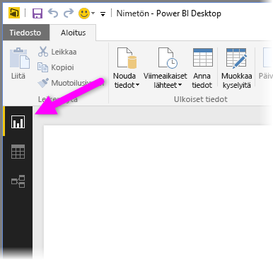

Power BI Desktopiin sisältyy myös **kyselyeditori**, jossa voit muodostaa yhteyden yhteen tai useaan tietolähteeseen, muotoilla ja muokata tietoja tarpeidesi mukaan ja sitten ladata mallin Power BI Desktopiin.

Tässä asiakirjassa on yleiskatsaus tietojen käsittelemiseen **kyselyeditorissa**. Opittavaa on tietysti paljon enemmän, ja tämän asiakirjan lopusta löydätkin linkit yksityiskohtaisiin ohjeisiin tuetuista tietotyypeistä, yhteyden muodostamisesta tietoihin, tietojen muotoilemisesta, yhteyksien luomisesta ja aloittamisesta.

Mutta tutustumaan kuitenkin ensin **kyselyeditoriin**.

## Kyselyeditori
Voit siirtyä **kyselyeditoriin** valitsemalla **Muokkaa kyselyitä** Power BI Desktopin **Aloitus**-välilehdessä.  

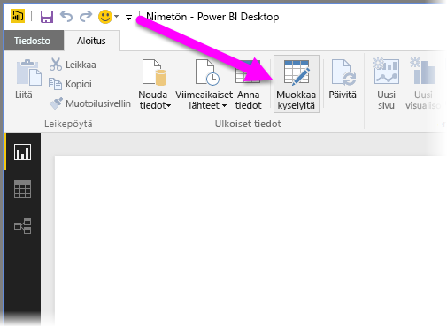

Kun tietoyhteyksiä ei ole, **kyselyeditorin** näkyy tyhjänä ruutuna valmiina tiedoille.  

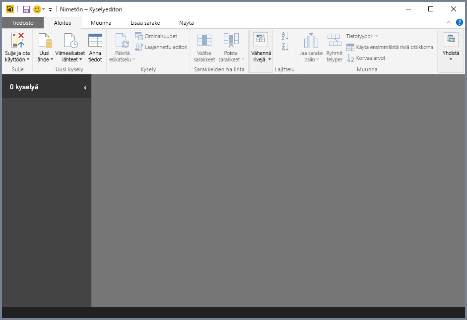

Kun kysely on ladattu, **Kyselyeditori**-näkymästä tulee kiinnostavampi. Jos yhteys muodostetaan seuraavaan verkkotietolähteeseen, **Kyselyeditori** lataa datan tiedot, joiden muotoilemisen voit sitten aloittaa.

[*http://www.bankrate.com/finance/retirement/best-places-retire-how-state-ranks.aspx*](http://www.bankrate.com/finance/retirement/best-places-retire-how-state-ranks.aspx)

**Kyselyeditori** näyttää seuraavanlaiselta, kun tietoyhteys on muodostettu:

1. Valintanauhassa on nyt useita aktiivisia painikkeita, joiden avulla kyselyn tietoja voi käsitellä.
2. Vasemmassa ruudussa on luettelo kyselyistä, ja ne valitaan siitä tarkasteltaviksi tai muovattaviksi.
3. Keskiruudussa näkyvät valitun kyselyn tiedot valmiina muovattavaksi.
4. **Kyselyasetukset**-ikkunassa näytetään luettelo kyselyn ominaisuuksista ja käytössä olevista vaiheista.  
   
   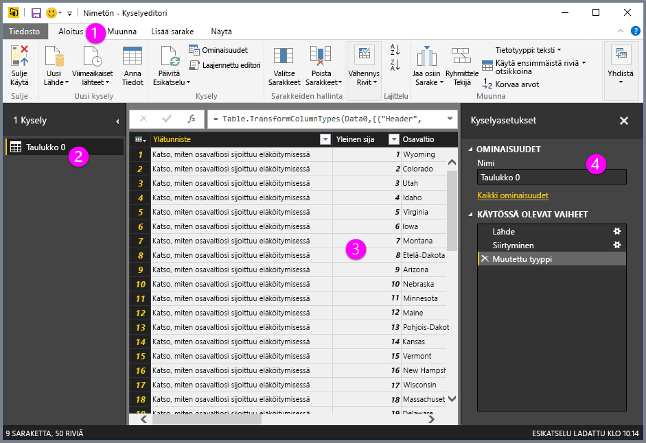

Tutustumme näihin neljään alueeseen – valintanauhaan, Kyselyt-ruutuun, tietonäkymään ja Kyselyasetukset-ruutuun – seuraavissa osissa.

## Kyselyn valintanauha
**Kyselyeditorin** valintanauha koostuu neljästä välilehdestä – **Aloitus**, **Muunna**, **Lisää sarake** ja **Näkymä**.

**Aloitus**-välilehti sisältää yleisiä kyselytehtäviä, mukaan lukien kaikkien kyselyiden ensimmäisen vaiheen, joka on **Nouda tiedot.** Seuraavassa kuvassa näkyy **Aloitus**-valintanauha.  

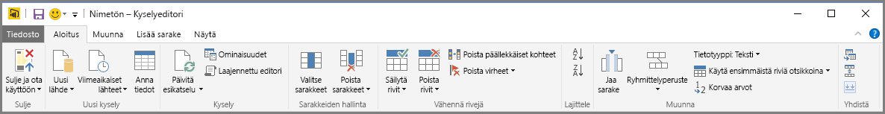

Voit muodostaa yhteyden tietoihin ja aloittaa kyselyn muodostamisprosessin valitsemalla **Nouda tiedot** -painikkeen. Näkyviin tulee valikko, jossa on yleisimmät tietolähteet.  

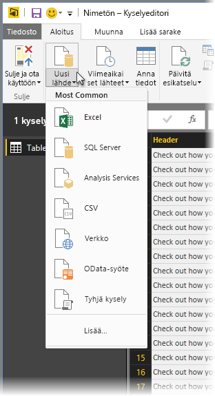

Lisätietoja käytettävissä olevista tietolähteistä on ohjeaiheessa **Tietolähteet**. Saat lisätietoja yhteyden muodostamisesta tietoihin, kuten esimerkkejä ja ohjeita, ohjeaiheesta **Yhdistä tietoihin**.

**Muunna**-välilehden avulla voit käyttää yleisiä tietojen muuntamistehtäviä. Voit esimerkiksi lisätä tai poistaa sarakkeita, muuttaa tietotyyppejä, jakaa sarakkeita ja tehdä muita tietopohjaisia tehtäviä. Seuraavassa kuvassa näkyy **Muunna**-välilehti.  

Lisätietoja tietojen muuntamisesta, kuten esimerkkejä, on ohjeaiheessa **Yhdistä ja muotoile tietoja**.

**Lisää sarake** -välilehti sisältää muita tehtäviä, jotka liittyvät sarakkeen lisäämiseen, sarakkeen tietojen muotoiluun ja mukautettujen sarakkeiden lisäämiseen. Seuraavassa kuvassa näkyy **Lisää sarake** -välilehti.  

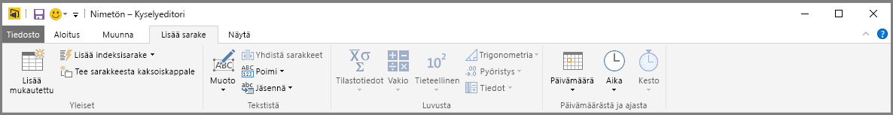

Valintanauhan **Näkymä**-välilehdessä voidaan näyttää tai piilottaa tietyt ruudut tai ikkunat. Sen avulla voidaan myös näyttää laajennettu editori. Seuraavassa kuvassa näkyy **Näkymä**-välilehti.  

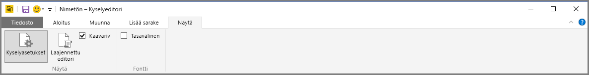

On hyödyllistä tietää, että monet valintanauhan kautta käytettävissä olevat tehtävät ovat käytettävissä myös napsauttamalla hiiren kakkospainikkeella saraketta tai muita tietoja keskimmäisessä ruudussa.

## Vasen ruutu
Vasemmassa ruudussa näkyy aktiivisten kyselyiden määrä sekä kyselyn nimi. Kun valitset kyselyn vasemmanpuoleisesta ruudusta, sen tiedot näytetään keskimmäisessä ruudussa, jossa voit muotoilla ja muuntaa tietoja tarpeidesi mukaan. Seuraavassa kuvassa on näkyvissä vasemmanpuoleinen ruutu ja useita kyselyjä.  

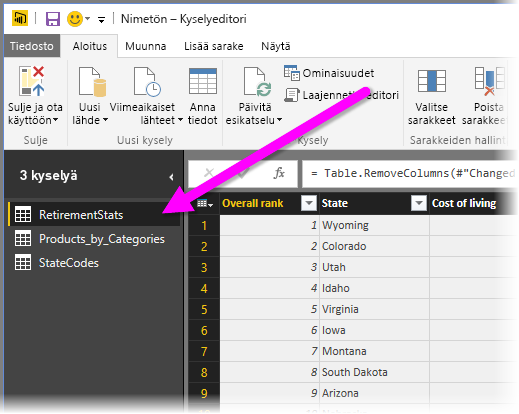

## Keskimmäinen (tieto)ruutu
Keskimmäisessä tai tietoruudussa näkyvät valitun kyselyn tiedot. Täällä tehdään suurin osa kyselynäkymän työstä.

Seuraavassa kuvassa näytetään aiemmin muodostettu verkkotietoyhteys, **Yleinen pistemäärä** -sarake valitaan ja sen otsikkoa napsautetaan hiiren kakkospainikkeella, jolloin käytettävissä olevat valikkovaihtoehdot tulevat näkyviin. Huomaa, että monet näistä hiiren kakkospainikkeen valikkokohteista ovat samoja kuin valintanauhan välilehtien painikkeet.  

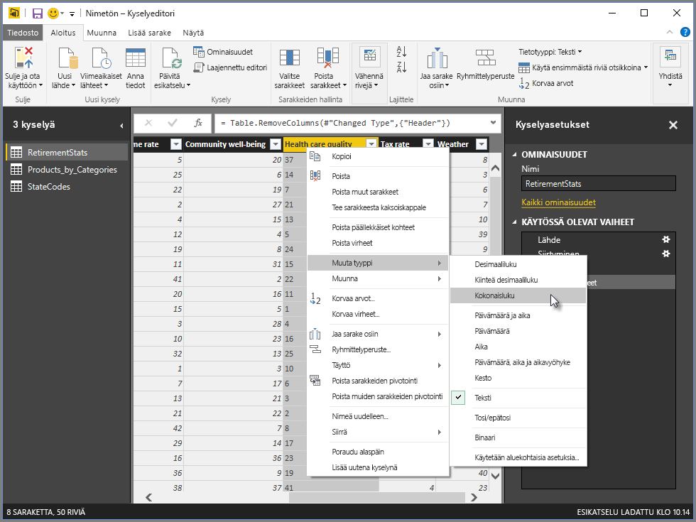

Kun valitset hiiren kakkospainikkeen valikkokohteen (tai valintanauhan painikkeen), kysely käyttää tiedoissa vaihetta ja tallentaa ne itse kyselyn osana. Vaiheet tallennetaan **Kyselyasetukset**-ruudussa järjestyksessä seuraavassa osassa kuvatulla tavalla.  

## Kyselyasetukset-ruutu
**Kyselyasetukset**-ruutu on paikka, jossa kaikki kyselyyn liittyvät vaiheet näytetään. Esimerkiksi seuraavassa kuvassa **Käytössä olevat vaiheet** -osa **Kyselyasetukset**-ruudussa kuvastaa sitä, että olemme juuri muuttaneet **Yleinen pistemäärä** -sarakkeen tyyppiä.

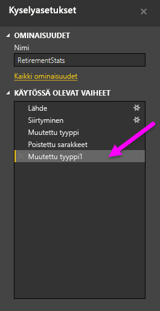

Kun kyselyssä otetaan käyttöön lisämuokkausvaiheita, ne tallennetaan **Käytössä olevat vaiheet** -osaan.

On tärkeää tietää, että pohjana olevat tiedot *eivät* ole muuttuneet, vaan sen sijaan kyselyeditori säätää ja muokkaa tietonäkymäänsä, ja yhteydenpito pohjana oleviin tietoihin tehdään kyselyeditorin näiden tietojen muokatun näkymän perusteella.

**Kyselyasetukset**-ruudussa voit nimetä vaiheita uudelleen, poistaa vaiheita tai järjestää vaiheet uudelleen tarpeen mukaan. Voit tehdä tämän napsauttamalla hiiren kakkospainikkeella vaihetta **Käytössä olevat vaiheet** -osassa ja valitse sitten valikosta, joka tulee näkyviin. Kaikki kyselyn vaiheet suoritetaan siinä järjestyksessä, jossa ne näkyvät **Käytössä olevat vaiheet** -ruudussa.

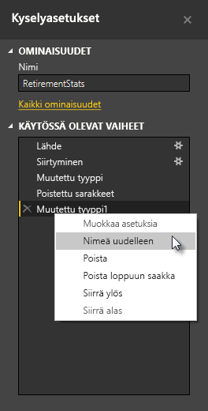

## Laajennettu editori
Jos haluat nähdä koodin, jonka kyselyeditori luo jokaisessa vaiheessa, tai jos haluat luoda oman muotoilukoodin, voit käyttää **laajennettua editoria**. Ota laajennettu editori käyttöön valitsemalla **Näkymä** valintanauhasta ja sitten **Laajennettu editori**. Näyttöön tulee ikkuna, jossa on aiemmin luotu kyselykoodi.  
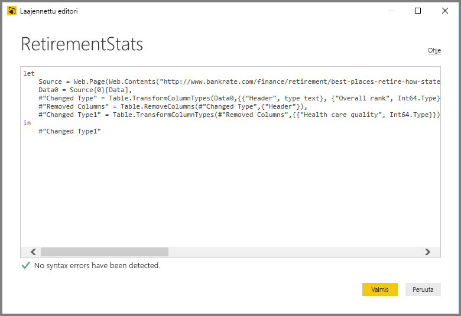

Voit muokata koodia suoraan **Laajennettu editori** -ikkunassa. Sulje ikkuna valitsemalla **Valmis**- tai **Peruuta**-painike.  

## Työn tallentaminen
Kun kysely on haluamassasi paikassa, voit antaa kyselyeditorin käyttää tietomallin muutoksia Power BI Desktopissa ja sitten sulkea kyselyeditorin. Voit tehdä tämän valitsemalla **Sulje ja ota käyttöön** Kyselyeditorin **Tiedosto**-valikosta.  
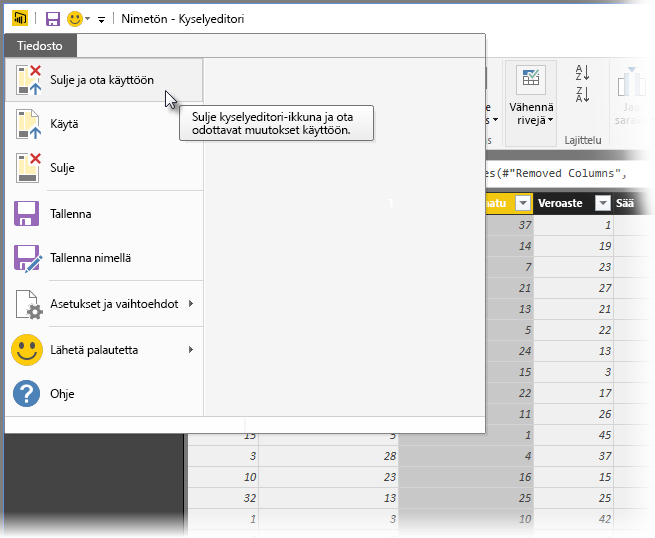

Edistymisen aikana Power BI Desktop näyttää tilansa valintaikkunassa.  
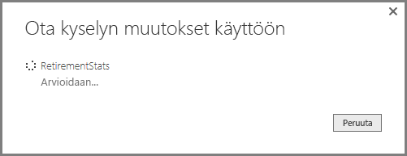

Kun kysely on oikeassa paikassa, tai jos haluat vain varmistaa, että työsi tallennetaan, Power BI Desktop voi tallentaa työsi .pbix-tiedostomuodossa.

Voit tallentaa työsi valitsemalla **Tiedosto \> Tallenna** (tai **Tiedosto \> Tallenna nimellä**) seuraavassa kuvassa esitetyllä tavalla.  
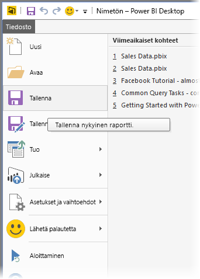

## Seuraavat vaiheet
Voit tehdä kaikenlaista Power BI Desktopilla. Saat lisätietoja sen toiminnoista seuraavista resursseista:

* [Power BI Desktopin käytön aloittaminen](desktop-getting-started.md)
* [Power BI Desktopin tietolähteet](desktop-data-sources.md)
* [Tietoihin yhdistäminen Power BI Desktopissa](desktop-connect-to-data.md)
* [Tietojen muotoilu ja yhdistäminen Power BI Desktopissa](desktop-shape-and-combine-data.md)
* [Yleiset kyselytehtävät Power BI Desktopissa](desktop-common-query-tasks.md)   

