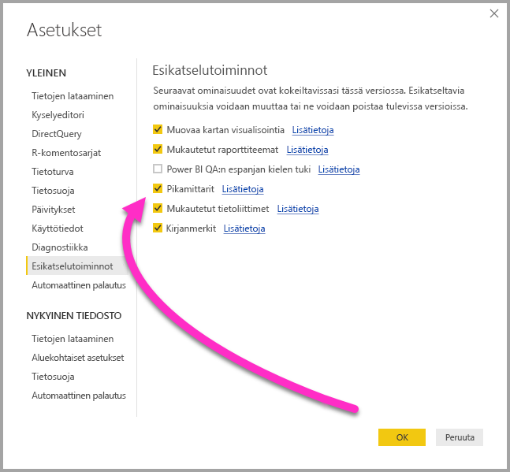
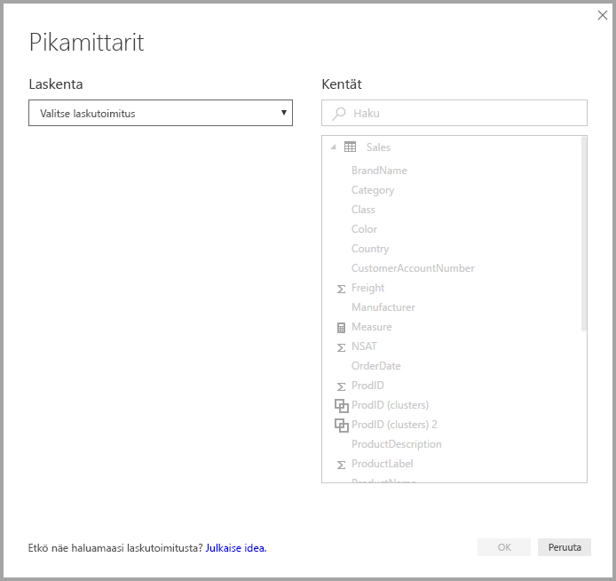
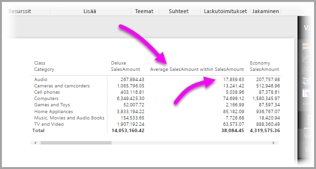

# Pikamittareiden avulla voit suorittaa helposti yleisiä ja tehokkaita laskutoimituksia.
**Pikamittareiden** avulla voit suorittaa helposti sekä nopeasti yleisiä ja tehokkaita laskutoimituksia. **Pikamittari** suorittaa joukon DAX-komentoja taustalla (sinun ei tarvitse kirjoittaa DAX-kaavaa, se tehdään puolestasi) sen perusteella, mitä tietoja annat valintaikkunassa, ja näyttää sitten tulokset, joita voit käyttää raportissa. Parasta on se, että näet pikamittarin suorittaman DAX-kaavan, minkä ansiosta voit laajentaa ja parantaa omaa DAX-osaamistasi.

Voit luoda **pikamittareita** napauttamalla kenttää hiiren kakkospainikkeella **Kentät**-kohdassa ja valitsemalla sitten näyttöön avautuvasta valikosta **Pikamittarit**. Voit myös napsauttaa hiiren kakkospainikkeella mitä tahansa arvoa olemassa olevan visualisoinnin **Arvot**-ruudussa (esimerkiksi *Palkkikaavio*-visualisoinnin *Arvot*-kenttää). Tarjolla on moneen eri luokkaan kuuluvia laskutoimituksia. Lisäksi voit muokata niitä omien tarpeidesi mukaisesti.

### Pikamittarit nyt yleisesti käytettävissä

**Power BI Desktopin** helmikuun 2018 julkaisu tuo pikamittarit yleiseen käyttöön (eli ne eivät ole enää esikatseluvaiheessa). Jos käytät vanhempaa **Power BI Desktop** -julkaisua, voit kokeilla **pikamittaritoimintoa** **Power BI Desktopin** **huhtikuun 2017** julkaisusta alkaen valitsemalla **Tiedosto > Asetukset ja vaihtoehdot > Esiversio-ominaisuudet** ja valitsemalla sitten **Pikamittarit**-kohdan valintaruudun.

Sinun täytyy käynnistää **Power BI Desktop** uudelleen tämän jälkeen.

## Pikamittareiden käyttäminen
Kun haluat käyttää **pikamittaria**, napsauta mitä tahansa**Power BI Desktopin** **Kentät**-kohdan kenttää hiiren kakkospainikkeella ja valitse näyttöön avautuvasta valikosta **Pikamittari**.

Kun käytät reaaliaikaisia SQL Server Analysis Services (SSAS) -yhteyksiä, jotkin **pikamittarit** ovat käytettävissä. **Power BI Desktop** näyttää vain ne **pikamittarit**, joita se SSAS-versio tukee, johon yhteys on muodostettu. Jos siis olet yhteydessä reaaliaikaiseen SSAS-tietolähteeseen ja et näe luettelossa tiettyjä **pikamittareita**, tämä johtuu siitä, että yhdistetty SSAS-versio ei tue DAX-mittayksikköä, jolla nämä **pikamittarit** toteutetaan.

Kun valitset pikamittarikohdan hiiren kakkospainikevalikosta, näyttöön avautuu seuraava **Pikamittari**-ikkuna. Siitä voit valita haluamasi laskelman ja kentät, joissa haluat sen suorittaa.

Kun valitset avattavan valikon, näet pitkän luettelon käytettävissä olevia **pikamittareita**.

Pikamittarilaskutoimitukset jaetaan viiteen erilliseen ryhmään, joista kukin sisältää tietyt laskutoimitukset. Nämä ryhmät ja laskutoimitukset ovat seuraavat:

* **Kooste luokkaa kohden**
  * Keskimäärä per luokka
  * Varianssi per luokka
  * Suurin arvo per luokka
  * Pienin arvo per luokka
  * Painotettu keskiarvo luokkaa kohti
* **Suodattimet**
  * Suodatettu arvo
  * Ero suodatetusta arvosta
  * Prosentuaalinen ero suodatetusta arvosta
  * Myynti uusista luokista
* **Aikatiedot**
  * Summa vuoden alusta
  * Summa neljänneksen alusta
  * Summa kuukauden alusta
  * Muutos vuodesta toiseen
  * Muutos neljänneksestä toiseen
  * Kuukauden ja kuukauden lopun muutos
  * Liukuva keskiarvo
* **Summat**
  * Juokseva summa
  * Luokan summa (suodattimet käytössä)
  * Luokan summa (suodattimet eivät käytössä)
* **Matemaattiset laskutoimitukset**
  * Yhteenlasku
  * Vähennyslasku
  * Kertolasku
  * Jakolasku
  * Prosentuaalinen ero
  * Korrelaatiokerroin
* **Teksti**
  * Tähtiluokitus
  * Yhdistetty arvojen luettelo.

Aiomme tarjota jatkossakin lisää muitakin laskutoimituksia, joten haluamme kuulla mielipiteesi siitä, mitä **pikamittareita** haluaisit saada käyttöösi. Voit lähettää meille ehdotuksia uusiin **pikamittareihin** ja niiden DAX-kaavoihin liittyen. Saat lisätietoja tämän artikkelin lopusta.

## Esimerkkejä pikamittareista
Tutustutaan nyt näihin **pikamittareihin** käytännössä.

Seuraavasta **Matrix**-visualisoinnista (esimerkki on englanninkielisestä käyttöliittymästä) näet taulukon erilaisten elektroniikkatuotteiden myynnistä. Se on perustaulukko, joka sisältää summan kullekin luokalle.

Kun napsautat **Values (Arvot)** -kenttää hiiren kakkospainikkeella ja valitset **Quick measures (Pikamittarit)**, voit valita *Calculation*-kohdassa laskutoimitukseksi *Average per category (keskimäärä per luokka)* ja valita sitten *Base Value -arvoksi eli perusarvoksi*  *Sum of SalesAmount (myynnin määrän summa)* ja määrittää sitten *SalesAmount-arvon eli myynnin määrän* vetämällä tämän kentän oikean ruudun *Fields (Kentät)* -ruudusta vasemmalle *Category (Luokka)* -osioon.

Kun valitset **OK**, tapahtuu muutama mielenkiintoinen asia, kuten näet luettelon jälkeisestä kuvasta:

1. **Matrix (Matriisi)** -visualisoinnissa on nyt uusi sarake, joka näyttää laskutoimituksemme (tässä tapauksessa se on *Average SalesAmount within SalesAmount* eli keskimääräinen myynnin määrä myynnin määrässä).
2. Järjestelmä luo uuden **mittayksikön**, joka on käytettävissä **Kentät**-kohdassa ja joka on korostettuna (Power BI luo sen ympärille keltaisen laatikon). Tämä mittayksikkö on käytettävissä missä tahansa raportin visualisoinnissa, ei vain siinä visualisoinnissa, jossa se luotiin alun perin.
3. **Pikamittarille** luotu DAX-kaava näytetään kaavarivillä.

Ota huomioon, että **pikamittari** on käytössä visualisoinnissa. Näkyvissä on uusi sarake ja vastaava arvo, jotka molemmat perustuvat luotuun **pikamittariin**.

**Pikamittari** näytetään myös tietomallin **Kentät**-kohdassa. Voit käyttää sitä kuten mitä tahansa muutakin mallin kenttää missä tahansa muussa visualisoinnissa. Seuraavassa kuvassa on luotu **palkkikaaviovisualisointi** uudella kentällä, joka on luotu **pikamittarilla**.

Seuraavassa osiossa keskustelemme DAX-kaavioista.

## DAX-käytön opettelu pikamittareiden avulla
**Pikamittarit** ovat käteviä myös siksi, että niistä näet suoraan DAX-kaavan, jolla mittari on toteutettu. Seuraavassa kuvassa on valittuna **pikamittarin** luoma mittayksikkö (se on nyt **Kentät**-kohdassa, joten meidän täytyy napsauttaa sitä). Kun teemme näin, näyttöön avautuu **kaavarivi**, jolta näemme DAX-kaavan, jolla Power BI on toteuttanut pikamittarin.

Tämä on kätevää, koska näet mittarin taustalla olevan kaavan. Tärkeintä on kuitenkin se, että **pikamittareiden** avulla näet, miten taustalla olevia DAX-kaavoja tulisi luoda.

Oletetaan, että haluat luoda vuosittaisen laskutoimituksen, mutta et ole varma DAX-kaavan muotoilusta tai et edes oikein tiedä, mistä aloittaa. Onneksi voit kuitenkin luoda **pikamittarin**, joka käyttää **Muutos vuodesta toiseen** -laskutoimitusta, ja katsoa, mitä tapahtuu. Luo siis **pikamittari** ja katso, miten se näytetään visualisoinnissa ja miten DAX-kaava toimii. Sitten voit tehdä muutokset suoraan DAX-kaavaan tai luoda toisen pikamittarin, kunnes laskelmat vastaavat tarpeitasi.

Tällä tavalla saat ikään kuin käyttöösi opettajan, joka vastaa entä jos -kysymyksiisi muutamalla napsautuksella. Voit poistaa pikamittareita mallistasi, jos et pidä niistä. Napsauta vain hiiren kakkospainikkeella ja valitse **Poista**.

Kun pikamittari vastaa tarpeitasi, voit myös vaihtaa sen nimeä hiiren kakkospainikevalikon avulla.

## Rajoitukset ja huomioon otettavia seikkoja
Muutamat rajoitukset ja tärkeät seikat on syytä huomioida.

* **Pikamittarit** ovat käytettävissä vain, jos voit muokata mallia. Tämä ei ole mahdollista, kun käytät joitakin reaaliaikaisia yhteyksiä (SSAS:n taulukkomuotoisia reaaliaikaisia yhteyksiä tuetaan, kuten aiemmin mainittiin).
* **Kentät**-kohtaan lisätty pikamittaria voi käyttää missä tahansa raportin visualisoinnissa.
* Näet aina **pikamittarin** DAX-kaavan **kaavarivillä** valitsemalla mittarin **Kentät**-kohdasta.
* Et voi luoda aikatietojen pikamittareita, kun työskentelet DirectQuery-tilassa. Näissä pikamittareissa käytettyjen DAX-funktioiden suorituskyky muuttuu, kun ne käännetään T-SQL-lausekkeiksi, jotka lähetetään tietolähteeseesi.

> [!WARNING]
> Tällä hetkellä pikamittarit luovat *ainoastaan* DAX-lausekkeita, joissa argumentit erotellaan pilkuin. Jos **Power BI Desktop** -versiosi on lokalisoitu kielellä, jossa pilkkuja käytetään desimaalierottimina, pikamittarit eivät toimi oikein.
> 
> 

### Aikatiedot ja pikamittarit
**Power BI Desktopin** lokakuun 2017 päivityksestä alkaen voit käyttää omia mukautettuja päivämäärätietoja **pikamittareiden** aikatiedoissa. Jos käytät ulkoista taulukkomallia, varmista, että taulukon ensisijainen päivämääräsarake on merkitty päivämääräsarakkeeksi taulukkoa luotaessa. Saat ohjeet [tästä artikkelista](https://docs.microsoft.com/sql/analysis-services/tabular-models/specify-mark-as-date-table-for-use-with-time-intelligence-ssas-tabular). Jos tuot oman päivämäärätaulukon, muista merkitä se päivämäärätaulukoksi [tämän artikkelin](https://docs.microsoft.com/power-bi/desktop-date-tables) ohjeiden mukaisesti

### Lisätiedot ja esimerkit
Aiomme tarjota esimerkkejä ja ohjeita kaikille **pikamittarilaskutoimituksille**, joten tarkista päivitykset asiaankuuluvista artikkeleista pian.

Onko sinulla idea **pikamittariksi**, jota ei ole vielä saatavilla? Hienoa! Tutustu [tähän sivuun](https://go.microsoft.com/fwlink/?linkid=842906) ja lähetä **pikamittari-ideasi** sekä DAX-kaavaideasi, jotka haluaisit nähdä **Power BI Desktopissa**. Tarkistamme palautteesi ja saatamme tarjota ehdottamasi **pikamittarin** tulevassa versiossa.

