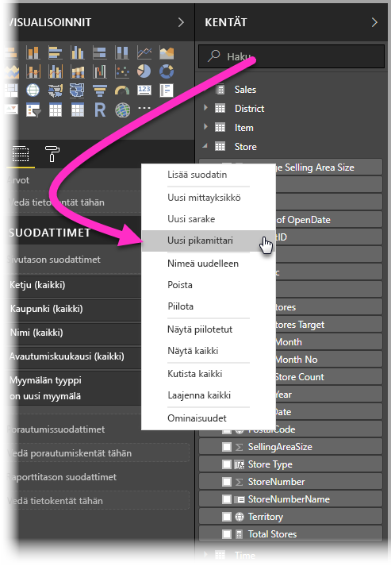
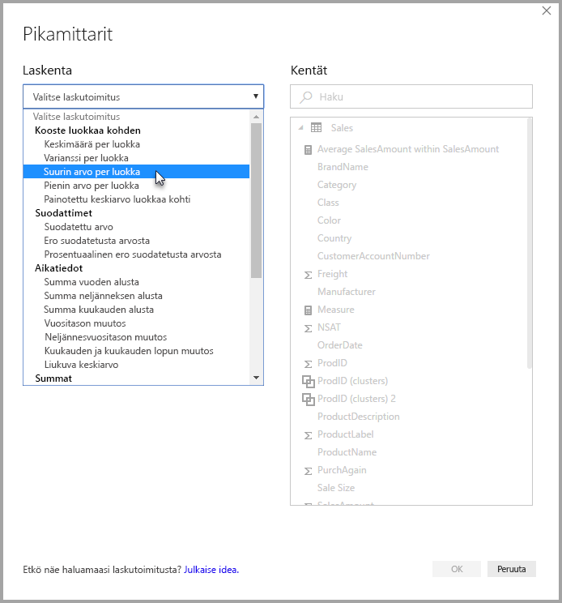
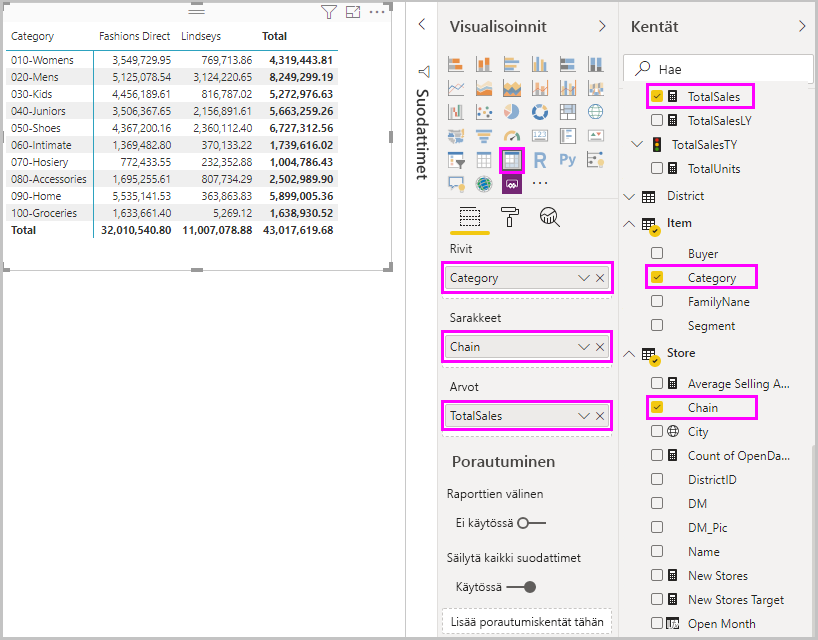
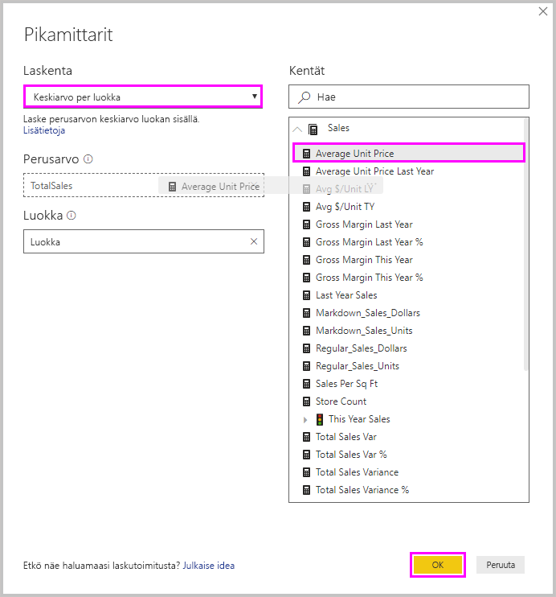
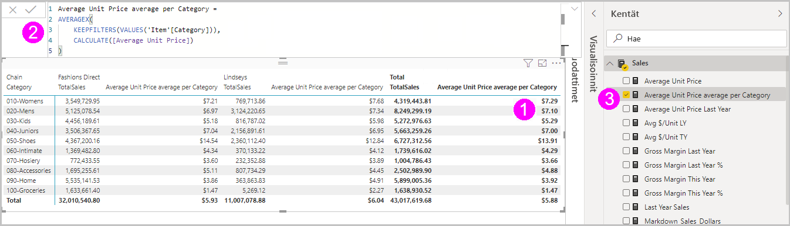
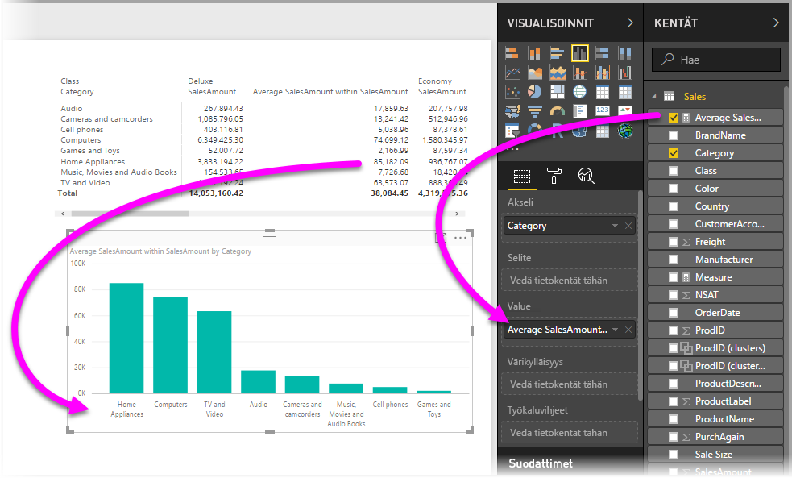
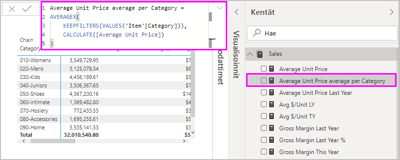
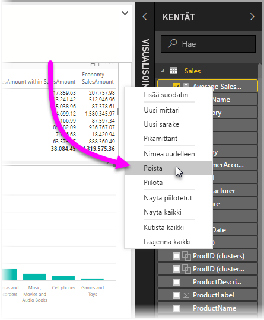

# Yleiset laskutoimitukset pikamittareilla
*Pikamittareiden* avulla voit suorittaa helposti sekä nopeasti yleisiä ja tehokkaita laskutoimituksia. Pikamittari suorittaa joukon DAX-komentoja (Data Analysis Expressions -komentoja) taustalla ja näyttää sitten tulokset, joita voit käyttää raportissa. Sinun ei tarvitse kirjoittaa DAX-kaavaa, se tehdään puolestasi sen perusteella, mitä tietoja annat valintaikkunassa. Tarjolla on moneen eri luokkaan kuuluvia laskutoimituksia. Lisäksi voit muokata niitä omien tarpeidesi mukaisesti. Ehkä parasta on se, että näet pikamittarin suorittaman DAX-kaavan, minkä ansiosta voit laajentaa ja parantaa omaa DAX-osaamistasi.

## Pikamittarin luominen

Kun haluat luoda pikamittarin Power BI Desktopissa, napsauta hiiren kakkospainiketta tai valitse kolme pistettä ( **...** ) minkä tahansa **Kentät**-ruudun kohdan vieressä ja valitse sitten näyttöön avautuvasta valikosta **Uusi pikamittari**. 

Voit myös napsauttaa hiiren kakkospainiketta tai valita avattavan nuolen minkä tahansa olemassa olevan visualisoinnin **Arvot**-kohdan arvon vierestä ja valita valikosta **Uusi pikamittari**. 

Kun valitset **Uusi pikamittari**, **Pikamittarit**-ikkuna avautuu näyttöön. Siinä voit valita haluamasi laskutoimitukset ja kentät, joissa ne suoritetaan. 

Valitsemalla **Valitse laskutoimitus** -kentän näet pitkän luettelon käytettävissä olevista pikamittareista. 

Viisi pikamittareiden laskutoimitustyyppiä ja niiden laskutoimitukset ovat seuraavat:

* **Kooste luokkaa kohden**
  * Keskiarvo per luokka
  * Varianssi per luokka
  * Suurin arvo per luokka
  * Pienin arvo per luokka
  * Painotettu keskiarvo luokkaa kohti
* **Suodattimet**
  * Suodatettu arvo
  * Ero suodatetusta arvosta
  * Prosentuaalinen ero suodatetusta arvosta
  * Myynti uusilta asiakkailta
* **Aikatiedot**
  * Summa vuoden alusta
  * Summa neljänneksen alusta
  * Summa kuukauden alusta
  * Muutos vuodesta toiseen
  * Muutos neljänneksestä toiseen
  * Kuukauden ja kuukauden lopun muutos
  * Liukuva keskiarvo
* **Summat**
  * Juokseva summa
  * Luokan summa (suodattimet käytössä)
  * Luokan summa (suodattimet eivät käytössä)
* **Matemaattiset laskutoimitukset**
  * Yhteenlasku
  * Vähennyslasku
  * Kertolasku
  * Jakolasku
  * Prosentuaalinen ero
  * Korrelaatiokerroin
* **Teksti**
  * Tähtiluokitus
  * Yhdistetty arvojen luettelo.

Jos haluat lähettää ideoita uusiksi pikamittareiksi, joita haluaisit käyttää, pohjalla oleviksi DAX-kaavoiksi tai muita pikamittareihin liittyviä ehdotuksia, lue lisätietoja tämän artikkelin lopusta.

> [!NOTE]
> Kun käytät reaaliaikaisia SQL Server Analysis Services (SSAS) -yhteyksiä, jotkin pikamittarit ovat käytettävissä. Power BI Desktop näyttää vain ne pikamittarit, joita se SSAS-versio tukee, johon yhteys on muodostettu. Jos siis olet yhteydessä reaaliaikaiseen SSAS-tietolähteeseen etkä näe luettelossa tiettyjä pikamittareita, tämä johtuu siitä, että yhdistetty SSAS-versio ei tue DAX-komentoja, jolla nämä pikamittarit toteutetaan.

Kun olet valinnut pikamittarin laskutoimitukset ja kentät, valitse **OK**. Uusi pikamittari näytetään **Kentät**-ruudussa ja sen pohjana oleva DAX-kaava kaavarivillä. 

## Esimerkki pikamittarista
Tutustutaan nyt pikamittariin käytännössä.

Seuraavasta matriisivisualisoinnista näet taulukon erilaisten tuotteiden myynnistä. Se on perustaulukko, joka sisältää kokonaismyyntisumman kullekin luokalle.

Kun matriisivisualisointi on valittuna, valitse avattava nuoli **Arvot**-kohdan **TotalSales**-kohdan vierestä ja valitse sitten **Uusi pikamittari**. 

Valitse **Pikamittarit**-ikkunan **Laskutoimitukset**-kohdassa **Keskimäärä per luokka**. 

Vedä **Keskimääräinen yksikköhinta** **Kentät**-ruudusta **Perusarvo**-kenttään. Jätä **Luokka** **Luokka**-kenttään ja valitse **OK**. 

Kun valitset **OK**, useita mielenkiintoisia asioita tapahtuu.

1. Matriisivisualisoinnissa on uusi sarake, joka näyttää lasketun **keskimääräisen yksikköhinnan per luokka**.
   
2. Uuden pikamittarin DAX-kaava näytetään kaavarivillä. [Seuraavasta osiosta](#learn-dax-by-using-quick-measures) saat lisätietoja DAX-kaavasta.
   
3. Uusi pikamittari näytetään valittuna ja korostettuna **Kentät**-ruudussa. 

Uusi pikamittari on käytettävissä missä tahansa raportin visualisoinnissa, ei vain siinä visualisoinnissa, jossa se luotiin alun perin. Seuraavassa kuvassa näkyy palkkikaaviopikavisualisointi, joka on luotu uudella pikamittarikentällä.

## DAX-käytön opettelu pikamittareiden avulla
Pikamittarit ovat erityisen hyödyllisiä myös siksi, että ne näyttävät mittarin toteuttavan DAX-kaavan. Kun valitset pikamittarin **Kentät**-ruudussa, näyttöön avautuu **kaavarivi**. Siitä näet DAX-kaavan, jolla Power BI on toteuttanut pikamittarin.

Kaavariviltä näet paitsi mittarin taustalla olevan kaavan, mutta myös sen, miten pikamittareiden taustalla olevia DAX-kaavoja luodaan (mikä voi olla jopa tärkeämpää).

Oletetaan, että haluat luoda vuosittaisen laskutoimituksen, mutta et ole varma DAX-kaavan muotoilusta tai et edes oikein tiedä, mistä aloittaa. Sen sijaan, että heität hanskat tiskiin turhautuneena, voit onneksi kuitenkin luoda pikamittarin, joka käyttää **Muutos vuodesta toiseen -laskutoimitusta**, ja tarkistaa, miten se näytetään visualisoinnissasi ja miten DAX-kaava toimii. Sitten voit joko tehdä muutoksia suoraan DAX-kaavaan tai luoda samankaltaisen mittarin, joka vastaa tarpeitasi ja odotuksiasi. Tällä tavalla saat ikään kuin käyttöösi opettajan, joka vastaa entä jos -kysymyksiisi vain muutamalla napsautuksella. 

Voit aina poistaa pikamittareita mallista, jos et pidä niistä. Voit tehdä sen napsauttamalla hiiren kakkospainiketta tai valitsemalla mittarin vierestä **...** ja valitsemalla sitten **Poista**. Voit myös vaihtaa pikamittarin nimeksi haluamasi nimen valitsemalla valikosta **Nimeä uudelleen**. 

## Rajoitukset ja huomioitavat asiat
Muutamat rajoitukset ja tärkeät seikat on syytä huomioida.

- Voit käyttää **Kentät**-ruutuun lisättyjä pikamittareita missä tahansa raportin visualisoinnissa.
- Näet aina pikamittarin DAX-kaavan kaavarivillä valitsemalla mittarin **Kentät**-luettelosta.
- Pikamittarit ovat käytettävissä vain, jos voit muokata mallia. Joillain reaaliaikaisilla yhteyksillä tämä ei kuitenkaan ole mahdollista. SSAS-taulukkomuotoisia reaaliaikaisia yhteyksiä tuetaan, kuten aiemmin kuvattiin.
- Et voi luoda aikatietojen pikamittareita, kun työskentelet DirectQuery-tilassa. Näissä pikamittareissa käytettyjen DAX-funktioiden suorituskyky muuttuu, kun ne käännetään T-SQL-lausekkeiksi, jotka lähetetään tietolähteeseesi.

> [!IMPORTANT]
> Pikamittareiden DAX-lausekkeissa argumentit erotellaan vain pilkuin. Jos Power BI Desktop -versiosi on lokalisoitu kielelle, jossa pilkkuja käytetään desimaalierottimina, pikamittarit eivät toimi oikein.

### Aikatiedot ja pikamittarit
Voit käyttää omia mukautettuja päivämäärätaulukoita pikamittareiden aikatiedoissa. Jos käytät ulkoista taulukkomallia, varmista, että taulukon ensisijainen päivämääräsarake on merkitty päivämäärätaulukoksi taulukkoa luotaessa. Saat ohjeet tähän ohjeartikkelista [Päivämäärätaulukoksi merkitseminen aikatiedoissa](https://docs.microsoft.com/sql/analysis-services/tabular-models/specify-mark-as-date-table-for-use-with-time-intelligence-ssas-tabular). Jos tuot oman päivämäärätaulukon, muista merkitä se päivämäärätaulukoksi. Saat ohjeet tähän ohjeartikkelista [Päivämäärätaulukoiden määrittäminen ja käyttäminen Power BI Desktopissa](desktop-date-tables.md).

### Lisätiedot ja esimerkit
Onko sinulla idea pikamittariksi, jota ei ole vielä saatavilla? Hienoa! Tutustu [Power BI:n ideasivuun](https://go.microsoft.com/fwlink/?linkid=842906), jossa voit lähettää ideoita ja ehdotuksia DAX-kaavoista ja pikamittareista, joita haluaisit nähdä Power BI Desktopissa. Harkitsemme niiden lisäämistä pikamittareihin tulevissa versioissa.

