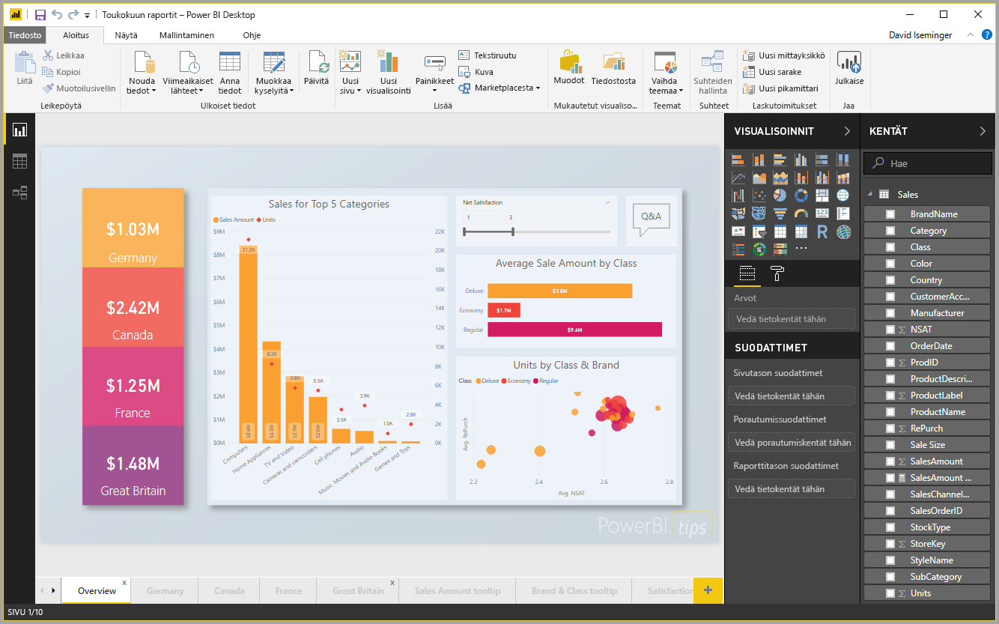
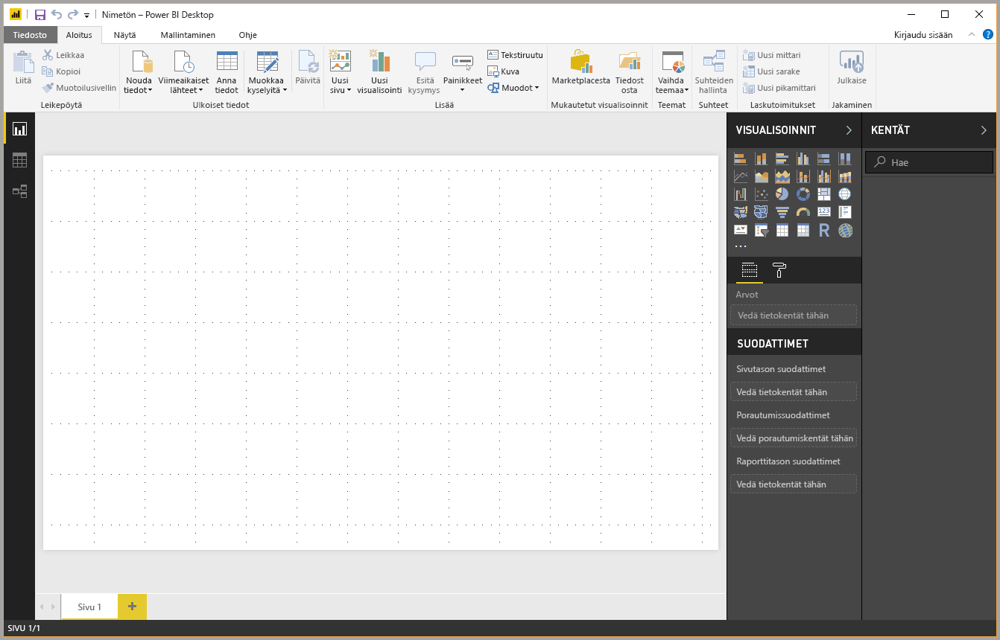
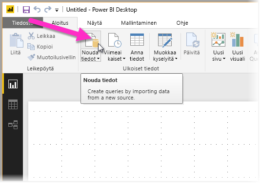
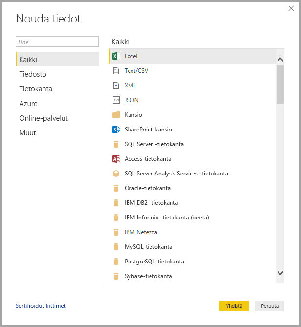
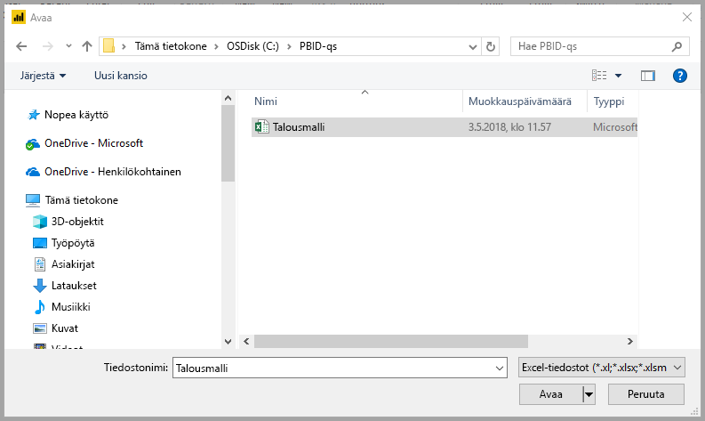
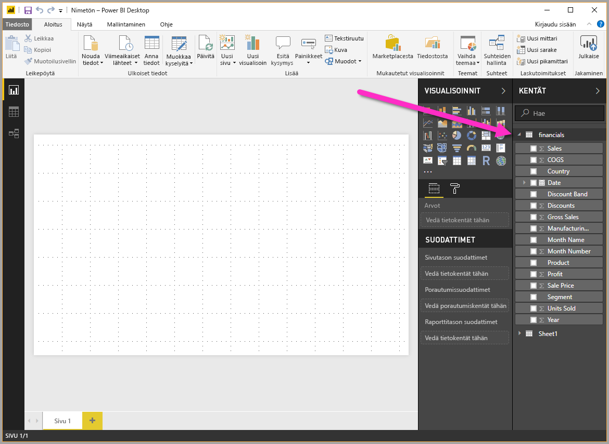

# Pikaopas: Tietoihin yhdistäminen Power BI Desktopissa

Tässä pikaoppaassa muodostat yhteyden tietoihin **Power BI Desktopin** avulla. Tämä on ensimmäinen vaihe tietomallien ja raporttien luomiseen.

Jos et ole rekisteröitynyt Power BI:hin, [rekisteröidy ilmaiseen kokeiluversioon](https://app.powerbi.com/signupredirect?pbi_source=web) ennen aloittamista.

## Edellytykset

Tarvitset seuraavat, jotta voit suorittaa tämän artikkelin vaiheet:
* Lataa ja asenna ilmainen **Power BI Desktop** -sovellus, joka suoritetaan paikallisessa tietokoneessa. Voit [ladata **Power BI Desktopin**](https://powerbi.microsoft.com/desktop) suoraan tai hakea sen [**Microsoft-kaupasta**](http://aka.ms/pbidesktopstore).
* [Lataa tämä Excel-mallityökirja](http://go.microsoft.com/fwlink/?LinkID=521962) ja luo kansio nimeltä *C:\PBID-qs*, johon tallennat kyseisen Excel-tiedoston. Tämän pikaoppaan seuraavissa vaiheissa oletetaan, että ladattu Excel-työkirja sijaitsee kyseisessä paikassa.

## Käynnistä Power BI Desktop

Kun olet asentanut **Power BI Desktop** -sovelluksen, käynnistä se paikallisessa tietokoneessa. Tyhjä pohja avautuu. Voit luoda siihen visualisointeja ja raportteja tiedoista, joihin muodostat yhteyden. 

## Tietoihin yhdistäminen

**Power BI Desktopin** avulla voit yhdistää moniin erityyppisiin tietoihin. Voit muodostaa yhteyden perustietolähteisiin, kuten Microsoft Excel -tiedostoon, tai monenlaisia tietoja sisältäviin verkkopalveluihin, kuten Salesforceen, Microsoft Dynamicsiin, Azure Blob -säilöön ja moniin muihin.

Muodosta yhteys tietoihin valitsemalla **Aloitus**-valintanauhassa **Nouda tiedot**.

**Nouda tiedot** -ikkuna aukeaa. Ikkunassa voit valita monista eri tietolähteistä, joihin **Power BI Desktop** pystyy muodostamaan yhteyden. Tässä pikaoppaassa käytämme lataamaasi Excel-työkirjaa, joka kuvailtiin tämän artikkelin alussa olevassa *Edellytykset*-osiossa.

Koska tämä on Excel-tiedosto, valitse **Nouda tiedot** -ikkunasta **Excel** ja valitse sitten **Yhdistä**-painike.

Sinua pyydetään antamaan Excel-tiedoston sijainti, jotta siihen voidaan muodostaa yhteys. Ladatun tiedoston nimi on *Rahoitusmalli*. Valitse kyseinen tiedosto ja valitse sitten **Avaa**.

**Power BI Desktop** lataa työkirjan ja lukee sen sisällön ja näyttää sitten tiedostossa käytettävissä olevat tiedot **Siirtymistoiminta**-ikkunassa, jossa voit valita, mitä tietoja haluat ladata Power BI Desktopiin. Valitse taulukot merkitsemällä valintaruutu jokaisen tuotavan taulukon vieressä. Tässä tapauksessa tuomme molemmat käytettävissä olevat taulukot.

Kun olet tehnyt valintasi, valitse **Lataa** tietojen tuomiseksi Power BI Desktopiin.

## Näytä tiedot Kentät-ruudussa

Kun olet ladannut taulukot, tiedot näkyvät **Kentät**-ruudussa. Voit laajentaa kunkin taulukon valitsemalla sen nimen vieressä olevan kolmion. Seuraavassa kuvassa *rahoitus*-taulukko on laajennettu ja sen kentät ovat näkyvissä. 

Siinä kaikki. Olet muodostanut yhteyden tietoihin **Power BI Desktopissa** ja ladannut ne, ja nyt voit nähdä kaikki kyseisissä taulukoissa käytettävissä olevat kentät.

## Seuraavat vaiheet

Kun olet muodostanut yhteyden tietoihin, voit tehdä **Power BI Desktopilla** monia asioita, kuten luoda visualisointeja ja raportteja. Lisätietoja saat seuraavista resursseista:

* [Power BI Desktopin aloitusopas](desktop-getting-started.md)