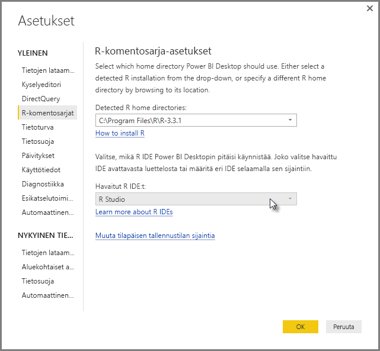
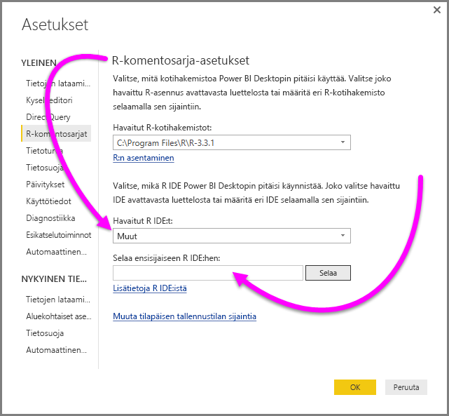
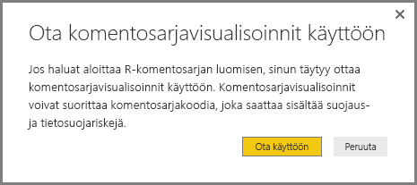
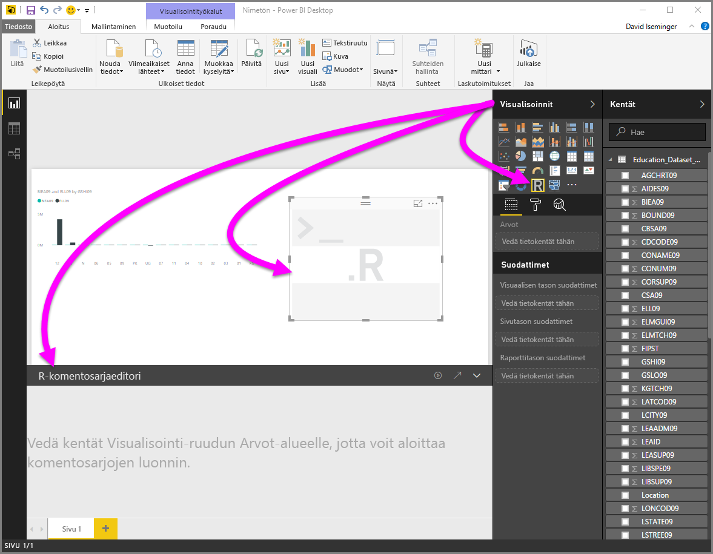
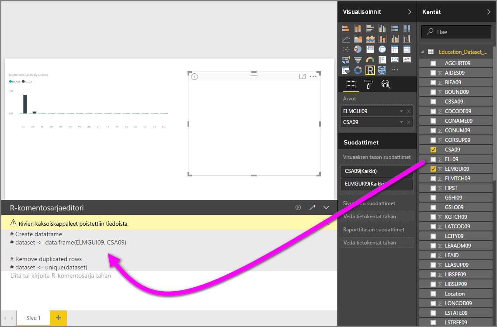
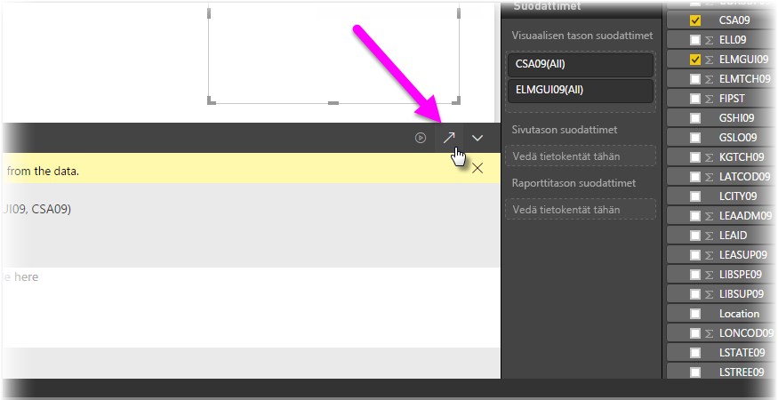
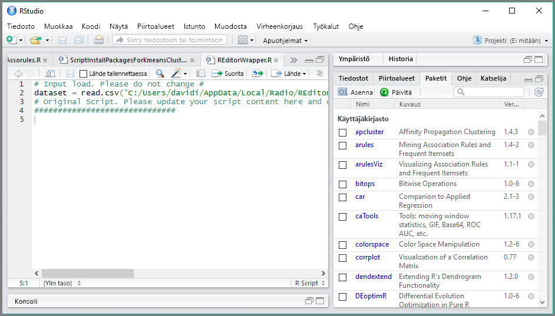

# Ulkoisen R IDE:n käyttö Power BI:n kanssa
Voit käyttää ulkoista integroitua R-kehitysympäristöä **Power BI Desktopin** avulla ja luoda ja tarkentaa R-komentosarjoja ja käyttää kyseisiä komentosarjoja Power BI:ssä.

## Ulkoisen integroidun R-kehitysympäristön ottaminen käyttöön
Aiemmin sinun täytyi käyttää **Power BI Desktopin** R-komentosarjaeditoria R-komentosarjojen luomiseen ja suorittamiseen. Tämä julkaisun myötä voit käynnistää ulkoisen integroidun R-kehitysympäristön **Power BI Desktopista**, jolloin tietosi tuodaan ja näytetään automaattisesti integroidussa R-kehitysympäristössä. Siellä voit muokata kyseisen ulkoisen integroidun R-kehitysympäristön komentosarjaa ja liittää sen takaisin **Power BI Desktopiin** Power BI -visualisointien ja raporttien luomista varten.

**Power BI Desktopin** syyskuun 2016 julkaisusta alkaen (versio 2.39.4526.362) voit määrittää, mitä integroitua R-kehitysympäristöä haluat käyttää, ja käynnistää sen automaattisesti **Power BI Desktopista**.

### Vaatimukset
Jos haluat käyttää tätä ominaisuutta, sinun on asennettava **integroitu R-kehitysympäristö** paikalliseen tietokoneeseesi. **Power BI Desktop** ei sisällä, ota käyttöön tai asenna R-moduulia, joten sinun on asennettava **R** erikseen paikalliseen tietokoneeseesi. Voit valita seuraavista vaihtoehdoista, mitä integroitua R-kehitysympäristöä käytät:

* Voit asentaa integroidun R-suosikkikehitysympäristösi, joista monet ovat saatavilla maksutta esimerkiksi [Revolution Open -lataussivulta](https://mran.revolutionanalytics.com/download/) ja [CRAN-säilöstä](https://cran.r-project.org/bin/windows/base/).
* **Power BI Desktop** tukee myös [R Studiota](https://www.rstudio.com/) ja **Visual Studio 2015:tä**[*R Tools for Visual Studion*](/visualstudio/rtvs) -editorien kanssa.
* Voit myös asentaa muun integroidun R-kehitysympäristön ja saada **Power BI Desktopin** käynnistämään kyseinen **integroitu R-kehitysympäristö** tekemällä jokin seuraavista:
  
  * Voit liittää **. R**-tiedostoihin ulkoisen integroidun kehitysympäristön, jonka haluat **Power BI Desktopin** käynnistävän.
  * Voit määrittää .exe-tiedoston, joka **Power BI Desktopin** on käynnistettävä, valitsemalla **Asetukset**-valintaikkunan **R-komentosarja-asetukset**-osiosta *Muu*. Voit tuoda **Asetukset**-valintaikkunan esiin valitsemalla **Tiedosto > Asetukset ja vaihtoehdot > Asetukset**.
    
    

Jos sinulla on useita integroituja R-kehitysympäristöjä asennettuna, voit määrittää, mikä käynnistetään, valitsemalla sen **Asetukset**-valintaikkunan avattavasta *Havaitut integroidut R-kehitysympäristöt* -luettelosta.

Oletusarvoisesti **Power BI Desktop** käynnistää **R Studion** ulkoisena integroituna R-kehitysympäristönä paikallisessa tietokoneessasi. Jos **R Studiota** ei ole asennettu ja sinulla on **Visual Studio 2015** ja **R Tools for Visual Studio**, se käynnistetään R Studion sijaan. Jos kumpaakaan kyseisistä integroiduista R-kehitysympäristöistä ei ole asennettu, käynnistetään **.R**-tiedostoihin liittyvä sovellus.

Jos **. R**-tiedostokytkentää ei ole tehty, on mahdollista määrittää polku mukautettuun integroituun kehitysympäristöön **Asetukset**-valintaikkunan *Selaa haluamaasi integroituun R-kehitysympäristöön* -osiossa. Voit myös käynnistää muun integroidun R-kehitysympäristön valitsemalla **Asetukset**-rataskuvakkeen **Käynnistä integroitu R-kehitysympäristö** -nuolikuvakkeen vieressä **Power BI Desktopissa**.

## Integroidun R-kehitysympäristön käynnistäminen Power BI Desktopista
Käynnistä integroitu R-kehitysympäristö **Power BI Desktopista** seuraavasti:

1. Lataa tiedot **Power BI Desktopiin**.
2. Valitse **Kentät**-ruudusta joitakin kenttiä, joita haluat käsitellä. Jos et ole vielä ottanut komentosarjan visualisointeja käyttöön, sinua pyydetään tekemään niin.
   
   
3. Kun komentosarjojen visualisoinnit ovat käytössä, voit valita R-visualisoinnin **Visualisoinnit**-ruudusta, jolloin luodaan tyhjä R-visualisointi komentosarjasi tulosten näyttämistä varten. Näkyviin tulee myös **R-komentosarjaeditori**-ruutu.
   
   
4. Nyt voit valita kentät, joita haluat käyttää R-komentosarjassa. Kun valitset kentän, **R-komentosarjaeditori**-kenttä luo automaattisesti komentosarjakoodin valitsemasi kentän tai kenttien perusteella. Voit joko luoda (tai liittää) R-komentosarjan suoraan **R-komentosarjaeditori**-ruutuun tai voit jättää sen tyhjäksi.
   
   
   
   > [!NOTE]
   > R-visualisointien koostamisen oletustyyppi on *Älä tee yhteenvetoa*.
   > 
   > 
5. Voit nyt käynnistää integroidun R-kehitysympäristön suoraan **Power BI Desktopista**. Valitse **Käynnistä integroitu R-kehitysympäristö** -painike, joka on **R-komentosarjaeditorin**-otsikkorivin oikealla puolella, kuten alla esitetään.
   
   
6. Power BI Desktop käynnistää määrittämäsi integroidun R-kehitysympäristön seuraavassa kuvassa esitetyllä tavalla (tässä kuvassa **RStudio** on oletusarvoinen integroitu R-kehitysympäristö).
   
   
   
   > [!NOTE]
   > **Power BI Desktop** lisää komentosarjan kolme ensimmäistä riviä, jotta se voi tuoda tiedot **Power BI Desktopista**, kun suoritat komentosarjan.
   > 
   > 
7. **Power BI Desktopin** **R-komentosarjaeditori-ruudussa** luomasi komentosarjat näkyvät integroidun R-kehitysympäristön riviltä 4 alkaen. Tässä vaiheessa voit luoda R-komentosarjan integroidussa R-kehitysympäristössä. Kun R-komentosarja on valmis integroidussa R-kehitysympäristössä, sinun on kopioitava ja liitettävä se takaisin **Power BI Desktopin** **R-komentosarjaeditori**-ruutuun *lukuun ottamatta* komentosarjan kolmea ensimmäistä riviä, jotka **Power BI Desktop** loi automaattisesti. Älä kopioi komentosarjan kolmea ensimmäistä riviä takaisin **Power BI Desktopiin**. Kyseisten rivien käyttötarkoitus on vain tietojen tuominen integroituun R-kehitysympäristöön **Power BI Desktopista**.

### Tunnetut rajoitukset
Integroidun R-kehitysympäristön käynnistämiseen suoraan Power BI Desktopista liittyy joitakin rajoituksia:

* Komentosarjan viemistä automaattisesti integroidusta R-kehitysympäristöstä **Power BI Desktopiin** ei tueta.
* **R Client** -editoria (RGui.exe) ei tueta, koska itse editori ei tue tiedostojen avaamista.

## Seuraavat vaiheet
Tutustu seuraaviin lisätietoihin, jotka koskevat R:ää Power BI:ssä.

* [R-komentosarjojen suorittaminen Power BI Desktopissa](desktop-r-scripts.md)
* [Power BI -visualisointien luominen R:n avulla](desktop-r-visuals.md)

