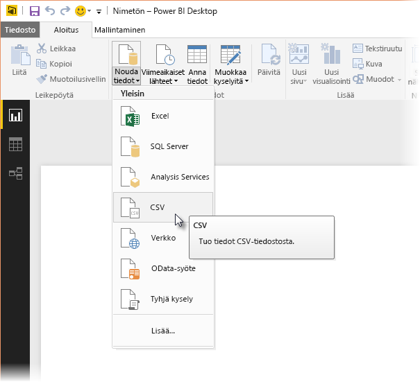
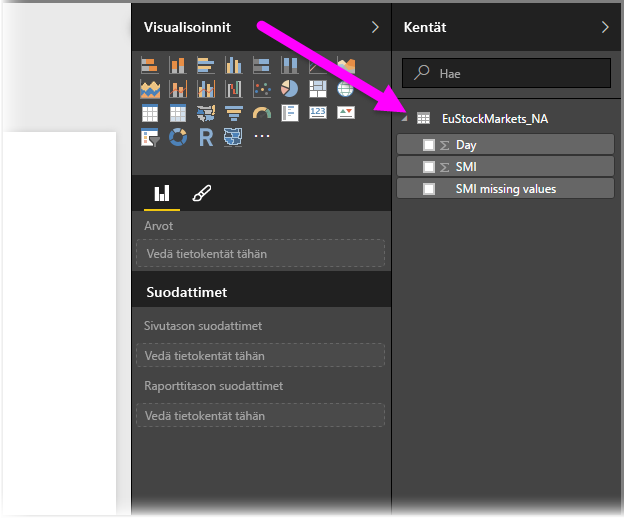
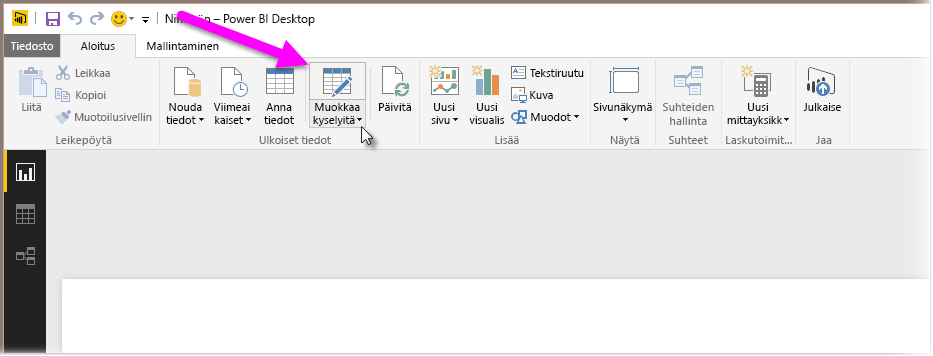
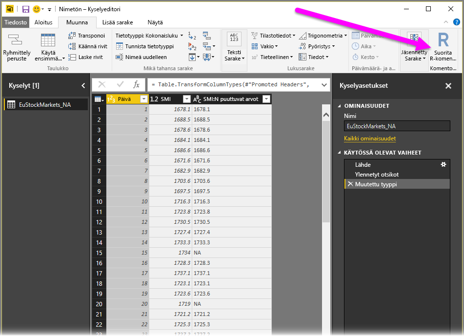
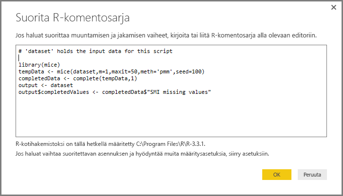
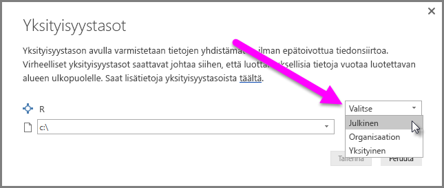
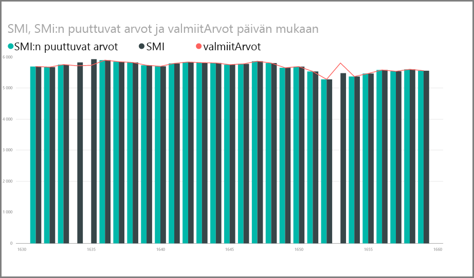
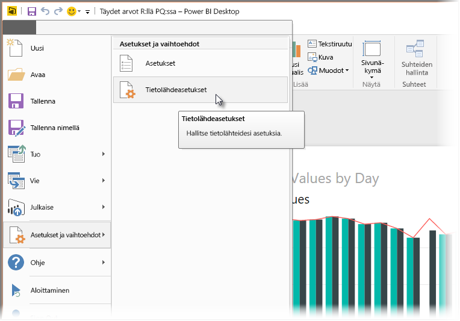
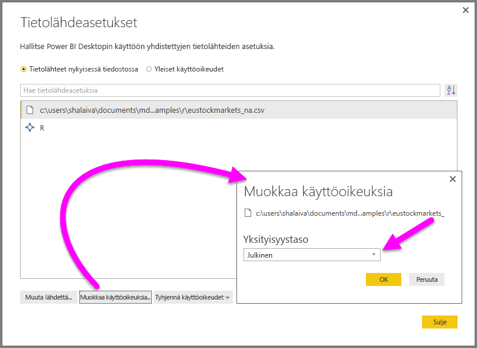

# R:n käyttö kyselyeditorissa
Voit käyttää tilastoijien, tiedemiesten ja tietoanalysoijien käyttämää **R**-ohjelmointikieltä Power BI Desktopin **kyselyeditorissa**. Tämän R:n **kyselyeditoriin** integroinnin avulla voit suorittaa tietojen puhdistamisen R:llä ja suorittaa kehittynyttä tietojen muotoilemista ja analyysia tietojoukoissa, kuten puuttuvien tietojen täydentämistä, ennusteita ja klusterointia. **R** on tehokas kieli, ja sitä voidaan käyttää **kyselyeditorissa** valmistelemaan tietomallisi ja raporttien luomiseen.

## R:n asentaminen
Jos haluat käyttää **R:ää** Power BI Desktopin **kyselyeditorissa**, sinun on asennettava **R** paikallisessa tietokoneessa. Voit ladata ja asentaa **R:n** maksutta useista sijainneista, mukaan lukien [Revolution Open -lataussivulta](https://mran.revolutionanalytics.com/download/) ja [CRAN-säilöstä](https://cran.r-project.org/bin/windows/base/).

## R:n käyttö kyselyeditorissa
Katso, miten **R:ää** voi käyttää **kyselyeditorissa**, tutustumalla tähän pörssitietojoukon esimerkkiin, joka perustuu .CSV-tiedostoon, jonka voit [ladata täältä](http://download.microsoft.com/download/F/8/A/F8AA9DC9-8545-4AAE-9305-27AD1D01DC03/EuStockMarkets_NA.csv) ja jota voit seurata. Tämän esimerkin vaiheet ovat seuraavat:

1. Lataa ensin tiedot **Power BI Desktopiin**. Lataa tässä esimerkissä *EuStockMarkets_NA.csv*-tiedosto ja valitse **Power BI Desktopin** **Aloitus**-valintanauhasta **Nouda tiedot > CSV**.

   
2. Valitse tiedosto ja valitse **Avaa**. CSV näytetään **CSV-tiedosto**-valintaikkunassa.

   
3. Kun tiedot on ladattu, näet ne Power BI Desktopin **Kentät**-ruudussa.

   
4. Avaa **kyselyeditori** valitsemalla **Power BI Desktopin** **Aloitus**-välilehdestä **Muokkaa kyselyitä**.

   
5. Valitse **Muunna**-välilehdessä **Suorita R-komentosarja**. **Suorita R-komentosarja** -editori tulee näyttöön (näkyy seuraavassa vaiheessa). Huomaa, että riveiltä 15 ja 20 puuttuu tietoja samoin kuin muilta riveiltä, joita et näe seuraavassa kuvassa. Seuraavissa vaiheissa osoitetaan, miten R voi täyttää (ja täyttää) kyseiset rivit puolestasi.

   
6. Anna tässä esimerkissä seuraava komentosarjakoodi:

       library(mice)
       tempData <- mice(dataset,m=1,maxit=50,meth='pmm',seed=100)
       completedData <- complete(tempData,1)
       output <- dataset
       output$completedValues <- completedData$"SMI missing values"

   > [!NOTE]
   > R-ympäristöön on oltava asennettuna *mice*-kirjasto, jotta edellinen komentosarjakoodi toimisi oikein. Asenna mice suorittamalla seuraava komento R-asennuksessasi: |      > install.packages('mice')
   > 
   > 

   **Suorita R-komentosarja** -valintaikkunaan annettuna koodi näyttää seuraavalta:

   
7. Kun olet valinnut **OK**, **kyselyeditori** näyttää tietoturvaa koskevan varoituksen.

   
8. Jotta R-komentosarjat toimisivat oikein Power BI-palvelussa, kaikki tietolähteet on asetettava *julkisiksi*. Saat lisätietoja tietosuoja-asetuksista ja niiden vaikutuksista katsomalla [yksityisyystasot](desktop-privacy-levels.md).

   

   Huomaa **Kentät**-ruudun uusi sarake *completedValues*. Huomaa, että muutamia tietoelementtejä puuttuu, kuten rivillä 15 ja 18. Katso seuraavassa kohdassa, miten R käsittelee sen.

Käyttämällä vain viittä R-komentosarjan riviä **kyselyeditori** täyttää puuttuvat arvot ennakoivan mallin avulla.

## Visualisointien luominen R-komentosarjatiedoista
Voimme nyt visualisoida, miten *mice*-kirjastoa käyttävä R-komentosarjakoodi täytti puuttuvat arvot, mikä on esitetty seuraavassa kuvassa:

Kun tämä visualisointi ja muut visualisoinnit, jotka haluat luoda **Power BI Desktopilla**, ovat valmiit, voit tallentaa **Power BI Desktop** -tiedoston (joka tallennetaan .pbix-tiedostona) ja käyttää sitten tietomallia ja sen osana olevia R-komentosarjoja Power BI-palvelussa.

> [!NOTE]
> Haluatko nähdä valmiin .pbix-tiedoston, jossa nämä vaiheet on suoritettu? Voit ladata näissä esimerkeissä käytetyn valmiin **Power BI Desktop** -tiedoston [täältä](http://download.microsoft.com/download/F/8/A/F8AA9DC9-8545-4AAE-9305-27AD1D01DC03/Complete%20Values%20with%20R%20in%20PQ.pbix).

Kun olet ladannut .pbix-tiedoston Power BI -palveluun, sinun on suoritettava muutama lisävaihe, jotta voit ottaa tietojen päivityksen käyttöön (palvelussa) ja sallia visualisointien päivittämisen palvelussa (tiedoilla on oltava R:n käyttöoikeus, jotta visualisoinnit voidaan päivittää). Lisävaiheet ovat seuraavat:

* **Ota tietojoukon ajoitettu päivitys käyttöön** – Jos haluat ottaa tietojoukon ja R-komentosarjan sisältävän työkirjan päivittämisen käyttöön, katso kohta [Ajoitetun päivityksen määrittäminen](refresh-scheduled-refresh.md), jossa on myös tietoja **henkilökohtaisesta yhdyskäytävästä**.
* **Asenna henkilökohtainen yhdyskäytävä** – Sinulla on oltava **henkilökohtainen yhdyskäytävä** asennettuna koneeseen, jossa tiedosto sijaitsee ja johon R on asennettu. Power BI-palvelun on käytettävä työkirjaa ja hahmonnettava päivitetyt visualisoinnit uudelleen. Saat lisätietoja siitä, miten voit [asentaa ja määrittää henkilökohtaisen yhdyskäytävän](service-gateway-personal-mode.md).

## Rajoitukset
Kyselyissä, jotka sisältävät **Kyselyeditorissa** luotuja R-komentosarjoja, on joitakin rajoituksia:

* Kaikki R-tietolähdeasetukset on määritettävä *julkisiksi* ja kaikkien muiden **kyselyeditorissa** luodun kyselyn vaiheiden on oltava julkisia. Siirry tietolähdeasetuksiin **Power BI Desktopissa** valitsemalla **Tiedosto > Asetukset > Tietolähdeasetukset**.

  

  Valitse **Tietolähdeasetukset**-valintaikkunassa tietolähteet, valitse **Muokkaa käyttöoikeuksia...**  ja varmista, että **Tietosuojataso** on määritetty arvoon *Julkinen*.

      
* Jos haluat ottaa R-visualisointien tai tietojoukon ajoitetun päivityksen käyttöön, sinun on otettava **Ajoitettu päivitys** käyttöön ja asennettava **Henkilökohtainen yhdyskäytävä** tietokoneeseen, jossa työkirja ja R-asennus ovat. Saat lisätietoja kummastakin tämän artikkelin edellisestä osasta, jonka linkeissä on lisätietoja kummastakin.

Voit tehdä kaikenlaisia asioita R:llä ja mukautetuilla kyselyillä, joten tutki ja muotoile tietoja sellaisiksi, miten haluat niiden näkyvän.

