# R:ää hyödyntävien mukautettujen visualisointien käyttö Power BI:ssä
**Power BI Desktopissa** ja **Power BI -palvelussa** voit käyttää R:ää hyödyntäviä mukautettuja visualisointeja ilman etukäteistietoa R:stä ja ilman R-komentosarjoja. Tämä mahdollistaa R-visualisointien ja R-komentosarjojen analyyttisen ja visuaalisen tehon ottamisen käyttöön ilman, että sinun pitää opetella R:n käyttöä tai ohjelmoida itse.

Jos haluat käyttää R:ää hyödyntäviä mukautettuja visualisointeja, valitse ja lataa ensin mukautettu R-visualisointi, jota haluat käyttää, Power BI:n **mukautettujen visualisointien** [**AppSource**](https://appsource.microsoft.com/marketplace/apps?product=power-bi-visuals&page=1)-valikoimasta.

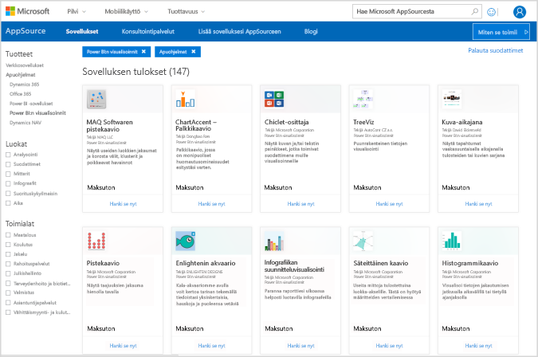

Seuraavissa osissa kuvataan, miten voit valita, ladata ja käyttää R:ää hyödyntäviä visualisointeja **Power BI Desktopissa**.

## Mukautettujen R-visualisointien käyttäminen
Jos haluat käyttää R:ää hyödyntäviä mukautettuja visualisointeja, lataa jokainen visualisointi **mukautettujen visualisointien** kirjastosta, minkä jälkeen voit käyttää visualisointia kuten mitä tahansa muuta visualisointityyppiä **Power BI Desktopissa**. Saat mukautettuja visualisointeja kahdella tavalla: voit ladata ne verkosta **AppSource**-sivustosta tai voit selata ja hankkia ne sisäisesti **Power BI Desktopista**. 

### Mukautettujen visualisointien hankkiminen AppSourcesta

Alla on ohjeet visualisointien selaamiseen ja valitsemiseen verkossa **AppSource**-sivustossa:

1. Siirry Power BI:n visualisoinnit -kirjastoon osoitteessa [https://appsource.microsoft.com](https://appsource.microsoft.com/). Valitse *Power BI -sovellukset* -valintaruutu kohdassa *Tarkenna tuotteen mukaan*, ja valitse sitten **Näytä kaikki** -linkki.
   
   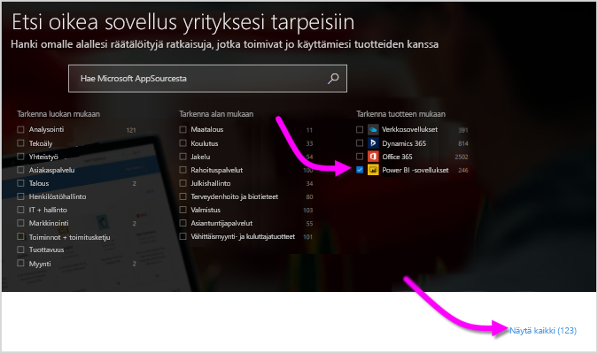

2. Valitse **Power BI -visualisoinnit** [Power BI:n visualisoinnit](https://appsource.microsoft.com/marketplace/apps?product=power-bi-visuals&page=1) -kirjastosivun vasemman ruudun apuohjelmaluettelosta.

   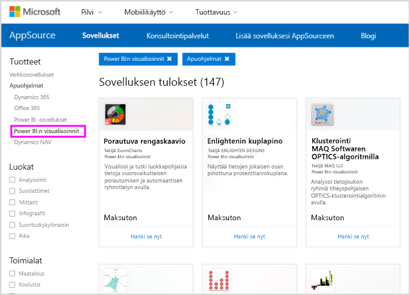

3. Valitse valikoimasta **visualisointi**, josta olet kiinnostunut, jonka jälkeen siirryt sivulle, jossa kuvaillaan visualisointia. Lataa se valitsemalla **Hanki se nyt** -painike.
   
   > [!NOTE]
    > Sisällön tuottamista varten **Power BI Desktopissa** sinulla on oltava R asennettuna paikallisessa tietokoneessa. Mutta kun käyttäjät haluavat tarkastella R:ää hyödyntäviä visualisointia **Power BI -palvelussa**, R:n ei tarvitse olla asennettuna paikallisesti.
   > 
   > 
   
   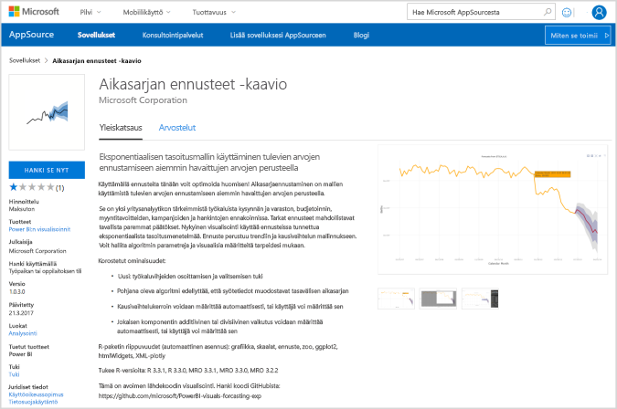
   
   Sinun ei tarvitse asentaa R:ää käyttääksesi R:ää hyödyntäviä mukautettuja visualisointeja **Power BI -palvelussa**. Kuitenkin jos haluat käyttää R:ää hyödyntäviä mukautettuja visualisointeja **Power BI Desktopissa**, R *pitää* asentaa paikalliseen koneeseen. Voit ladata R:n seuraavista sijainneista:
   
   * [CRAN](https://cran.r-project.org/)
   * [MRO](https://mran.microsoft.com/)

4. Kun visualisointi on ladattu (kuin mikä tahansa selaimesta ladattu tiedosto), siirry **Power BI Desktopiin** ja napsauta kolmea pistettä (...) **Visualisoinnit**-ruudussa ja valitse **Tuo tiedostosta**.
   
   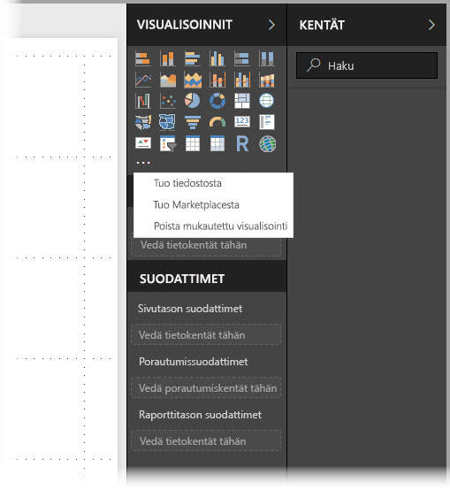
5. Näytössä näkyy varoitus mukautettujen visualisointien tuomisesta seuraavassa kuvassa esitetyllä tavalla:
   
   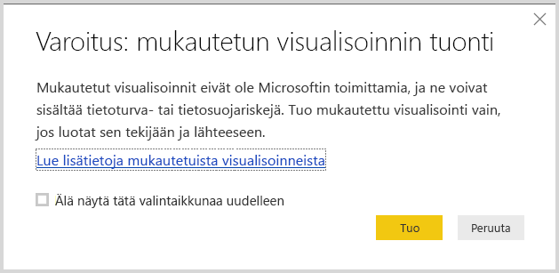
6. Siirry visualisointitiedoston tallennuspaikkaan ja valitse sitten tiedosto. **Power BI Desktopin** mukautetuissa visualisoinneissa on .pbiviz-tunniste.
   
   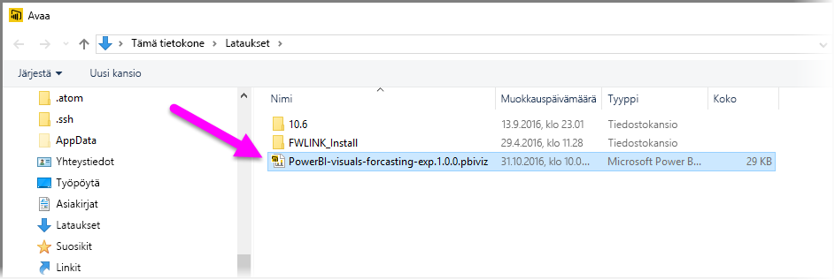
7. Kun palaat Power BI Desktopiin, näet uuden visualisointityypin **Visualisoinnit**-ruudussa.
   
   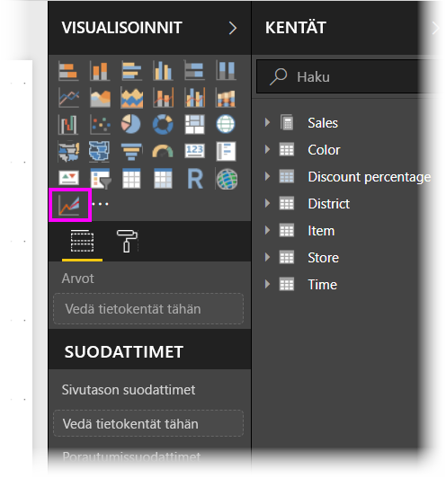
8. Kun tuot uuden visualisoinnin (tai avaat raportin, joka sisältää R:ää hyödyntävän mukautetun visualisoinnin), **Power BI Desktop** asentaa vaaditut R-paketit.
   
   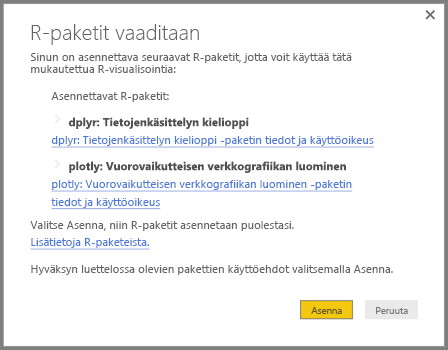

9. Sieltä voit lisätä tietoja visualisointiin samalla tavalla kuin muihinkin **Power BI Desktop** -visualisointeihin. Kun olet valmis, näet valmiin visualisoinnin piirtoalustalla. Seuraavassa visualisoinnissa R:ää hyödyntävää **Ennustaminen**-visualisointia käytettiin YK:n syntyvyysennusteissa (vasemmanpuoleinen visualisointi).

    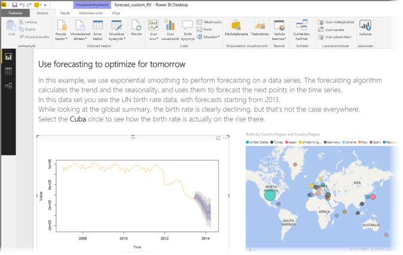

    Muiden **Power BI Desktop** -visualisointien tavoin voit julkaista tämän raportin R:ää hyödyntävillä visualisoinneilla **Power BI -palveluun** ja jakaa sen muiden kanssa.

    Tarkista kirjasto usein, koska uusia visualisointeja lisätään jatkuvasti.

### Mukautettujen visualisointien hankkiminen **Power BI Desktopista**

1. Voit myös hankkia mukautettuja visualisointeja **Power BI Desktopista**. Napsauta **Power BI Desktopissa** hiiren kakkospainikkeella kolmea pistettä (...) **Visualisoinnit**-ruudussa ja valitse **Tuo marketplacesta**.
   
   

2. Kun teet niin, näkyviin tulee **Power BI -visualisoinnit** -valintaikkuna, jossa voit selata käytettävissä olevia mukautettuja visualisointeja ja valita haluamasi. Voit etsiä nimen mukaan, valita luokan tai vain selata käytettävissä olevia visualisointeja. Kun olet valmis, valitsemalla **Lisää** voit lisätä mukautetun visualisoinnin **Power BI Desktopiin**.

   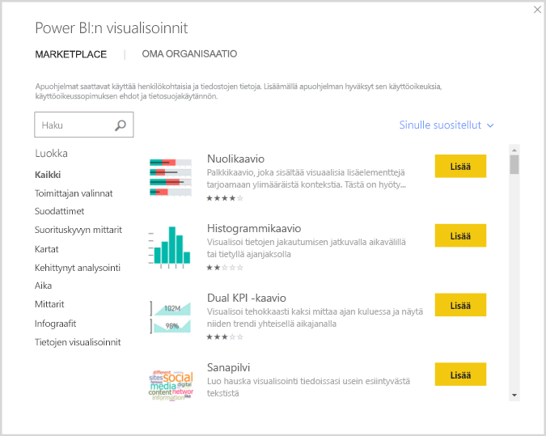

## Osallistuminen R:ää hyödyntäviin mukautettuihin visualisointeihin
Jos luot omat R-visualisoinnit käytettäväksi raporteissa, voit jakaa kyseiset visualisoinnit koko maailmalle osallistumalla mukautetulla visualisoinnilla **mukautettujen visualisointien valikoimaan**. Voit osallistua GitHubin kautta, ja prosessi on jäsennelty seuraavassa sijainnissa:

* [Osallistuminen R:ää hyödyntävien mukautettujen visualisointien valikoimaan](https://github.com/Microsoft/PowerBI-visuals#building-r-powered-custom-visual-corrplot)

## R:ää hyödyntävien mukautettujen visualisointien vianmääritys
R:ää hyödyntävillä mukautetuilla visualisoinneilla on tiettyjä riippuvuussuhteita, jotka on täytettävä, jotta visualisoinnit toimivat oikein. Kun R:ää hyödyntävien mukautettujen visualisointien suorittaminen tai lataaminen ei onnistu kunnolla, ongelma on yleensä jokin seuraavista:

* R-moduuli puuttuu.
* Virhe R-komentosarjassa, johon visualisointi perustuu.
* R-paketit puuttuvat tai ovat vanhentuneet.

Seuraavassa osassa kuvataan vianmääritysohjeita, jotka auttavat mahdollisten ongelmien korjaamisessa.

### Puuttuvat tai vanhentuneet R-paketit
Kun yrität asentaa R:ää hyödyntävän mukautetun visualisoinnin, voit kohdata virheitä, jos R-paketteja puuttuu tai ne ovat vanhentuneita. Tämä johtuu yleensä jostakin seuraavista syistä:

* R-asennus ei ole yhteensopiva R-paketin kanssa
* Palomuuri, virustorjuntaohjelmisto tai välityspalvelimen asetukset estävät R:n Internet-yhteyden muodostamisen
* Internet-yhteys on hidas tai Internet-yhteyden kanssa on ongelmia

Power BI -tiimi työskentelee aktiivisesti ratkaistakseen nämä ongelmat ennen niiden vaikuttamista sinuun, ja seuraava Power BI Desktop sisältää päivityksiä näiden ongelmien ratkaisemiseen. Siihen asti voit ehkäistä ongelmia tekemällä seuraavat toimet:

1. Poista mukautettu visualisointi ja asenna se uudelleen. Tämä käynnistää R-pakettien uudelleenasennuksen.
2. Jos R-asennuksesi ei ole ajan tasalla, päivitä R-asennus ja sen jälkeen poista tai asenna uudelleen mukautettu visualisointi edellisessä vaiheessa kuvatulla tavalla.
   
   Tuetut R-versiot on lueteltu jokaisen R:ää hyödyntävän mukautetun visualisoinnin kohdalla seuraavassa kuvassa esitetyllä tavalla.
   
     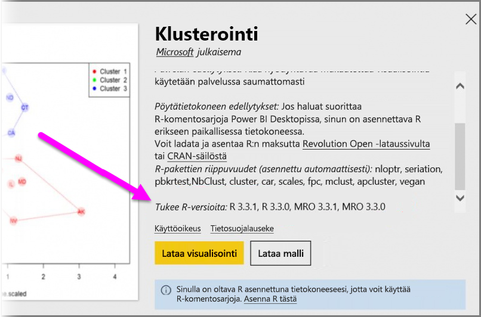
     > [!NOTE]
    > Voit säilyttää alkuperäisen R-asennuksen ja liittää Power BI Desktopin asentamaasi nykyiseen versioon. Valitse **Tiedosto > Asetukset ja vaihtoehdot > Asetukset > R-komentosarja**.
    >
    >
3. Asenna R-paketit manuaalisesti minkä tahansa R-konsolin avulla. Tämän lähestymistavan vaiheet ovat seuraavat:
   
   a.  Lataa R:ää hyödyntävän visualisoinnin asennuksen komentosarja ja tallenna tiedosto paikalliseen asemaan.
   
   b.  Suorita R-konsolista seuraavat kohdat:
   
       > source(“C:/Users/david/Downloads/ScriptInstallPackagesForForecastWithWorkarounds.R”)    
   
   Tyypilliset oletusasennussijainnit ovat seuraavat:
   
       c:\Program Files\R\R-3.3.x\bin\x64\Rterm.exe (for CRAN-R)
       c:\Program Files\R\R-3.3.x\bin\x64\Rgui.exe (for CRAN-R)
       c:\Program Files\R\R-3.3.x\bin\R.exe (for CRAN-R)
       c:\Program Files\Microsoft\MRO-3.3.x\bin\R.exe (for MRO)
       c:\Program Files\Microsoft\MRO-3.3.x\bin\x64\Rgui.exe (for MRO)
       c:\Program Files\RStudio\bin\rstudio.exe (for RStudio)
4. Jos edelliset vaiheet eivät toimi, kokeile seuraavaa:
   
   a. Käytä **R Studiota** ja noudata kohdan 3.b vaihetta edellä (suorita komentosarjarivi R-konsolista).
   
   b. Jos edellinen vaihe ei toimi, muuta kohtaa **Työkalut > Yleiset asetukset > Paketit** **R Studiossa** ja ota käyttöön **Käytä Internet Explorerin kirjastoa / HTTP-välityspalvelinta** -valintaruutu, ja toista sitten vaihe 3.b. edellä olevien ohjeiden mukaan.

## Seuraavat vaiheet
Tutustu seuraaviin lisätietoihin, jotka koskevat R:ää Power BI:ssä.

* [Power BI:n mukautettujen visualisointien valikoima](https://app.powerbi.com/visuals/)
* [R-komentosarjojen suorittaminen Power BI Desktopissa](desktop-r-scripts.md)
* [R-visualisointien luominen Power BI Desktopissa](desktop-r-visuals.md)
* [Ulkoisen R IDE:n käyttö Power BI:n kanssa](desktop-r-ide.md)

