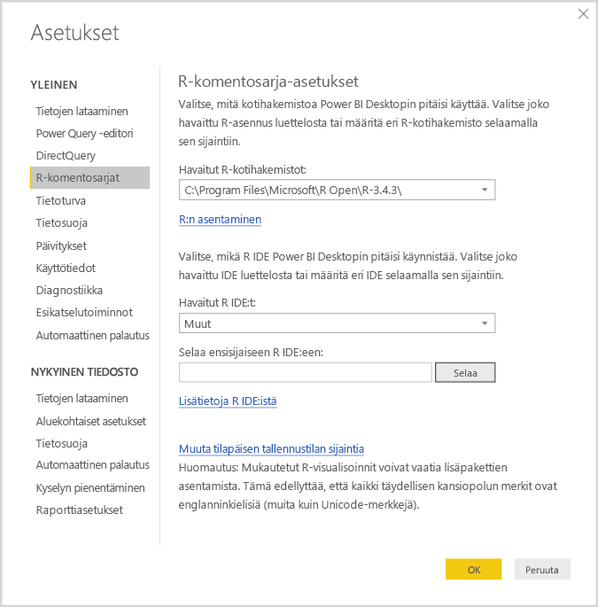
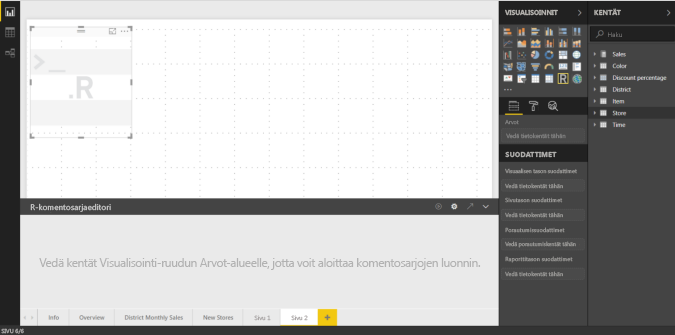
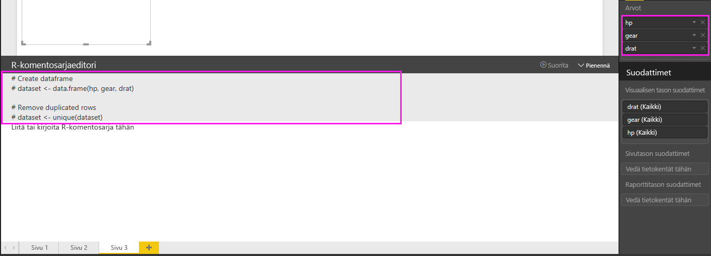
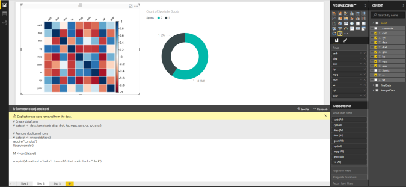
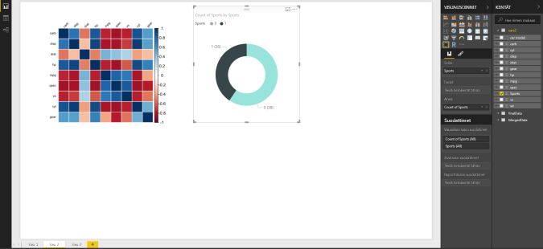
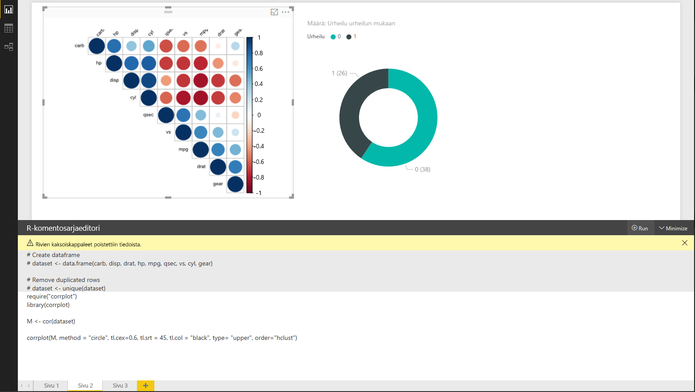
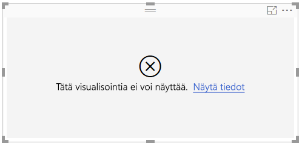

# Power BI -visualisointien luominen R:n avulla
**Power BI Desktopin** kanssa voit käyttää **R**:ää tietojen visualisoimiseen.

## Asenna R
**Power BI Desktop** ei sisällä, ota käyttöön tai asenna **R**-moduulia. Jos haluat suorittaa R-komentosarjoja **Power BI Desktopissa**, sinun on asennettava **R** erikseen paikallisessa tietokoneessa. Voit ladata ja asentaa **R**:n maksutta useista sijainneista, mukaan lukien [Revolution Open -lataussivu](https://mran.revolutionanalytics.com/download/) ja [CRAN-säilö](https://cran.r-project.org/bin/windows/base/). Nykyinen R-komentosarjan versio **Power BI Desktopissa** tukee Unicode-merkkejä sekä välilyöntejä (tyhjiä merkkejä) asennuspolulla.

## R-visualisointien ottaminen käyttöön
Ota R-visualisoinnit käyttöön valitsemalla **Tiedosto > Asetukset ja vaihtoehdot > Asetukset** ja näkyviin tulevalla **Asetukset**-sivulla varmista, että paikallinen R-asennus on määritetty **R-komentosarjat**-osassa **Asetukset**-ikkunassa seuraavassa kuvassa esitetyllä tavalla. Seuraavassa kuvassa R:n paikallinen asennuspolku on **C:\Program Files\R\R-3.2.0**, ja kyseinen polku on nimenomaisesti määritetty tekstiruudussa. Varmista, että polku näkyy oikein ja kuvastaa paikallista R-asennusta, jota haluat **Power BI Desktopin** käyttävän.
   
   

Kun olet määrittänyt R-asennukset, olet valmis aloittamaan R-visualisointien luomisen.

## R-visualisointien luominen Power BI Desktopissa
1. Valitse **R-visualisointi**-kuvake **Visualisointi**-ruudussa seuraavassa kuvassa esitetyllä tavalla, jos haluat lisätä R-visualisoinnin.
   
   

   Kun haluat lisätä raporttiin R-visualisoinnin, **Power BI Desktop** toimii seuraavasti:
   
   - R-visualisoinnin kuvan paikkamerkki tulee näkyviin raportin piirtoalustalle.
   
   - **R-Komentosarjaeditori** näkyy keskimmäisen ruudun alareunassa.
   
   

2. Lisää seuraavaksi kentät, joita haluat käyttää R-komentosarjassa, **Arvot**-osioon **Kentät**-kohdassa samalla tavalla kuin muunkin **Power BI Desktop** -visualisoinnin. 
    
    Vain kentät, jotka on lisätty **Kentät**-kohtaan, ovat käytettävissä R-komentosarjaasi varten. Voit lisätä uusia kenttiä tai poistaa tarpeettomia kenttiä **Kentät**-kohdasta käsitellessäsi R-komentosarjaasi **Power BI Desktopin R-komentosarjaeditorissa**. **Power BI Desktop** havaitsee automaattisesti, mitkä kentät on lisätty tai poistettu.
   
   > [!NOTE]
   > R-visualisointien koostamisen oletustyyppi on *Älä tee yhteenvetoa*.
   > 
   > 
   
3. Nyt voit luoda piirron valitsemiesi tietojen perusteella. 

    Kun valitset kenttiä, **R-Komentosarjaeditori** luo tukevan R-komentosarjan sidontakoodin harmaassa osassa editoriruudun yläosassa tekemiesi valintojen perusteella. Kun valitset tai poistat lisäkenttiä, tukikoodi R-komentosarjaeditorissa luodaan tai poistetaan vastaavasti automaattisesti.
   
   Seuraavassa kuvassa olevassa esimerkissä valittiin kolme kenttää: hp, hammaspyörä ja drat. Näiden valintojen tuloksena R-komentosarjaeditori loi seuraavan sidontakoodin:
   
   * Datakehys nimeltään**tietojoukko** luotiin
     * Kyseinen datakehys koostuu käyttäjän valitsemista kentistä
   * Koostamisen oletustyyppi on *Älä tee yhteenvetoa*
   * Samoin kuin taulukon visualisoinnit, kentät on ryhmitelty ja rivien kaksoiskappaleet näkyvät vain kerran
   
   
   
   > [!TIP]
   > Joissakin tapauksissa et ehkä halua automaattista ryhmittelyä tai haluat ehkä kaikkien rivien näkyvän, mukaan lukien kaksoisarvot. Tässä tapauksessa voit lisätä tietojoukkoosi indeksikentän, jonka takia kaikkia rivejä pidetään yksilöllisinä ja joka estää ryhmittelyn.
   > 
   > 
   
   Luotu tietokehys on nimeltään **tietojoukko**, ja voit käyttää valittuja sarakkeita niiden nimillä. Esimerkiksi hammaspyöräkenttää voi käyttää kirjoittamalla *tietojoukko$hammaspyörä* R-komentosarjaan. Välilyöntejä tai erikoismerkkejä sisältävissä kentissä käytä heittomerkkejä.

4. Valitsemasi kentät luovat tietokehyksen automaattisesti, joten olet valmis kirjoittamaan R-komentosarjan, joka johtaa piirron luomiseen R-oletuslaitteeseen. Kun komentosarja on valmis, valitse **Suorita** **R-komentosarjaeditorin** otsikkorivillä (**Suorita** on otsikkorivin oikealla puolella).
   
    Kun **Suorita** on valittuna, **Power BI Desktop** tunnistaa piirron ja esittää sen piirtoalustalla. Koska prosessi suoritetaan paikallisessa R-asennuksessa, varmista, että tarvittavat paketit asennetaan.
   
   **Power BI Desktop** piirtää visualisoinnin uudelleen, kun jokin seuraavista tapahtumista tapahtuu:
   
   * Kun valitset **Suorita** **R-komentosarjaeditorin** otsikkoriviltä
   * Aina kun tietoja muutetaan päivittämisen, suodattamisen tai korostamisen vuoksi

     Seuraavassa kuvassa on esimerkki korrelaation piirtokoodista, ja siinä piirretään korrelaatiot erityyppisten autojen määritteiden välillä.

     

5. Saat visualisointeja suurempaan näkymään pienentämällä **R-komentosarjaeditorin**. Ja tietysti muiden visualisointien tapaan **Power BI Desktopissa** voit ristisuodattaa korrelaation piirron valitsemalla vain urheiluautot rengasvisualisoinnissa (pyöreä visualisointi oikealla yllä olevan esimerkin kuvassa).

    

6. Voit myös muokata R-komentosarjaa visualisoinnin mukauttamiseksi ja hyödyntää R:n tehoa lisäämällä parametreja piirtokomentoon.

    Alkuperäinen piirtokomento oli seuraavanlainen:

    corrplot(M, method = "color",  tl.cex=0.6, tl.srt = 45, tl.col = "black")

    Joidenkin R-komentosarjan muutosten jälkeen komento on nyt seuraava:

    corrplot(M, method = "circle", tl.cex=0.6, tl.srt = 45, tl.col = "black", type= "upper", order="hclust")

    Tuloksena on, että R-visualisointi piirtää nyt ympyröitä, ottaa vain yläosan huomioon ja järjestää matriisin uudelleen tehdäkseen klusterin korreloiduista ominaisuuksista seuraavassa kuvassa esitetyllä tavalla.

    

    Suoritettaessa R-komentosarjaa, jonka tuloksena on virhe, R-visualisointia ei piirretä ja virhesanoma tulee näkyviin piirtoalustalle. Lisätietoja virheestä saat valitsemalla **Näytä tiedot** R-visualisoinnin virheestä piirtoalustalla.

    

    > **R-komentosarjojen suojaus:** R-visualisointeja luodaan R-komentosarjoista, joiden koodi voi sisältää suojaus- tai tietosuojariskejä. Kun yrität tarkastella tai käsitellä R-visualisointia ensimmäistä kertaa, käyttäjälle esitetään suojauksen varoitussanoma. Ota R-visualisoinnit käyttöön vain, jos luotat tekijään ja lähteeseen, tai sen jälkeen, kun olet tarkastanut R-komentosarjan ja tutustunut siihen.
    > 
    > 

## Tunnetut rajoitukset
R-visualisoinneilla **Power BI Desktopissa** on joitakin rajoituksia:

* Tietojen kokorajoitukset – R-visualisointien piirtämiseen käyttämä tietomäärä on rajoitettu 150 000 riviin. Jos valittuna on yli 150 000 riviä, vain 150 000 ylintä riviä käytetään ja kuvassa näkyy sanoma.
* Laskenta-ajan rajoitus – jos R-visualisoinnin laskenta kestää kauemmin kuin viisi minuuttia, suoritus aikakatkaistaan ja tuloksena on virhe.
* Yhteydet – muiden Power BI Desktop -visualisointien tavoin, jos eri taulukoista on valittuna tietokenttiä, joiden välille ei ole määritetty yhteyttä, tapahtuu virhe.
* R-visualisoinnit päivitetään tietojen päivittämisen, suodattamisen ja korostamisen yhteydessä. Kuitenkin itse kuva ei ole vuorovaikutteinen, eikä sitä voi käyttää ristiinsuodatuksen lähteenä.
* R-visualisoinnit reagoivat muiden visualisointien korostamiseen, mutta et voi napsauttaa R-visualisointien elementtejä ristiinsuodattaaksesi muita elementtejä.
* Vain piirrot, jotka on piirretty R:n oletusarvoiseen näyttölaitteeseen, näkyvät oikein piirtoalustalla. Vältä nimenomaisesti eri R-näyttölaitteen käyttämistä.
* Tässä julkaisussa RRO-asennuksia ei automaattisesti tunnisteta Power BI Desktopin 32-bittisessä versiossa, joten sinun on määritettävä manuaalisesti R-asennuskansion polku kohdassa **Asetukset ja vaihtoehdot > Asetukset > R-komentosarja**.

## Seuraavat vaiheet
Tutustu seuraaviin lisätietoihin, jotka koskevat R:ää Power BI:ssä.

* [R-komentosarjojen suorittaminen Power BI Desktopissa](desktop-r-scripts.md)
* [Ulkoisen R IDE:n käyttö Power BI:n kanssa](desktop-r-ide.md)

