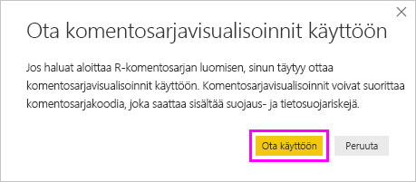

# <a name="create-power-bi-visuals-using-r"></a>Power BI -visualisointien luominen R:n avulla
Power BI Desktopissa voit visualisoida tietojasi *R*:n avulla. [R](https://mran.revolutionanalytics.com/documents/what-is-r) on kieli ja ympäristö tilastolliselle tietojenkäsittelylle ja grafiikalle.

## <a name="install-r"></a>Asenna R
Power BI Desktop ei oletusarvoisesti sisällä, ota käyttöön tai asenna R-moduulia. Jos haluat suorittaa R-komentosarjoja Power BI Desktopissa, sinun on asennettava R erikseen paikallisessa tietokoneessa. Voit ladata ja asentaa R:n maksutta useista eri paikoista, esimerkiksi [Revolution Open](https://mran.revolutionanalytics.com/download/) -lataussivulta ja [CRAN-säilöstä](https://cran.r-project.org/bin/windows/base/). Nykyinen R-komentosarjan versio Power BI Desktopissa tukee Unicode-merkkejä sekä välilyöntejä (tyhjiä merkkejä) asennuspolulla.

## <a name="enable-r-visuals-in-power-bi-desktop"></a>R-visualisointien käyttöönotto Power BI Desktopissa
Kun olet asentanut R:n Power BI Desktop ottaa sen käyttöön automaattisesti. Voit varmistaa, että Power BI Desktop on ottanut R:n käyttöön oikeassa sijainnissa, toimimalla seuraavasti: 

1. Valitse Power BI Desktop -valikossa **Tiedosto** > **Asetukset ja vaihtoehdot** > **Asetukset**. 

2. Valitse **Asetukset** sivun vasemman reunan **Yleiset**-kohdasta **R-komentosarjat**. 

3. Varmista **R-komentosarja-asetuksista**, että paikallinen R-asennuksesi on määritetty **tunnistettujen R-kotihakemistojen** kohdassa ja että Power BI Desktopissa käytettävän paikallisen R-asennuksen tiedot ovat oikein. Seuraavassa kuvassa R:n paikallinen asennuspolku on **C:\Program Files\R Open\R-3.5.3\\** .
   
   

Kun olet varmistanut R-asennuksen, olet valmis aloittamaan R-visualisointien luomisen.

## <a name="create-r-visuals-in-power-bi-desktop"></a>R-visualisointien luominen Power BI Desktopissa
1. Lisää R-visualisointi valitsemalla **R-visualisointi**-kuvake **Visualisointi**-ruudussa.
   
   

2. Valitse näkyviin tulevassa **Ota käyttöön komentosarjavisualisoinnit** -ikkunassa **Ota käyttöön**.

   

   Kun lisäät raporttiin R-visualisoinnin, Power BI Desktop tekee seuraavat muutokset:
   
   - R-visualisoinnin kuvan paikkamerkki tulee näkyviin raportin piirtoalustalle.
   
   - **R-Komentosarjaeditori** näkyy keskimmäisen ruudun alareunassa.
   
   

3. Vedä **Visualisointi**-ruudun **Arvot**-osiossa **Kentät**-ruudusta ne kentät, joita haluat käyttää R-komentosarjassa (samalla tavalla kuin minkä tahansa muunkin Power BI Desktop -visualisoinnin). Voit myös valita kentät suoraan **Kentät**-ruudussa.
    
    Vain kentät, jotka lisäät **Arvot**-osioon, ovat käytettävissä R-komentosarjassasi. Voit lisätä uusia kenttiä tai poistaa tarpeettomia kenttiä **Arvot**-osiossa, kun käsittele R-komentosarjaasi **R-komentosarjaeditorissa**. Power BI Desktop tunnistaa automaattisesti, mitkä kentät on lisätty tai poistettu.
   
   > [!NOTE]
   > R-visualisointien koostamisen oletustyyppi on *Älä tee yhteenvetoa*.
   > 
   > 
   
4. Nyt voit luoda piirron valitsemiesi tietojen perusteella: 

    - Kun valitset kenttiä, **R-Komentosarjaeditori** luo tukevan R-komentosarjan sidontakoodin harmaassa osassa editoriruudun yläosassa oleville kentille.
    - Jos poistat kentän, **R-komentosarjaeditori** poistaa automaattisesti kyseisen kentän tukikoodin.
   
   Seuraavassa kuvassa olevassa esimerkissä valittiin kolme kenttää: hp, gear ja drat. Näiden valintojen tuloksena R-komentosarjaeditori loi sidontakoodin, joka voidaan vetää yhteen seuraavasti:
   
   * Luo datakehys nimeltä **tietojoukko**, joka koostuu käyttäjän valitsemista kentistä.
   * Koostamisen oletustyyppi on *Älä tee yhteenvetoa*.
   * Samoin kuin taulukon visualisoinnit, kentät on ryhmitelty ja rivien kaksoiskappaleet näkyvät vain kerran.
   
   
   
   > [!TIP]
   > Joissakin tapauksissa et ehkä halua automaattista ryhmittelyä tai haluat ehkä kaikkien rivien näkyvän, mukaan lukien kaksoisarvot. Tässä tapauksessa lisää tietojoukkoosi indeksikenttä, jonka johdosta kaikkia rivejä pidetään yksilöllisinä ja joka estää ryhmittelyn.
   > 
   > 
   
   Luotu tietokehys on nimeltään **tietojoukko**, ja käytät valittuja sarakkeita niiden nimillä. Esimerkiksi hammaspyöräkenttää voi käyttää kirjoittamalla *dataset$gear* R-komentosarjaan. Välilyöntejä tai erikoismerkkejä sisältävissä kentissä käytä heittomerkkejä.

5. Valitsemasi kentät luovat tietokehyksen automaattisesti, joten olet valmis kirjoittamaan R-komentosarjan, jonka Power BI Desktop piirtää R-oletuslaitteeseen. Kun komentosarja on valmis, valitse **Suorita komentosarja** **R-komentosarjaeditorin** otsikkorivin oikeasta reunasta.
   
    Kun valitset **Suorita komentosarja**, Power BI Desktop tunnistaa piirron ja esittää sen piirtoalustalla. Koska prosessi suoritetaan paikallisessa R-asennuksessa, varmista, että tarvittavat paketit on asennettu.
   
   Power BI Desktop piirtää visualisoinnin uudelleen, kun mikä tahansa seuraavista tapahtuu:
   
   * Valitset **Suorita komentosarja** **R-komentosarjaeditorin** otsikkoriviltä.
   * Tietoja muutetaan päivittämisen, suodattamisen tai korostamisen johdosta.

     Seuraavassa kuvassa on esimerkki korrelaation piirtokoodista, jolla piirretään korrelaatiot erityyppisten autojen määritteiden välillä.

     

6. Jos haluat nähdä visualisoinnit suuremmassa näkymässä, pienennä **R-komentosarjaeditori**. Kuten muillakin Power BI Desktopin visualisoinneilla, voit ristiinsuodattaa korrelaation piirron valitsemalla vain tietyn osion (esimerkiksi urheiluautot) rengasvisualisoinnissa (pyöreä visualisointi oikealla).

    

7. Muokkaa R-komentosarjaa visualisoinnin mukauttamiseksi ja hyödynnä R:n tehoa lisäämällä parametreja piirtokomentoon.

    Alkuperäinen piirtokomento oli seuraavanlainen:

    ```
    corrplot(M, method = "color",  tl.cex=0.6, tl.srt = 45, tl.col = "black")
    ```

    Muuta R-komentosarjaa siten, että piirtokomento on seuraava:

    ```
    corrplot(M, method = "circle", tl.cex=0.6, tl.srt = 45, tl.col = "black", type= "upper", order="hclust")
    ```

    Tämän johdosta R-visualisointi piirtää nyt ympyröitä, ottaa vain yläosan huomioon ja järjestää matriisin uudelleen tehdäkseen klusterin korreloiduista ominaisuuksista.

    

    Kun suoritat R-komentosarjan, joka aiheuttaa virheen, näet pohjalla virheilmoituksen R-visualisoinnin piirron asemesta. Saat lisätietoja virheestä valitsemalla **Näytä tiedot** R-visualisoinnin virheestä.

    

## <a name="r-scripts-security"></a>R-komentosarjojen suojaus 
R-visualisoinnit luodaan R-komentosarjoista, joiden koodi voi sisältää suojaus- tai tietosuojariskejä. Kun yrität tarkastella tai käsitellä R-visualisointia ensimmäistä kertaa, käyttäjälle esitetään suojauksen varoitussanoma. Ota R-visualisoinnit käyttöön vain, jos luotat tekijään ja lähteeseen, tai sen jälkeen, kun olet tarkastanut R-komentosarjan ja tutustunut siihen.


## <a name="known-limitations"></a>Tunnetut rajoitukset
Power BI Desktopin R-visualisoinneilla on seuraavat rajoitukset:

* Tietojen koko: R-visualisointien piirtämiseen käyttämä tietomäärä on rajoitettu 150 000 riviin. Jos valittuna on yli 150 000 riviä, vain 150 000 ylintä riviä käytetään ja kuvassa näkyy sanoma.

* Tarkkuus: Kaikki R-visualisoinnit näytetään tarkkuudella 72 DPI.

* Laskenta-ajat: Jos R-visualisoinnin laskeminen kestää yli viisi minuuttia, tämä aiheuttaa aikakatkaisuvirheen.

* Yhteydet: Jos eri taulukoista on valittuna tietokenttiä, joiden välille ei ole määritetty yhteyttä, ilmenee virhe (Muiden Power BI Desktop -visualisointien tavoin).

* Päivitykset: R-visualisoinnit päivitetään tietojen päivittämisen, suodattamisen ja korostamisen yhteydessä. Kuitenkin itse kuva ei ole vuorovaikutteinen, eikä sitä voi käyttää ristiinsuodatuksen lähteenä.

* Korostukset: R-visualisoinnit reagoivat muiden visualisointien korostamiseen, mutta et voi ristiinsuodattaa muita elementtejä valitsemalla R-visualisoinnin elementtejä.

* Näyttölaitteet: Vain piirrot, jotka on piirretty R:n oletusarvoiseen näyttölaitteeseen, näkyvät oikein piirtoalustalla. Vältä nimenomaisesti eri R-näyttölaitteen käyttämistä.

* RRO-asennukset: Tässä versiossa RRO-asennuksia ei automaattisesti tunnisteta Power BI Desktopin 32-bittisessä versiossa, joten sinun on määritettävä manuaalisesti R-asennuskansion polku kohdassa **Asetukset ja vaihtoehdot** > **Asetukset** > **R-komentosarja**.

## <a name="next-steps"></a>Seuraavat vaiheet
Saat lisätietoja Power BI:n R-ominaisuuksista seuraavista ohjeartikkeleista:

* [R-komentosarjojen suorittaminen Power BI Desktopissa](desktop-r-scripts.md)
* [Ulkoisen R IDE:n käyttö Power BI:n kanssa](desktop-r-ide.md)

