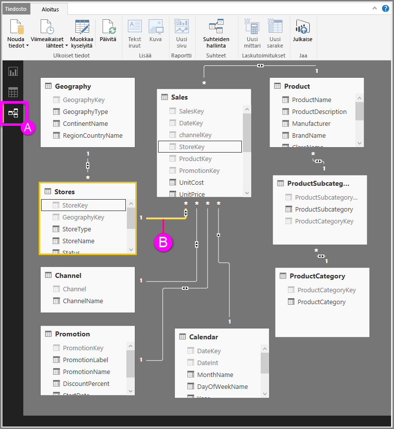

# Suhteet-näkymä Power BI Desktopissa
**Suhteet-näkymässä** näytetään kaikki mallin taulukot, sarakkeet ja suhteet. Tästä voi olla hyötyä etenkin silloin, kun mallin taulukoiden välillä on monimutkaisia suhteita.

Katsotaanpa.

**A.**  Suhteet-näkymän kuvake – Näytä malli Suhteet-näkymässä napsauttamalla kuvaketta

**B.** Suhde – Voit näyttää käytetyt sarakkeet viemällä kohdistimen suhteen päälle. Voit avata suhteen **Muokkaa suhdetta** -valintaikkunassa kaksoisnapsauttamalla suhdetta. 

Edellä olevasta kuvasta voit nähdä, että *Stores*-taulukossa on *StoreKey*-sarake, joka liittyy *Sales*-taulukkoon, jossa on myös *StoreKey*-sarake. Näemme, että kyseessä on *Monta yhteen* (\*:1) -suhde, ja rivin keskellä oleva kuvake osoittaa, että ristisuodatuksen suunnaksi on määritetty *molemmat*. Kuvakkeen nuoli osoittaa suodatinkontekstin suunnan.

Lisätietoja suhteista on artikkelissa [Suhteiden luominen ja hallinta Power BI Desktopissa](desktop-create-and-manage-relationships.md).

