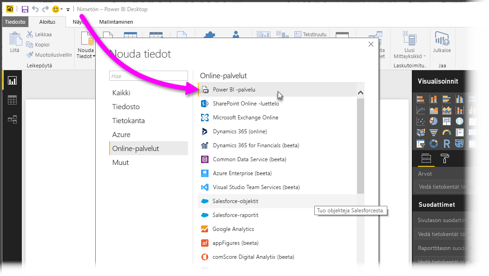
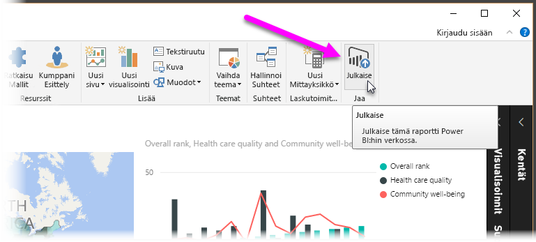
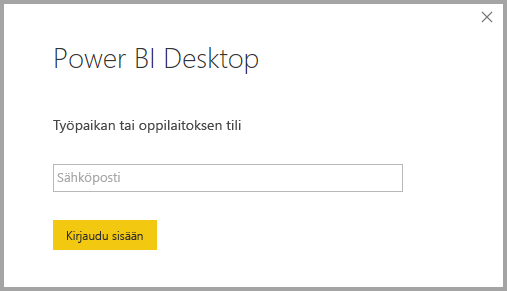
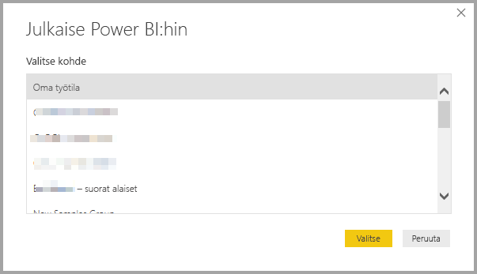
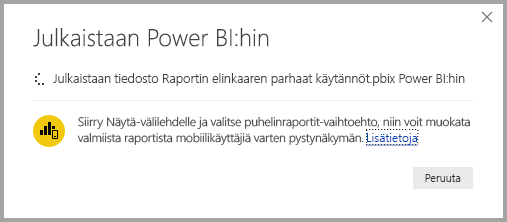
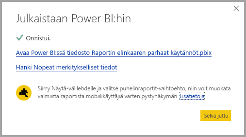
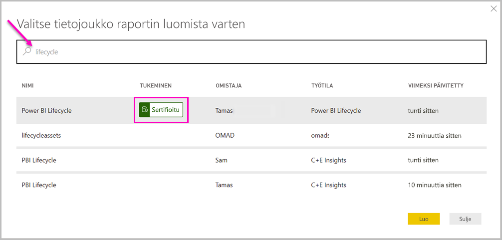
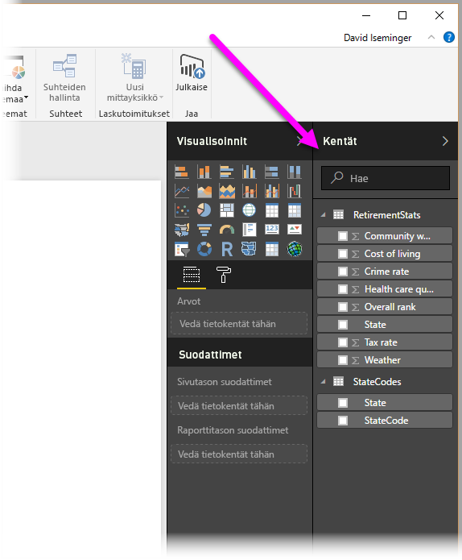

# Tietojoukkoihin yhdistäminen Power BI -palvelussa Power BI Desktopista
Voit muodostaa reaaliaikaisen yhteyden jaettuun tietojoukkoon Power BI -palvelussa ja luoda useita erilaisia raportteja samasta tietojoukkoryhmästä. Tämä tarkoittaa sitä, että voit luoda täydellisen tietomallin Power BI Desktopissa ja julkaista sen Power BI -palvelussa. Sen jälkeen sinä ja muut käyttäjät voitte luoda useita erilaisia raportteja (erillisiin .pbix-tiedostoihin) samasta, yleisestä tietomallista, ja tallentaa ne eri työtiloihin. Tätä ominaisuutta kutsutaan **Power BI -palvelun reaaliaikaiseksi yhteydeksi**.

Tästä ominaisuudesta on monenlaista hyötyä, mukaan lukien parhaat käytännöt, joita käsittelemme tässä artikkelissa. Siihen liittyy myös muutamia huomioon otettavia seikkoja ja rajoituksia, joten varmista, että luet ne läpi. Ne löytyvät tämän artikkelin lopusta.

## Power BI -palvelun reaaliaikaisen yhteyden käyttö raportin elinkaaren hallintaan
Yksi Power BI:n suosion haaste on raporttien, koontinäyttöjen ja niiden pohjana olevien tietomallien runsaus. Tämä johtuu siitä, että näyttäviä raportteja on helppo luoda **Power BI Desktopissa**, jakaa ([julkaista](desktop-upload-desktop-files.md)) nämä raportit **Power BI -palvelussa** ja luoda upeita koontinäyttöjä näistä tietojoukoista. Koska niin monet henkilöt tekevät näin käyttäen usein samoja (tai lähes samoja) tietojoukkoja, on vaikea tietää, mikä raportti perustui mihinkin tietojoukkoon, ja ovatko nämä tietojoukot ajantasaisia. Tähän haasteeseen voidaan vastata **Power BI -palvelun reaaliaikaisen yhteyden** avulla. Se helpottaa ja yhdenmukaistaa yleisten tietojoukkojen raporttien ja koontinäyttöjen luomista, jakamista ja laajentamista.

### Luo tietojoukko, jota jokainen voi käyttää, ja jaa se
Oletetaan, että tiimissäsi on Anna (liiketoiminta-analyytikko), joka on taitava luomaan hienoja tietomalleja (kutsutaan usein tietojoukoiksi). Kokenut Anna luo tietojoukon ja raportin ja jakaa sitten raportin **Power BI -palvelussa**.

Kaikki pitävät Annan raportista ja tietojoukosta, ja tässä ongelma juuri piilee – kaikki tiimin jäsenet yrittävät luoda *oman versionsa* tästä tietojoukosta ja jakavat sitten omat raporttinsa tiimin kanssa. Yhtäkkiä tiimin työtilassa voi olla lukuisia raportteja (eri tietojoukoista) **Power BI -palvelussa**. Mikä on niistä uusin? Olivatko tietojoukot samat vai vain suurin piirtein samat? Mitkä olivat niiden erot? **Power BI -palvelun reaaliaikaisen yhteyden** ansiosta tilanne saadaan hallintaan. Näemme seuraavassa osiossa, miten muut voivat käyttää Annan julkaisemaa tietojoukkoa omissa raporteissaan ja omissa työtiloissaan. Näin kaikki voivat luoda saman vankan, yhtenäisen ja julkaistun tietojoukon avulla omia yksilöllisiä raporttejaan.

### Yhteyden muodostaminen Power BI -palvelun tietojoukkoon reaaliaikaisen yhteyden avulla
Anna luo raportin (ja sen perustana olevan tietojoukon) ja sitten julkaisee sen **Power BI -palvelussa**. Raportti näkyy nyt hänen tiiminsä työtilassa Power BI -palvelussa. Jos Anna tallentaa sen *uuden käyttökokemuksen mukaiseen työtilaan*, hän voi määrittää muodostamisoikeudet niin, että kaikki hänen työtilaansa kuuluvat ja sen ulkopuoliset henkilöt voivat nähdä raportin ja käyttää sitä.

Saat lisätietoja uudesta työtilojen käyttökokemuksesta [työtilat](service-new-workspaces.md)-kohdasta.

Annan työtilaan kuuluvat ja sen ulkopuoliset henkilöt voivat nyt muodostaa reaaliaikaisen yhteyden Annan jaettuun tietomalliin (**Power BI -palvelun reaaliaikaisen yhteyden** avulla) ja luoda *alkuperäisestä tietojoukosta* omia yksilöllisiä raporttejaan *omissa, uuden käyttökokemuksen mukaisissa työtiloissaan*.

Näet seuraavassa kuvassa, miten Anna luo yhden **Power BI Desktop** -raportin ja julkaisee sen (yhdessä sen tietomallin kanssa) **Power BI -palvelussa**. Muut voivat sitten muodostaa yhteyden Annan tietomalliin **Power BI -palvelun reaaliaikaisen yhteyden** avulla ja luoda Annan tietojoukon pohjalta omia yksilöllisiä raporttejaan.

> [!NOTE]
> Jos tallennat tietojoukon [perinteiseen jaettuun työtilaan](service-create-workspaces.md), vain kyseisen työtilan jäsenet voivat luoda tietojoukkoon perustuvia raportteja. Power BI -palvelun reaaliaikaisen yhteyden muodostamiseksi tietojoukkojen, joihin yhteys muodostetaan, on oltava jaetussa työtilassa, jonka jäsen olet.
> 
> 

## Power BI -palvelun reaaliaikaisen yhteyden vaiheittaiset käyttöohjeet
Kun nyt tunnemme **Power BI -palvelun reaaliaikaisen yhteyden** edut ja sen, miten voimme käyttää sitä parhaana käytäntönä raportin elinkaaren hallintaan, käsittelemme seuraavaksi Annan upeaan raporttiin (ja tietojoukkoon) liittyviä vaiheita jaetun tietojoukon luomiseksi. Annan Power BI -tiimin jäsenet voivat sitten käyttää sitä.

### Power BI -raportin ja -tietojoukon julkaiseminen
Kun hallitset raportin elinkaarta **Power BI -palvelun reaaliaikaisen yhteyden** avulla, tarvitset ensinnäkin raportin (ja tietojoukon), jota tiimin jäsenet haluavat käyttää. Annan on siten ensin **julkaistava** raporttinsa **Power BI Desktopista**. Se tehdään valitsemalla **Julkaise** Power BI Desktopin **Aloitus**-valintanauhasta.

Jos Anna ei ole kirjautunut Power BI -palvelun tiliin, ponnahdusikkuna kehottaa häntä tekemään niin.

Sieltä Anna voi valita työtilan kohteen, johon hänen raporttinsa ja tietojoukkonsa julkaistaan. Muista, että jos Anna tallentaa sen uuden käyttökokemuksen mukaiseen työtilaan, kuka tahansa, jolla on muodostamisoikeudet, voi käyttää kyseistä tietojoukkoa. Muodostamisoikeudet määritetään julkaisemisen jälkeen Power BI -palvelussa. Jos työ tallennetaan perinteiseen työtilaan, vain sellaiset jäsenet, joilla on julkaistun raportin sisältävän työtilan käyttöoikeudet, voivat käyttää sen tietojoukkoa **Power BI -palvelun reaaliaikaisen yhteyden** avulla.

Julkaisuprosessi käynnistyy ja **Power BI Desktop** näyttää edistymisen.

Kun prosessi on valmis, **Power BI Desktop** näyttää onnistumisen ja tarjoaa pari linkkiä, jotta pääset itse raporttiin **Power BI -palvelussa**, ja linkin raportin **merkityksellisiin tietoihin**.

Nyt kun raportti tietojoukkoineen on Power BI -palvelussa, voit myös *korottaa* sen korostaaksesi sen laatua ja luotettavuutta. Voit myös pyytää, että Power BI -vuokraajasi määräävässä asemassa oleva taho *sertifioi* sen. Tietojoukko, jolla on vähintään toinen näistä tuista, näkyy aina aiheen luettelossa tietojoukkoja hakiessa. Voit halutessasi lukea lisää [tietojoukkojen korottamisesta](service-datasets-promote.md). 

Lopuksi määritetään raportin pohjana olevan tietojoukon *muodostamisoikeudet*. Muodostamisoikeudet määrittävät, ketkä voivat nähdä tietojoukon ja käyttää sitä. Voit määrittää oikeudet suoraan työtilassa tai jakaessasi sovellusta työtilan kautta. Katso [muodostamisoikeuksien](service-datasets-build-permissions.md) lisätiedot.

Katsotaanpa seuraavaksi, miten muut tiimin jäsenet, joilla on käyttöoikeus työtilaan, jossa raportti (ja tietojoukko) julkaistaan, voivat muodostaa yhteyden tietojoukkoon ja luoda omia raporttejaan.

### Power BI -palvelun reaaliaikaisen yhteyden muodostaminen julkaistuun tietojoukkoon
Jotta voit muodostaa yhteyden julkaistuun raporttiin ja luoda oman raporttisi julkaistun tietojoukon perusteella, valitse **Nouda tiedot** **Aloitus**-valintanauhasta **Power BI Desktopissa**, valitse **Power BI -palvelu** vasemmasta ruudusta ja valitse sitten **Power BI -tietojoukot**.

Jos et ole kirjautunut sisään Power BI -palveluun, sinua kehotetaan tekemään niin. Kun olet kirjautunut sisään, näkyviin tulee ikkuna. Näet siitä, minkä työtilan jäsen olet. Voit myös valita, mikä työtila sisältää tietojoukon, johon haluat muodostaa **Power BI -palvelun reaaliaikaisen yhteyden**.

Luettelon tietojoukot ovat kaikkien työtilojen jaettuja tietojoukkoja, joiden muodostamisoikeudet sinulla on. Voit etsiä tiettyä tietojoukkoa ja nähdä sen nimen, omistajan, sijaintityötilan ja sen, milloin se on viimeksi päivitetty. Näet myös *tuetut* (sertifioidut ja korotetut) tietojoukot luettelon yläosassa. 

Kun valitset ikkunasta **Lataa**, muodostat reaaliaikaisen yhteyden valittuun tietojoukkoon. Se tarkoittaa sitä, että näkemäsi tiedot (kentät ja niiden arvot) ladataan **Power BI Desktopiin** reaaliaikaisesti.

Voit nyt itse (ja muut voivat) luoda ja jakaa mukautettuja raportteja, kaikki samasta tietojoukosta. Tällä tavoin yksi taitava henkilö voi kätevästi luoda oikein muodostettuja tietojoukkoja (kuten Anna), ja useat tiimin jäsenet voivat tämän jaetun tietojoukon avulla luoda omia raporttejaan.

## Rajoitukset ja huomioitavat asiat
**Power BI -palvelun reaaliaikaisen yhteyden** käyttöön liittyy joitakin rajoituksia ja huomioon otettavia seikkoja, jotka on hyvä pitää mielessä.

* Vain käyttäjät, joilla on tietojoukon muodostamisoikeudet, voivat muodostaa yhteyden julkaistuun tietojoukkoon **Power BI -palvelun reaaliaikaisen yhteyden** avulla. 
* Maksuttoman version käyttäjät näkevät vain oman työtilansa sekä Premium-työtilojen tietojoukot.
* Koska kyse on reaaliaikaisesta yhteydestä, vasen siirtymisruutu ja mallinnus ovat poissa käytöstä samalla tavoin kuin muodostettaessa yhteyttä **SQL Server Analysis Servicesiin** ja voit yhdistää vain yhteen tietojoukkoon kussakin raportissa.
* Koska kyse on reaaliaikaisesta yhteydestä, RLS (rivi- ja roolitason suojaus) ja muut tällaiset yhteystoiminnot pakotetaan samalla tavoin kuin muodostettaessa yhteyttä **SQL Server Analysis Servicesiin**.
* Jos omistaja muuttaa alkuperäistä jaettua .pbix-tiedostoa, **Power BI -palvelussa** jaettava tietojoukko ja raportti korvataan. Kyseiseen tietojoukkoon perustuvia raportteja ei korvata, vaan tietojoukkoon tehdyt muutokset näkyvät raportissa.
* Työtilan jäsenet eivät voi korvata alunperin jaettua raporttia. Jos näin yritetään tehdä, näyttöön tulee varoitus, joka kehottaa sinua nimeämään tiedoston uudelleen ja julkaisemaan sen.
* Jos poistat jaetun tietojoukon **Power BI -palvelussa**, muut tietojoukkoon perustuvat raportit enää toimi oikein eivätkä niiden visualisoinnit näy.
* Sisältöpakettien tapauksessa sinun on ensin luotava sisältöpaketin kopio ennen kuin käytät sitä .pbix raportin ja tietojoukon jakamiseen **Power BI -palveluun**.
* Kun sisältöpaketit on kopioitu *Oman organisaatio* -kohdasta, et voi korvata palvelussa luotua raporttia ja/tai raporttia, joka on luotu osana sisältöpaketin luomista reaaliaikaisen yhteyden avulla. Jos näin yritetään tehdä, näyttöön tulee varoitus, joka kehottaa sinua nimeämään tiedoston uudelleen ja julkaisemaan sen. Tässä tilanteessa voit vain korvata reaaliaikaisen yhteyden avulla julkaistut raportit.
* Jos poistat jaetun tietojoukon **Power BI -palvelussa**, et voi enää käyttää kyseistä tietojoukkoa **Power BI Desktopista**.
* Raportit, jotka jakavat tietojoukon Power BI -palvelussa, eivät tue automaattisia käyttöönottoja Power BI REST -ohjelmointirajapinnan avulla.

