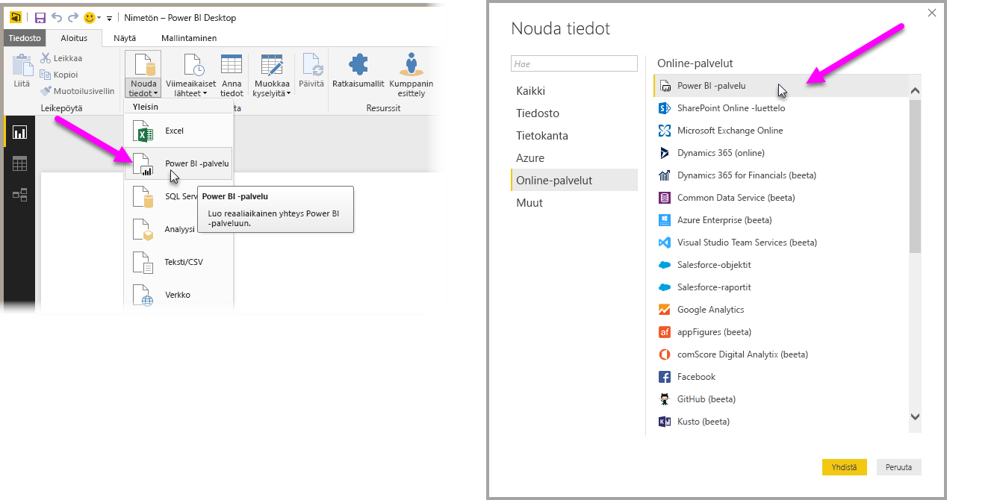
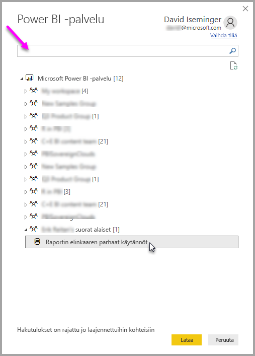

# Tietojoukkoihin yhdistäminen Power BI -palvelussa Power BI Desktopista
Voit muodostaa reaaliaikaisen yhteyden jaettuun tietojoukkoon Power BI -palvelussa ja luoda useita erilaisia raportteja samasta tietojoukkoryhmästä. Tämä tarkoittaa sitä, että voit luoda täydellisen tietomallin Power BI Desktopissa ja julkaista sen Power BI -palvelussa. Voit näin luoda, tai muut voivat luoda, useita erilaisia raportteja (erillisissä .pbix-tiedostoissa) samasta, yleisestä tietomallista. Tätä ominaisuutta kutsutaan **Power BI -palvelun reaaliaikaiseksi yhteydeksi**.

Tästä ominaisuudesta on monenlaista hyötyä, mukaan lukien parhaat käytännöt, joita käsittelemme tässä artikkelissa. Siihen liittyy myös muutamia huomioon otettavia seikkoja ja rajoituksia, joten varmista, että luet ne läpi. Ne löytyvät tämän artikkelin lopusta.

## Power BI -palvelun reaaliaikaisen yhteyden käyttö raportin elinkaaren hallintaan
Yksi Power BI:n suosion haaste on raporttien, koontinäyttöjen ja niiden pohjana olevien tietomallien runsaus. Tämä johtuu siitä, että näyttäviä raportteja on helppo luoda **Power BI Desktopissa**, jakaa ([julkaista](desktop-upload-desktop-files.md)) nämä raportit **Power BI -palvelussa** ja luoda upeita koontinäyttöjä näistä tietojoukoista. Koska niin monet henkilöt tekevät näin käyttäen usein samoja (tai lähes samoja) tietojoukkoja, on vaikea tietää, mikä raportti perustui mihinkin tietojoukkoon, ja ovatko nämä tietojoukot ajantasaisia. Tähän haasteeseen voidaan vastata **Power BI -palvelun reaaliaikaisen yhteyden** avulla. Se helpottaa ja yhdenmukaistaa yleisten tietojoukkojen raporttien ja koontinäyttöjen luomista, jakamista ja laajentamista.

### Luo tietojoukko, jota jokainen voi käyttää, ja jaa se
Oletetaan, että tiimissäsi on Anna (liiketoiminta-analyytikko), joka on taitava luomaan hienoja tietomalleja (kutsutaan usein tietojoukoiksi). Kokenut Anna luo tietojoukon ja raportin, ja jakaa sitten raportin **Power BI -palvelussa**.

Kaikki pitävät Annan raportista ja tietojoukosta, ja tässä ongelma juuri piilee – kaikki tiimin jäsenet yrittävät luoda *oman versionsa* tästä tietojoukosta ja jakaa sitten omat raporttinsa tiimin kanssa. Yhtäkkiä tiimin työtilassa on lukuisia raportteja (eri tietojoukoista) **Power BI -palvelussa**. Mikä on niistä uusin? Olivatko tietojoukot samat vai vain suurin piirtein samat? Mitkä olivat niiden erot? **Power BI -palvelun reaaliaikaisen yhteyden** ansiosta tilanne saadaan hallintaan. Näemme seuraavassa osiossa, miten muut voivat käyttää Annan julkaisemaa tietojoukkoa omissa raporteissaan. Näin kaikki voivat luoda saman vankan, yhtenäisen ja julkaistun tietojoukon avulla omia yksilöllisiä raporttejaan.

### Yhteyden muodostaminen Power BI -palvelun tietojoukkoon reaaliaikaisen yhteyden avulla
Kun Anna on luonut raportin (ja sen perustana olevan tietojoukon), hän julkaisee sen **Power BI -palvelussa**. Raportti näkyy nyt hänen tiiminsä työtilassa Power BI -palvelussa. Kaikki voivat tarkastella ja käyttää sitä Annan työtilassa.

Saat lisätietoja työtiloista [sovellustyötilat](service-create-distribute-apps.md#app-workspaces)-kohdasta.

Annan työtilan muut jäsenet voivat nyt muodostaa reaaliaikaisen yhteyden Annan jaettuun tietomalliin (**Power BI -palvelun reaaliaikaisen yhteyden** avulla) ja luoda *Annan alkuperäisestä tietojoukosta* omia yksilöllisiä raporttejaan.

Näet seuraavassa kuvassa, miten Anna luo yhden **Power BI Desktop** -raportin ja julkaisee sen (yhdessä sen tietomallin kanssa) **Power BI -palvelussa**. Annan työtilan muut jäsenet voivat muodostaa yhteyden Annan tietomalliin **Power BI -palvelun reaaliaikaisen yhteyden** avulla ja luoda Annan tietojoukon pohjalta omia yksilöllisiä raporttejaan.

> [!NOTE]
> Tietojoukot jaetaan vain yhdessä työtilassa. Power BI -palvelun reaaliaikaisen yhteyden muodostamiseksi tietojoukkojen, joihin yhteys muodostetaan, on oltava jaetussa työtilassa, jonka jäsen olet.
> 
> 

## Power BI -palvelun reaaliaikaisen yhteyden vaiheittaiset käyttöohjeet
Kun nyt tunnemme **Power BI -palvelun reaaliaikaisen yhteyden** edut ja sen, miten voimme käyttää sitä parhaana käytäntönä raportin elinkaaren hallintaan, käsittelemme seuraavaksi Annan upeaan raporttiin (ja tietojoukkoon) liittyviä vaiheita jaetun tietojoukon luomiseksi. Tiimin jäsenet voivat sitten käyttää sitä Annan Power BI -työtilassa.

### Power BI -raportin ja -tietojoukon julkaiseminen
Kun hallitset raportin elinkaarta **Power BI -palvelun reaaliaikaisen yhteyden** avulla, tarvitset ensinnäkin raportin (ja tietojoukon), jota tiimin jäsenet haluavat käyttää. Annan on siten ensin **julkaistava** raporttinsa **Power BI Desktopista**. Hän valitseekin **Julkaise** Power BI Desktopin **Aloitus**-valintanauhasta.

Jos hän ei ole kirjautunut sisään Power BI -palvelun tililleen, häntä kehotetaan tekemään niin.

Sieltä hän voi valita työtilan kohteen, johon hänen raporttinsa ja tietojoukkonsa julkaistaan. Muista, että vain jäsenet, joilla on käyttöoikeus työtilaan, jossa raportti julkaistaan, voivat käyttää sen tietojoukkoa **Power BI -palvelun reaaliaikaisen yhteyden** avulla.

Julkaisuprosessi käynnistyy ja **Power BI Desktop** näyttää edistymisen.

Kun prosessi on valmis, **Power BI Desktop** näyttää onnistumisen ja tarjoaa pari linkkiä, jotta pääset itse raporttiin **Power BI -palvelussa**, ja linkin raportin **merkityksellisiin tietoihin**.

Katsotaanpa seuraavaksi, miten muut tiimin jäsenet, joilla on käyttöoikeus työtilaan, jossa raportti (ja tietojoukko) julkaistaan, voivat muodostaa yhteyden tietojoukkoon ja luoda omia raporttejaan.

### Power BI -palvelun reaaliaikaisen yhteyden muodostaminen julkaistuun tietojoukkoon
Jotta voit muodostaa yhteyden julkaistuun raporttiin ja luoda oman raporttisi julkaistun tietojoukon perusteella, valitse **Nouda tiedot** **Aloitus**-valintanauhasta **Power BI Desktopissa** ja valitse **Power BI -palvelu**. Voit myös valita sen kohteesta **Nouda tiedot > Online-palvelut > Power BI -palvelu**.

Jos et ole kirjautunut sisään Power BI -palveluun, sinua kehotetaan tekemään niin. Kun olet kirjautunut sisään, näkyviin tulee ikkuna. Näet siitä, minkä työtilan jäsen olet. Voit myös valita, mikä työtila sisältää tietojoukon, johon haluat muodostaa **Power BI -palvelun reaaliaikaisen yhteyden**.

Työtilan viereinen hakasulkeissa oleva luku näyttää, miten monta jaettua tietojoukkoa on saatavilla tässä työryhmässä. Kun valitset vasemmalla olevan kolmion, voit laajentaa työtilaa ja valita näin jaetun tietojoukon.

Edellisestä **Power BI -palvelun** reaaliaikaisen yhteyden ikkunasta kannattaa panna merkille pari seikkaa:

* Voit etsiä jaettua tietojoukkoa, mutta hakutulokset rajoittuvat laajennettuihin kohteisiin, eivätkä sisällä mitään työtilaa, jota et ole laajentanut.
* Voit laajentaa useamman kuin yhden työtilan haun laajentamiseksi.

Kun valitset ikkunasta **Lataa**, muodostat reaaliaikaisen yhteyden valittuun tietojoukkoon. Se tarkoittaa sitä, että näkemäsi tiedot (kentät ja niiden arvot) ladataan **Power BI Desktopiin** reaaliaikaisesti.

Voit nyt itse (ja muut voivat) luoda ja jakaa mukautettuja raportteja, kaikki samasta tietojoukosta. Tällä tavoin yksi taitava henkilö voi kätevästi luoda oikein muodostettuja tietojoukkoja (kuten Anna), ja useat tiimin jäsenet voivat tämän jaetun tietojoukon avulla luoda omia raporttejaan.

> [!NOTE]
> Kun luot tietojoukkoon perustuvia raportteja muodostamalla reaaliaikaisen yhteyden **Power BI -palveluun**, voit julkaista tämän raportin vain samaan Power BI -palvelun työtilaan, joka sisältää käytettävän tietojoukon.
> 
> 

## Rajoitukset ja huomioon otettavat seikat
**Power BI -palvelun reaaliaikaisen yhteyden** käyttöön liittyy joitakin rajoituksia ja huomioon otettavia seikkoja, jotka on hyvä pitää mielessä.

* Työtilan jäsenet, joilla on Vain luku -oikeus, eivät voi muodostaa yhteyttä tietojoukkoihin **Power BI Desktopista**.
* Vain käyttäjät, jotka kuuluvat samaan **Power BI -palvelun** työtilaan, voivat muodostaa yhteyden julkaistuun tietojoukkoon **Power BI -palvelun reaaliaikaisen yhteyden** avulla. Käyttäjät voivat (ja usein näin onkin) olla useamman kuin yhden työtilan jäseniä.
* Koska kyse on reaaliaikaisesta yhteydestä, vasen siirtymisruutu ja mallinnus ovat poissa käytöstä samalla tavoin kuin muodostettaessa yhteyttä **SQL Server Analysis Servicesiin**.
* Koska kyse on reaaliaikaisesta yhteydestä, RLS (rivi- ja roolitason suojaus), OneDrive for Business ja muut tällaiset yhteystoiminnot pakotetaan samalla tavoin kuin muodostettaessa yhteyttä **SQL Server Analysis Servicesiin**.
* Kun valitset tietojoukon yhteyden muodostamiseksi **Power BI -palveluun**, hakuruutua sovelletaan vain laajennettuihin työtiloihin.
* Jos omistaja muuttaa alkuperäistä jaettua .pbix-tiedostoa, **Power BI -palvelussa** jaettava tietojoukko ja raportti korvataan.
* Työtilan jäsenet eivät voi korvata alunperin jaettua raporttia. Jos näin yritetään tehdä, näyttöön tulee varoitus, joka kehottaa sinua nimeämään tiedoston uudelleen ja julkaisemaan sen.
* Jos poistat jaetun tietojoukon **Power BI -palvelussa**, muut **Power BI Desktop** (.pbix-tiedostot) eivät enää toimi oikein eivätkä näytä niiden visualisointeja.
* Sisältöpakettien tapauksessa sinun on ensin luotava sisältöpaketin kopio ennen kuin käytät sitä .pbix raportin ja tietojoukon jakamiseen **Power BI -palveluun**.
* Kun sisältöpaketit on kopioitu *Oman organisaatio* -kohdasta, et voi korvata palvelussa luotua raporttia ja/tai raporttia, joka on luotu osana sisältöpaketin luomista reaaliaikaisen yhteyden avulla. Jos näin yritetään tehdä, näyttöön tulee varoitus, joka kehottaa sinua nimeämään tiedoston uudelleen ja julkaisemaan sen. Tässä tilanteessa voit vain korvata reaaliaikaisen yhteyden avulla julkaistut raportit.
* Kun luot tietojoukkoon perustuvia raportteja muodostamalla reaaliaikaisen yhteyden **Power BI -palveluun**, voit julkaista tämän raportin vain samaan Power BI -palvelun työtilaan, joka sisältää käytettävän tietojoukon.
* Jos poistat jaetun tietojoukon **Power BI -palvelussa**, et voi enää käyttää tätä tietojoukkoa **Power BI Desktopista**.

