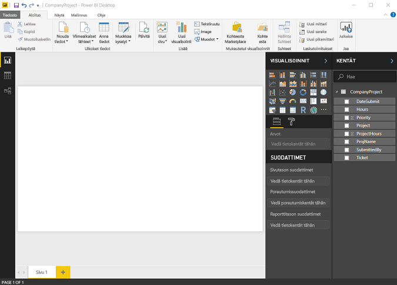
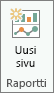
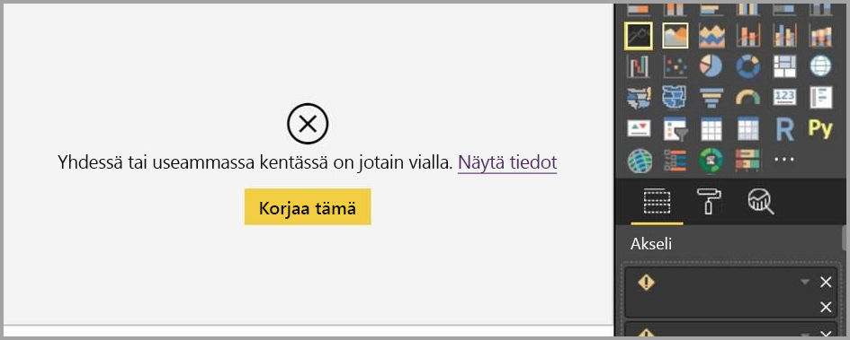
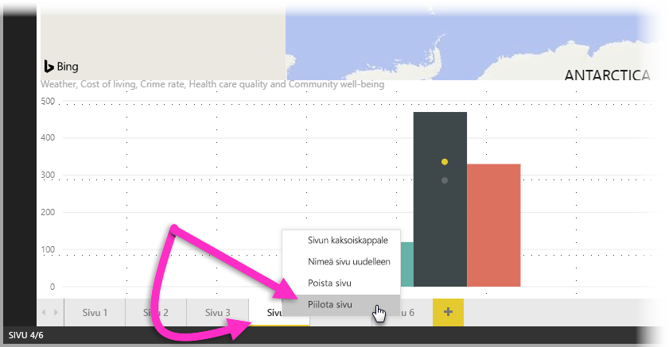
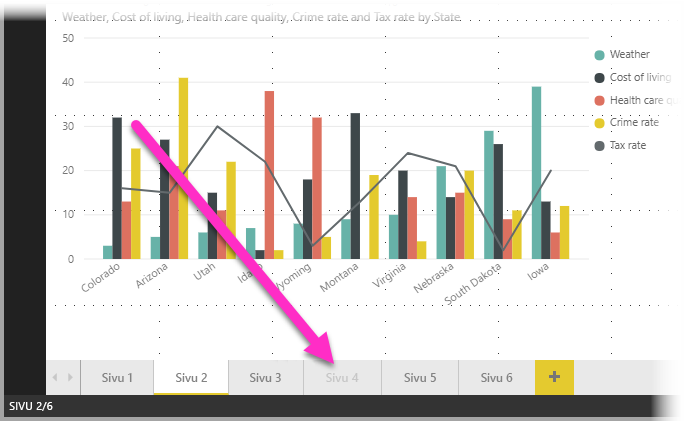

# Raporttinäkymän käsittely Power BI Desktopissa

Jos olet työskennellyt Power BI:lla tiedät, miten helppoa on luoda raportteja, jotka sisältävät dynaamisia perspektiivejä ja merkityksellisiä tietoja tietoihisi. Power BI on sisältää myös kehittyneempiä ominaisuuksia Power BI Desktopissa. Power BI Desktopin avulla voit luoda kehittyneitä kyselyitä, koota tietoja useista lähteistä, luoda taulukoiden välisiä yhteyksiä ja paljon muuta.

Power BI Desktop sisältää *raporttinäkymän*, jossa voit luoda minkä tahansa määrän raporttisivuja visualisointien avulla. Power BI Desktopin raporttinäkymä on rakenteeltaan pääpiirteittäin sama kuin raportin muokkausnäkymä *Power BI -palvelussa*. Voit esimerkiksi siirtää, kopioida ja liittää sekä yhdistää visualisointeja jne.

Ero näkymien välillä on, että käyttäessäsi Power BI Desktop -versiota voit työstää kyselyitäsi ja mallintaa tietosi, jotta ne varmasti tukevat raporttiesi parhaita merkityksellisiä tietoja. Voit sen jälkeen tallentaa Power BI Desktop -tiedoston minne tahansa, esimerkiksi paikalliselle asemalle tai pilvipalveluun.

## Katsotaanpa!

Kun lataat tietoja Power BI Desktopiin ensimmäisen kerran, näkyviin tulee raporttinäkymä ja tyhjä pohja.

Voit vaihdella **raporttinäkymän**, **tietonäkymän** ja **suhdenäkymän** välillä valitsemalla vasemmanpuoleisessa siirtymispalkissa olevat kuvakkeet:

Kun olet lisännyt tietoja, voit lisätä kenttiä uuteen visualisointiin pohjalle.

Jos haluat muuttaa visualisoinnin tyyppiä, voit valita sen pohjalla ja valita sitten uuden tyypin **Visualisoinnit**-kohdassa.

> [!TIP]
> Muista kokeilla eri visualisointityyppejä. On tärkeää, että visualisointi välittää tietoja selvästi.

Raportissa on ainakin yksi tyhjä sivu, josta aloittaa. Sivut näkyvät navigointiruudussa alustan vasemmalla puolella. Voit lisätä sivulle kaikenlaisia visualisointeja, mutta on tärkeää, ettet tee niitä liikaa. Jos sivulla on liian monta visualisointia, se näyttää sekavalta ja siitä on vaikea löytää oikeita tietoja. Voit lisätä uusia sivuja raporttiin. Napsauta **Uusi sivu** valintanauhasta.

Voit poistaa sivun napsauttamalla **X** sivun välilehdellä raporttinäkymän alareunassa.

> [!NOTE]
> Raportteja ja visualisointeja ei voi kiinnittää koontinäyttöön Power BI Desktopista. Sitä varten sinun on julkaistava ne Power BI-sivustolla. Lisätietoja on artikkelissa [Tietojoukkojen ja raporttien julkaiseminen Power BI Desktopista](desktop-upload-desktop-files.md).

## Kopioiminen ja liittäminen raporttien välillä

Voit helposti ottaa visualisoinnin yhdestä Power BI Desktop -raportista ja liittää sen toiseen raporttiin. Voit kopioida raportin visualisoinnin käyttämällä Ctrl + C -pikanäppäintä. Toisessa Power BI Desktop -raportissa voit liittää visualisoinnin toiseen raporttiin painamalla Ctrl + V -näppäintä. Voit valita yhden visualisoinnin kerrallaan tai sivun kaikki visualisoinnit kopioitaviksi ja sitten liittää ne Power BI Desktop -kohderaporttiin.

Visualisointien kopiointi- ja liittämismahdollisuudesta on hyötyä henkilöille, jotka luovat ja päivittävät useita raportteja usein. Tiedostojen välillä kopioitaessa asetukset ja muotoilu, jotka on nimenomaan määritetty muotoiluruudussa, kopioituvat eteenpäin, kun taas teemaan tai oletusasetuksiin pohjautuvat visuaaliset elementit päivitetään automaattisesti vastaamaan kohderaportin teemaa. Kun siis saat muotoiltua visualisoinnin juuri haluamallasi tavalla, voit kopioida ja liittää kyseisen visualisoinnin uusiin raportteihin ja näin säilyttää muotoilun eteen tehdyn työn.

Jos mallin kentät ovat erilaisia, visualisoinnissa tulee näkyviin virhe sekä varoitus siitä, mitä kenttiä ei ole olemassa. Virhe on samanlainen kuin silloin, kun poistat kentän mallista, jota visualisointi käyttää.

Virheen korjaamiseksi korvaa rikkinäiset kentät haluamillasi kentillä raportissa olevasta mallista, johon liitit visualisoinnin. Jos käytät mukautettua visualisointia, sinun on tuotava myös kyseinen mukautettu visualisointi kohderaporttiin.

## Raporttisivujen piilottaminen

Kun luot raportin, voit myös piilottaa sivuja raportista. Tämä lähestymistapa voi olla hyödyllinen, jos haluat luoda raporttiin piilossa olevia tietoja tai visualisointeja, etkä halua, että kyseiset sivut näkyvät muille käyttäjille, esimerkiksi kun luot taulukoita tai tukevia visualisointeja, joita käytetään raportin muilla sivuilla. On olemassa monia muitakin syitä, joiden takia haluat ehkä luoda raporttisivun ja sitten piilottaa tietoja raportista, jonka haluat julkaista.

Raporttisivun piilottaminen on helppoa. Napsautat vain hiiren kakkospainikkeella Raportin sivu -välilehteä ja valitset **Piilota** valikosta, joka tulee näkyviin.

Ota muutamia seikkoja huomioon, kun piilotat raporttisivua:

* Näet edelleen piilotetun raporttinäkymän Power BI Desktopissa, vaikka sivun otsikko näkyy harmaana. Seuraavassa kuvassa sivu 4 on piilotettu.

    

* *Et voi* nähdä piilotettua raporttisivua, kun tarkastelet raporttia Power BI -palvelussa.

* Raporttisivun piilottaminen *ei* ole turvatoimi. Käyttäjät pääsevät edelleen sivulle ja sen sisältöön alirakenneraporttien muiden menetelmien avulla.

* Kun sivu on piilotettu, näyttötilassa ei enää näy näyttötilan siirtymisnuolia.
