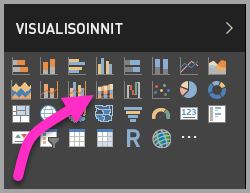
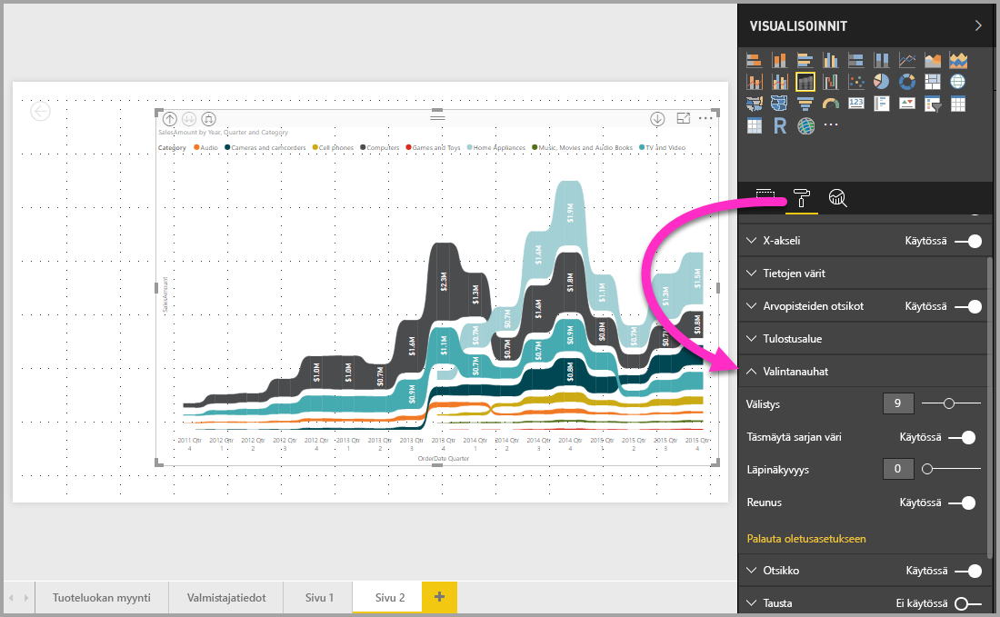

# Nauhakaavioiden käyttäminen Power BI:ssä
Voit käyttää nauhakaavioita **Power BI:ssä** tietojen visualisointiin ja sen selvittämiseen nopeasti, millä tietoluokalla on korkein sija (suurin arvo). Nauhakaaviot esittävät luokkamuutoksen tehokkaasti, koska korkein sija (suurin arvo) näkyy aina ylimpänä kullakin ajanjaksolla. Nauhakaaviot ovat käytettävissä **Power BI Desktopissa** syyskuun 2017 julkaisusta lähtien ja kaikissa sen jälkeen tulleissa **Power BI -palvelun** päivityksissä.

## Nauhakaavion luominen
Luo nauhakaavio valitsemalla **Nauhakaavio** **Visualisoinnit**-ruudusta.

Nauhakaavioissa tietoluokat yhdistetään visualisoidun aikajatkumon ajan nauhoilla, joten näet helposti, miten tietty luokka sijoittuu kaavion koko x-akselin (yleensä aikajana) matkalle.

## Nauhakaavion muotoileminen
Kun luot nauhakaavion, voit käyttää **Muotoilu**-osan muotoiluasetuksia **Visualisoinnit**-ruudussa. Nauhakaavioiden muotoiluasetukset ovat samankaltaisia kuin pinotussa pylväskaaviossa, mutta ne sisältävät lisäksi nauhoihin liittyviä muotoiluasetuksia.

Voit säätää seuraavia asetuksia näillä nauhakaavioiden muotoiluasetuksilla:

* **Välistys**-asetuksella voit asettaa, kuinka paljon tilaa nauhojen väliin jätetään. Luku on prosenttiosuus sarakkeen enimmäiskorkeudesta.
* **Täsmäytä sarjan väri** -asetuksella voit sovittaa nauhojen värin sarjan väriin. Kun asetus ei ole käytössä, nauhat näkyvät harmaina.
* **Läpinäkyvyys** määrittää, miten läpinäkyviä nauhat ovat. Oletusasetus on 30.
* **Reuna**-asetuksella voit sijoittaa tumman reunaviivan nauhojen ylä- ja alareunoihin. Reunat ovat oletusarvoisesti pois käytöstä.

## Seuraavat vaiheet
Saat lisätietoja **Power BI Desktopista** ja käytön aloittamisesta tutustumalla seuraaviin artikkeleihin.

* [Mikä on Power BI Desktop?](desktop-what-is-desktop.md)
* [Power BI Desktopin kyselyiden yleiskatsaus](desktop-query-overview.md)
* [Power BI Desktopin tietolähteet](desktop-data-sources.md)
* [Tietoihin yhdistäminen Power BI Desktopissa](desktop-connect-to-data.md)
* [Tietojen muotoilu ja yhdistäminen Power BI Desktopissa](desktop-shape-and-combine-data.md)
* [Yleiset kyselytehtävät Power BI Desktopissa](desktop-common-query-tasks.md)   

