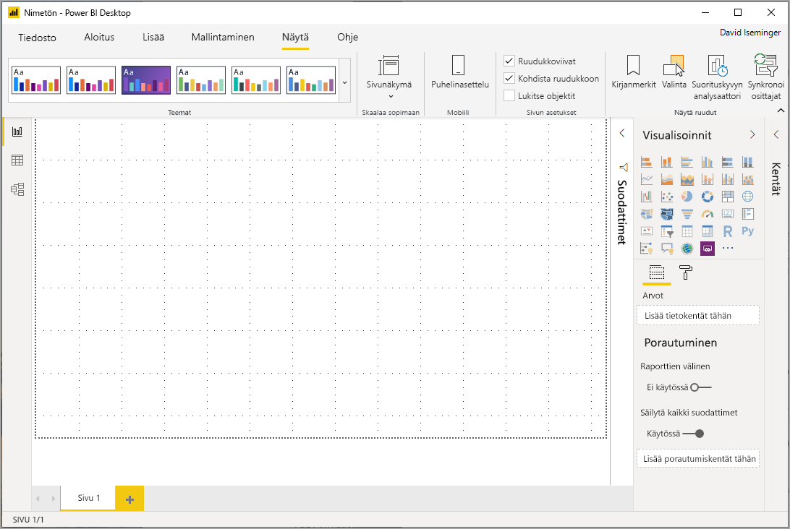
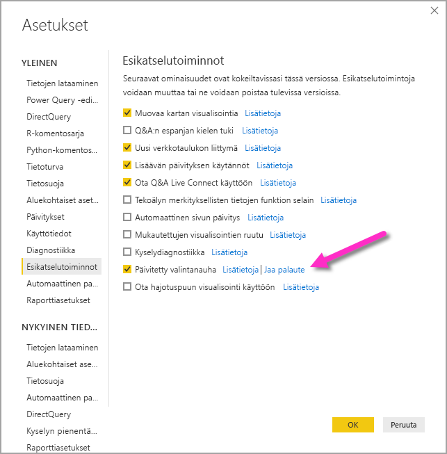
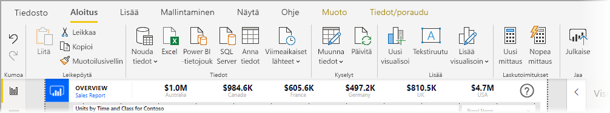
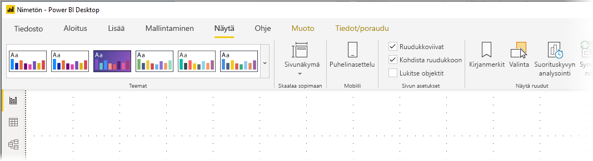
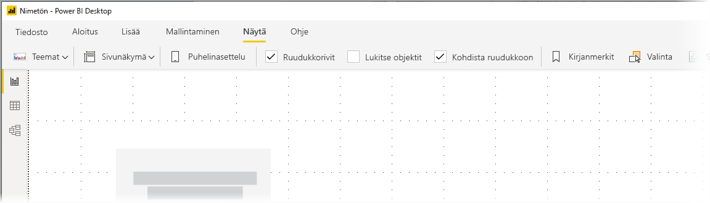

# Power BI Desktopin (esiversio) päivitetyn valintanauhan käyttäminen

Marraskuun 2019 päivityksestä alkaen Power BI Desktopin valintanauhaa muokataan, niin että sen ulkoasu ja käyttökokemus vastaavat paremmin muita Microsoftin tuotteita, kuten Microsoft Officea.

Päivitetty valintanauha on esikatselutilassa, jotta voimme kerätä palautetta käyttäjiltä ja asiakkailta sekä varmistaa, että käyttökokemus on erinomainen. Oletamme esikatselun, palautteen ja parannusten vievän muutaman kuukauden, minkä jälkeen päivitetty Power BI Desktop -valintanauha julkaistaan yleisesti saatavaksi. 

## Päivitetyn valintanauhan ottaminen käyttöön

Power BI:n päivitetty valintanauha on esikatselutoiminto, joka täytyy erikseen ottaa käyttöön. Voit ottaa toiminnon käyttöön valitsemalla **Tiedosto > Asetukset ja vaihtoehdot > Asetukset** ja valitsemalla sitten vasemmasta sarakkeesta **Esikatselutoiminnot**. Oikeanpuoleisessa ruudussa on **Päivitetty valintanauha** -valinta. Ota esikatseluominaisuus käyttöön valitsemalla **Päivitetty valintanauha** -valintaruutu. Esikatselutoiminnon käyttöönotto edellyttää Power BI Desktopin käynnistämistä uudelleen.

## Uuden valintanauhan ominaisuudet

Valintanauhan päivittämiseen liittyvien etujen myötä Power BI Desktopin käyttökokemus on tarkoitettu helpoksi ja tutuksi muiden Microsoft-tuotteiden tapaan. 

Nämä edut voidaan ryhmitellä seuraaviin luokkiin:

* **Parannettu ulkoasu, käyttötuntuma ja järjestely** – Päivitetyn Power BI Desktop -valintanauhan kuvakkeet ja toiminnot vastaavat Office-sovelluksien valintanauhakohteiden ulkoasua, käyttötuntumaa ja järjestelyä.

    

* **Intuitiivinen Teemat-valikoima** - **Näytä**-valintanauhan Teemat-valikoiman ulkoasu ja käyttötuntuma vastaavat PowerPointin teemavalikoimaa. Näin ollen valintanauhan kuvissa esitetään, miltä raportissa käyttöön otetut teeman muutokset näyttävät (kuten väriyhdistelmät ja fontit). 

    

* **Dynaaminen valintanauhan sisältö, joka perustuu näkymään** - Power BI Desktopin nykyisessä valintanauhassa sellaiset kuvakkeet ja komennot, jotka eivät olleet käytettävissä, näkyivät harmaina, minkä johdosta käyttökokemus ei ollut aivan optimaalinen. Päivitetyn valintanauhan myötä kuvakkeet näytetään ja järjestetään dynaamisesti, joten käyttäjä tietää aina, mitä asetukset ovat käytettävissä kussakin yhteydessä.

* **Yksiriviseksi tiivistetty valintanauha säästää tilaa** - Toinen päivitetyn valintanauhan etu on mahdollisuus tiivistää itse valintanauha yhdelle riville, jolloin valintanauhan kohteet näytetään dynaamisesti kontekstin perusteella. 

    

* **Näppäinvihjeet siirtymiseen ja painikkeiden valitsemiseen** – voit aktivoida valintanauhassa siirtymisen näppäinvihjeet valitsemalla **Alt + Windows-näppäin**. Kun näppäinvihjeet on aktivoitu, voit siirtyä valitsemalla näppäimistöltä vihjeissä näkyvät näppäimet.

    

* **Mukautetut muotoilumerkkijonot** – sen lisäksi, että voit määrittää mukautettuja muotoilumerkkijonoja *Ominaisuudet*-ruudussa, voit myös määrittää niitä valintanauhassa. Valitse se mittari tai sarake, jonka haluat mukauttaa, niin näkyviin tulee valintasi perusteella joko **Mittarityökalut**- tai **Saraketyökalut**-pikavälilehti. Välilehden muotoiluosiossa voit sitten kirjoittaa mukautetun muotoilumerkkijonon suoraan avattavaan valikkoruutuun.

    

* **Helppokäyttötoiminnot** – otsikkorivissä, valintanauhassa ja tiedostovalikossa on täydet helppokäyttötoiminnot. Siirry valintanauhaosioon valitsemalla Ctrl + F6. Sen jälkeen voit siirtyä ylä- ja alapalkeissa **sarkaimella** ja siirtyä elementtien välillä nuolinäppäinten avulla.

Näkyvien muutosten lisäksi päivitetyn valintanauhan avulla voimme tehdä Power BI Desktopiin ja sen valintanauhaan jatkossa muutoksia, kuten seuraavat:

* Entistä joustavampien ja intuitiivisempien ohjausobjektien luominen valintanauhassa (kuten visualisointien valikoima)
* *Musta*- ja *tummanharmaa*-Office-teemojen lisääminen Power BI Desktopiin
* Helppokäyttöisyyden parantaminen

## Seuraavat vaiheet
Power BI Desktopin avulla voit muodostaa yhteyden hyvin monenlaisiin tietoihin. Lisätietoja näistä tietolähteistä saat seuraavista resursseista:

* [Mikä on Power BI Desktop?](desktop-what-is-desktop.md)
* [Power BI Desktopin tietolähteet](desktop-data-sources.md)
* [Tietojen muotoilu ja yhdistäminen Power BI Desktopissa](desktop-shape-and-combine-data.md)
* [Yhteyden muodostaminen Excel-työkirjoihin Power BI Desktopissa](desktop-connect-excel.md)   
* [Tietojen antaminen suoraan Power BI Desktopiin](desktop-enter-data-directly-into-desktop.md)   

