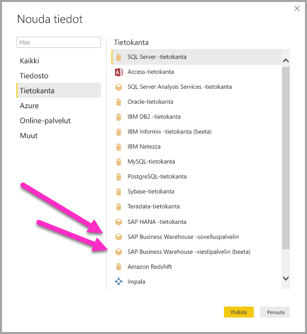
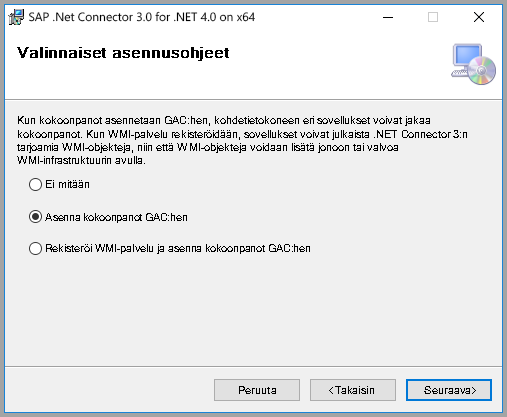
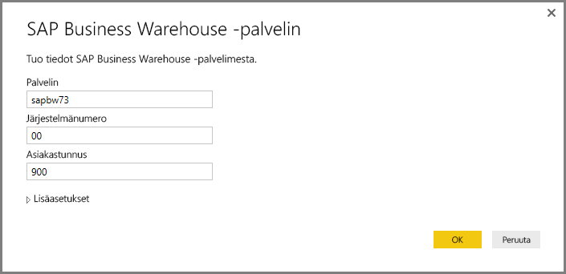
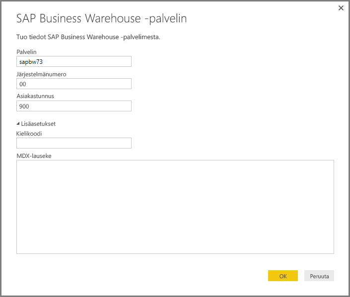
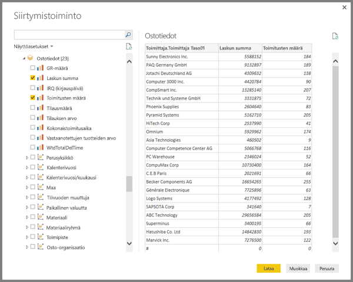
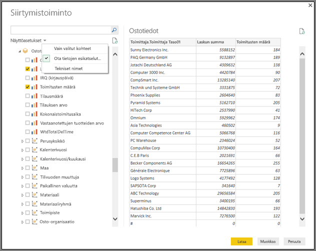
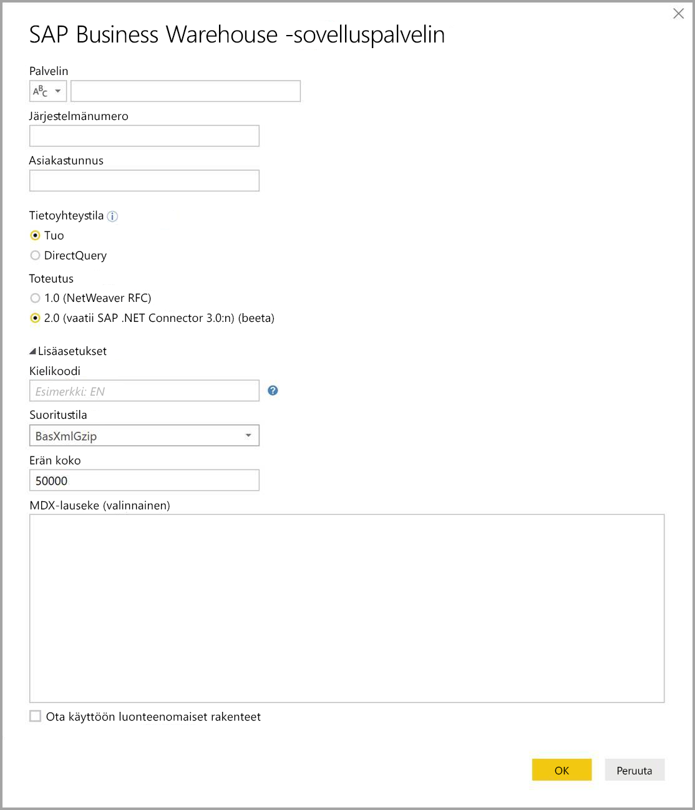
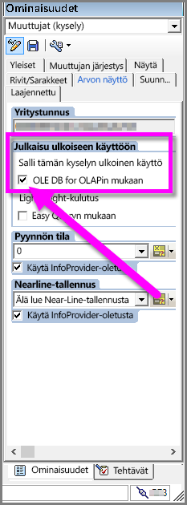

# SAP BW -yhdistimen käyttö Power BI Desktopissa
Voit nyt käyttää **SAP Business Warehouse (BW)** -tietoja Power BI Desktopilla.

Tietoja siitä, miten SAP-asiakkaat voivat hyötyä yhdistämällä Power BI:n SAP Business Warehouse (BW) -järjestelmäänsä, saat [Power BI ja SAP BW -teknisestä raportista](https://aka.ms/powerbiandsapbw). Saat lisätietoja DirectQueryn käytössä SAP BW:n kanssa artikkelista [DirectQuery ja SAP Business Warehouse (BW)](desktop-directquery-sap-bw.md).

**Power BI Desktopin** kesäkuun 2018 julkaisusta lähtien voit käyttää SAP BW -yhdistimen toteutusta, joka sisältää merkittäviä parannuksia sekä suorituskykyyn että ominaisuuksiin (yleisesti käytettävissä lokakuun 2018 julkaisusta lähtien). Tämän SAP BW -yhdistimen päivitetyn version kehittäjä on Microsoft ja sitä kutsutaan nimellä**toteutus 2.0**. Voit valita joko **SAP BW -yhdistimen** version 1 (v1) tai **toteutus 2.0 SAP-yhdistimen**. Seuraavassa kuvataan kunkin version asennus. Yhdistäessäsi Power BI Desktopista SAP BW:hen, voit valita kumman tahansa yhdistimen.

Microsoft suosittelee **toteutus 2.0 SAP-yhdistimen** valitsemista aina kun se on mahdollista.

## SAP BW -yhdistimen version 1 asennus
Suosittelemme valitsemaan toteutus 2.0 SAP-yhdistimen aina kun se on mahdollista (ohjeet seuraavassa osiossa). Tässä osiossa kuvataan **SAP BW -yhdistimen** version 1 asennus, joka voidaan suorittaa seuraavasti:

1. Asenna **SAP NetWeaver** -kirjasto tietokoneellesi. Voit saada **SAP Netweaver** -kirjaston SAP-järjestelmänvalvojaltasi tai suoraan [SAP-ohjelmiston latauskeskuksesta](https://support.sap.com/swdc). Koska **SAP-ohjelmiston latauskeskus** muuttaa rakennettaan usein, emme voi antaa tarkempia ohjeita kyseisellä sivulla navigoimiseen. **SAP NetWeaver** kirjasto sisältyy yleensä myös SAP-asiakastyökalujen asennukseen.
   
   Saata löytää viimeisimmän version latauspaikan hakulausekkeella *SAP Note #1025361*. Varmista, että **SAP NetWeaver** -kirjaston rakenne (32-bittinen tai 64-bittinen) vastaa **Power BI Desktop** -asennustasi ja asenna sitten kaikki **SAP NetWeaver RFC SDK** -latauksessa olevat tiedostot, mukaan lukien SAP Note.
2. **Hae tiedot** -valintaikkuna sisältää valinnan **SAP Business Warehouse -sovelluspalvelimelle** ja **SAP Business Warehouse -viestipalvelimelle** **Tietokanta**-luokassa.
   
   

## Toteutus 2.0 SAP-yhdistimen asennus

**Toteutus 2.0** SAP-yhdistin vaatii SAP .NET Connector 3.0:n. Voit [ladata SAP .NET Connector 3.0:n](https://support.sap.com/en/product/connectors/msnet.html) SAP:n sivustolta seuraavasta linkistä:

* [SAP .NET Connector 3.0](https://support.sap.com/en/product/connectors/msnet.html)

Lataaminen edellyttää kelvollisia S-käyttöoikeuksia. Asiakkaita kehotetaan ottamaan yhteyttä SAP-perustatiimiin saadakseen SAP .NET Connector 3.0:n. 

Kytkennästä on olemassa sekä 32-bittinen että 64-bittinen versio ja käyttäjien *on* valittava Power BI Desktopin asennusta vastaava versio. Tätä kirjoitettaessa sivustolla näkyy kaksi versiota (.NET 4.0 frameworkille):

* Microsoft .NET 3.0.20.0. SAP-yhdistin 32-bittiselle (x86) Windowsille zip-tiedostona (6.896 kt), 16. tammikuuta 2018
* Microsoft.NET 3.0.20.0 SAP-yhdistin 64-bittiselle (x64) Windowsille zip-tiedostona (7.180 kt), 16. tammikuuta 2018

Kun asennat, varmista **valinnainen asennusvaiheita** -ikkunassa, että valitset *asenna kokoonpanot GCA:hen* -vaihtoehdon kuvassa esitetyllä tavalla.

> [!NOTE]
> SAP BW:n ensimmäisen version toteutus edellytti Netweaver DLL -tiedostoja; jos käytät SAP-yhdistimen toteutus 2.0:a etkä ensimmäistä versiota, Netweaver DLL -tiedostoja ei tarvita.

## SAP BW -yhdistimen version 1 ominaisuudet
Power BI Desktopin **SAP BW -yhdistimen** versio 1 mahdollistaa tietojen tuomisen **SAP Business Warehouse -palvelimen** kuutioista tai DirectQueryn käytön. 

Lisätietoja **SAP BW -yhdistimestä** ja sen käyttämisestä DirectQueryn kanssa löytyy artikkelista [DirectQuery ja SAP Business Warehouse (BW)](desktop-directquery-sap-bw.md).

Kun yhteys muodostetaan, sinun on määritettävä *palvelin*, *järjestelmän numero* ja *asiakastunnus*.

Voit myös määrittää kaksi muuta **lisäasetusta**: kielikoodi ja mukautettu MDX-lauseke, joka suoritetaan määritetyllä palvelimella.

Jos MDX-lauseketta ei ole määritelty, näytölle aukeaa **Navigator**-ikkuna, jossa näkyy lista palvelimella olevista kuutioista, mahdollisuus porautua ja valita tietoyksikköjä valittavissa olevista kuutioista, mukaan lukien dimensiot ja mittarit. Power BI tuo esiin kyselyt ja kuutiot, jotka [BW Open Analysis Interface OLAP -sovellusympäristöt](https://help.sap.com/saphelp_nw70/helpdata/en/d9/ed8c3c59021315e10000000a114084/content.htm) ovat paljastaneet.

Kun valitset yhden tai useamman tietoyksikön palvelimelta, tulostetaulukosta luodaan esikatselu, joka perustuu valintaan.

**Navigator**-ikkunassa on myös **näyttövalintoja**, jotka mahdollistavat seuraavat toiminnot:

* **Näytä *Vain valitut kohteet* tai *Kaikki kohteet* (oletusnäkymä):** Tämä valinta on hyödyllinen, kun vahvistetaan valittujen kohteiden lopullinen joukko. Vaihtoehtoinen tapa nähdä tämä on valita *Sarakenimet* *Esikatselu*-alueella.
* **Ota tietojen esikatselut käyttöön (oletustoiminto):** Voit myös valita, näytetäänkö tietojen esikatselu tässä dialogissa. Tietojen esikatselun ottaminen pois käytöstä vähentää palvelinkutsujen määrää, koska palvelin ei enää pyydä tietoja esikatseluita varten.
* **Tekniset nimet:** SAP BW tukee *teknisten nimien* käsitettä kuution sisältämille objekteille. Tekniset nimet mahdollistavat sen, että kuution omistaja voi näyttää *käyttäjäystävällisiä* nimiä kuution objekteille pelkästään *fyysisten nimien* sijaan.

Kun olet valinnut **Navigator**-ikkunassa kaikki tarvittavat objektit, voit päättää mitä teet seuraavaksi valitsemalla seuraavista **Navigator**-ikkunan alaosassa olevista painikkeista:

* **Lataus**-painikkeen valitseminen käynnistää kaikkien valittujen rivien lataamisen tulostetaulukosta Power BI Desktop -tietomalliin ja vie sinut sitten  **raportti**-näkymään, jossa voit aloittaa tietojen visualisoinnin tai tehdä muutoksia **tieto-** tai **suhde**-näkymissä.
* **Muokkaus**-painikkeen valitseminen avaa **kyselyeditorin**, jos voit suorittaa tietojen muutos- ja suodatusvaiheita ennen kuin rivit tuodaan Power BI Desktop -tietomalliin.

Muista, että sen lisäksi, että voit tuoda tietoja **SAP BW** -kuutioista, voit myös tuoda Power BI Desktopiin tietoja laajasta valikoimasta muita tietolähteitä ja yhdistää ne sitten yhdeksi raportiksi. Tämä tarjoaa monia kiinnostavia vaihtoehtoja raportointiin ja analyysiin **SAP BW** -tietojen lisäksi.

## Toteutus 2.0 SAP BW -yhdistimen käyttäminen

Sinun on luotava uusi yhteys käyttääksesi toteutus 2.0 SAP BW -yhdistintä. Luodaksesi uuden yhteyden, toimi seuraavasti:

1. Valitse **Nouda tiedot** -ikkunasta joko **SAP Business Warehouse -sovelluspalvelin** tai **SAP Business Warehouse -viestipalvelin**.

2. Sinulle avautuu uusi yhteys -valintaikkuna, josta voit valita toteutuksen. Valitsemalla **toteutus 2.0**, kuvan osoittamalla tavalla, saat käyttöösi suoritustilan, erän koon ja ota käyttöön luonteenomaiset rakenteet -asetukset.

    

3. Valitse **OK** ja tämän jälkeen**Navigator**-käyttökokemus vastaa SAP BW -yhdistimen versiota 1 käsittelevässä aiemmassa osiossa kuvattua käyttökokemusta. 

### Uudet asetukset toteutus 2.0:lle 

Toteutus 2.0 tukee seuraavia asetuksia:

1. **ExecutionMode** - määrittää palvelimessa tehtävien kyselyiden MDX-käyttöliittymän. Kelvolliset vaihtoehdot ovat:

        a. SapBusinessWarehouseExecutionMode.BasXml
        b. SapBusinessWarehouseExecutionMode.BasXmlGzip
        c. SapBusinessWarehouseExecutionMode.DataStream

    Asetuksen oletusarvo on SapBusinessWarehouseExecutionMode.BasXmlGzip.

    *SapBusinessWarehouseExecutionMode.BasXmlGzip*-arvon käyttäminen saattaa parantaa suorituskykyä, kun suurten tietojoukkojen käsittelyssä ilmenee viiveitä.

2. **BatchSize** - määrittää rivien maksimimäärän, jotka noudetaan yhdellä kertaa suoritettaessa MDX-lausetta. Pieni määrä rivejä tarkoittaa enemmän kutsuja palvelimella, kun noudetaan tietoja suuresta tietojoukosta. Suuri määrä rivejä saattaa parantaa suorituskykyä, mutta saattaa aiheuttaa muistiongelmia SAP BW -palvelimessa. Oletusarvona on 50000 riviä.

3. **EnableStructures** - looginen arvo, joka ilmaisee tunnistetaanko ominaisuusrakenteita. Asetuksen oletusarvo on false. Vaikuttaa valittavissa olevien objektien luetteloon. Ei tueta alkuperäisessä kyselytilassa.

**ScaleMeasures** -asetus on syrjäytetty tässä toteutuksessa. Se käyttäytyy samoin kuin *ScaleMeasures = false* -asetus, joka näyttää aina skaalaamattoman arvot.

### Toteutus 2.0:n muut parannukset 

Seuraava luettelo kuvaa joitakin muita parannuksia, jotka sisältyvät uuteen toteutukseen:

* Parannettu suorituskyky
* Kyky hakea tietoa useita miljoonia rivejä ja hienosäätää erän kokoa parametrin kautta.
* Kyky vaihtaa suoritustiloihin.
* Pakatun tilan tuki. Hyödyllinen erityisesti suurten viiveiden on yhteyksien tai suurten tietojoukkojen kanssa.
* Parannettu päivämäärä muuttujien tunnistaminen
* [Kokeellinen] Paljastaa päivämäärä (ABAP-tyypin DATS) ja aika (ABAP-tyypin TIMS) -dimensiot päivämäärinä ja aikoina, tekstiarvojen sijaan.
* Parempi poikkeusten hallinta. BAPI-kutsuissa havaitut virheet näytetään.
* Saraketaitto BasXml ja BasXmlGzip -tiloissa. Jos esimerkiksi luotu MDX-kysely palauttaa 40 saraketta, mutta nykyinen valinta tarvitsee vain 10, välitetään tämä pyyntö palvelimelle ja pienempi tietojoukko noudetaan.

### Aikaisemmin luotujen raporttien muuttaminen käyttämään toteutus 2.0:a 

Aikaisemmin luotujen raporttien muuttaminen käyttämään **toteutus 2.0:a** on mahdollista vain tuontitilassa ja edellyttää seuraavia manuaalisia toimenpiteitä:

1. Avaa aiemmin luotu raportti, valitse valintanauhasta **Muokkaa kyselyitä** ja valitse sitten SAP Business Warehouse -kysely, jonka haluat päivittää.

2. Napsauta hiiren kakkospainikkeella kyselyä ja valitse **Laajennettu editori**.

3. Muuta**Laajennetussa editorissa**SapBusinessWarehouse.Cubes-kutsua seuraavasti: 

    a. Määritä, sisältääkö kysely vaihtoehto-tietueen, kuten seuraavassa esimerkissä:

    

    b. Lisää tässä tapauksessa toteutus 2.0 -vaihtoehto ja poista ScaleMeasures -vaihtoehto, jos sellainen on näkyvillä, seuraavasti:

    

    c. Lisää asetukset-tietue, jos kysely ei sitä sisällä. Esimerkiksi seuraavasti:

    

    d. Muuta se:

    

4. Olemme pyrkineet kaikin tavoin varmistamaan, että SAP BW -yhdistimen toteutus 2.0 on yhteensopiva SAP BW -yhdistimen version 1 kanssa. Joitakin eroja saattaa kuitenkin olla, eri SAP BW MDX -suoritintilojen käytöstä johtuen. Poikkeamia voidaan yrittää ratkaista vaihtamalla eri suoritustilojen välillä.

## Vianmääritys
Tämä osio sisältää vianmäärityksen tilanteita ja ratkaisuja käytettäessä tätä **SAP BW** -yhdistintä.

1. **SAP BW** -yhdistimen numeeriset tiedot palauttavat desimaalipisteitä pilkkujen sijaan. Esimerkiksi 1,000,000 palautetaan muodossa 1.000.000.
   
   **SAP BW** -yhdistin palauttaa desimaalitiedot joko desimaalierottimella *,* (pilkku) tai desimaalierottimella *.* (piste). Määrittääkseen kumpaa **SAP BW** -yhdistimen tulisi käyttää desimaalierottimena **Power BI Desktopin** käyttämä ajuri lähettää kutsun *BAPI_USER_GET_DETAIL*. Tämä kutsu palauttaa rakenteen nimeltä **DEFAULTS**, jossa on kenttä nimeltä *DCPFM*, johon on tallennettu *desimaalimuodon merkintä*. Tämä voi olla yksi seuraavista kolmesta arvosta:
   
       ‘ ‘ (space) = Decimal point is comma: N.NNN,NN
       'X' = Decimal point is period: N,NNN.NN
       'Y' = Decimal point is N NNN NNN,NN
   
   Asiakkaat, jotka ovat ilmoittaneet tästä ongelmasta, havaitsivat, että kutsu *BAPI_USER_GET_DETAIL* epäonnistuu tietyn käyttäjän (käyttäjän, jolla näkyy virheellisiä tietoja) kohdalla ja tuottaa vikaviestin, joka muistuttaa seuraavaa:
   
       You are not authorized to display users in group TI:
           <item>
               <TYPE>E</TYPE>
               <ID>01</ID>
               <NUMBER>512</NUMBER>
               <MESSAGE>You are not authorized to display users in group TI</MESSAGE>
               <LOG_NO/>
               <LOG_MSG_NO>000000</LOG_MSG_NO>
               <MESSAGE_V1>TI</MESSAGE_V1>
               <MESSAGE_V2/>
               <MESSAGE_V3/>
               <MESSAGE_V4/>
               <PARAMETER/>
               <ROW>0</ROW>
               <FIELD>BNAME</FIELD>
               <SYSTEM>CLNTPW1400</SYSTEM>
           </item>
   
   Ratkaistakseen tämän vian, käyttäjien tulee pyytää SAP-järjestelmänvalvojaansa antamaan Power BI:ssä käytettävälle SAPBW-käyttäjälle oikeuden suorittaa kutsu *BAPI_USER_GET_DETAIL*. Kannattaa myös tarkistaa, että käyttäjällä on tarvittava *DCPFM*-arvo, joka kuvattiin aikaisemmin tämän vianmäärityksen ratkaisussa.
   
2. **SAP BEx -kyselyiden yhteydet**
   
   Voit suorittaa Power BI Desktopilla **BEx**-kyselyitä ottamalla käyttöön tietty ominaisuus, joka on esitetty seuraavassa kuvassa:
   
   
   
3. **Navigator**-ikkuna ei näytä tietojen esikatselua, vaan se antaa *Objektiviittausta ei ole määritetty objektin esiintymään* -virheilmoituksen.
   
   SAP-käyttäjien täytyy hakea metatiedot ja hakea tiedot SAP BW:n InfoProviders-kohteista tietyillä BAPI-funktiomoduuleilla. Näitä ovat esimerkiksi seuraavat:
   * BAPI_MDPROVIDER_GET_CATALOGS
   * BAPI_MDPROVIDER_GET_CUBES
   * BAPI_MDPROVIDER_GET_DIMENSIONS
   * BAPI_MDPROVIDER_GET_HIERARCHYS
   * BAPI_MDPROVIDER_GET_LEVELS
   * BAPI_MDPROVIDER_GET_MEASURES
   * BAPI_MDPROVIDER_GET_MEMBERS
   * BAPI_MDPROVIDER_GET_VARIABLES
   * BAPI_IOBJ_GETDETAIL

   Voit ratkaista ongelman varmistamalla, että käyttäjällä on oikeus käyttää erilaisia *MDPROVIDER*- ja *BAPI_IOBJ_GETDETAIL*-moduuleita. Jos haluat tehdä tällaisen tai vastaavan ongelman vianmäärityksen, valitse Power BI Desktopin *asetusten* *Diagnostiikka*-ikkunassa *Ota jäljitys käyttöön*. Yritä hakea tietoja SAP BW:stä, kun jäljitys on käytössä, ja tutki lisätietoja jäljitystiedostosta.

## SAP BW -yhteyden tuki

Seuraavassa taulukossa esitetään SAP BW:n nykyinen tuki.

|Tuote  |Tila  |Todentaminen  |Liitin  |SNC-kirjasto  |Tuetaan  |
|---------|---------|---------|---------|---------|---------|
|Power BI Desktop     |Mikä tahansa         | Käyttäjä / salasana  | Sovelluspalvelin | –  | Kyllä  |
|Power BI Desktop     |Mikä tahansa         | Windows          | Sovelluspalvelin | sapcrypto + gsskrb5/gx64krb5  | Kyllä  |
|Power BI Desktop     |Mikä tahansa         | Windows tekeytymisen kautta | Sovelluspalvelin | sapcrypto + gsskrb5/gx64krb5  | Kyllä  |
|Power BI Desktop     |Mikä tahansa         | Käyttäjä / salasana        | Viestipalvelin | –  | Kyllä  |
|Power BI Desktop     |Mikä tahansa         | Windows        | Viestipalvelin | sapcrypto + gsskrb5/gx64krb5  | Kyllä  |
|Power BI Desktop     |Mikä tahansa         | Windows tekeytymisen kautta | Viestipalvelin | sapcrypto + gsskrb5/gx64krb5  | Kyllä  |
|Power BI Gateway     |Tuo      | Sama kuin Power BI Desktopilla |         |   |   |
|Power BI Gateway     |DirectQuery | Käyttäjä / salasana        | Sovelluspalvelin | –  | Kyllä  |
|Power BI Gateway     |DirectQuery | Windows tekeytymisen kautta (kiinteä käyttäjä, ei kertakirjautumista) | Sovelluspalvelin | sapcrypto + gsskrb5/gx64krb5  | Kyllä  |
|Power BI Gateway     |DirectQuery | Käytä DirectQuery-kyselyissä kertakirjautumista Kerberoksen kautta | Sovelluspalvelin | *vain* gsskrb5/gx64krb5   | Kyllä  |
|Power BI Gateway     |DirectQuery | Käyttäjä / salasana        | Viestipalvelin | –  | Kyllä  |
|Power BI Gateway     |DirectQuery | Windows tekeytymisen kautta (kiinteä käyttäjä, ei kertakirjautumista) | Viestipalvelin | sapcrypto + gsskrb5/gx64krb5  | Kyllä  |
|Power BI Gateway     |DirectQuery | Käytä DirectQuery-kyselyissä kertakirjautumista Kerberoksen kautta | Viestipalvelin | sapcrypto + gsskrb5/gx64krb5  | Ei  |

## Seuraavat vaiheet
Lisätietoja SAP-tietokannoista ja DirectQuery-kyselystä saat seuraavista lähteistä:

* [DirectQuery ja SAP HANA](desktop-directquery-sap-hana.md)
* [DirectQuery ja SAP Business Warehouse (BW)](desktop-directquery-sap-bw.md)
* [DirectQuery Power BI:ssä](desktop-directquery-about.md)
* [DirectQueryn tukemat tietolähteet](desktop-directquery-data-sources.md)
* [Power BI ja SAP BW tekninen raportti](https://aka.ms/powerbiandsapbw)
