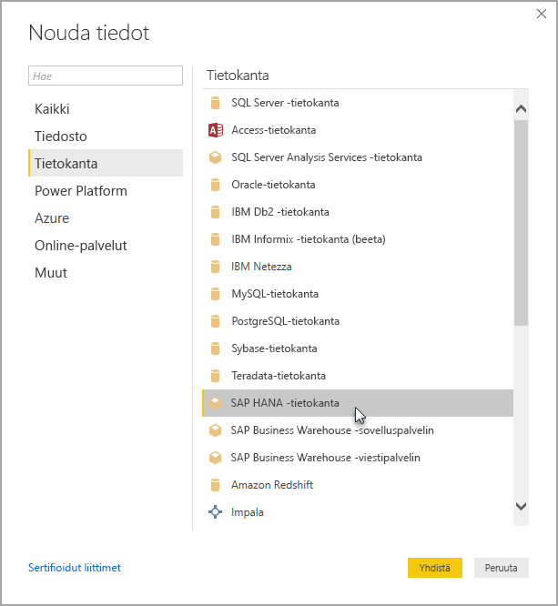

# SAP HANA -käyttö Power BI Desktopissa
Voit nyt käyttää **SAP HANA** -tietokantoja Power BI Desktopilla. Jotta voit käyttää **SAP HANA** -tietokantoja, täytyy SAP HANA ODBC -ohjain olla asennettuna paikallisessa asiakastietokoneessa, jotta Power BI Desktopin **SAP HANA** -tietoyhteys toimii oikein. Voit ladata SAP HANA ODBC -ohjaimen [SAP-ohjelmiston latauskeskuksesta](https://support.sap.com/swdc). Etsi sieltä Windows-koneille tarkoitettu SAP HANA CLIENT -asiakasohjelmisto. Koska **SAP-ohjelmiston latauskeskus** muuttaa rakennettaan usein, emme voi antaa tarkempia ohjeita kyseisellä sivulla navigoimiseen.

Muodostaaksesi yhteyden **SAP HANA** -tietokantaan, valitse **Nouda tiedot > Tietokanta > SAP HANA -tietokanta** seuraavassa kuvassa esitetyllä tavalla:

Kun yhteys SAP HANA -tietokantaan muodostetaan, määritä palvelimen nimi ja portti muodossa *palvelin:portti* – seuraavassa kuvassa on esimerkki, jossa palvelimen nimi on *ServerXYZ* ja porti on *30015*.

Tässä julkaisussa **SAP HANA** -tietokannan [DirectQuery](desktop-directquery-sap-hana.md)-tila on tuettu Power BI Desktopissa ja Power BI -palvelussa, ja voit julkaista ja ladata raportteja, joissa käytetään **SAP HANA** -tietokannan DirectQuery -tilaa, Power BI -palveluun. Voit myös julkaista ja ladata raportteja Power BI -palveluun, kun **SAP HANA** -tietokanta ei ole DirectQuery-tilassa.

### SAP HANA -tietokannan tuetut ominaisuudet
Tässä julkaisussa hyödynnetään monia **SAP HANA** -tietokannan ominaisuuksia, kuten näkyy seuraavassa luettelossa:

* **SAP HANA** -tietokannan Power BI -liitäntä käyttää SAP ODBC -ohjainta antamaan parhaan mahdollisen käyttäjäkokemuksen.
* **SAP HANA** tukee sekä DirectQuery- että tuontivaihtoehtoja.
* Power BI tukee HANA-tietomalleja (kuten analyyttinen ja laskelmanäkymä) ja sen navigointi on optimoitu.
* Voit myös käyttää **SAP HANA** -tietokannan kanssa Direct SQL -toimintoa yhdistääksesi rivi- ja saraketaulukkoja.
* Sisältää HANA-mallien optimoidun selaamisen.
* Power BI tukee **SAP HANA** -muuttujia ja syöttöparametreja.

### SAP HANA ODBC -ohjaimen asentaminen
### SAP HANA -tietokantojen rajoitukset
**SAP HANA** -tietokantojen käyttöön liittyy joitakin rajoituksia:

* NVARCHAR-merkkijonot lyhennetään enimmäispituuteen, joka on 4000 Unicode-merkkiä.
* SMALLDECIMAL-toimintoa ei tueta.
* VARBINARY-toimintoa ei tueta.
* Kelvolliset päivämäärät ovat väliltä 30.12.1899-31.12.9999.

## Seuraavat vaiheet
Saat lisätietoja DirectQuerystä seuraavista resursseista:

* [DirectQuery ja SAP HANA](desktop-directquery-sap-hana.md)
* [DirectQuery Power BI:ssä](desktop-directquery-about.md)
* [DirectQueryn tukemat tietolähteet](desktop-directquery-data-sources.md)

