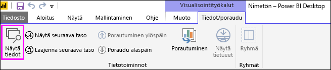
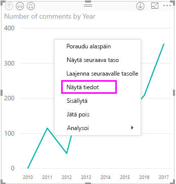
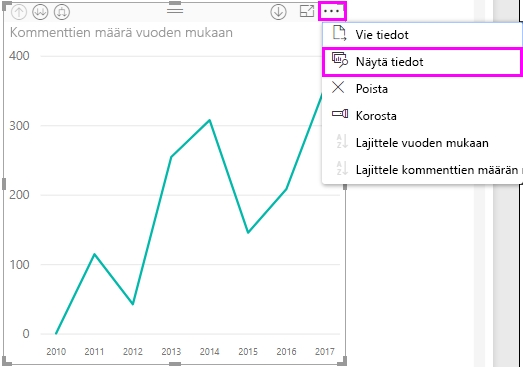
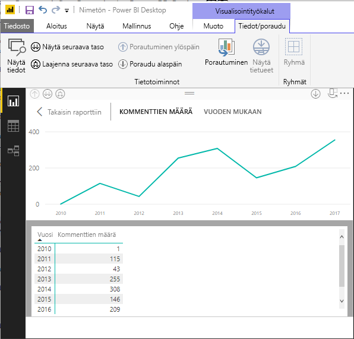
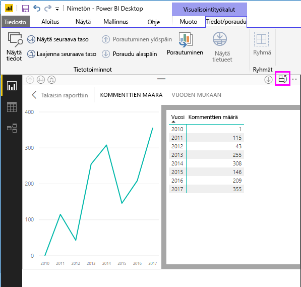
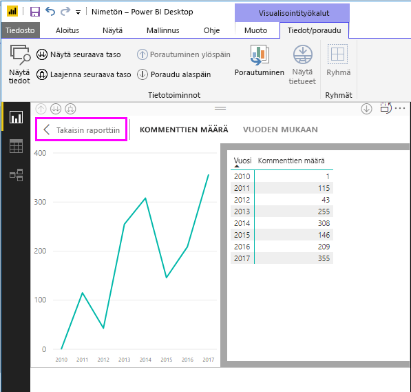
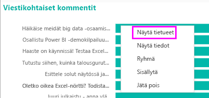
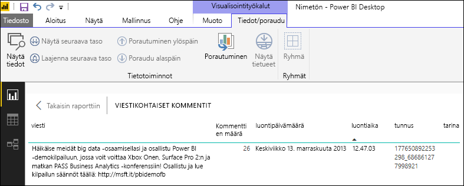
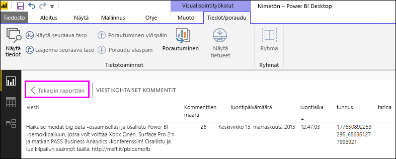

# Power BI Desktopin ominaisuuksien ”Näytä tiedot” ja ”Näytä tietueet” käyttäminen
**Power BI Desktopissa** voit syventyä minkä tahansa visualisoinnin tietoihin ja nähdä pohjana olevien tietojen tekstiesityksen tai yksittäiset tietueet valituista visualisoinneista. Näitä ominaisuuksia kutsutaan joskus nimellä *napsauttamalla tarkasteltava raportti* tai *alirakenneraportti* tai *alirakenneraporttien yksityiskohtien tiedot*.

Voit käyttää **Näytä tiedot** -toimintoa yhden valitun tietoelementin pohjana olevien rivien tarkastelemiseksi tai käyttää **Näytä tietueet** -toimintoa yhden valitun tietueen tai arvopisteen kaikkien tietojen näyttämiseksi. 

>[!IMPORTANT]
>**Näytä tiedot** ja **Näytä tietueet** tukevat vain seuraavia visualisointityyppejä:
>  - Palkkikaavio
>  - Pylväskaavio
>  - Rengaskaavio
>  - Täytetty kartta
>  - Suppilo
>  - Kartta
>  - Ympyräkaavio
>  - Puukartta

## Näytä tiedot -toiminto Power BI Desktopissa

**Näytä tiedot** näyttää visualisoinnin pohjana olevat tiedot. **Näytä tiedot** -painike ilmestyy **Tiedot/poraudu** -välilehdelle valintanauhan **Visualisointityökalut** -osaan, kun visualisointi valitaan.

Näet tiedot myös painamalla hiiren kakkospainiketta visualisoinnissa ja valitsemalla sitten **Näytä tiedot** näkyviin tulevasta valikosta, tai valitsemalla **Lisää vaihtoehtoja** -kohdan kolme pistettä (...) visualisoinnin oikeassa yläkulmassa ja valitsemalla sitten **Näytä tiedot**.

&nbsp;&nbsp;

> [!NOTE]
> Sinun pitää siirtää hiiri visualisoinnin arvopisteen päälle, jotta hiiren kakkospainikkeen valikko olisi käytettävissä.

Kun valitset **Näytä tiedot** tai **Näytä tiedot**, Power BI Desktop -pohjassa näkyvät sekä tietojen visualisointi että tietojen tekstiesitys. *Vaakasuuntaisessa näkymässä* visualisointi näkyy pohjan yläosassa ja tiedot näkyvät alaosassa. 

Voit myös vaihdella *pystysuuntaiseen näkymän* ja vaakasuuntaisen näkymän välillä valitsemalla kuvakkeen pohjan oikeassa yläkulmassa.

Voit siirtyä raporttiin valitsemalla **< Takaisin raporttiin** pohjan vasemmasta yläkulmasta.

## Näytä tietueet -toiminnon käyttäminen Power BI Desktopissa

Voit myös keskittyä yhden tietueen visualisointiin ja porautua sen pohjana oleviin tietoihin. Jos haluat käyttää **Näytä tietueet** -toimintoa, valitse visualisointi ja valitse sitten **Näytä tietueet** **Tiedot/poraudu** -välilehdessä valintanauhan **Visualisointityökalut** -osassa, ja valitse sitten arvopiste tai rivi visualisoinnissa. 

> [!NOTE]
> Jos **Näytä tietueet** -painike on poistettu käytöstä ja himmennettynä valintanauhassa, se tarkoittaa, ettei valittu visualisointi tue **Näytä tietueet** -toimintoa.

Voit myös napsauttaa tietoelementtiä hiiren kakkospainikkeella ja valita **Näytä tietueet** näkyviin tulevasta valikosta.

Kun valitset tietoelementiksi **Näytä tietueet**, Power BI Desktop -pohjassa näkyvät kaikki valittuun elementtiin liittyvät tiedot. 

Voit siirtyä raporttiin valitsemalla **< Takaisin raporttiin** pohjan vasemmasta yläkulmasta.

> [!NOTE]
>**Näytä tietueet** -toiminnolla on seuraavat rajoitukset:
> - Et voi muuttaa tietoja **Näytä tietueita** -näkymässä ja tallentaa niitä takaisin raporttiin.
> - Et voi käyttää **Näytä tietueet** -toimintoa, kun visualisointi käyttää laskettua mittayksikköä.
> - Et voi käyttää **Näytä tietueet** -toimintoa, kun olet yhteydessä reaaliaikaiseen MD-malliin.

## Seuraavat vaiheet
**Power BI Desktop** sisältää erilaisia ominaisuuksia raportin muotoiluun ja tietojen hallintatoimintoihin. Tutustu seuraaviin resursseihin ja niiden muutamiin esimerkkeihin:

* [ Ryhmittely ja lokeroiminen Power BI Desktopissa](desktop-grouping-and-binning.md)
* [Käytä ruudukkoa, Kohdista ruudukkoon, Z-järjestys, Tasaus ja jakelu Power BI Desktop-raporteissa](desktop-gridlines-snap-to-grid.md)

