# Opetusohjelma: Tietojen muotoilu ja yhdistäminen Power BI Desktopissa

**Power BI Desktopilla** voit muodostaa yhteyksiä moniin erilaisiin tietolähteisiin ja muotoilla sitten tietoja tarpeidesi mukaisesti. Näin voit luoda visuaalisia raportteja, joita voit jakaa muille. Tietojen *muotoileminen* tarkoittaa tietojen muuntamista, esimerkiksi sarakkeiden tai taulukoiden nimeämistä uudelleen, tekstin muuntamista luvuiksi, rivien poistamista, ensimmäisen rivin määrittämistä otsikoiksi ja niin edelleen. Tietojen *yhdistäminen* tarkoittaa kahden tai useamman tietolähteen yhdistämistä, tietojen muotoilua tarvittaessa ja sitten tietojen yhdistämistä yhdeksi hyödylliseksi kyselyksi.

Tässä opetusohjelmassa opit:

* Tietojen muotoilun käyttämällä **kyselyeditoria**
* Yhdistäminen tietolähteeseen
* Yhdistäminen toiseen tietolähteeseen
* Kyseisten tietolähteiden yhdistäminen ja tietomallien luominen raportissasi käytettäviksi

Tässä opetusohjelmassa näytetään, miten voit muotoilla kyselyä Power BI Desktopilla, sekä tuodaan esiin joitain yleisimpiä tehtäviä. Tässä käytetty kysely kuvataan tarkemmin ohjeartikkelissa [Power BI Desktopin käytön aloittaminen](desktop-getting-started.md), josta saat myös ohjeet kyselyn luomiseen kokonaan itse.

Kannattaa huomioida, että Power BI Desktopin **kyselyeditorissa** käytetään runsaasti hiiren kakkospainikkeella avattavien valikoiden toimintoja sekä valintanauhan toimintoja. Useimmat toiminnot, jotka ovat valittavissa **Muunna**-valintanauhassa, ovat käytettävissä myös napsauttamalla kohdetta (esimerkiksi saraketta) hiiren kakkospainikkeella ja valitsemalla sitten toiminto näyttöön avautuvasta valikosta.

## Tietojen muotoileminen
Kun muotoilet tietoja kyselyeditorissa, annat vaiheittaiset ohjeet (jotka kyselyeditori toteuttaa puolestasi) tietojen muokkaamiseksi, kun kyselyeditori lataa ja näyttää tiedot. Tämä ei vaikuta alkuperäiseen tietolähteeseen, sillä vain tätä tietonäkymää muokataan eli *muotoillaan*.

Määrittämäsi vaiheet (esimerkiksi taulukon nimeäminen uudelleen, tietotyypin muuntaminen tai sarakkeiden poistaminen) kirjataan kyselyeditoriin. Nämä vaiheet suoritetaan sitten aina, kun kysely muodostaa yhteyden tietolähteeseen, jotta tiedot muotoillaan aina määrittämälläsi tavalla. Tämä prosessi suoritetaan aina, kun käytät Power BI Desktopin kyselyeditoria ja kun joku käyttää jaettua kyselyäsi esimerkiksi **Power BI** -palvelussa. Vaiheet kirjataan järjestyksessä **Kyselyasetukset**-ruudun **Käytössä olevat vaiheet** -kohtaan.

Seuraavasta kuvasta näet **Kyselyasetukset**-ruudun kyselylle, jota on muotoiltu. Käymme läpi kaikki nämä vaiheet seuraavissa kappaleissa.

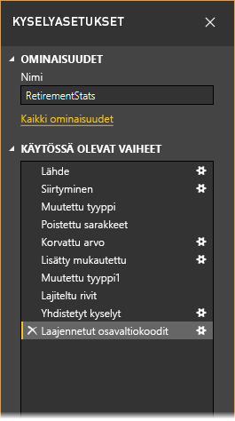

Käytämme tässä esimerkissä [Power BI Desktopin käytön aloittaminen](desktop-getting-started.md) -artikkelista tuttuja eläköitymistietoja, jotka löysimme muodostamalla yhteyden verkkotietolähteeseen. Muotoilemme tässä esimerkissä näitä tietoja omiin tarpeisiimme.

Aloitetaan lisäämällä mukautettu sarake, jolla lasketaan sijoitus sillä perusteella, että kaikki tiedot ovat yhtä tärkeitä, ja verrataan tätä olemassa olevaan _Rank_-sarakkeeseen.  Tässä on **Lisää sarake** -valintanauha, jossa on **Mukautettu sarake** -painikkeeseen osoittava nuoli. Tällä painikkeella voit lisätä mukautetun sarakkeen.

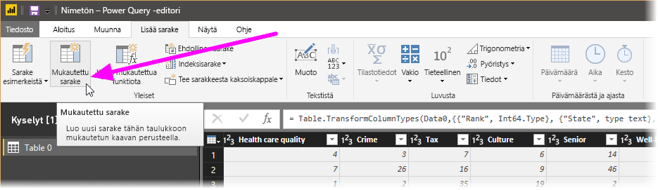

Kirjoita **Mukautettu sarake** -valintaikkunan **Uuden sarakkeen nimi** -kohtaan _New Rank_ ja kirjoita **Mukautettu sarakekaava** -kohtaan seuraava:

    ([Cost of living] + [Weather] + [Health care quality] + [Crime] + [Tax] + [Culture] + [Senior] + [#"Well-being"]) / 8

Varmista, että tilailmoituksessa lukee _Syntaksivirheitä ei ole havaittu._ Valitse sitten **OK**.

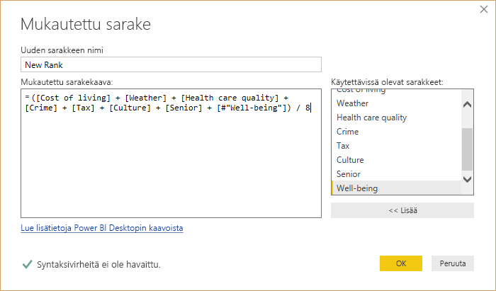

Jotta sarakkeiden tiedot pysyvät johdonmukaisena, muunnamme uudet sarakearvot kokonaisluvuiksi. Voit vaihtaa arvot napsauttamalla sarakeotsikkoa hiiren kakkospainikkeella ja valitsemalla **Muuta tyyppi \> Kokonaisluku**. 

Jos haluat valita useita sarakkeita, valitse ensimmäinen sarake, paina **VAIHTO**-näppäin pohjaan, valitse vierekkäisiä sarakkeita ja vaihda sitten kaikki valitut sarakkeet napsauttamalla hiiren kakkospainikkeella jotain valittua sarakeotsikkoa. Painamalla **CTRL**-näppäintä valitessasi voit valita kerralla useita sarakkeita, jotka eivät ole vierekkäin.

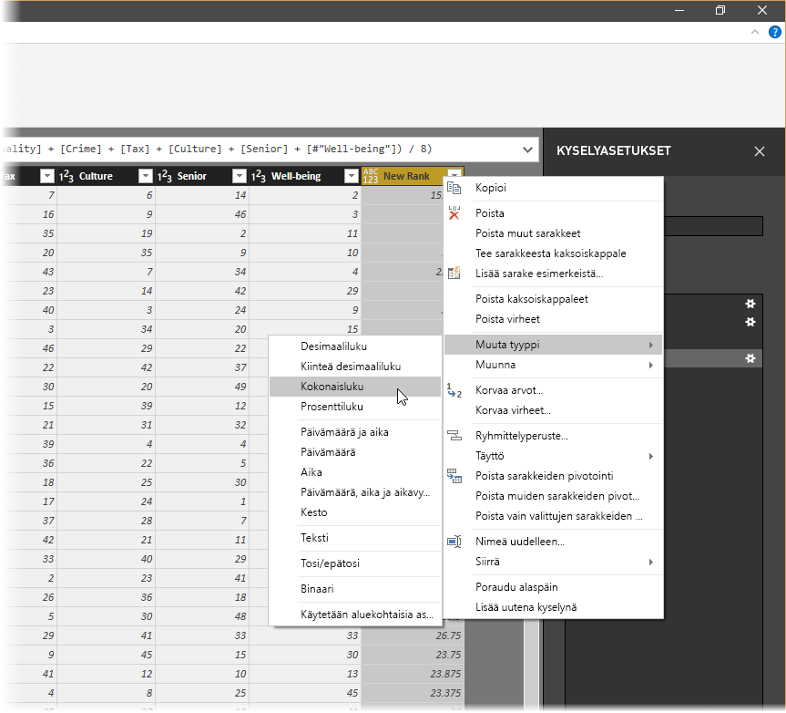

*Muunna*-valintanauhassa voit myös **muuntaa** sarakkeiden tietotyyppejä. Tässä on **Muunna**-valintanauha, jossa on **Tietotyyppi**-painikkeeseen osoittava nuoli. Tällä painikkeella voit muuntaa tietotyypin toiseksi.

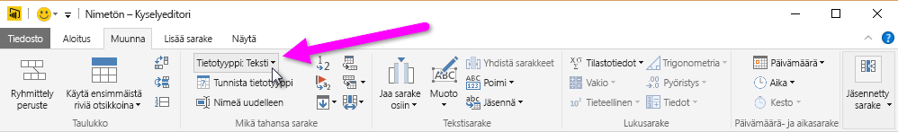

Ota huomioon, että kaikki tietojen muotoiluvaiheet kirjataan **Kyselyasetukset**-ruudun **Käytössä olevat vaiheet** -kohtaan. Jos haluat poistaa vaiheen muotoiluprosessista, valitse haluamasi vaiheen vasemmalta puolelta **X**. Seuraavassa kuvassa **Käytössä olevat vaiheet** -kohta näyttää tähän mennessä määritetyt vaiheet: yhdistämisen verkkosivustoon (**Source**), taulukon valinnan (**Navigation**) ja sen, että taulukon lataamisen yhteydessä kyselyeditori vaihtoi automaattisesti tekstipohjaisten lukusarakkeiden *Teksti*-tietotyypin *Kokonaisluku*-tietotyypiksi (**Changed Type**). Viimeiset kaksi vaihetta näyttävät edelliset toimintamme, jotka olivat **Added Custom** ja **Changed Type1**. 

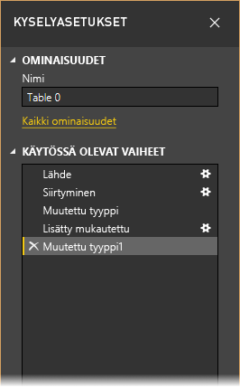

Ennen kuin voimme käyttää tätä kyselyä, meidän täytyy tehdä muutama muutos, jotta saamme sen tiedot sinne, minne haluamme:

* *Sijoitusten muokkaaminen poistamalla sarake*: Olemme päättäneet, että asuinkustannuksilla eli **Cost of living** -sarakkeella ei ole vaikutusta tuloksissa. Kun poistamme sarakkeen, ongelmana on se, että tiedot pysyvät ennallaan. Tämän korjaaminen on kuitenkin helppoa Power BI Desktopilla. Samalla voimme myös esitellä kyselyn **Käytössä olevat vaiheet** -kohdan erästä kätevää toimintoa.
* *Muutaman virheen korjaaminen*: Koska poistimme sarakkeen, meidän täytyy muokata **New Rank** -sarakkeen laskelmia. Tämä tarkoittaa myös kaavan muuttamista.
* *Tietojen lajitteleminen*: tiedot lajitellaan **New Rank**- ja **Rank**-sarakkeiden perusteella. 
* *Tietojen korvaaminen*: näytämme, miten voit korvata tietyn arvon ja miksi **käytössä oleva vaihe** täytyy lisätä.
* *Taulukon nimen vaihtaminen*: **Table 0** ei ole kuvaava nimi, mutta nimen vaihtaminen on yksinkertaista.

Jos haluat poistaa **Cost of living** -sarakkeen, valitse sarake ja valitse valintanauhan **Aloitus**-välilehdestä **Poista sarakkeet**, kuten seuraavassa kuvassa.

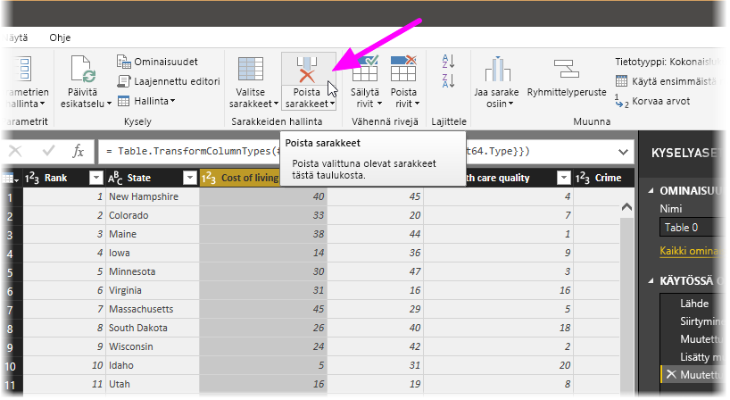

Huomaat, että _New Rank_ -arvot eivät ole muuttuneet. Tämä johtuu vaiheiden järjestyksestä. Koska kyselyeditori kirjaa vaiheet järjestyksessä ja silti toisistaan riippumatta, voit siirtää kutakin **käytössä olevaa vaihetta** järjestyksessä aiemmaksi tai myöhemmäksi. Kun napsautat mitä tahansa vaihetta hiiren kakkospainikkeella kyselyeditorissa, näyttöön avautuu valikko, jossa voit **nimetä uudelleen**, **poistaa**, **poistaa** **loppuun saakka** (tämä poistaa valitun vaiheen ja kaikki sitä myöhemmät vaiheet), **siirtää ylös** ja **siirtää alas**. Siirrä nyt viimeinen vaihe eli _Removed Columns_ _Added Custom_ -vaiheen yläpuolelle.

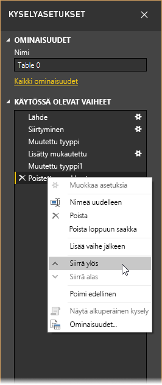

Valitse sitten _Added Custom_ -vaihe. Huomaat, että tiedoissa näkyy nyt _virhe_, joka meidän täytyy korjata. 

Voit hankkia lisätietoa eri virheistä muutamin tavoin. Voit valita solun (napsauttamatta **Virhe**-sanaa) tai napsauttaa suoraan **Virhe**-sanaa. Jos valitset solun *napsauttamatta* suoraan **Virhe**-sanaa, kyselyeditori näyttää virhetiedot ikkunan alareunassa.

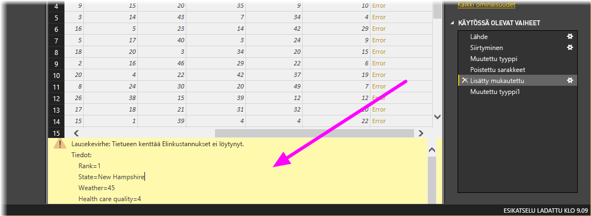

Jos napsautat *Virhe*-sanaa suoraan, kyselyeditori luo **käytössä olevan vaiheen** **kyselyasetusten** ruutuun ja näyttää tiedot virheestä. Emme halua toimia näin, joten valitse **Peruuta**.

Voit korjata virheet valitsemalla _New Rank_ -sarakkeen, näyttämällä sarakkeen tiedot avaamalla **Näytä**-valintanauhan ja valitsemalla **Kaavarivi**-valintaruudun. 

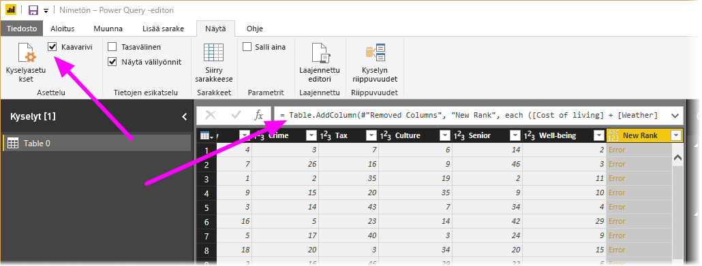

Voit nyt pienentää _Cost of living_ -parametrin ja pienentää jakajan muuttamalla kaavan seuraavaan muotoon: 

    Table.AddColumn(#"Removed Columns", "New Rank", each ([Weather] + [Health care quality] + [Crime] + [Tax] + [Culture] + [Senior] + [#"Well-being"]) / 7)

Valitse kaavaruudun vieressä oleva vihreä valintamerkki tai paina **Enteriä**. Tämän pitäisi korvata tiedot muutetuilla arvoilla, jolloin **Added Custom** -vaiheen pitäisi olla valmis *ilman virheitä*.

> [!NOTE]
> Voit myös **poistaa virheitä** (valintanauhan tai hiiren kakkospainikevalikon avulla). Tämä poistaa kaikki rivit, joilla on virheitä. Tässä tapauksessa tämä olisi poistanut kaikki rivit tiedoistamme, mitä emme halua, sillä haluamme pitää kaikki tiedot taulukossa.

Nyt meidän täytyy lajitella tiedot **New Rank**-sarakkeen perusteella. Valitse ensin viimeisin käytetty vaihe eli **Changed Type1**, jotta pääset uusimpiin tietoihin. Valitse sitten avattava valikko **New Rank** -sarakeotsikon vierestä ja valitse **Lajittele nousevaan järjestykseen**.

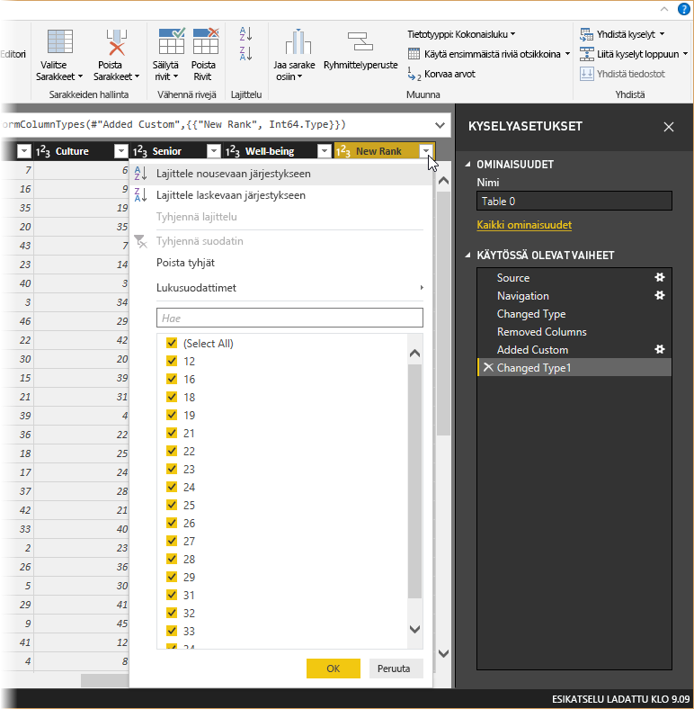

Näet, että tiedot lajitellaan nyt **New Rank** -sarakkeen perusteella.  Jos taas katsot **Rank**-saraketta, näet, että tietoja ei lajitella oikein kohdissa, joissa **New Rank** -arvo on tasapeli. Voit korjata tämän valitsemalla **New Rank** -sarakkeen ja vaihtamalla sitten **kaavarivin** kaavan seuraavaan muotoon:

    = Table.Sort(#"Changed Type1",{{"New Rank", Order.Ascending},{"Rank", Order.Ascending}})

Valitse kaavaruudun vieressä oleva vihreä valintamerkki tai paina **Enteriä**. Rivien pitäisi nyt olla järjestettynä sekä _New Rank_- että _Rank_-sarakkeiden mukaisesti.

Voit myös valita **käytössä olevan vaiheen** luettelon mistä tahansa kohdasta ja jatkaa tietojen muotoilua järjestyksen tässä kohdassa. Kyselyeditori lisää automaattisti uuden vaiheen tällä hetkellä valitun **käytössä olevan vaiheen** perään. Kokeillaan tätä.

Valitse ensin **käytössä oleva vaihe**, joka edeltää mukautetun sarakkeen lisäämistä. Tässä tapauksessa se on _Removed Columns_ -vaihe. Korvaamme tässä _Weather_-sijoituksen arvon Arizonassa. Napsauta hiiren kakkospainikkeella solua, joka sisältää Arizonan _Weather_-sijoituksen. Valitse sitten näyttöön avautuvasta valikosta *Korvaa arvot...* Tarkista, mikä **käytössä oleva vaihe** on tällä hetkellä valittuna (vaihe ennen _Added Custom_ -vaihetta).

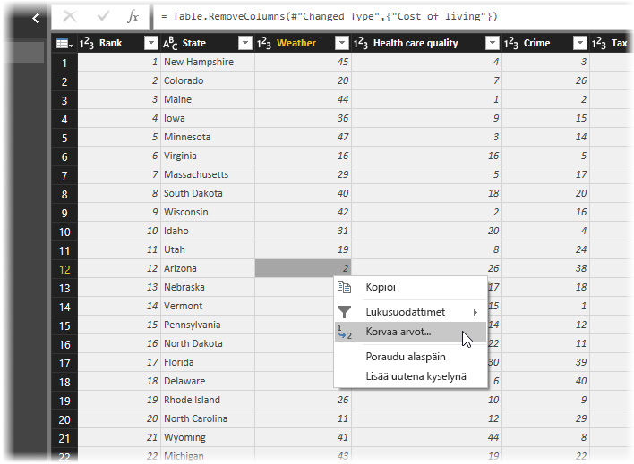

Koska lisäämme vaiheen, kyselyeditori varoittaa tämän vaaroista: myöhemmät vaiheet voivat tehdä kyselystä rikkinäisen. Tässä täytyy toimia harkitusti ja varoen! Koska tämä on opetusohjelma ja koska olemme esittelemässä kyselyeditorin kätevää toimintoa, jolla voit luoda, poistaa ja lisätä vaiheita sekä muokata niiden järjestystä, valitsemme tässä nyt **Lisää**.

Vaihda arvoksi _51_. Tämä korvaa Arizonan tiedot. Kun luot uutta käytössä olevaa vaihetta, kyselyeditori nimeää sen toiminnon mukaisesti: tässä tapauksessa nimeksi tulee **Replaced Value** Jos sinulla kyselyssä useita vaiheita, joilla on sama nimi, kyselyeditori lisää jokaiseen myöhempään **käytettyyn vaiheeseen** nimen loppuun järjestysnumeron, jotta erotat vaiheet toisistaan.

Valitse nyt viimeinen **käytetty vaihe** (_Sorted Rows_), niin näet, että tiedot muuttuvat Arizonan uuden sijoituksen mukaisesti.  Tämä johtuu siitä, että lisäsimme _Replaced Value_ -vaiheen oikeaan paikkaan ennen _Added Custom_ -vaihetta.

Tämä on hyvä esimerkki siitä, kuinka tehokas ja monipuolinen kyselyeditori voi olla.

Lopuksi haluamme vaihtaa taulukon nimeksi paremmin kuvaavan nimen. Kun ryhdyt luomaan raportteja, taulukoiden nimien kannattaa olla kuvaavia. Tämä pätee etenkin silloin, jos muodostat yhteyden useisiin tietolähteisiin ja kaikkien taulukoiden nimet luetellaan **raporttinäkymän** **Kentät**-ruudussa.

Taulukon nimen vaihtaminen on helppoa: kirjoita **Kyselyasetukset**-ruudun **Ominaisuudet**-kohdassa uusi nimi taulukolle, kuten seuraavassa kuvassa näytetään, ja paina sitten **Enteriä**. Anna tälle taulukolle nimeksi *RetirementStats*.

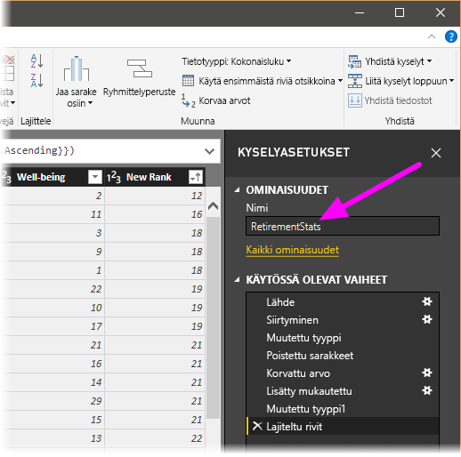

Nyt olemme muotoilleet tietoja tarpeeksi. Seuraavaksi muodostamme yhteyden toiseen tietolähteeseen ja yhdistämme tiedot.

## Tietojen yhdistäminen
Nämä tiedot eri osavaltioista ovat mielenkiintoisia. Niistä on myös hyötyä muidenkin analyysien ja kyselyiden luomisessa. Tässä on kuitenkin yksi ongelma: suurin osa saatavilla olevista tiedoista käyttää kaksikirjaimisia osavaltiolyhenteitä, ei osavaltioiden koko nimiä. Meidän täytyy siis yhdistää osavaltioiden nimet ja niiden lyhenteet.

Meillä on kuitenkin onnea, sillä eräs toinen julkinen tietolähde tekee juuri tämän, mutta sen tiedot vaativat suhteellisen paljon muotoilua, ennen kuin voimme yhdistää ne tähän eläköitymistaulukkoomme. Tässä on osavaltiolyhenteiden verkkoresurssi:

<http://en.wikipedia.org/wiki/List_of_U.S._state_abbreviations>

Valitse kyselyeditorin **Aloitus**-valintanauhasta **Uusi lähde \> Verkko**, kirjoita osoite ja valitse **Yhdistä**. Näin siirtymistoiminto näyttää tiedot, jotka verkkosivulta löytyvät.

 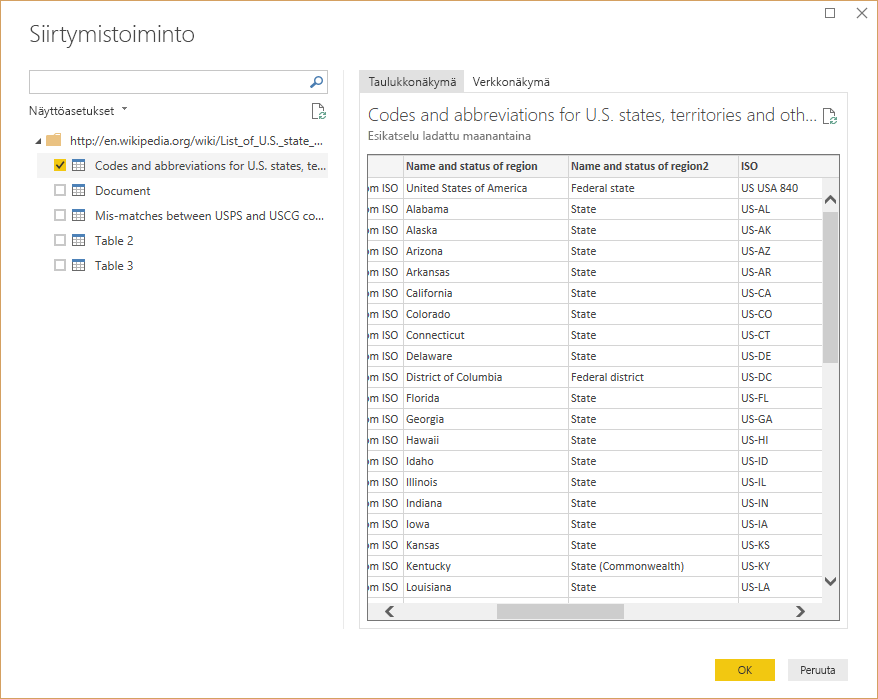

Valitse **Koodit ja lyhenteet...**, koska haluamme käyttää tällaisia tietoja. Tietoja täytyy kuitenkin muotoilla melko paljon, ennen kuin voimme yhdistää taulukon tiedot haluamallamme tavalla.

> [!TIP]
> Onko alla lueteltujen vaiheiden suorittamiseen jokin nopeampi tai helpompi tapa? Kyllä, voit luoda kahden taulukon välille *suhteen* ja muotoilla tietoja sitten tämän suhteen perusteella. Seuraavista vaiheista on kuitenkin hyötyä, kun opettelet taulukoiden käyttöä, mutta kannattaa muistaa, että suhteiden avulla käyttää nopeasti tietoja useista taulukoista.
> 
> 

Muotoilemme nämä tiedot käyttökelpoiseen muotoon seuraavasti:

* Poista ylin rivi: Se on seurausta tavasta, jolla verkkosivun taulukko on luotu, mutta emme tarvitse ylintä riviä. Valitse **Aloitus**-valintanauhasta **Vähennä rivejä \> Poista rivit \> Poista ylimmät rivit**.

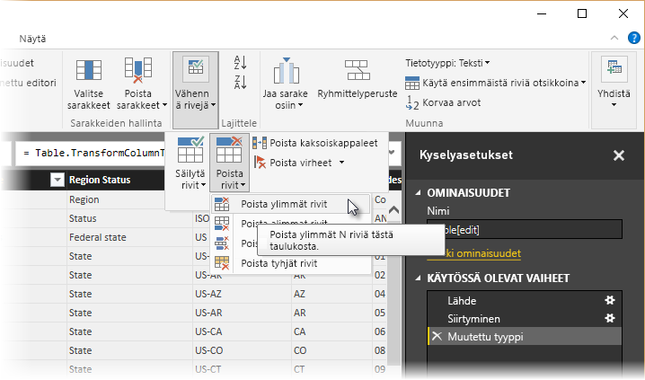

Näyttöön avautuu **Poista ylimmät rivit** ikkuna, jossa voit määrittää, montako riviä haluat poistaa.

>[!NOTE]
>Jos Power BI tuo vahingossa taulukko-otsikot rivinä tietotaulukkoosi, voit korjata taulukkosi valitsemalla valintanauhan **Aloitus**- tai **Muunna**-välilehdestä **Käytä ensimmäistä riviä otsikkoina**.

* Poista alimmat 26 riviä, sillä ne ovat kaikki alueita, joita meidän ei tarvitse sisällyttää mukaan. Valitse **Aloitus**-valintanauhasta **Vähennä rivejä \> Poista rivit \> Poista alimmat rivit**.

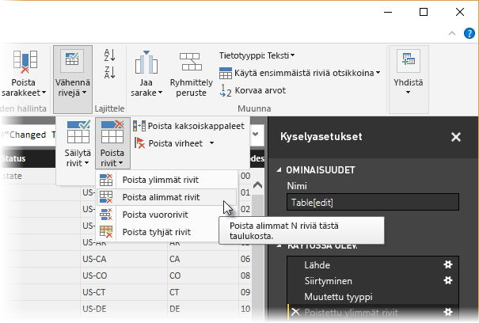

* Koska RetirementStats-taulukko ei sisällä Washington DC:n tietoja, meidän täytyy suodattaa se luettelostamme. Valitse avattavan valikon nuoli Region Status -sarakkeen vierestä ja poista sitten **Federal district** -kohdan valintaruutu.

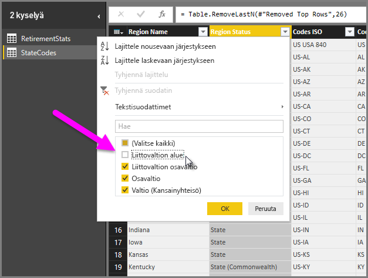

* Poista muutamat tarpeettomat sarakkeet: Meidän täytyy yhdistää vain osavaltio sen viralliseen kaksikirjaimiseen lyhenteeseen, joten voit poistaa sarakkeet **Column1**, **Column3**, **Column4** ja sitten sarakkeet väliltä **Column6**–**Column11**. Valitse ensin **Column1**, paina **CTRL**-näppäin pohjaan ja valitse sitten muut poistettavat sarakkeet (näin voit valita useita sarakkeita, jotka eivät ole kiinni toisissaan). Valitse valintanauhan Aloitus-välilehdestä **Poista sarakkeet \> Poista sarakkeet**.

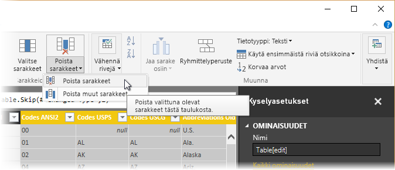

>[!NOTE]
>Tämä on hyvä hetki huomauttaa, että kyselyeditorissa käytettyjen vaiheiden *järjestys* on tärkeä. Se voi myös vaikuttaa tietojen muotoiluun. On tärkeää huomioida se, miten yksi vaihe voi vaikuttaa toiseen myöhempään vaiheeseen. Jos poistat vaiheen käytetyistä vaiheista, myöhemmät vaiheet eivät ehkä toimi niin kuin alun perin tarkoitit, koska vaiheen poistaminen kyselyn vaihejärjestyksestä vaikuttaa muihin vaiheisiin.

>[!NOTE]
>Kun pienennät kyselyeditorin ikkunaa kapeammaksi, jotkin valintanauhan kohteet tiivistetään, jotta näkyvissä oleva tila on käytössä mahdollisimman tehokkaasti. Kun levennät kyselyeditorin ikkunaa, valintanauhan kohteet laajentuvat, jotta valintanauhan suurempi tila saadaan paremmin käyttöön.

* Nimeä sarakkeet ja itse taulukko uudelleen. Totuttuun tapaan voit vaihtaa sarakkeen nimeä eri tavoin: valitse ensin sarake ja valitse sitten valintanauhan **Muunna**-välilehdestä **Nimeä uudelleen** tai napsauta saraketta hiiren kakkospainikkeella ja valitse sitten **Nimeä uudelleen...** valikossa, joka näyttöön avautuu. Seuraavassa kuvassa on nuolet, jotka osoittavat molempiin toimintoihin, mutta sinun tarvitsee käyttää vain toista.

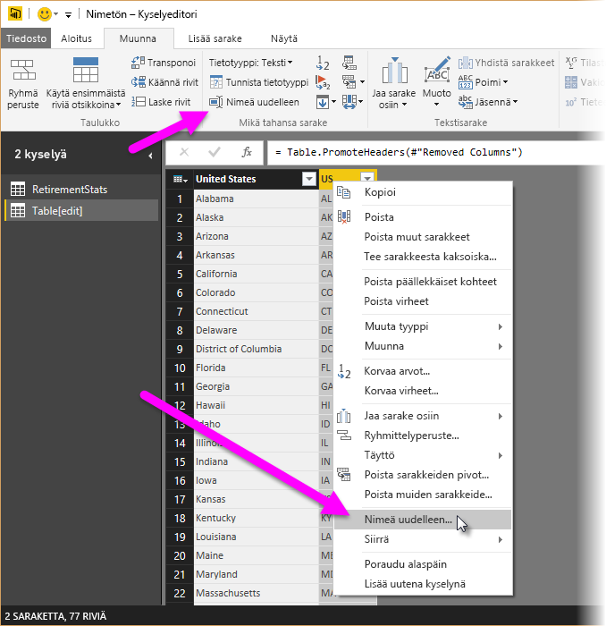

Anna uusiksi nimiksi *State Name* ja *State Code*. Voit vaihtaa taulukon nimeä kirjoittamalla uuden nimen **Kyselyasetukset**-ruudun **Nimi**-ruutuun. Anna tälle taulukolle nimeksi *StateCodes*.

Nyt kun olemme muotoilleet StateCodes-taulukon haluamallamme tavalla, voimme yhdistää nämä kaksi taulukkoa (tai kyselyä) yhdeksi. Koska taulukot, jotka meillä nyt ovat, ovat tulos kyselyistä, jotka suoritimme tiedoille, niitä kutsutaan usein *kyselyiksi*.

Kyselyitä voi yhdistää kahdella tavalla: *yhdistämällä* tai *loppuun liittämällä*.

Jos sinulla on sarake tai sarakkeita, jonka tai jotka haluat lisätä toiseen kyselyyn, **yhdistä** kyselyt. Jos sinulla on lisärivejä tietoja, jotka haluat lisätä olemassa olevaan kyselyyn, **liitä ne kyselyn loppuun**.

Tässä tapauksessa haluamme yhdistää kyselyt. Aloita valitsemalla kyselyeditorin vasemmasta ruudusta kysely, *johon* haluat yhdistää toisen kyselyn. Tässä tapauksessa se on *RetirementStats*. Valitse sitten valintanauhan **Aloitus\>-välilehdestä** Yhdistä  **Yhdistä kyselyt**.

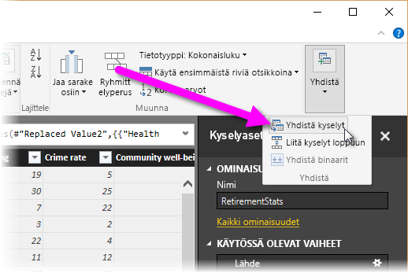

Sinua saatetaan pyytää määrittämään yksityisyystaso. Näin varmistetaan, että tiedot yhdistetään siten, että sisällytä tai siirrä tietoja, joita et halua.

Seuraavaksi näyttöön avautuu **Yhdistä**-ikkuna, jossa sinulta kysytään, minkä taulukon haluat yhdistää valittuun taulukkoon. Sinua pyydetään myös määrittämään yhdistämisen vastaavat sarakkeet. Valitse *RetirementStats*-taulukosta (kysely) State-sarake ja valitse sitten *StateCodes*-kysely (tämä on tässä tapauksessa helppoa, koska muita kyselyitä on vain yksi, mutta kun yhdistettynä on useita tietolähteitä, valittavissa olevia kyselyitä on paljon). Kun valitsemme oikeat vastaavat sarakkeet (**State**-sarake *RetirementStats*-taulukosta ja **State Name** -sarake *StateCodes*-taulukosta), **Yhdistä**-ikkuna näyttää seuraavankaltaisella. Myös **OK**-painike on käytettävissä.

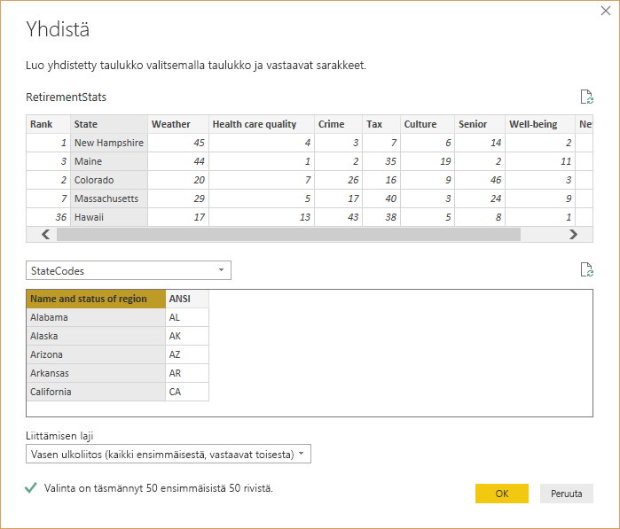

Kyselyn loppuun luodaan **NewColumn**, joka sisältää sen taulukon (kyselyn) sisällön, joka yhdistettiin olemassa olevaan kyselyyn. Kaikki yhdistetyn kyselyn sarakkeet tiivistetään **NewColumn**-sarakkeeseen, mutta voit **laajentaa** taulukon ja sisällyttää haluamasi sarakkeet.

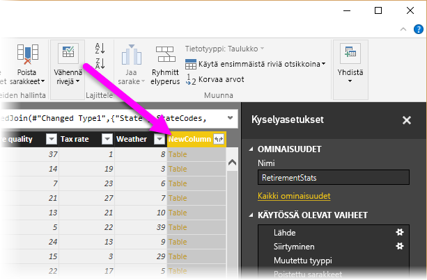

Jos haluat laajentaa yhdistetyn taulukon ja valita sisällytettävät sarakkeet, valitse laajennuskuvake (). Näyttöön avautuu **Laajenna**-ikkuna.

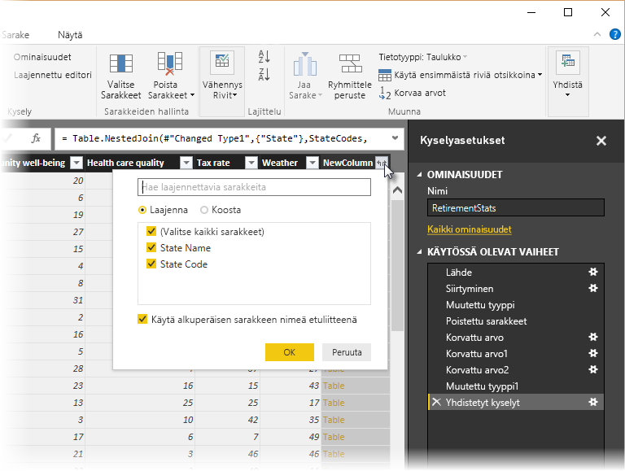

Tässä tapauksessa haluamme vain **State Code** -sarakkeen, joten valitse se ja valitse sitten **OK**. Poista Käytä alkuperäisen sarakkeen nimeä etuliitteenä -valintaruudun valinta, koska et halua tätä. Jos jätät tämän valituksi, yhdistetyn sarakkeen nimi olisi **NewColumn.State Code** (alkuperäisen sarakkeen nimi eli **NewColumn**, sitten piste ja sitten kyselyyn tuodun sarakkeen nimi).

>[!NOTE]
>Haluatko kokeilla eri tapoja tuoda tämä **NewColumn**-taulukko? Voit kokeilla eri tapoja. Jos et pidä tuloksista, poista kyseinen vaihe **Kyselyasetukset**-ruudun **käytössä olevien vaiheiden** luettelosta. Tämä palauttaa kyselysi tilaan, jossa se oli ennen tätä **laajennusvaihetta**. Voit siis kokeilla eri tapoja vapaasti niin monta kertaa kuin haluat, kunnes saat laajennusprosessista haluamasi kaltaisen.

Nyt meillä on yksi kysely (taulukko), joka yhdistää kaksi tietolähdettä, jotka kummatkin on muotoiltu tarpeidemme mukaisesti. Tämän kyselyn pohjalta voit luoda paljon muitakin kiinnostavia tietoyhteyksiä, esimerkiksi asumiskuluista, demografisista tiedoista tai työmahdollisuuksista missä tahansa osavaltiossa.

Ota muutokset käyttöön ja sulje kyselyeditori valitsemalla valintanauhan **Aloitus**-välilehdeltä **Sulje ja ota käyttöön**. Muunnettu tietojoukko näytetään Power BI Desktopissa, jossa voit luoda raportteja sen pohjalta.

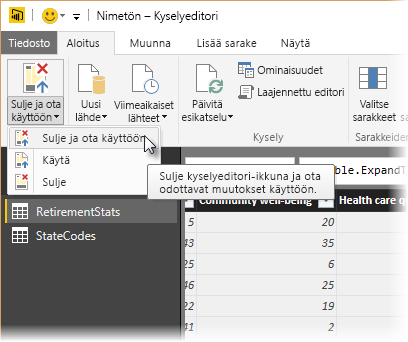

## Seuraavat vaiheet
Voit tehdä kaikenlaista Power BI Desktopilla. Saat lisätietoja sen toiminnoista seuraavista resursseista:

* [Mikä on Power BI Desktop?](desktop-what-is-desktop.md)
* [Power BI Desktopin kyselyiden yleiskatsaus](desktop-query-overview.md)
* [Power BI Desktopin tietolähteet](desktop-data-sources.md)
* [Tietoihin yhdistäminen Power BI Desktopissa](desktop-connect-to-data.md)
* [Yleiset kyselytehtävät Power BI Desktopissa](desktop-common-query-tasks.md)   

