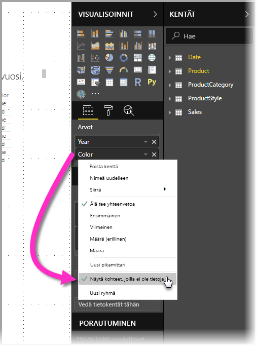
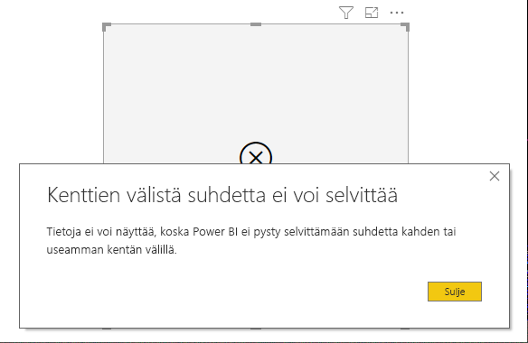

# Power BI:n Näytä kohteet, joilla ei ole tietoja -ominaisuus

Power BI:n avulla voit visualisoida kaikenlaisia tietoja eri lähteistä. Kun luot visualisointia, Power BI näyttää vain merkitykselliset tiedot, jotta tietojen esittämis- ja näyttötapa pysyy hallinnassa. Power BI valitsee merkitykselliset tiedot visualisoinnin määritysten ja pohjana käytetyn tietomallin perusteella. Tässä artikkelissa kuvataan, miten Power BI määrittää tietojen merkityksellisyyden, ja annetaan esimerkkejä, jotka kuvaavat, miten määritykset tehdään.

## Merkityksellisten tietojen määrittäminen

Yksinkertaisen taulukkoesimerkin avulla on helppo alkaa tutustua tapaan, jolla Power BI määrittää, mitkä tiedot ovat merkityksellisiä ja tulee siis näyttää. Tarkastele artikkelin lopusta löytyvässä esimerkkiosiossa olevaa mallia. Oletetaan, että sinun olisi luotava taulukko, jossa käytetään seuraavia asetuksia:

**1. Ryhmät, jotka ovat peräisin samasta taulukosta:** *Product[Color] – Product[Size]*

|*Product[Color]*  |*Product[Size]*  |
|---------|---------|
|Sininen     |Suuri         |
|Sininen     |Keskikokoinen         |
|Sininen     |Pieni         |
|Punainen     |Suuri         |

Tässä esimerkissä Power BI näyttää *[Color-Size]*-yhdistelmät, jotka esiintyvät taulukossa *[Product]*. 

Valitaan seuraavaksi erilainen yhdistelmä:

**2. Ryhmät, jotka ovat peräisin eri taulukoista, jotka liittyvät toisiinsa suoraan, sekä mittayksikkö:** *ProductStyle[Finish] – Product[Color] – Sum(Sales[Quantity])*

|*ProductStyle[Finish]*  |*Product[Color]*  |*[SumQuantity]*  |
|---------|---------|---------|
|Kiiltävä     |Sininen         |10         |
|Matta     |Sininen         |15         |

Tässä esimerkissä Power BI näyttää vain ne yhdistelmät, jotka ovat olemassa. Se ei esimerkiksi näytä yhdistelmää ("Ei mitään" + "Sininen") tai ("Matta" + "Punainen"), koska kyseisiä yhdistelmiä ei ole mallissa. Ehto, jolla määritetään, mitkä yhdistelmät ovat olemassa, on, että *Sum(Sales[Quantity])*-arvo ei ole tyhjä.

Katsotaanpa erilaista tapausta: 

**3. Ryhmät, jotka ovat peräisin eri taulukoista, jotka liittyvät toisiinsa, ilman mittayksikköä:** *ProductStyle[Finish] – Product[Color]*

|*ProductStyle[Finish]*  |*Product[Color]*  |
|---------|---------|
|Kiiltävä     |Sininen         |
|Kiiltävä     |Punainen         |
|Matta     |Sininen         |

Koska eksplisiittistä mittayksikköä ei ole ja taulukot liittyvät suoraan toisiinsa, Power BI yrittää lisätä mittayksikön rajoittaakseen tuloksena olevia yhdistelmiä. Tässä tapauksessa Power BI lisää *CALCULATE(COUNTROWS('Product'))*-mittayksikön, jonka arvo ei saa olla tyhjä, koska *Product*-taulukko on yhteinen molemmille taulukoille.

Siispä Power BI näyttää yhdistelmät, joilla on tietoja Product-taulukossa, eli jättää pois yhdistelmät *(”Ei mitään” + ”Sininen”)* ja *(”Matta” + ”Punainen”)*.

**4. Ryhmät, jotka ovat peräisin eri taulukoista, jotka eivät liity toisiinsa**

Esimerkkinä käytetyssä mallissa ei ole tällaista yhdistelmää, mutta jos käsiteltävänä olisi ryhmiä eri taulukoista, jotka eivät liity toisiinsa, Power BI ei pystyisi liittämään kahta saraketta toisiinsa. Tuloksena olisi kummankin sarakkeen kaikkien arvojen ristiliitos. Tässä tilanteessa Power BI ilmoittaa *rajoittamattoman liitoksen* tyyppisestä virheestä, koska tällaisten ristiliitosten käsittely tietokannassa on raskasta eivätkä ne tarjoa kovinkaan paljon tietoa käyttäjälle. 

## Tietoja sisältämättömien kohteiden näyttäminen

Edellisessä osiossa kuvataan, miten Power BI määrittää, mitkä tiedot kannattaa näyttää. Toisinaan saatat kuitenkin *haluta* näyttää kohteita, jotka eivät sisällä tietoja. 

Tämä onnistuu **Näytä kohteet, joilla ei ole tietoja** -ominaisuuden avulla: voit sisällyttää esitykseen tietorivit ja sarakkeet, jotka eivät sisällä mittayksikkötietoja (tyhjät mittayksikön arvot).

Jos haluat ottaa **Näytä kohteet, joilla ei ole tietoja** -ominaisuuden käyttöön, valitse visualisointi, napsauta **Kentät**-osiosta haluamaasi kenttää hiiren kakkospainikkeella ja valitse avautuvasta valikosta **Näytä kohteet, joilla ei ole tietoja** seuraavassa kuvassa esitetyllä tavalla:

**Näytä kohteet, joilla ei ole tietoja** -ominaisuudella *ei* ole vaikutusta seuraavissa tilanteissa:

* Visualisointiin ei ole lisätty mittayksikköä ja ryhmiteltävät sarakkeet ovat peräisin samasta taulukosta.
* Ryhmät eivät liity toisiinsa. Power BI ei suorita kyselyjä visualisoinneille, jotka sisältävät toisiinsa liittymättömiä ryhmiä.
* Mittayksikkö ei liity mihinkään ryhmään. Syynä on, että mittayksikkö ei milloinkaan jää tyhjäksi vain joissakin ryhmien yhdistelmissä.
* Käyttäjän määrittämä mittayksikkösuodatin jättää pois tyhjät mittayksiköt. Esimerkki: *SalesAmount > 0*

### Näytä kohteet, joilla ei ole tietoja -ominaisuuden toiminta

Kiinnostavimpia **Näytä kohteet, joilla ei ole tietoja** -ominaisuuden käyttötapauksia ovat ne, joissa käytetään mittayksiköitä. Tarkastellaanpa tilannetta, jossa ryhmät ovat peräisin samasta taulukosta tai ne voidaan liittää toisiinsa mallissa olevan polun kautta. Esimerkiksi *ProductStyle* liittyy suoraan *Product*-taulukkoon ja epäsuorasti *Sales*-taulukkoon, *ProductStyle* ja *ProductCategory* voidaan yhdistää *Product*-taulukon kautta ja niin edelleen.

Seuraavaksi tarkastellaan muutamaa mielenkiintoista tapausta ja verrataan tilanteita ennen **Näytä kohteet, joilla ei ole tietoja** -ominaisuuden käyttöönottoa ja sen jälkeen. 

**1. Samasta taulukosta peräisin olevien sarakkeiden ryhmittely:** *Product[Color] – Product[Size] – Sum(Sales[Quantity])*

Näkymä, kun **Näytä kohteet, joilla ei ole tietoja** -ominaisuus ei ole käytössä:

|*Product[Color]*  |*Product[Size]*  |*[SumQuantity]*  |
|---------|---------|---------|
|Sininen     |Keskikokoinen         |15         |
|Sininen     |Pieni         |10         |

Näkymä, kun **Näytä kohteet, joilla ei ole tietoja** -ominaisuus on käytössä:

|*Product[Color]*  |*Product[Size]*  |*[SumQuantity]*  |
|---------|---------|---------|
|Sininen     |Suuri         |         |
|Sininen     |Keskikokoinen         |15         |
|Sininen     |Pieni         |10         |
|Punainen     |Suuri         |         |

Huomaa, että näkyviin tuli kaksi uutta yhdistelmää, kun ominaisuus otettiin käyttöön: *Sininen – Suuri* ja *Punainen – Suuri*. Kummallakaan yhdistelmällä ei ole vastaavaa *Quantity*-arvoa *Sales*-taulukossa. Ne kuitenkin näkyvät *Product*-taulukossa.

**2. Toisiinsa liittyvistä taulukoista peräisin olevien sarakkeiden ryhmittely:** *ProductStyle[Finish] – Product[Color] – Sum(Sales[Quantity])*

Näkymä, kun **Näytä kohteet, joilla ei ole tietoja** -ominaisuus ei ole käytössä:

|*ProductStyle[Finish]*  |*Product[Color]*  |*[SumQuantity]*  |
|---------|---------|---------|
|Kiiltävä     |Sininen         |10         |
|Matta     |Sininen         |15         |

Näkymä, kun **Näytä kohteet, joilla ei ole tietoja** -ominaisuus on käytössä:

|*ProductStyle[Finish]*  |*Product[Color]*  |*[SumQuantity]*  |
|---------|---------|---------|
|Kiiltävä     |Sininen         |10         |
|Kiiltävä     |Punainen         |         |
|Matta     |Sininen         |15         |
|Ei mitään     |         |         |

Huomaa, että yhdistelmät *(Kiiltävä – Punainen)* ja *(Ei mitään – tyhjä)* tulivat näkyviin. Ne näytetään seuraavasta syystä:
* Power BI käsitteli ensin ProductStyle[Finish]-kohdan, ja kaikki arvot valittiin näytettäviksi. Tuloksena olivat Kiiltävä, Matta ja Ei mitään.
* Näiden arvojen perusteella Power BI valitsi kaikki vastaavat *Product[Color]*-tiedot. 
* Koska *Ei mitään* -arvo ei vastaa mitään *Product[Color]*-arvoa, se jää tyhjäksi.

On tärkeää huomata, että järjestys vaikuttaa sarakkeiden arvojen valintaan, ja valintamekanismia voidaankin ajatella *vasen ulkoliitos* -toimintona taulukoiden välillä. Jos sarakkeiden järjestystä vaihdetaan, myös tulokset muuttuvat.

Seuraavassa on esimerkki järjestyksen muuttamisesta ja siitä, miten se vaikuttaa tuloksiin. Kyseessä on tämän osion kohde **2**, jonka järjestystä on muutettu.

**Product[Color] – ProductStyle[Finish] – Sum(Sales[Quantity])**

Näkymä, kun **Näytä kohteet, joilla ei ole tietoja** -ominaisuus on käytössä:

|*Product[Color]* |*ProductStyle[Finish]*  |*[SumQuantity]*  |
|---------|---------|---------|
|Sininen     |Kiiltävä         |10         |
|Sininen     |Matta         |15         |
|Punainen     |Kiiltävä         |         |

Huomaa, että tässä tapauksessa *ProductStyle[Finish]-kohdan arvo Ei mitään* ei näy taulukossa. Syynä tähän on se, että Power BI valitsi tällä kertaa ensin kaikki *Color*-arvot *Product*-taulukosta. Tämän jälkeen Power BI valitsi kutakin väriä vastaavat *Finish*-arvot, jotka sisälsivät tietoja. Koska *Ei mitään* ei näy missään *Color*-yhdistelmässä, sitä ei valittu.

## Esimerkkitietomalli

Tämä osio sisältää esimerkkitietomallin, jota on käytetty artikkelin esimerkeissä.

**Malli**: 

**Tiedot**:

|Product[ProductId]|    Product[ProductName]|   Product[Color]| Product[Size]|  Product[CategoryId]|    Product[StyleId]|
|---------|---------|---------|---------|---------|---------|
|1  |Tuote1  |Sininen   |Pieni  |1  |1 |
|2  |Tuote2  |Sininen   |Keskikokoinen |2  |2 |
|3  |Tuote3  |Punainen    |Suuri  |1  |1 |
|4  |Tuote4  |Sininen   |Suuri  |2  |2 |

|ProductCategory[CategoryId]|   ProductCategory[CategoryName]|
|---------|---------|
|1  |Puhelin   |
|2  |Kamera |
|3  |TV |

|ProductStyle[StyleId]| ProductStyle[Finish]|   ProductStyle[Polished]|
|---------|---------|---------|
|1  |Kiiltävä  |Kyllä |
|2  |Matta  |Ei |
|3  |Ei mitään   |Ei |

|Sales[SaleId]| Sales[ProductId]|   Sales[Date]|    Sales[Quantity]|
|---------|---------|---------|---------|
|1  |1  |1.1.2012 0.00| 10 |
|2  |2  |1.1.2013 0.00| 15 |

## Seuraavat vaiheet

Tässä artikkelissa on kuvattu, miten voit ottaa **Näytä kohteet, joilla ei ole tietoja** -ominaisuuden käyttöön Power BI:ssä. Voit olla kiinnostunut myös seuraavista artikkeleista: 

* [Power BI:n monidimensiomallien oletusjäsen](desktop-default-member-multidimensional-models.md)
