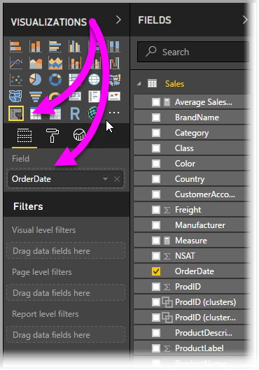
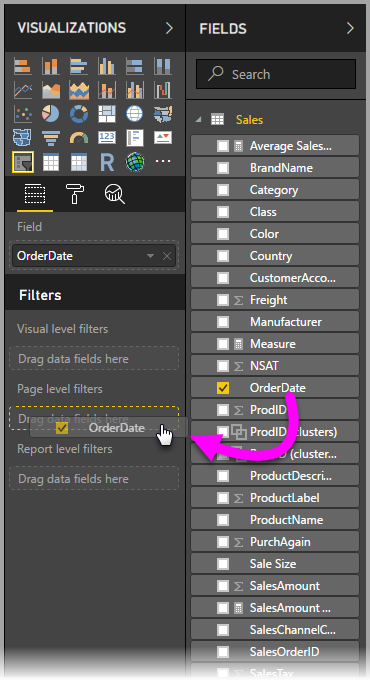

# Suhteellisen päivämääräosittajan ja -suodattimen käyttö Power Bi Desktopissa
**Suhteellisen päivämääräosittajan** tai **suhteellisen päivämääräsuodattimen** avulla voit käyttää aikasidonnaisia suodattimia missä tahansa tietomallisi päivämääräsarakkeessa. Voit esimerkiksi käyttää **suhteellisen päivämäärän osittajaa** näyttääksesi vain viimeisten 30 päivän (tai kuukauden tai kalenterikuukausien jne.) aikana tapahtuneen myynnin tiedot. Kun päivität tiedot, suhteellinen ajanjakso käyttää automaattisesti soveltuvaa suhteellisen päivämäärän rajoitusta.

## Suhteellisen päivämääräalueen osittajan käyttäminen
Voit käyttää suhteellisen päivämäärän osittajaa kuten mitä muuta tahansa osittajaa. Luo yksinkertaisesti **osittaja**raportillesi ja valitse sitten päivämääräarvo **Kenttä**-arvoksi. Seuraavassa kuvassa valittuna on *OrderDate*-kenttä.

Valitse **suhteellisen päivämäärän osittajan** oikeassa yläkulmassa oleva merkki, jolloin näytölle avautuu valikko.

Valitse *Suhteellinen* suhteellisen päivämäärän osittajaa varten.

Voit sitten valita haluamasi asetukset. *Suhteellisen päivämäärän osittajan* ensimmäisessä pudotusvalikossa on seuraavat vaihtoehdot:

* Viimeinen
* Seuraava
* Tämä

Nämä valinnat on esitetty seuraavassa kuvassa.

*Suhteellisen päivämäärän osittajan* seuraavat (keskimmäiset) asetukset sallivat numeron kirjoittamisen suhteellisen päivämääräalueen määrittelemiseksi.

Kolmannen asetuksen avulla voit valita päivämäärämitan. Sinulla on seuraavat vaihtoehdot:

* Päivät
* Viikot
* Viikot (kalenteri)
* Kuukautta
* Kuukaudet (kalenteri)
* Vuodet
* Vuodet (kalenteri)

Nämä valinnat on esitetty seuraavassa kuvassa.

Jos valitset tästä luettelosta vaihtoehdon *Kuukaudet* ja syötät keskimmäiselle asetukselle arvon 2, tapahtuu seuraavaa: jos päivämäärä on esimerkiksi 20.7., osittajan rajoittamassa taulukossa näytetään tiedot kahdelta edeltävältä kuukaudelta, alkaen 20.5. ja jatkuen aina 20.7. eli kyseisen päivän päivämäärään asti.

Toisaalta, jos valitsit *Kuukaudet (Kalenteri)* rajoitettu näyttö esittäisi tiedot 1.5. - 30.6. (viimeiset kaksi täyttä kalenterikuukautta).

## Suhteellisen päivämääräalueen suodattimen käyttäminen
Voit myös luoda raporttisivullesi tai koko raportillesi suhteellisen päivämääräalueen suodattimen. Tee niin raahaamalla päivämääräkentän **sivutason suodattimien** tai **raporttitason alueen suodattimien** alueille **Kenttä**-ruudussa, kuten seuraavassa kuvassa on esitetty.

Kun suodatin on luotu, voit muuttaa suhteellista päivämääräaluetta samalla tavalla kuin **suhteellisen päivämäärän osittajaa**. Valitse **Suodatintyypin** pudotusvalikosta **Suhteellisen päivämäärän suodatus**.

Kun **Suhteellisen päivämäärän suodatus** on valittu, näet kolme muokattavaa kohtaa, mukaan lukien numerolaatikon keskellä, aivan kuten osittajankin kohdalla.

Sen enempää ei tarvita, jotta voisit käyttää näitä suhteellisen päivämäärän rajoituksia raporteissasi.

## Rajoitukset ja huomioitavat asiat
**Suhteellisen päivämäärän osittajaa** ja suodatinta koskevat seuraavat rajoitukset ja huomioon otettavat seikat.

* **Power BI:n** tietomallit eivät sisällä aikavyöhyketietoja. Mallit voivat tallentaa aikoja, mutta niistä ei selviä mistä aikavyöhykkeestä on kyse.
* Osittaja ja suodatin perustuvat aina aikaan UTC-muodossa, joten jos muokkaat suodatinta raportissa ja lähetät sen toisella aikavyöhykkeellä olevalle kollegalle, näette molemmat saman ajan. Toisaalta, jos et ole UTC-aikavyöhykkeellä, saatat nähdä eri aikasiirtymän mukaisia tietoja kuin oletit.
* Paikallisen aikavyöhykkeen ajan mukaisesti talletetut tiedot voidaan muuttaa UTC-ajaksi **Kyselyeditoria** käyttäen.

