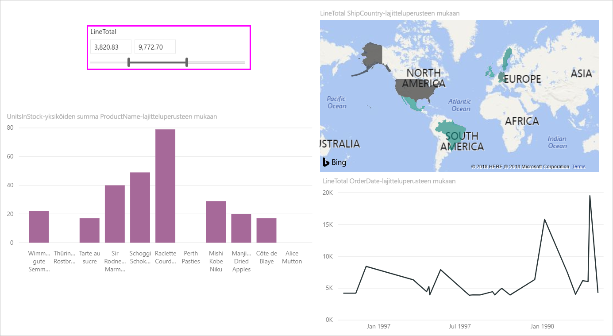
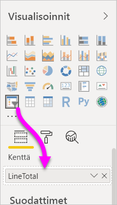
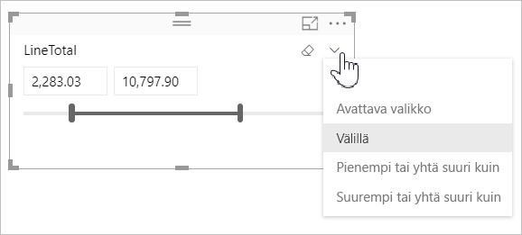
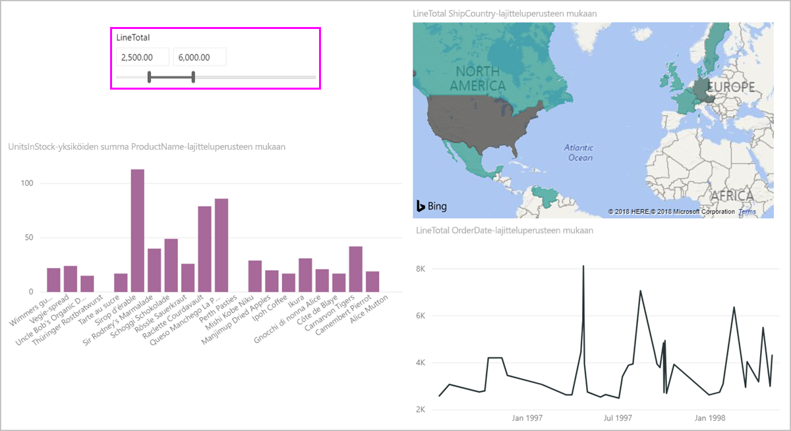
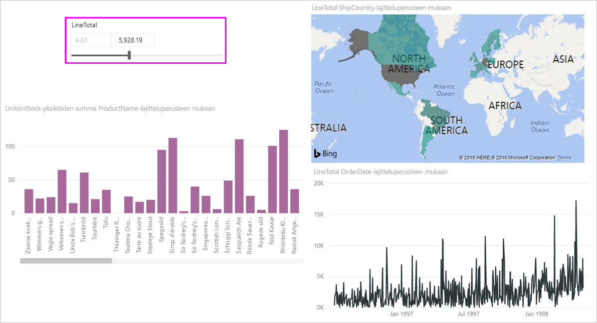
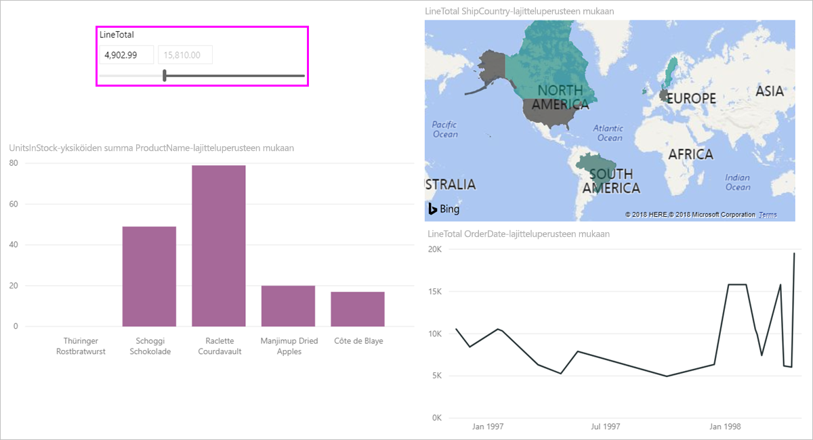

# Numeerisen alueen osittajan käyttö Power BI Desktopissa
**Numeerisen alueen osittajan** avulla voit käyttää kaikenlaisia suodattimia mihin tahansa tietomallisi numeeriseen sarakkeeseen. Voit myös suodattaa ehdoilla lukujen **välillä**, **pienempi tai yhtä suuri** kuin luku tai **suurempi tai yhtä suuri** kuin luku. Tämä voi kuulostaa yksinkertaiselta, mutta se on hyvin tehokas tapa suodattaa tietojasi.

## Numeerisen alueen osittajan käyttö
Voit käyttää numeerisen alueen osittajaa kuten mitä tahansa muuta osittajaa. Laadi **osittajan** visualisointi raportillesi ja valitse sitten numeerinen arvo **kentän** arvoksi. Seuraavassa kuvassa valittuna on *LineTotal*-kenttä.

Valitse **numeerisen alueen osittajan** oikeassa yläkulmassa oleva alanuoli, jolloin esiin tulee valikko.

Numeerisen alueen osalta voit valita seuraavista kolmesta vaihtoehdosta:

* Välillä
* Pienempi tai yhtä suuri kuin
* Suurempi tai yhtä suuri kuin

Kun valitset valikosta vaihtoehdon **Välillä**, näkyviin tulee liukusäädin, ja voit suodattaa lukujen välille osuvia numeerisia arvoja. Varsinaisen liukusäätimen käytön lisäksi voit napsauttaa kummasta ruudusta tahansa ja syöttää arvot. Tämä on kätevää, kun haluat osittaa tietyillä luvuilla, mutta osituspalkin siirtämisen askelvälit tekevät täsmälleen kyseiseen lukuun päätymisestä hankalaa.

Seuraavassa kuvassa raporttisivu on suodatettu *LineTotal*-arvoilla, jotka ovat välillä 2500,00–6000,00.

Kun valitaan **Pienempi tai yhtä suuri kuin**, liukusäätimen vasemmalla oleva (pienempää arvoa osoittava) kahva katoaa ja vain liukusäätimen ylärajaa voidaan säätää. Seuraavassa kuvassa liukusäätimen enimmäisarvoksi asetetaan 5928,19.

Jos taas valitaan **Suurempi tai yhtä suuri kuin**, liukusäätimen oikea (suurinta arvoa osoittava) kahva katoaa ja pienempää arvoa voidaan säätää seuraavassa kuvassa osoitetulla tavalla. Nyt raporttisivun visualisoinneissa näytetään vain kohteet, joiden *LineTotal*-arvo on suurempi tai yhtä suuri kuin 4902,99.

## Kokonaislukuihin kohdistaminen numeerisen alueen osittajalla

Numeerisen alueen osittaja kohdistuu kokonaislukuihin, jos pohjana olevan kentän tietotyyppi on **kokonaisluku**. Näin osittaja voi tasata siististi kokonaislukuihin. **Desimaaliluku**-tyyppisten kenttien avulla voit syöttää tai valita murtolukuja. Tekstiruudun muotoilu vastaa kentässä määritettyä muotoilua, vaikka voit kirjoittaa tai valita tarkempia lukuja.

## Muotoilun näyttäminen päivämääräalueen osittajan avulla

Kun käytät osittajaa näyttämään tai määrittämään päivämääräalueen, päivämäärän muoto näkyy aina **lyhyen päivämäärän** muodossa käyttäjän selaimen tai käyttöjärjestelmän aluekohtaisten asetusten mukaan. Tämä näyttömuoto on aina sama pohjana olevien tietojen tai mallin tietotyyppiasetuksista huolimatta. 

Sinulla voi esimerkiksi olla pitkä päivämäärämuoto pohjana olevalle tietotyypille (kuten *pppp, p KKKK, vvvv*, joka voi muodostaa päivämäärän muissa visualisoinneissa tai tilanteissa, kuten *keskiviikko, 14. maaliskuuta 2001*), mutta päivämääräosittajassa tämä päivämäärä näytetään osittajassa muodossa *14.3.2001*.

Näyttämällä osittajassa **lyhyen päivämäärän** muodon varmistat, että merkkijonon pituus säilyy aina johdonmukaisena ja lyhyenä osittajassa. 

## Rajoitukset ja huomioitavat asiat
**Numeerisen alueen osittajaa** koskevat tällä hetkellä seuraavat rajoitukset ja huomioon otettavat seikat:

* **Numeerisen alueen osittaja** suodattaa tällä hetkellä kaikki tietojen pohjana olevat rivit eikä koostettuja arvoja. Esimerkiksi jos käytetään kenttää *Myynnin määrä*, suodatetaan jokainen kenttään *Myynnin määrä* pohjautuva tapahtuma eikä summaa, joka saadaan visualisoinnin kunkin arvopisteen *Myynnin määrä* -kentistä.
* Osittaja ei tällä hetkellä toimi mittayksiköiden kanssa.
* Voit kirjoittaa minkä tahansa luvun tekstiruutuun numeerisessa osittajassa, vaikka luku olisi pohjana olevan sarakkeen arvojen alueen ulkopuolella. Tämän avulla voit määrittää suodattimia, jos tiedät, että tiedot voivat muuttua tulevaisuudessa.
