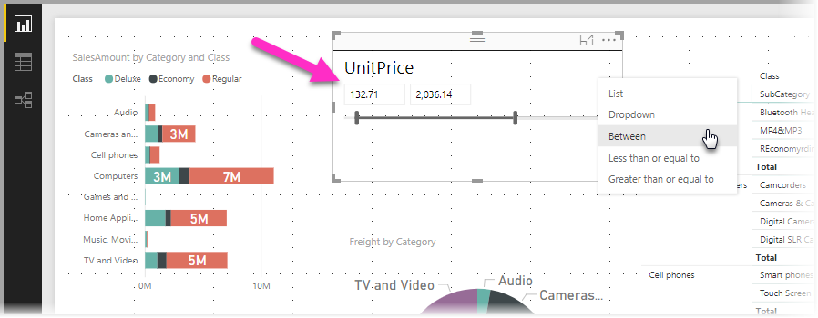
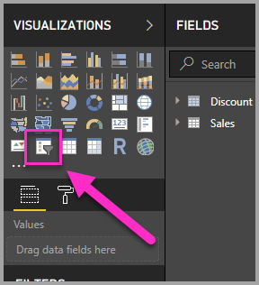
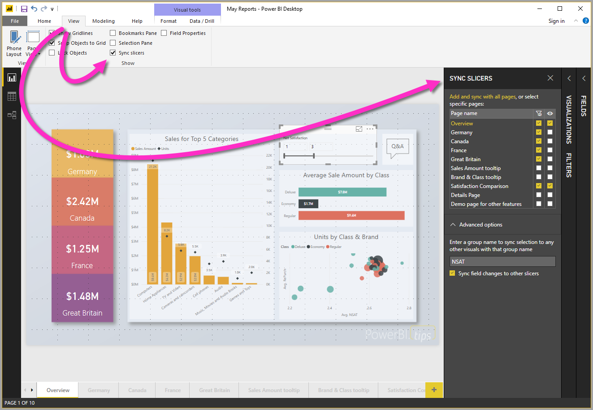
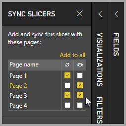

# Osittajien käyttäminen Power BI Desktopissa

Voit käyttää **osittajaa** **Power BI Desktopissa** raporttisivun visualisointien tulosten suodattamiseen. Osittajilla voit helposti säätää käytettävää suodatinta käsittelemällä itse osittajaa. Voit myös määrittää asetuksia siitä, miten osittaja näkyy ja miten sitä käsitellään. Seuraavassa kuvassa näkyy osittaja, jossa sen avattava *tyyppi*-valikko on näkyvissä. 

Osittaja voidaan näyttää jollakin seuraavista tyypeistä:

* Luettelo
* Avattava valikko
* Välillä
* Pienempi tai yhtä suuri kuin
* Suurempi tai yhtä suuri kuin

Voit lisätä osittajan raporttiin napsauttamalla **osittaja**-visualisointia **Visualisoinnit**-ruudussa.

Osittajat toimivat samalla tavalla sekä **Power BI Desktopissa** että **Power BI -palvelussa**. Opetusohjelma osittajien käyttämisestä on artikkelissa [Osittajat Power BI -palvelussa (opetusohjelma)](power-bi-visualization-slicers.md).

## Osittajien synkronointi raporttisivuilla

Voit synkronoida osittajat useilla raporttisivuilla **Power BI Desktopissa**. Jos haluat synkronoida osittajat, valitse valintanauhan **Näytä**-ruudusta **Synkronoi osittajat**. Kun synkronoit osittajat, näkyviin tulee **Synkronoi osittajat** -ruutu seuraavan kuvan mukaisesti.

**Synkronoi osittajat** -ruudussa voit määrittää, miten osittaja synkronoidaan raportin sivuilla. Voit määrittää, **käytetäänkö** kutakin osittajaa kullakin yksittäisellä raporttisivulla ja **näkyykö** osittaja kullakin yksittäisellä raporttisivulla.

Voit esimerkiksi sijoittaa osittajan raportin **sivulle 2** seuraavan kuvan mukaisesti. Voit sen jälkeen valita, *käytetäänkö* osittajaa kullakin valitulla sivulla ja *näkyykö* osittaja kullakin valitulla sivulla raportissa. Voit käyttää näistä mitä tahansa yhdistelmää kussakin osittajassa. 

Ruudun **Lisää kaikkiin** -linkin käyttäminen ottaa valitun osittajan käyttöön raportin kaikilla sivuilla.

Huomaa, että **Synkronoi osittajat** -ruudussa näkyvät valinnat koskevat vain *valittua osittajaa*. Voit käyttää useita osittajia eri sivuilla ja määrittää ruudun avulla, miten kutakin osittajaa käytetään raportin eri sivuilla. 

Vaikka osittajien valinta voidaan synkronoida, muita valintoja, kuten tyyliä, muokkausta ja poistoa, *ei* synkronoida. 

## Seuraavat vaiheet

Voit olla kiinnostunut myös seuraavista artikkeleista:

* [Osittajat Power BI -palvelussa (opetusohjelma)](power-bi-visualization-slicers.md)
* [Numeerisen alueen osittajan käyttö Power BI Desktopissa](desktop-slicer-numeric-range.md)
* [Suhteellisen päivämääräosittajan ja -suodattimen käyttö Power Bi Desktopissa](desktop-slicer-filter-date-range.md)

