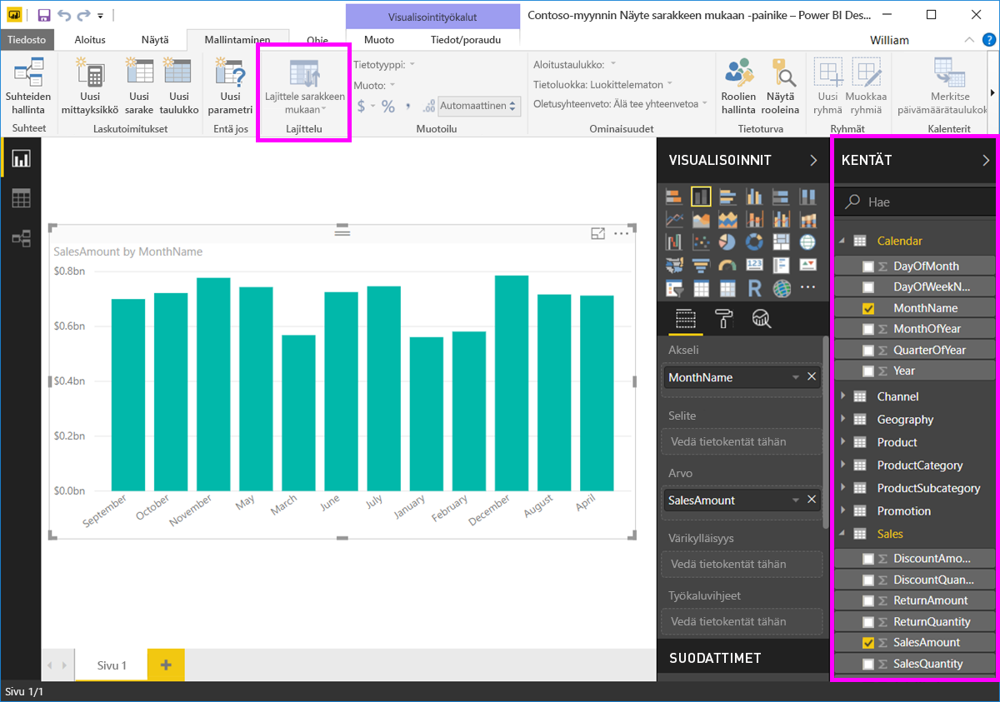

# Sarakkeen perusteella lajittelu Power BI Desktopissa
Voit muuttaa visualisoinnin ulkoasua **Power BI Desktopissa** ja **Power BI -palvelussa** lajittelemalla sen eri tietokenttien mukaan. Muuttamalla visualisoinnin lajittelua voit korostaa välitettäviä tietoja ja varmistaa, että visualisointi kuvastaa tätä trendiä (tai tietoa).

Voit lajitella visualisoinnit haluamallasi tavalla ja muokata niiden ulkoasua, olipa käytössä siten numeerisia tietoja (kuten myyntilukuja) tai tekstiä (kuten osavaltioiden nimiä).  **Power BI** tarjoaa käyttöösi joustavat lajitteluvaihtoehdot ja pikavalikot. Valitse missä tahansa visualisoinnissa kolmen pisteen valikko (...) ja valitse kenttä, jonka mukaan haluat lajitella, seuraavassa kuvassa esitetyllä tavalla.

## Lisää syvyyttä ja esimerkki
Otetaan seuraavaksi esimerkki, jossa on lisää syvyyttä, ja katsotaan, kuinka se toimii **Power BI Desktopissa**.

Seuraava visualisointi esittää kustannukset, määrät ja summat valmistajan nimen perusteella. Tässä on visualisointi sellaisena kuin se näkyy ennen lisälajittelua.

Visualisoinnin lajitteluperuste on tällä hetkellä **Myyntimäärät**, mikä selviää vertaamalla selitettä nousevien palkkien väriin. On kuitenkin olemassa parempi tapa selvittää nykyinen lajittelusarake: voidaan avata visualisoinnin oikeassa yläkulmassa olevasta kolmen pisteen valikosta (...). Kun valitset kolmen pisteen valikot, seuraava näkymä tulee esiin:

* Nykyinen lajittelukenttä on **Myyntimäärät** ilmaistuina niiden tietojen mukaan, jotka **Lajittelu myyntimäärien mukaan** on lihavoinut ja jotka sisältävät keltaisen palkin. 

* Nykyinen lajittelusuunta on pienimmästä suurimpaan, katso pieni kuvake **A/Z** (A - Z) ja nuoli alas.

Tarkastellaan lajittelukenttää ja suuntaa itsenäisesti seuraavissa kahdessa osassa.

## Lajittelusarakkeen valitseminen
Huomasit keltaisen palkin kohdan **Lajittelu myyntimäärien mukaan** vieressä valikossa **Enemmän vaihtoehtoja**, joka ilmaisee, että visualisointi on lajiteltu **Myyntimäärät**-sarakkeen mukaan. Toisen sarakkeen mukaan lajitteleminen on helppoa – avaa kolmen pisteen valikosta kolmen pisteen valikko ja valitse toinen sarake.

Seuraavassa kuvassa olemme valinneet *Alennuksen määrä* -sarakkeen lajitteluperusteeksi. Kyseinen sarake on yksi visualisoinnin riveistä palkkien sijaan. Tältä visualisointi näyttää, kun **Lajittele alennuksen määrän perusteella** on valittu.

Huomaa, miten visualisointi on muuttunut. Arvot järjestetään nyt arvosta suurimmasta alennuksen arvosta tässä visualisoinnissa Fabrikam Inc:sta alaspäin Northwind Tradersiin asti, jolla on pienin arvo. 

Mutta entä jos haluamme lajittele tiedot nousevasti laskevan järjestyksen sijaan? Seuraavasta osasta näet, miten helppoa se on.

## Lajittelujärjestyksen valitseminen – pienimmästä suurimpaan tai suurimmasta pienimpään
Kun katsomme lähemmin **Valinnat**-valikkoa edellisessä kuvassa huomaamme, että kohdan **Lajittele alennuksen määrän perusteella** vieressä olevassa kuvakkeessa näkyy **Z/A** (Z-kirjan A-kirjaimen yllä). Katso:

Kun **Z/A** on näkyvissä, se tarkoittaa, että visualisointi on lajiteltu valitun sarakkeen mukaan suurimmasta arvosta pienimpään arvoon. Haluatko muuttaa sen? Napauta tai napsauta **Z/A**-kuvaketta, niin lajittelujärjestykseksi vaihtuu **A/Z**, jolloin visualisointi lajitellaan pienimmästä arvosta suurimpaan arvoon valitun sarakkeen mukaan.

Tässä on sama visualisointi sen jälkeen, kun sen lajittelujärjestys on muutettu napauttamalla **Z/A**-kuvaketta **Lajittele alennuksen määrän mukaan**. Huomaa, että Northwind Traders on nyt luettelossa ensimmäinen valmistaja ja Fabrikam Inc. on viimeinen, toisin kuin aiemmassa lajittelussa.

Voit lajitella visualisoinnin minkä tahansa sarakkeen mukaan. Voimme esimerkiksi valita lajittelusarakkeeksi Myyntimäärät-sarakkeen ja valita **Lajittele myyntimäärien mukaan**, jolloin eniten myyneet valmistajat näkyvät ensimmäisinä. Muut sarakkeet säilyvät mukana visualisoinnissa valmistajaa koskevien arvojen mukaan. Tältä visualisointi näyttää näillä asetuksilla.

## Lajittelu Lajittele sarakkeen mukaan -painikkeella
Tiedot voidaan lajitella myös käyttämällä **Lajittele sarakkeen mukaan** -painiketta **Mallinnus**-valintanauhassa.

Tämä tapa edellyttää, että valitset ensin sarakkeen **Kentät**-ruudussa ja painat sitten **Lajittele sarakkeen mukaan** -painiketta valitaksesi, miten (minkä sarakkeen mukaan) haluat lajitella visualisoinnin. Sinun on valittava lajiteltava sarake (kenttä) **Kentät**-ruudussa, jotta voit ottaa käyttöön **Lajittele sarakkeen mukaan** -painikkeen – muuten painike ei ole käytössä.

Tässä on yleinen esimerkki: sinulla on tietoja jokaiselta kuukaudelta ja haluat lajitella ne aikajärjestyksessä. Seuraavissa vaiheissa esitellään, miten se on mahdollista.

1. Huomaa, että kun visualisointi on valittuna, mutta mitään saraketta ei ole valittu **Kentät**-ruudussa, **Lajittele sarakkeen mukaan** -painike ei ole käytössä (painike näkyy harmaana).
   
   

2. Kun valitsemme lajiteltavan sarakkeen **Kentät**-ruudussa, **Lajittele sarakkeen mukaan** -painike muuttuu aktiiviseksi.
   
   
3. Nyt, kun visualisointi on valittuna, voimme valita *Kuukausi*-vaihtoehdon oletusarvon (*Kuukauden nimi*) sijaan, jolloin visualisointi lajitellaan haluamassamme järjestyksessä eli kuukauden mukaan.
   
   

Siinä kaikki. Muista, että sinun on valittava sarake **Kentät**-ruudussa, jotta **Lajittele sarakkeen mukaan** -painike aktivoituu.

## Lajittelun oletussarakkeen palauttaminen
Voit lajitella visualisoinnin minkä tahansa sarakkeen mukaan, mutta joskus haluat ehkä palauttaa visualisoinnin lajittelun oletussarakkeen. Se onnistuu helposti. Kun visualisoinnissa on valittuna lajittelusarake (kolmien pisteen vieressä on keltainen palkki), avaa **Enemmän vaihtoehtoja**-valikko ja valitse kyseinen sarake uudelleen, niin visualisointi lajitellaan taas oletussarakkeen mukaan.

Tässä on esimerkiksi edellinen kaavio:

Kun siirrymme takaisin valikkoon ja valitsemme **Myyntimäärät**-sarakkeen uudelleen, visualisointi järjestetään aakkosjärjestyksessä **Valmistaja** -arvon mukaan, seuraavassa kuvassa esitetyllä tavalla.

Visualisointien monipuolisten lajitteluvaihtoehtojen avulla voit luoda juuri haluamasi kaavion tai esityksen.

