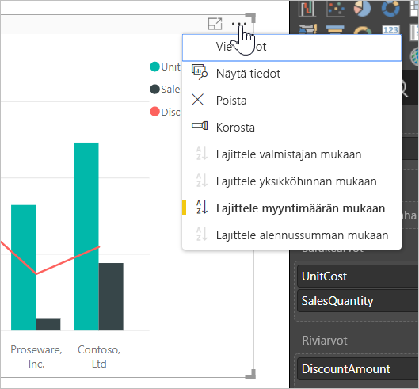
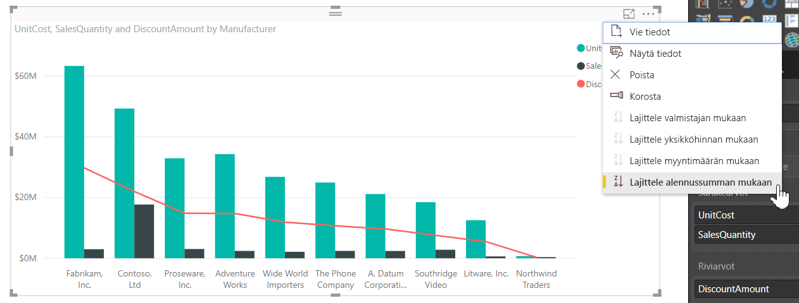
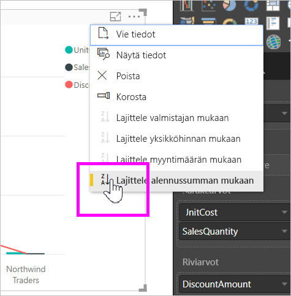
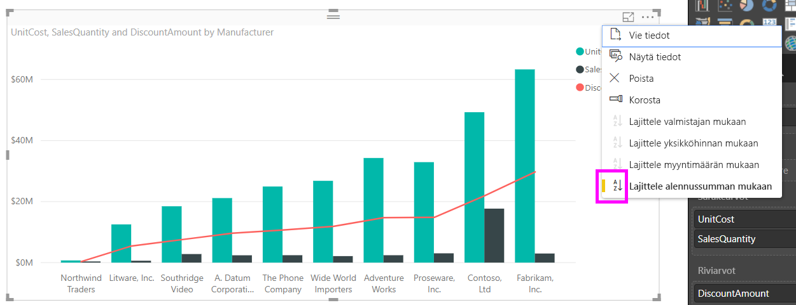
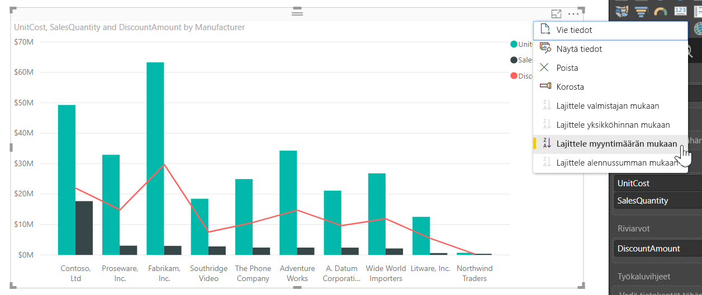
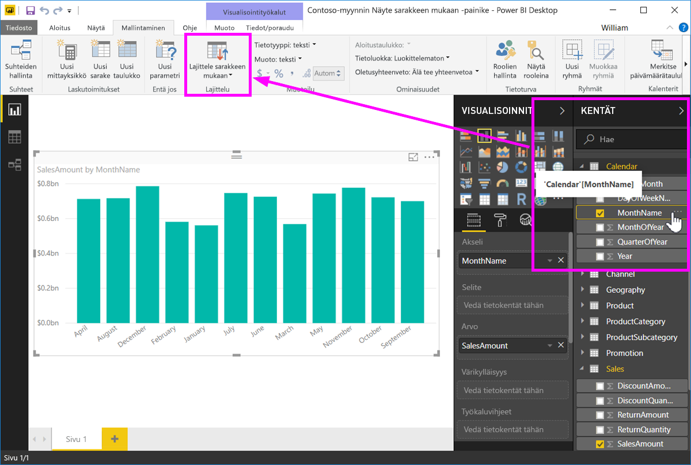
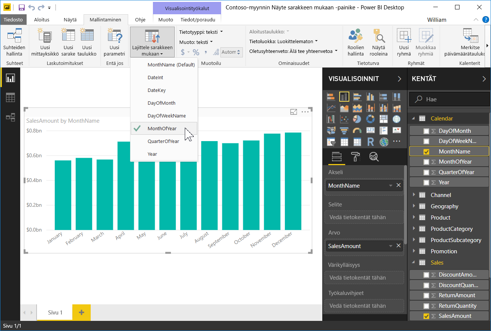
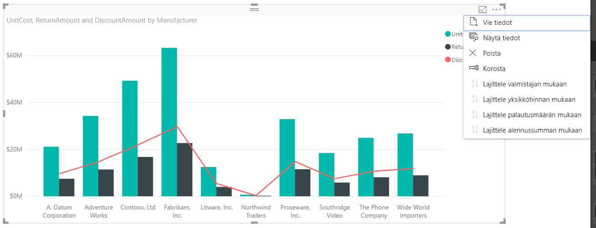

# Sarakkeen perusteella lajittelu Power BI Desktopissa
Voit muuttaa visualisoinnin ulkoasua **Power BI Desktopissa** ja **Power BI -palvelussa** lajittelemalla sen eri tietokenttien mukaan. Muuttamalla visualisoinnin lajittelua voit korostaa välitettäviä tietoja ja varmistaa, että visualisointi kuvastaa haluttua trendiä (tai tietoa).

Voit lajitella visualisoinnit haluamallasi tavalla ja muokata niiden ulkoasua, olipa käytössä siten numeerisia tietoja (kuten myyntilukuja) tai tekstiä (kuten osavaltioiden nimiä).  **Power BI** tarjoaa käyttöösi joustavat lajitteluvaihtoehdot ja pikavalikot. Valitse missä tahansa visualisoinnissa kolmen pisteen valikko (...) ja valitse sitten **Lajitteluperuste**. Valitse kenttä, jonka mukaan haluat lajitella, seuraavassa kuvassa esitetyllä tavalla.

## Lisää syvyyttä ja esimerkki
Otetaan seuraavaksi esimerkki, jossa on lisää syvyyttä, ja katsotaan, kuinka se toimii **Power BI Desktopissa**.

Seuraava visualisointi listaa Yhdysvaltain 15 aurinkoisinta osavaltiota (eniten aurinkoisia päiviä asteikolla 1–50, jossa 1 on eniten aurinkoisia päiviä). Tässä on visualisointi sellaisena kuin se näkyy ennen mitään lajittelua.

Visualisoinnin lajitteluperuste on tällä hetkellä **Elinkustannukset**, mikä selviää vertaamalla selitettä laskevien palkkien väriin. On kuitenkin olemassa parempi tapa selvittää nykyinen lajittelusarake: **Lajitteluperuste**-valintaikkuna, joka voidaan avata visualisoinnin oikeassa yläkulmassa olevasta kolmen pisteen valikosta (...). Kun valitset kolmen pisteen valikot, seuraava näkymä tulee esiin:

Kolmen pisteen valikossa on muutama huomion arvoinen seikka:

* Keltainen palkki kohdan **Elinkustannukset** vieressä ja **Elinkustannukset**-tekstin lihavointi.
* **Lajitteluperuste**-kohdan vieressä oleva pieni kuvake, jossa näkyy **Z/A** (Z-kirjain A-kirjaimen yllä) ja alaspäin osoittava nuoli.

Tutustumme niihin erikseen kahdessa seuraavassa osassa.

## Lajittelusarakkeen valitseminen
**Elinkustannukset**-kohdan vieressä **Lajitteluperuste**-valikossa oleva keltainen palkki osoittaa, että visualisointi lajitellaan **Elinkustannukset**-sarakkeen mukaan. Toisen sarakkeen mukaan lajitteleminen on helppoa – avaa kolmen pisteen valikosta **Lajitteluperuste**-valikko ja valitse toinen sarake. Se on juuri näin helppoa.

Seuraavassa kuvassa olemme valinneet **Yhteisön hyvinvointi** -sarakkeen lajitteluperusteeksi. Kyseinen sarake on yksi visualisoinnin riveistä palkkien sijaan. Tältä visualisointi näyttää, kun **Yhteisön hyvinvointi** on valittu.

Huomaa, miten visualisointi on muuttunut. Nyt arvot järjestetään suurimmasta Yhteisön hyvinvointi -arvosta (RI eli Rhode Island) pienimpään (AZ eli Arizona). Muista, että kokonaiskaavio sisältää yhä 15 osavaltiota, joissa on eniten aurinkoisia päiviä – olemme vain järjestäneet ne visualisoinnin toisen sarakkeen mukaan.

Mutta entä jos haluamme lajittele tiedot nousevasti laskevan järjestyksen sijaan? Seuraavasta osasta näet, miten helppoa se on.

## Lajittelujärjestyksen valitseminen – pienimmästä suurimpaan tai suurimmasta pienimpään
Kun katsomme lähemmin **Lajitteluperuste**-valikkoa edellisessä kuvassa huomaamme, että kohdan **Lajitteluperuste** vieressä olevassa kuvakkeessa näkyy **Z/A** (Z-kirjan A-kirjaimen yllä). Katso:

Kun **Z/A** on näkyvissä, se tarkoittaa, että visualisointi on lajiteltu valitun sarakkeen mukaan suurimmasta arvosta pienimpään arvoon. Haluatko muuttaa sen? Napauta tai napsauta **Z/A**-kuvaketta, niin lajittelujärjestykseksi vaihtuu **A/Z**, jolloin visualisointi lajitellaan pienimmästä arvosta suurimpaan arvoon valitun sarakkeen mukaan.

Tässä on sama visualisointi sen jälkeen, kun sen lajittelujärjestys on muutettu napauttamalla **Z/A**-kuvaketta **Lajitteluperuste**-valikossa. Huomaa, että AZ (Arizona) on nyt luettelossa ensimmäisenä ja RI (Rhode Island) viimeisenä, eli lajittelu on päinvastainen aiempaan verrattuna.

Voit lajitella visualisoinnin minkä tahansa sarakkeen mukaan. Voimme esimerkiksi valita lajittelusarakkeeksi Sää-sarakkeen ja valita sitten **Z/A**-kuvakkeen **Lajitteluperuste**-valikossa, jolloin aurinkoisimmat osavaltiot näkyvät ensimmäisinä (korkeimman arvon mukaan – Sää vastaa aurinkoisten päivien määrää tässä tietomallissa). Muut sarakkeet säilyvät mukana visualisoinnissa osavaltiota koskevien arvojen mukaan. Tältä visualisointi näyttää näillä asetuksilla.

## Lajittelu Lajittele sarakkeen mukaan -painikkeella
Tiedot voidaan lajitella myös käyttämällä **Lajittele sarakkeen mukaan** -painiketta **Mallinnus**-valintanauhassa.

Tämä tapa edellyttää, että valitset ensin sarakkeen **Kentät**-ruudussa ja painat sitten **Lajittele sarakkeen mukaan** -painiketta valitaksesi, miten (minkä sarakkeen mukaan) haluat lajitella visualisoinnin. Sinun on valittava lajiteltava sarake (kenttä) **Kentät**-ruudussa, jotta voit ottaa käyttöön **Lajittele sarakkeen mukaan** -painikkeen – muuten painike ei ole käytössä.

Tässä on yleinen esimerkki: sinulla on tietoja jokaiselta viikonpäivältä ja haluat lajitella ne aikajärjestyksessä. Seuraavissa vaiheissa esitellään, miten se on mahdollista.

1. Huomaa, että kun visualisointi on valittuna, mutta mitään saraketta ei ole valittu **Kentät**-ruudussa, **Lajittele sarakkeen mukaan** -painike ei ole käytössä (painike näkyy harmaana).
   
   
2. Kun valitsemme lajiteltavan sarakkeen **Kentät**-ruudussa, **Lajittele sarakkeen mukaan** -painike muuttuu aktiiviseksi.
   
   
3. Nyt, kun visualisointi on valittuna, voimme valita *Viikonpäivä*-vaihtoehdon oletusarvon (*Päivän nimi*) sijaan, jolloin visualisointi lajitellaan haluamassamme järjestyksessä eli viikonpäivän mukaan.
   
   

Siinä kaikki. Muista, että sinun on valittava sarake **Kentät**-ruudussa, jotta **Lajittele sarakkeen mukaan** -painike aktivoituu.

## Lajittelun oletussarakkeen palauttaminen
Voit lajitella visualisoinnin minkä tahansa sarakkeen mukaan, mutta joskus haluat ehkä palauttaa visualisoinnin lajittelun oletussarakkeen. Se onnistuu helposti. Kun visualisoinnissa on valittuna lajittelusarake (valitun lajittelusarakkeen vieressä on keltainen palkki **Lajitteluperuste**-valikossa, kuten aiemmin huomasit), avaa **Lajitteluperuste**-valikko ja valitse kyseinen sarake uudelleen, niin visualisointi lajitellaan taas oletussarakkeen mukaan.

Tässä on esimerkiksi edellinen kaavio:

Kun siirrymme takaisin valikkoon ja valitsemme **Sää**-sarakkeen uudelleen, visualisointi järjestetään aakkosjärjestyksessä **Osavaltion koodi** -arvon mukaan, seuraavassa kuvassa esitetyllä tavalla.

Visualisointien monipuolisten lajitteluvaihtoehtojen avulla voit luoda juuri haluamasi kaavion tai esityksen.

