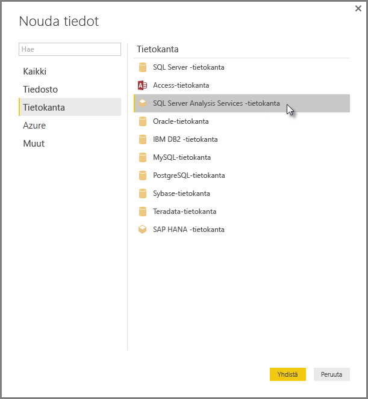

# Yhteyden muodostaminen SSAS-monidimensiomalleihin Power BI Desktopissa
Power BI Desktopin kautta on mahdollista käyttää **SSAS-monidimensiomalleja**, jotka tunnetaan myös lyhenteellä **SSAS MD**.

Jos haluat muodostaa yhteyden **SSAS MD** ‑tietokantaan, valitse kuvan osoittamalla tavalla **Nouda tiedot &gt; Tietokanta &gt; SQL Server Analysis Services ‑tietokanta**:

Sekä Power BI -palvelu että Power BI Desktop tukevat **SSAS-monidimensiomalleja** reaaliaikaisessa yhteystilassa. Voit myös julkaista ja ladata Power BI -palveluun raportteja, joissa käytetään **SSAS-monidimensiomalleja** reaaliaikaisessa tilassa.

## SSAS MD:n ominaisuudet ja toiminnot
Seuraavissa kappaleissa kuvataan Power BI:n ja SSAS MD:n yhteyksien ominaisuuksia ja toimintoja.

### Monidimensiomallien taulukkomuotoiset metatiedot
Seuraavassa taulukossa esitetään monidimensioisten objektien ja Power BI Desktopin palauttamien taulukkomuotoisten metatietojen väliset vastaavuudet. Power BI tekee kyselyn mallille saadakseen taulukkomuotoisia metatietoja ja suorittaa palautettujen metatietojen perusteella asianmukaiset DAX-kyselyt Analysis Servicesiin, kun luot visualisointeja, esimerkiksi taulukoita, matriiseja, kaavioita tai osittajia.

| Monidimensioinen BISM-objekti | Taulukkomuotoiset metatiedot |
| --- | --- |
| Kuutio |Malli |
| Kuutiodimensio |Taulukko |
| Dimension määritteet (avaimet), nimi |Sarakkeet |
| Mittayksikköryhmä |Taulukko |
| Mittayksikkö |Mittayksikkö |
| Mittayksiköt ilman niihin liittyvää mittayksikköryhmää |Taulukon sisällä kutsuttavat *mittayksiköt* |
| Mittayksikköryhmän suhde kuution dimensioon |Suhde |
| Perspektiivi |Perspektiivi |
| Suorituskykyilmaisin |Suorituskykyilmaisin |
| Käyttäjien / pää- ja alikohteiden hierarkiat |Hierarkiat |

### Mittayksiköt, mittayksikköryhmät ja suorituskykyilmaisimet
Monidimensioisen kuution mittayksikköryhmät näkyvät Power BI:ssä taulukkoina, joiden vieressä on **Kentät**-ruudussa merkki ∑. Lasketut mitat, joihin ei ole liitetty mittayksikköryhmää, ryhmitellään taulukkomuotoisissa metatiedoissa erikoistaulukkoon nimeltä *Mittayksiköt*.

Monidimensiomallissa voi yksinkertaistaa kompleksisia malleja määrittämällä joukon mittayksikköjä tai suorituskykyilmaisimia kuutioon, joka sijoitetaan *Näyttökansioon*. Power BI tunnistaa taulukkomuotoisissa metatiedoissa näyttökansiot ja näyttää niiden sisällä olevat mittayksiköt ja suorituskykyilmaisimet. Monidimensioisten tietokantojen suorituskykyilmaisimet tukevat seuraavia: *Arvo*, *Tavoite*, *tilagrafiikka* ja *trendigrafiikka*.

### Dimension määritetyyppi
Monidimensiomallit tukevat myös niihin liittyviä dimensiomääritteitä, jotka ovat tiettyä dimension määritetyyppiä. Taulukkomuotoisissa metatiedoissa näytetään esimerkiksi **Paikkatieto**-dimensio, jossa *Kaupunki*-, *Osavaltio tai provinssi*-, *Maa*- ja *Postinumero*-dimensiomääritteisiin on liitetty asianmukaiset paikkatietotyypit. Power BI tunnistaa nämä metatiedot, joten voit luoda niistä karttavisualisointeja. Tunnistat liittyvät tiedot siitä, että elementin vieressä näkyy Power BI:ssä **Kenttä**-ruudussa *kartan* kuvake.

Power BI pystyy myös hahmontamaan kuvia, jos annat sille kuvien URL-osoitteet (Uniform Resource Locator) sisältävän kentän. Voit määrittää kenttien tyypiksi *ImageURL* SQL Server Data Toolsissa (tai myöhemmin Power BI:ssä), ja tyypin tiedot annetaan Power BI:hin taulukkomuotoisina metatietoina. Power BI voi sitten noutaa kuvat URL-osoitteen perusteella ja näyttää ne visualisoinneissa.

### Pää- ja alikohteiden hierarkiat
Monidimensiomallit tukevat pää- ja alikohteiden hierarkioita, jotka näytetään taulukkomuotoisissa metatiedoissa *hierarkiana*. Kukin pää- ja alikohteen välinen hierarkia esitetään taulukkomuotoisissa metatiedoissa piilotettuna sarakkeena. Pää-alikohdedimension avainmääritettä ei näytetä taulukkomuotoisissa metatiedoissa.

### Dimension lasketut jäsenet
Monidimensiomallit tukevat erityyppisten *laskettujen jäsenten* luomista. Yleisimmät laskettujen jäsenten tyypit ovat seuraavat kaksi tyyppiä:

* Määritehierarkioissa olevat lasketut jäsenet, jotka eivät ole kohteen *Kaikki* rinnakkaiskohde
* Käyttäjähierarkioissa olevat lasketut jäsenet

Monidimensiomallit esittävät *määritehierarkioissa olevat lasketut jäsenet* sarakkeen arvoina. Tämäntyyppisen lasketun jäsenen esittämisessä on huomioitava joitakin lisäominaisuuksia ja -rajoituksia:

* Dimensiomääritteessä voi olla valinnainen *UnknownMember*-ominaisuus.
* Laskettuja jäseniä sisältävä määrite ei voi olla dimension avainmäärite, ellei se ole dimension ainoa määrite.
* Laskettuja jäseniä sisältävä määrite ei voi olla pää-alikohdemäärite.

Käyttäjähierarkioiden laskettuja jäseniä ei näytetä Power BI:ssä. Sen sijaan voit muodostaa yhteyden kuutioon, joka sisältää käyttäjähierarkioissa olevia laskettuja jäseniä, mutta et voi nähdä laskettuja jäseniä, jos niitä koskevat edellä olevan luettelon rajoitteet.

### Suojaus
Monidimensiomallit tukevat dimensio- ja solutason suojausta *roolien* kautta. Kun muodostat Power BI:llä yhteyden kuutioon, sinut todennetaan ja käyttöoikeuksiesi riittävyys arvioidaan. Kun käyttäjällä on käytössä *dimension suojaus*, käyttäjä ei näe Power BI:ssä vastaavan dimension jäseniä. Sen sijaan jos käyttäjälle on määritetty *solun suojauksen* käyttöoikeudet, joiden mukaan tietyt solut ovat rajoitettuja, kyseinen käyttäjä ei voi muodostaa yhteyttä kuutioon käyttämällä Power BI:tä.

## Huomioitavat asiat ja rajoitukset
**SSAS MD**:n käytössä pätevät tietyt rajoitukset:

* Jotta Power BI Desktopin SSAS MD ‑liitin toimisi oikein, palvelimissa on oltava käytössä Analysis Servicesistä versio SQL Server 2012 SP1 CU4 tai uudempi versio.
* *Toiminnot* ja *Nimetyt joukot* eivät näy Power BI:ssä, mutta voit silti muodostaa yhteyden kuutioihin, jotka sisältävät myös *toimintoja* ja *nimettyjä joukkoja* ja luoda visualisointeja ja raportteja.
* Voit kohdata ongelman, missä Power BI näyttää SSAS-mallin metatiedot, mutta et pysty hakemaan mallista tietoja. Tämä saattaa tapahtua, jos järjestelmään on asennettuna 32-bittinen MSOLAP-palvelun versio, eikä 64-bittinen versio. 64-bittisen version asentaminen saattaa ratkaista ongelman.

## Power BI Desktopin tukemat SSAS MD:n ominaisuudet
Power BI Desktop tukee seuraavia SSAS MD:n ominaisuuksia:

* Tämä **SSAS MD** ‑julkaisu tulee seuraavien elementtien käyttöä ([lisätietoja](https://msdn.microsoft.com/library/jj969574.aspx) ominaisuuksista):
  * Näyttökansiot
  * Suorituskykyilmaisimien trendit
  * Oletusjäsenet
  * Dimension määritteet
  * Dimension lasketut jäsenet (Jos dimensiossa on enemmän kuin yksi määrite, siinä on oltava yksi oikea jäsen; se ei voi olla dimension avainmäärite, paitsi ollessaan ainoa määrite, eikä se voi olla pää-alikohdemäärite.)
  * Dimension määritetyypit
  * Hierarkiat
  * Mittayksiköt (mittayksikköryhmien kanssa tai ilman niitä)
  * Mittayksiköt varianttina
  * Suorituskykyilmaisimet
  * ImageUrl-tyypit
  * Dimension suojaus

## Vianmääritys 
Alla luetellaan kaikki tunnetut ongelmat, joita esiintyy muodostettaessa yhteyttä SQL Server Analysis Servicesiin (SSAS). 

* **Virhe: Mallirakennetta ei voitu ladata** - Tämä virhe ilmenee yleensä kun käyttäjä yhdistää Analysis Servicesiin, mutta hänellä ei ole käyttöoikeutta tietokantaan/kuutioon.
