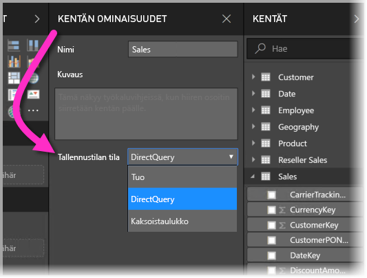
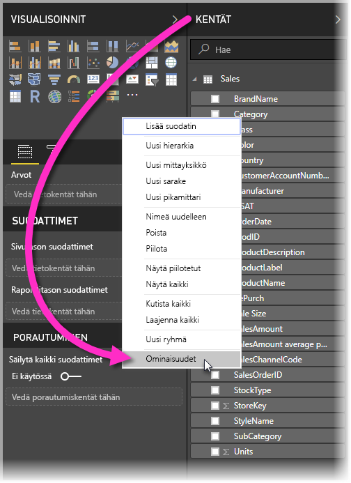
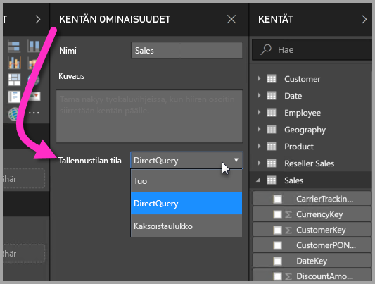
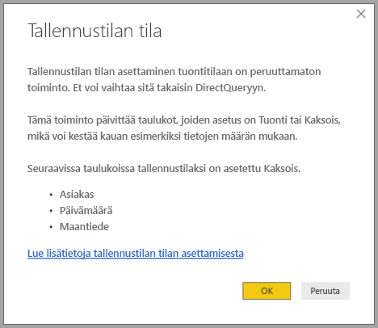

# Tallennustilan tila Power BI Desktopissa (esikatselu)

Microsoft Power BI Desktopissa voit määrittää taulukoiden *tallennustilan tilan*. *Tallennustilan tilan* avulla voit määrittää, tallentaako Power BI Desktop taulukkotietoja välimuistiin raportteja varten. 

Tallennustilan tilan määrittäminen tarjoaa monia etuja. Voit määrittää mallissasi kunkin taulukon tallennustilan tilan erikseen. Tämä toiminto ottaa käyttöön yhden tietojoukon, joka tarjoaa seuraavat edut:

* **Kyselyn suorituskyky**: Kun käyttäjät vuorovaikuttavat Power BI -raporttien visualisointien kanssa, DAX (Data Analysis Expressions) -kyselyt lähetetään tietojoukkoon. Kun tiedot tallennetaan välimuistiin tallennustilan tilan asianmukaisella määrittämisellä, voit tehostaa kyselyn suorituskykyä ja parantaa raporttien vuorovaikutteisuutta.

* **Suuret tietojoukot**: Sellaiset taulukot, joita ei tallenneta välimuistiin, eivät kuluta välimuistille varattua muistia. Voit ottaa käyttöön vuorovaikutteisen analyysin suurille tietojoukoille, jotka ovat liian suuria tai kalliita tallennettavaksi kokonaan välimuistiin. Voit valita, mitkä taulukot ovat välimuistiin tallentamisen arvoisia.

* **Tietojen päivittämisen optimointi**: Taulukoita, joita ei tallenneta välimuistiin, ei tarvitse päivittää. Voit lyhentää päivitysaikoja tallentamalla välimuistiin vain sellaiset tiedot, joita tarvitset palvelutasosopimuksen noudattamiseksi ja oman yrityksesi tarpeisiin.

* **Lähes reaaliaikaiset aikavaatimukset**: Taulukot, joissa on lähes reaaliaikaisia vaatimuksia, saattavat hyötyä siitä, että niitä ei tallenneta välimuistiin. Se vähentää tietojen viivettä.

* **Takaisinkirjoitus**: Takaisinkirjoituksen avulla yrityskäyttäjät voivat kokeilla entä jos -skenaarioita muuttamalla solujen arvoja. Mukautetut sovellukset voivat ottaa muutoksia käyttöön tietolähteessä. Taulukoissa, joita ei ole tallennettu välimuistiin, muutokset tulevat näkyviin välittömästi, mikä mahdollistaa vaikutusten nopean analyysin.

Power BI Desktopin Tallennustilan tila -asetus on yksi kolmesta toisiinsa liittyvästä ominaisuudesta:

* **Yhdistelmämallit**: Antavat mahdollisuuden sisällyttää raporttiin kaksi tietoyhteyttä tai enemmän (kuten DirectQuery-yhteydet tai tuonnin) minä tahansa yhdistelminä. Jos haluat lisätietoja, katso [Yhdistelmämallien käyttäminen Power BI Desktopissa (esikatselu)](desktop-composite-models.md).

* **Moni-moneen-yhteydet**: *Yhdistelmämallien* avulla voit määrittää taulukoiden välille *moni-moneen-yhteyksiä*. *Moni-moneen-yhteydet* poistavat vaatimuksen siitä, että taulukoiden arvojen pitäisi olla yksilöllisiä. Se myös poistaa edelliset ratkaisut, kuten uusien taulukoiden lisäämisen vain yhteyksien muodostamiseksi. Jos haluat lisätietoja, katso [Moni-moneen-yhteydet Power BI Desktopissa (esikatselu)](desktop-many-to-many-relationships.md).

* **Tallennustilan tila**: Voit nyt määrittää, mitkä visualisoinnit edellyttävät kyselyä taustatietolähteisiin. Visualisoinnit, jotka eivät edellytä kyselyä, tuodaan, vaikka ne perustuisivat DirectQueryyn. Tämä ominaisuus parantaa suorituskykyä ja vähentää taustakuormitusta. Aiemmin jopa osittajien kaltaiset yksinkertaiset visualisoinnit käynnistivät kyselyjä taustalähteisiin. Tallennustilan tila kuvataan edempänä tässä artikkelissa.

## Tallennustilan tila -ominaisuuden käyttäminen

Tallennustilan tila on ominaisuus, jonka voit määrittää mallisi kullekin taulukolle. Voit määrittää tallennustilan tilan napsauttamalla **Kentät**-ruudussa hiiren kakkospainikkeella taulukkoa, jonka ominaisuuksia haluat määrittää, ja valitsemalla sitten **Ominaisuudet**.

Nykyinen ominaisuus näkyy **Kentän ominaisuudet** -ruudun avattavassa **Tallennustilan tila** -luettelossa. Siellä voit tarkastella nykyistä tallennustilan tilaa tai muokata sitä.

Tallennustilan tilalle on kolme arvoa:

* **Tuonti**: Kun arvoksi on määritetty **Tuonti**, tuodut taulukot tallennetaan välimuistiin. Power BI -tietojoukkoon lähetetyt kyselyt, jotka palauttavat tietoja tuoduista taulukoista, ovat täytettävissä vain välimuistiin tallennetuista tiedoista.

* **DirectQuery**: Kun tämä asetus on käytössä, DirectQuery-taulukoita ei tallenneta välimuistiin. Sellaiset Power BI -tietojoukkoon lähetetyt kyselyt, jotka palauttavat tietoja DirectQuery-taulukoista, kuten DAX (Data Analysis Expressions) -kyselyt, ovat täytettävissä vain suorittamalla pyydettäessä saatavia kyselyjä tietolähteeseen. Tietolähteeseen lähetetyt kyselyt käyttävät kyseisen tietolähteen kyselykieltä, kuten SQL:ää.

* **Kaksoistaulukot**: Kaksoistaulukot voivat toimia joko välimuistiin tallennettuina tai siihen tallentamattomina riippuen Power BI -tietojoukkoon lähetetyn kyselyn kontekstista. Joissakin tapauksissa kyselyt toteutetaan välimuistiin tallennetuista tiedoista. Muissa tapauksissa kyselyt toteutetaan suorittamalla pyydettäessä saatava kysely tietolähteeseen.

Taulukon muuttaminen **tuontitilaan** on *peruuttamaton* toiminto. Taulukkoa ei voi muuttaa takaisin DirectQuery- tai kaksoistaulukoksi.

## DirectQuery- ja kaksoistaulukoiden rajoitukset

Kaksoistaulukkoja koskevat samat toiminnalliset rajoitukset kuin DirectQuery-taulukkoja. Niitä ovat esimerkiksi rajoitetut M-muunnokset ja laskettujen sarakkeiden rajoitetut DAX-funktiot. Lisätietoja on ohjeaiheessa [DirectQueryn käyttämisen vaikutukset](desktop-directquery-about.md#implications-of-using-directquery).

## Välitys- tai kaksoistaulukko
Tutustu seuraavaan yksinkertaiseen malliin, jossa kaikki taulukot ovat yhdestä tuontia ja DirectQuerya tukevasta lähteestä.

Oletetaan, että kaikki taulukot tässä mallissa ovat DirectQuery-taulukoita. Jos vaihdamme *Kyselyvastaus*-taulukon **tallennustilan tilaksi** Tuonti, näyttöön tulee seuraava varoitusikkuna:

Dimensiotaulukot (*Asiakas*, *Maantiede* ja *Päivämäärä*) voidaan määrittää arvoon **Kaksoistaulukko** tietojoukon heikkojen suhteiden määrän pienentämiseksi sekä suorituskyvyn parantamiseksi. Heikot suhteet sisältävät yleensä vähintään yhden DirectQuery-taulukon, jossa liittymislogiikkaa ei voida työntää lähdejärjestelmiin. **Kaksoistaulukot** voivat toimia joko DirectQuery- tai Tuonti-taulukkona, mikä auttaa välttämään tämän.

Välityslogiikka on suunniteltu auttamaan useita taulukoita sisältävien mallien käyttämisessä. Oletetaan, että sinulla on malli, joka sisältää 50 taulukkoa. Niistä vain tietyt (tapahtumatyyppiset) faktataulukot on tallennettava välimuistiin. Power BI Desktopin logiikkajärjestelmä laskee dimensiotaulukoiden vähimmäisjoukon, joka on määritettävä **kaksoistaulukoiksi**, joten sinun ei tarvitse tehdä sitä itse.

Välityslogiikka ulottuu vain yhdelle puolelle **yhdestä moneen** -yhteyksissä.

## Tallennustilan tilan käyttöesimerkki
Jatketaan edellisen osion esimerkin parissa. Oletetaan, että seuraavat tallennustilan tilan ominaisuusasetukset otetaan käyttöön:

| Taulukko                   | Tallennustilan tila         |
| ----------------------- |----------------------| 
| *Myynti*                 | DirectQuery          | 
| *Kyselyvastaus*        | Tuo               | 
| *Päivämäärä*                  | Kaksoistaulukko                 | 
| *Asiakas*              | Kaksoistaulukko                 | 
| *Maantiede*             | Kaksoistaulukko                 | 

Näiden tallennustilan tilan ominaisuusasetusten määrittäminen tuottaa seuraavia tuloksia olettaen, että *Myynti*-taulukossa on paljon tietoja.
* Power BI Desktop tallentaa dimensiotaulukot – *Päivämäärä*, *Asiakas* ja *Maantiede* – välimuistiin, joten ensimmäisen raportin latausaika on lyhyt, kun näytettäviä osittajan arvoja noudetaan.
* Jos *Myynti*-taulukkoa ei tallenneta välimuistiin, Power BI Desktop antaa seuraavat tulokset:
    * Tietojen päivitysajat ovat entistä paremmat ja muistin käyttö vähenee.
    * *Myynti*-taulukkoon perustuvat raporttikyselyt suoritetaan DirectQuery-tilassa. Kyselyt saattavat kestää kauemmin, mutta ne ovat lähempänä reaaliaikaisia, koska välimuistiin tallentamisen viivettä ei ilmene.

* *Kyselyvastaus*-taulukkoon perustuvat raporttikyselyt palautetaan välimuistista, joten ne ovat suhteellisen nopeita.

## Kyselyt, jotka kohdistuvat tai ovat kohdistumatta välimuistiin

Kun **SQL Profiler** liitetään Power BI Desktopin diagnostiikkaporttiin, seuraaviin tapahtumiin perustuvan jäljityksen avulla voit nähdä, mitkä kyselyt kohdistuvat tai ovat kohdistumatta välimuistiin:

* Kyselytapahtumat \ kyselyn alku
* Kyselyn käsittely \ Vertipaq SE -kyselyn alku
* Kyselyn käsittely \ DirectQueryn alku

Tarkista kunkin *kyselyn alku* -tapahtuman osalta muut tapahtumat, joilla on sama *ActivityID*. Jos esimerkiksi *DirectQueryn alku* -tapahtumaa ei ole, mutta *Vertipaq SE -kyselyn alku* -tapahtuma on olemassa, kyselyyn vastataan välimuistista.

Kyselyt, jotka viittaavat **kaksoistilassa** oleviin taulukoihin, palauttavat tiedot välimuistista, jos se on mahdollista. Muussa tapauksessa ne palautuvat DirectQueryyn.

Edellisessä esimerkissä seuraava kysely viittaa vain sarakkeeseen *Päivämäärä*-taulukossa, joka on **kaksoistilassa**. Tämän vuoksi kyselyn tulisi kohdistua välimuistiin.

Seuraava kysely viittaa vain sarakkeeseen *Myynti*-taulukossa, joka on **DirectQuery**-tilassa. Tämän vuoksi sen *ei* tulisi kohdistua välimuistiin.

Seuraava kysely on mielenkiintoinen, koska se yhdistää molemmat sarakkeet. Tämä kysely ei kohdistu välimuistiin. Sen voisi olettaa noutavan *Kalenterivuosi*-arvoja välimuistista ja *Myyntisumma*-arvoja lähteestä sekä yhdistävän nämä tulokset. Tämä olisi kuitenkin vähemmän tehokasta kuin SUM/GROUP BY -toiminnon lähettäminen lähdejärjestelmään. Jos toiminto lähetetään lähteeseen, palautettavien rivien määrä on todennäköisesti paljon pienempi. 

> [!NOTE]
> Tämä toiminta poikkeaa [Power BI Desktopin moni-moneen-yhteyksistä (esikatselu)](desktop-many-to-many-relationships.md), kun välimuistiin tallennettuja ja tallentamattomia taulukoita yhdistellään.

## Välimuistit tulisi pitää synkronoituna

Edellisessä osiossa näytyt kyselyt osoittavat, että **kaksoistaulukot** toisinaan kohdistuvat välimuistiin ja toisinaan eivät. Näin ollen palautettavat arvot saattavat olla erilaisia, jos välimuisti ei ole ajan tasalla. Kyselyn suorittaminen ei yritä peittää tieto-ongelmia esimerkiksi suodattamalla DirectQuery-tuloksia välimuistiin tallennettujen arvojen kanssa täsmäämiseksi. Sinun vastuullasi on tuntea tietovuot ja suunnitella toimet vastaavasti. On olemassa vakiintuneet tekniikoita tällaisten tapausten käsittelemiseen lähteessä.

Tallennustilan *kaksoistilassa* on kyse suorituskyvyn optimoinnista. Sitä tulisi käyttää vain tavoilla, jotka eivät vaikeuta liiketoiminnan tarpeiden toteuttamista. Vaihtoehtoisesti voit harkita artikkelissa [Moni-moneen-yhteydet Power BI Desktopissa (esikatselu)](desktop-many-to-many-relationships.md) kuvattuja tekniikoita.

## Tietonäkymä
Jos tietojoukon vähintään yhden taulukon tallennustila on määritetty joko **tuonti**- tai **kaksoistilaan**, näet **Tietonäkymä**-välilehden.

**Tietonäkymässä** valitut **kaksois**- ja **tuontitaulukot** näyttävät välimuistiin tallennettuja tietoja. DirectQuery-taulukot eivät näytä tietoja, ja näkyviin tulee ilmoitus, jonka mukaan DirectQuery-taulukoita ei voi näyttää.

## Rajoitukset ja huomioitavat asiat

Tallennustilan tilan tässä versiossa ja sen korrelaatiossa yhdistelmämalleihin on joitakin rajoituksia.

Seuraavia Live Connectin monidimensioisia lähteitä ei voi käyttää yhdistelmämallien kanssa:

* SAP HANA
* SAP Business Warehouse
* SQL Server Analysis Services
* Power BI -tietojoukot
* Azure Analysis Services

Kun muodostat yhteyttä näihin monidimensioisiin lähteisiin DirectQuerylla, et voi muodostaa yhteyttä myös toiseen DirectQuery-lähteeseen etkä yhdistää tuotuihin tietoihin.

DirectQueryn olemassa olevat käyttörajoitukset koskevat edelleen yhdistelmämallien käyttämistä. Monet näistä rajoituksista ovat nyt taulukkokohtaisia ja riippuvat taulukon tallennustilan tilasta. Esimerkiksi tuodun taulukon laskettu sarake voi viitata muihin taulukoihin, mutta DirectQuery-taulukon laskettu sarake on yhä rajoitettu viittaamaan vain saman taulukon sarakkeisiin. Muut rajoitukset koskevat vain mallia kokonaisuutena, jos jokin mallin taulukoista on DirectQuery-taulukko. Esimerkiksi Nopeat merkitykselliset tiedot- ja Q & A -ominaisuudet eivät ole käytettävissä mallissa, jos jollakin sen taulukoista tallennustilan tilana on DirectQuery. 

## Seuraavat vaiheet

Seuraavissa artikkeleissa on lisätietoja yhdistelmämalleista ja DirectQuerysta:
* [Yhdistelmämallit Power BI Desktopissa (esikatselu)](desktop-composite-models.md)
* [Moni-moneen-yhteydet Power BI Desktopissa (esikatselu)](desktop-many-to-many-relationships.md)
* [DirectQueryn käyttö Power BI:ssä](desktop-directquery-about.md)
* [DirectQueryn tukemat tietolähteet Power BI:ssä](desktop-directquery-data-sources.md)
