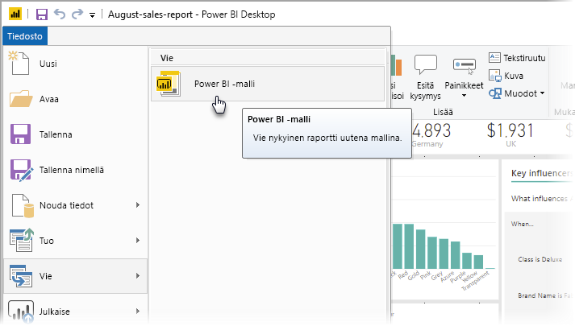
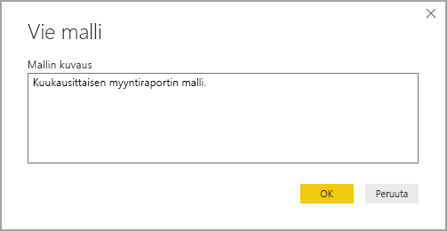
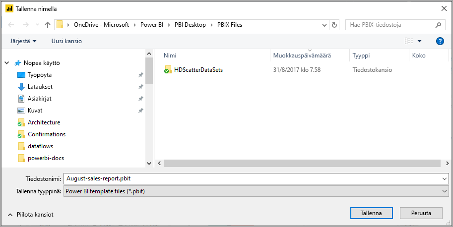
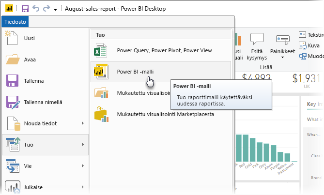
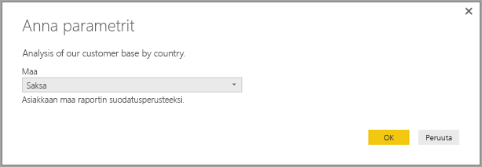
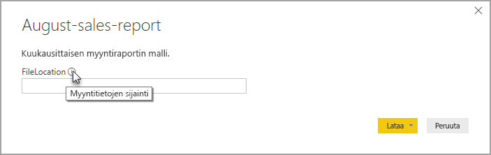

# Mallien käyttäminen Power BI Desktopissa

**Power BI Desktopin** avulla voit luoda vaikuttavia raportteja, joiden kautta voit jakaa merkityksellisiä tietoja koko organisaatiolle. Power BI Desktopin **mallien** avulla voit tehostaa työtä luomalla olemassa olevaan malliin perustuvan raporttimallin, jota sinä ja organisaatiosi muut käyttäjät voivat käyttää lähtökohtana uuden raportin asettelussa, tietomallissa ja kyselyissä. **Power BI Desktopin** mallit nopeuttavat raportin luomista ja vakioivat sen.

## Mallien luominen

Power BI:n raporttimallit sisältävät seuraavat tiedot raportista, josta ne luotiin:

* Raportin **sivut**, visualisoinnit ja muut visuaaliset elementit
* **Tietomallin määritykset**, mukaan lukien rakenne, yhteydet, mittarit ja muut mallin määritelmän artefaktit
* Kaikki **kyselymääritykset**, kuten kyselyt, kyselyparametrit ja muut kyselyiden elementit

Mallit *eivät* sisällä raportin tietoja. 

Raporttimalleissa käytetään tiedostotunnistetta .PBIT (Power BI Desktop -raporteissa tunniste on .PBIX). 

Jos haluat luoda raporttimallin, valitse valikosta **Tiedosto > Vie > Power BI -malli**. Saat näkyviin seuraavan ikkunan, jossa pyydetään antamaan mallin kuvaus. Tässä esimerkissä mallin kuvaus on *Kuukausittaisen myynnin raporttimalli.*

Valitse **OK**. Sinua pyydetään valitsemaan tiedostosijainti, johon .PBIT-mallitiedosto tallennetaan.

Siinä kaikki. Power BI -raporttimallisi luodaan määritettyyn tiedostosijaintiin .PBIT-tunnisteella.

> [!NOTE]
> Power BI -raporttimallitiedostot ovat yleensä paljon pienempiä kuin Power BI Desktopin raportit, koska mallit eivät sisällä mitään tietoja, vaan ainoastaan raporttimääritykset. 

## Mallien käyttäminen

Jos haluat käyttää Power BI -raporttimallia, avaa se Power BI Desktopissa ja aloita sen käyttö. Voit avata Power BI -raporttimallin kahdella tavalla:

* Kaksoisnapsauta mitä tahansa .PBIT-tiedostoa, jotta Power BI Desktop käynnistyy ja lataa mallin automaattisesti
* Valitse **Tiedosto > Tuo > Power BI -malli** Power BI Desktopissa

Kun avaat raporttimallin, näkyviin tulee valintaikkuna, joka näyttää arvot mallin perustana olevassa raportissa määritetyille parametreille. Jos raportissa esimerkiksi analysoidaan asiakkaita maan tai alueen perusteella ja siinä on *Maa*-parametri asiakaskunnan määrittämiseksi, näkyviin tulee kehotus valita *Maa*-arvo parametrin määrittämisessä yksilöidystä arvoluettelosta. 

Kun tarvittavat parametrit on annettu, sinua pyydetään antamaan raporttiin liittyvien pohjana olevien tietojen sijainti. Nykyinen raportin tekijä voi muodostaa yhteyden tietoihin tunnistetietojensa perusteella.

Kun parametrit ja tiedot on määritetty, luodaan raportti, joka sisältää kaikki sivut, visualisoinnit, tietomallin artefaktit ja kyselyt, jotka olivat osa mallin perustana olevaa raporttia. 

Siinä kaikki! Raporttimallien luominen ja käyttäminen Power BI Desktopissa on helppoa. Voit helposti toistaa vaikuttavia asetteluja ja muita raportin ominaisuuksia ja jakaa ne muille.

## Seuraavat vaiheet
Voit olla myös kiinnostunut **kyselyparametreista**:
* [Käytätkö kyselyparametreja Power BI Desktopissa?](https://docs.microsoft.com/power-query/power-query-query-parameters)

Voit lisäksi tehdä kaikenlaista Power BI Desktopilla. Saat lisätietoja sen toiminnoista seuraavista resursseista:

* [Mikä on Power BI Desktop?](desktop-what-is-desktop.md)
* [Power BI Desktopin kyselyiden yleiskatsaus](desktop-query-overview.md)
* [Tietotyypit Power BI Desktopissa](desktop-data-types.md)
* [Tietojen muotoilu ja yhdistäminen Power BI Desktopissa](desktop-shape-and-combine-data.md)
* [Yleiset kyselytehtävät Power BI Desktopissa](desktop-common-query-tasks.md)    
