# Power BI Desktopissa luotuihin raporttisivuihin perustuvien työkaluvihjeiden luominen
Voit luoda visuaalisesti monipuolisia **raporttityökaluvihjeitä**, jotka tulevat näkyviin, kun pidät hiiren osoitinta visualisoinnin päällä, ja jotka pohjautuvat **Power BI Desktopissa** luomiisi raporttisivuihin. Kun luot työkaluvihjeenä toimivan raporttisivun, mukautetut työkaluvihjeet voivat sisältää visualisointeja, kuvia ja muita kohdekokoelmia, joita luot raporttisivulla. 

Voit luoda niin monta työkaluvihjesivua kuin haluat. Jokainen työkaluvihjesivu voidaan yhdistää yhteen tai useampaan raportissa olevaan kenttään. Kun pidät hiiren osoitinta valitun kentän sisältävän visualisoinnin päällä, työkaluvihjesivulla luomasi työkaluvihje tulee näkyviin suodatettuna arvopisteellä, jonka päällä hiiren osoitinta pidetään. 

Raporttityökaluvihjeet avaavat monia hyödyllisiä mahdollisuuksia. Tutustutaan seuraavaksi siihen, miten voit luoda työkaluvihjeitä ja mitä sinun on tehtävä niiden määrittämiseksi.

## Luo raportin työkaluvihjesivu
Luo ensin uusi sivu valitsemalla **+**-painike, joka on **Power BI Desktop** -raporttipohjan alaosassa sivun välilehtialueella. Painike on raportin viimeisen sivun vieressä. 

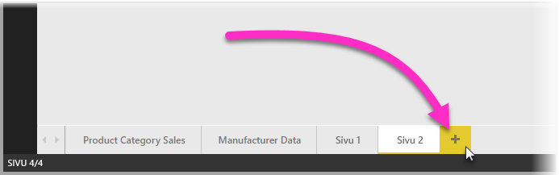

Työkaluvihje voi olla minkä kokoinen tahansa, mutta on hyvä pitää mielessä, että työkaluvihjeet tulevat näkyviin raporttipohjan päälle, joten haluat ehkä pitää ne kohtalaisen pieninä. **Muotoile**-ruudun **Sivun koko** -kortissa on uusi sivukokomalli nimeltä *Työkaluvihje*. Tämä tarjoaa raporttisivupohjan koon, joka on valmis työkaluvihjeellesi.

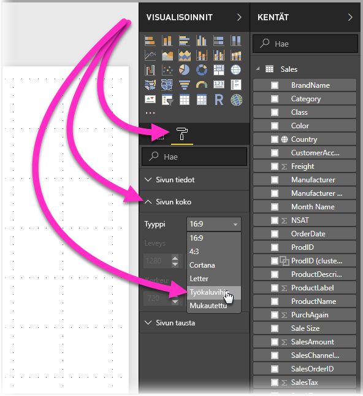

**Power BI Desktop** sovittaa oletusarvoisesti raporttipohjasi sivun käytettävissä olevaan tilaan. Tämä on usein hyvä, mutta ei työkaluvihjeiden kohdalla. Saat paremman käsityksen siitä, miltä valmis työkaluvihje näyttää, muuttamalla **Sivunäkymä**-asetukseksi todelliseen kokoon. 

Valitse ensin valintanauhasta **Näytä**-välilehti. Valitse sen jälkeen **Sivunäkymä > Todellinen koko**, kuten seuraavassa kuvassa esitetään.

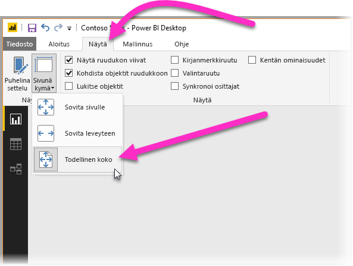

Voit myös nimetä raporttisivun siten, että sen tarkoitus on selkeä. Valitse **Muotoile**-ruudun **Sivun tiedot** -kortti ja kirjoita raportin nimi kortin **Nimi**-kenttään. Seuraavassa kuvassa työkaluvihjeen raportin nimi on *Tooltip1*, mutta voit vapaasti nimetä omasi paremmin.

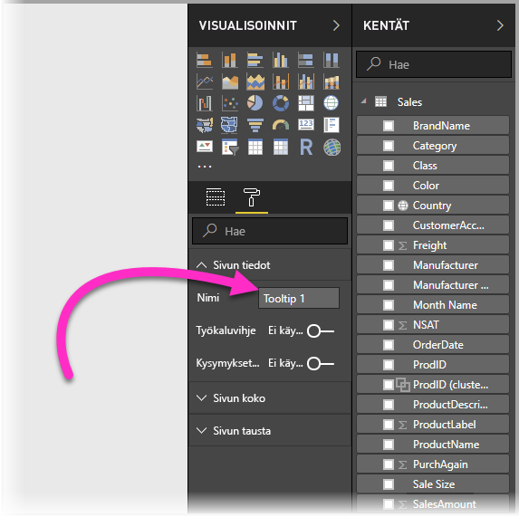

Tätä kautta voit luoda visualisointeja, joiden haluat näkyvän työkaluvihjeessä. Seuraavassa kuvassa on kaksi korttia ja yksi klusteroitu palkkikaavio työkaluvihjesivulla, minkä lisäksi siinä on itse sivun taustaväri ja jokaisen visualisoinnin taustat, jotka antavat sille haluamamme ulkoasun.

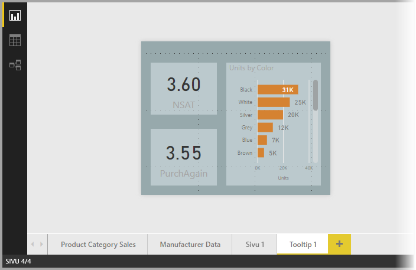

Ennen kuin työkaluvihjeen raporttisivu on valmis toimimaan työkaluvihjeenä, jäljellä on vielä muutama suoritettava vaihe. Sinun on määritettävä työkaluvihjeen sivu muutamalla tavalla, jotka kuvataan seuraavassa osiossa. 

## Määritä työkaluvihjeen raporttisivu

Kun olet luonut työkaluvihjeen raporttisivun, sinun on määritettävä sivu, jotta **Power BI Desktop** voi rekisteröidä sen työkaluvihjeeksi ja jotta voit varmistaa, että se näkyy oikeiden visualisointien päällä.

Aluksi sinun on asetettava **Sivun tiedot** -kortissa olevan **Työkaluvihjeen** liukusäädin asentoon **Käytössä**, jotta voit tehdä sivusta työkaluvihjeen. 

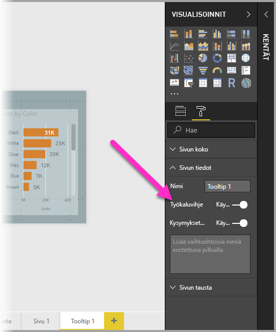

Kun liukusäädin on Käytössä-asennossa, voit määrittää kentät, joissa haluat raportin työkaluvihjeen näkyvän. Työkaluvihje tulee näkyviin raportin visualisointeihin, jotka sisältävät määrittämäsi kentän. Määritä haluamasi kenttä tai kentät vetämällä ne **Työkaluvihjekentät**-ryhmään, joka näkyy **Visualisoinnit**-ruudun **Kentät**-osassa. Seuraavassa kuvassa *SalesAmount*-kenttä on vedetty **Työkaluvihjekentät**-ryhmään.

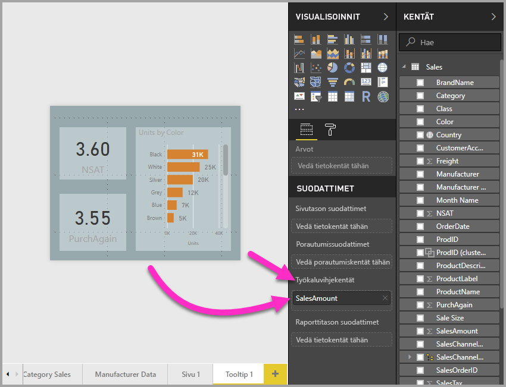
 
Voit sisällyttää **Työkaluvihjekentät**-ryhmään sekä luokittaisia että numeerisia kenttiä, mittayksiköt mukaan lukien.

Kun tämä on valmis, luomaasi työkaluvihjeen raporttisivua käytetään visualisoinneissa työkaluvihjeenä raportissa, joka käyttää **Työkaluvihjekentät**-ryhmään sijoittamiasi kenttiä, ja se korvaa oletusarvoisen Power BI -työkaluvihjeen.

## Raportin työkaluvihjeen asettaminen manuaalisesti

Sen lisäksi, että voit luoda työkaluvihjeen, joka tulee näkyviin automaattisesti, kun hiiren osoitinta pidetään määritetyn kentän sisältävän visualisoinnin päällä, voit asettaa työkaluvihjeen myös manuaalisesti. 

Kaikissa raportin työkaluvihjeitä tukevissa visualisoinneissa on nyt **Työkaluvihje**-kortti **muotoiluruudussa**. 

Voit asettaa työkaluvihjeen manuaalisesti valitsemalla ensin visualisoinnin, johon haluat manuaalisen työkaluvihjeen määrittää. Valitse sen jälkeen **Visualisoinnit**-ruudussa **Muotoile**-osa ja laajenna **Työkaluvihje**-kortti.

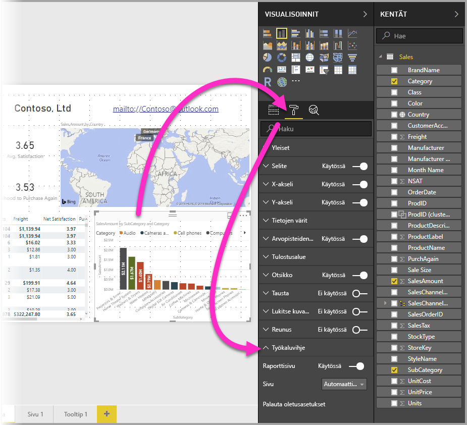

Valitse sitten avattavasta **Sivu**-valikosta työkaluvihjesivu, jota haluat käyttää valitussa visualisoinnissa. Huomaa, että vain **Työkaluvihje**-sivuiksi määritetyt raportin sivut näkyvät valintaikkunassa.

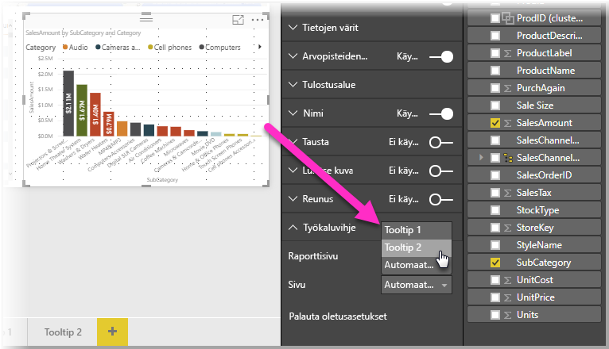

Sille, että työkaluvihjeen voi asettaa manuaalisesti, on useita käyttötarkoituksia. Voit määrittää työkaluvihjeelle tyhjän sivun ja ohittaa siten oletusarvoisesti valitun Power BI -työkaluvihjeen. Toinen käyttötarkoitus on, kun et halua käyttää työkaluvihjeenä Power BI:n automaattisesti valitsemaa työkaluvihjettä. Jos sinulla on esimerkiksi visualisointi, joka sisältää kaksi kenttää, joihin kumpaankin on liitetty työkaluvihje, Power BI valitsee näytettäväksi vain yhden. Tämä ei ehkä vastaa toiveitasi, joten voit valita manuaalisesti, minkä työkaluvihjeen haluat tulevan näkyviin.

## Oletusarvoisten työkaluvihjeiden palauttaminen

Jos olet luonut visualisointiin manuaalisen työkaluvihjeen, mutta haluatkin käyttää oletusarvoista työkaluvihjettä sen sijaan, voit aina palauttaa oletusarvoisen Power BI:n tarjoaman työkaluvihjeen. Voit palauttaa oletusarvoisen työkaluvihjeen, kun visualisointi on valittuna ja **Työkaluvihje**-kortti laajennettuna, valitsemalla avattavasta *Sivu*-valikosta **Automaattinen**.

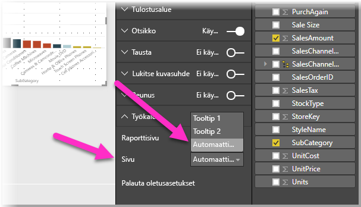

## Raporttien omat työkaluvihjeet ja viivakaaviot

On muutamia huomioon otettavia seikkoja, jotka kannattaa pitää mielessä, kun raportin työkaluvihjeet ovat vuorovaikutuksessa rivikaavion visualisointien kanssa ja ristiinkorostuksen aikana käytettävien visualisointien kanssa.

### Raporttien työkaluvihjeet ja viivakaaviot

Kun raportin työkaluvihje näytetään viivakaaviossa, kaavion kaikkien rivien osalta näkyviin tulee vain yksi työkaluvihje. Tämä vastaa oletusarvoisen työkaluvihjeen toimintaa viivakaavioissa, joka myös näyttää vain yhden työkaluvihjeen. 

Tämä johtuu siitä, että kentän selitettä ei välitetä työkaluvihjeen suodattimena. Seuraavassa kuvassa näkyvä raportin työkaluvihje näyttää kaikki kyseisenä päivänä kaikissa kolmessa luokassa myydyt yksiköt (tässä esimerkissä Deluxe, Economy ja Regular). 

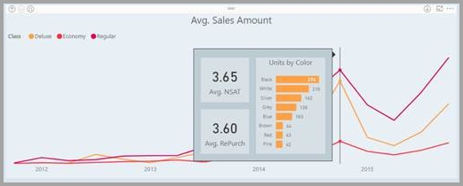

### Raportin työkaluvihjeet ja ristiinkorostus

Kun visualisointia ristiinkorostetaan raportissa, raportin työkaluvihjeet näyttävät aina ristiinkorostetut tiedot, myös silloin, kun hiiren osoitinta pidetään arvopisteen häivytetyn osan päällä. Seuraavassa kuvassa hiiren osoitin on pylväskaavion häivytetyn osan päällä (osa, joka ei ole korostettuna), mutta raportin työkaluvihje näyttää edelleen kyseisen arvopisteen (korostetut tiedot) korostetun osan tiedot.

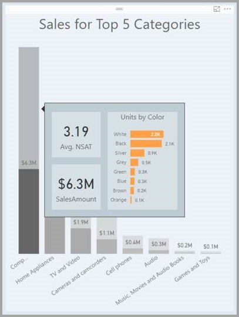

## Rajoitukset ja huomioitavat asiat
Muutamat **työkaluvihjeitä** koskevat rajoitukset ja tärkeät seikat on syytä huomioida.

* **Power BI Desktopin** joulukuun 2018 versiosta alkaen painikevisualisoinnit tukevat myös työkaluvihjeitä.
* Raporttityökaluvihjeitä ei tueta, kun raporttia tarkastellaan mobiilisovelluksella. 
* Raportin työkaluvihjeitä ei tueta mukautetuissa visualisoinneissa. 
* Klustereita ei tällä hetkellä tueta kenttinä, jotka voidaan näyttää raportin työkaluvihjeissä. 
* Valittaessa raportin työkaluvihjeiden kanssa näytettävää kenttää ja käytettäessä kenttää luokan asemesta kyseisen kentän sisältävät visualisoinnit näyttävät vain määritetyn työkaluvihjeen, kun valitun kentän yhteenveto on vastaava. 

## Seuraavat vaiheet
Seuraavissa artikkeleissa on lisätietoja ominaisuuksista, jotka muistuttavat raportin työkaluvihjeitä tai toimivat niiden kanssa:

* [Porautumisen käyttäminen Power BI Desktopissa](desktop-drillthrough.md)
* [Koontinäytön ruudun tai raporttivisualisoinnin näyttäminen kohdistustilassa](consumer/end-user-focus.md)

