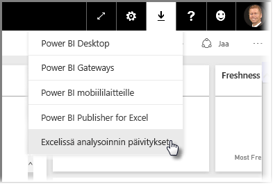
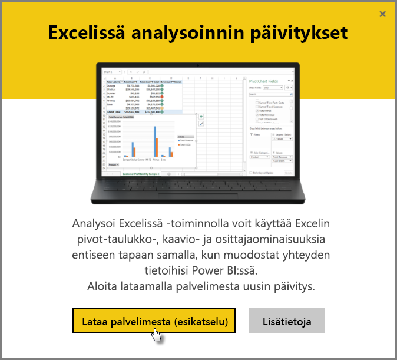
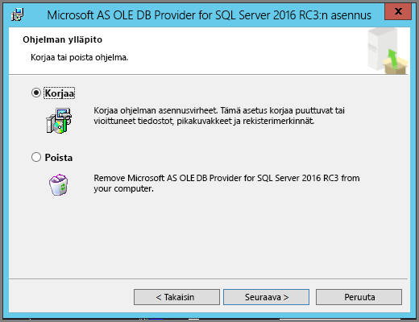
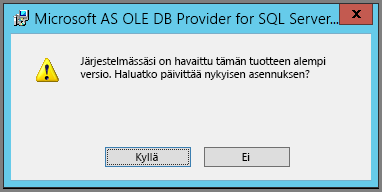

# Analysoi Excelissä -toiminnon vianmääritys
Analysoi Excelissä -toiminto voi ajoittain antaa odottamattomia tuloksia tai toimia odottamattomalla tavalla. Tämä sivu sisältää ratkaisuja yleisiin ongelmiin käytettäessä Analysoi Excelissä -toimintoa.

> [!NOTE]
> Lisätietoja [Analysoi Excelissä](service-analyze-in-excel.md) -toiminnon käyttämisestä on eri sivulla.
> 
> Jos kohtaat skenaarion, joka aiheuttaa ongelmia, etkä löydä sitä luettelossa, voit pyytää apua [yhteisösivustolla](http://community.powerbi.com/) tai luoda [tukipalvelupyynnön](https://powerbi.microsoft.com/support/).
> 
> 

Tässä artikkelissa on seuraavat osat:

* Päivitä OLE DB -palvelun Excel-kirjastot
* Excel-kirjastojen päivitysten tarpeen määrittäminen
* Yhteyden muodostaminen ei onnistu -virhe
* Kielletty-virhe
* Tietomalleja ei ole
* Tunnus on vanhentunut -virhe
* Yhteyden muodostaminen paikalliseen Analysis Services -palvelimeen epäonnistui
* Vetäminen ei onnistu Pivot-taulukon Arvot-alueelle (mittayksiköitä ei ole)

## Päivitä OLE DB -palvelun Excel-kirjastot
Jos haluat käyttää **Analysoi Excelissä** -toimintoa, tietokoneessa on oltava asennettuna aktiivinen AS OLE DB -palvelu. Tämä [yhteisön julkaisu](http://community.powerbi.com/t5/Service/Analyze-in-Excel-Initialization-of-the-data-source-failed/m-p/30837#M8081) on hyvä tietolähde, jos haluat tarkistaa OLE DB -palvelun asennuksen tai ladata uusimman version.

Excel-kirjastojen on vastattava Windows-version bittitasoa. Jos sinulla on asennettuna 64-bittinen Windows, sinun on asennettava 64-bittinen OLE DB -palvelu.

Lataa uusimmat Excel-kirjastot Power BI:ssä valitsemalla **alaspäin osoittavan nuolen** Power BI -palvelun oikeassa yläkulmassa ja sitten **Analysoi Excelissä -päivitykset**.

Valitse avautuvassa valintaikkunassa **Lataa (esikatselu)**.

## Excel-kirjastojen päivitysten tarpeen määrittäminen
Voit ladata uusimmat Excelin OLE DB -palvelun kirjastot edellisen osan linkkien kautta. Kun olet ladannut oikeaan OLE DB -palvelun kirjaston ja aloittanut asennuksen, nykyinen asennettu versio tarkistetaan.

Jos Excelin OLE DB -palvelun asiakaskirjastot ovat ajan tasalla, näyttöön tulee seuraavanlainen valintaikkuna:

C:\Users\davidi\Desktop\powerbi-content-pr\articles\media\powerbi-desktop-troubleshooting-analyze-in-excel

Vaihtoehtoisesti jos olet asentamassa uudempaa versiota, kuin mitä tietokoneessa on jo asennettuna, tulee näyttöön seuraava valintaikkuna:

Jos näet päivityskehotuksen, jatka asennusta. OLE DB -palvelun uusin versio asennettaan tietokoneeseen.

## Yhteyden muodostaminen ei onnistu -virhe
Ensisijainen syy *yhteyden epäonnistumiseen* on, että tietokoneen OLE DB -palvelun asiakaskirjastot eivät ole ajan tasalla. Lisätietoja oikean päivityksen selvittämisestä ja latauslinkeistä on tämän artikkelin aiemmassa osassa **Päivitä OLE DB -palvelun Excel-kirjastot**.

## Kielletty-virhe
Joillakin käyttäjillä on useampi Power BI -tili. Kun Excel yrittää muodostaa yhteyden Power BI:hin käyttäen tunnettuja tunnistetietoja, ohjelma saattaa käyttää tunnistetietoja, joilla ei ole kyseisen tietojoukon tai raportin käyttöoikeutta.

Tässä tapauksessa ohjelma saattaa antaa virhesanoman otsikolla **Kielletty**, mikä tarkoittaa, että olet ehkä kirjautunut Power BI:hin tunnistetiedoilla, joiden oikeudet eivät riitä tietojoukkoon. Kun havaitset **Kielletty**-virheen ja sinua pyydetään antamaan tunnistetiedot, käytä niitä tunnistetietoja, joilla on kyseisen tietojoukon käyttöoikeudet.

Jos kohtaat edelleen virheitä, kirjaudu Power BI:hin tilillä, jolla on käyttöoikeudet, ja varmista, että voit tarkastella ja käyttää sitä tietojoukkoa, jota yrität käyttää Excelissä.

## Tietomalleja ei ole
Jos kohtaat virheen, joka ilmoittaa, että **OLAP-kuution mallia ei löydy**, kyseisellä tietojoukolla ei ole tietomallia, joten sitä ei voida analysoida Excelissä.

## Tunnus on vanhentunut -virhe
**Tunnus on vanhentunut** -virhe tarkoittaa, että et ole vähään aikaan käyttänyt **Analysoi Excelissä** -toimintoa kyseisessä tietokoneessa. Anna tunnistetietosi tai avaa tiedosto uudelleen, niin virheen pitäisi hävitä.

## Yhteyden muodostaminen paikalliseen Analysis Services -palvelimeen epäonnistui
Jos yrität käyttää tietojoukkoa, jolla on yhteyksiä paikallisiin Analysis Services -tietoihin, näyttöön saattaa tulla virhesanoma. **Analysoi Excelissä** tukee paikallisten **Analysis Services** -tietojoukkojen ja raporttien käyttöä yhteysmerkkijonon avulla, kunhan tietokone on samassa toimialueessa kuin **Analysis Services** -palvelin ja tilillä on **Analysis Services** -palvelimen käyttöoikeus.

## Vetäminen ei onnistu Pivot-taulukon Arvot-alueelle (mittayksiköitä ei ole)
Kun **Analysoi Excelissä** muodostaa yhteyden ulkoiseen OLAP-malliin (näin Excel yhdistää Power BI:hin), *Pivot-taulukko* [edellyttää määritettyjä **toimenpiteitä** ulkoisessa mallissa](https://support.microsoft.com/kb/234700), koska kaikki laskutoimitukset suoritetaan palvelimella. Tämä on eri kuin käsiteltäessä paikallista tietolähdettä (kuten taulukoita Excelissä tai tietojoukkoja **Power BI Desktopissa** tai **Power BI -palvelussa**), jolloin taulukkomalli on käytettävissä paikallisesti ja [voit käyttää implisiittisiä mittayksiköitä](https://msdn.microsoft.com/library/gg399077.aspx), jotka ovat dynaamisesti luotuja toimenpiteitä, joita ei tallenneta tietomalliin. Näissä tapauksissa toiminta Excelissä eroaa **Power BI Desktopista** tai **Power BI -palvelusta**: tiedoissa voi olla sarakkeita, joita voidaan käsitellä mittayksiköinä Power BI:ssä mutta ei arvoina (mittayksiköinä) Excelissä.

Tämän ongelman ratkaisuun on muutamia vaihtoehtoja:

1. Luo [tietomallin mittayksiköt **Power BI Desktopissa**](desktop-tutorial-create-measures.md), julkaise tietomalli **Power BI -palveluun** ja käytä julkaistua tietojoukkoa Excelissä.
2. Luo [tietomallin mittayksiköt Excel PowerPivotissa](https://support.office.com/article/Create-a-Measure-in-Power-Pivot-d3cc1495-b4e5-48e7-ba98-163022a71198).
3. Jos olet tuonut tietoja Excel-työkirjasta, jossa on vain taulukoita (ei tietomallia), voit tämän jälkeen [lisätä taulukot tietomalliin](https://support.office.com/article/Add-worksheet-data-to-a-Data-Model-using-a-linked-table-d3665fc3-99b0-479d-ba09-a37640f5be42) ja sitten luoda mittayksiköitä tietomallissa noudattamalla vaihtoehdon 2 ohjeita yllä.

Kun mittayksiköt on määritetty mallissa Power BI -palvelussa, niitä voidaan käyttää **Arvot**-alueella Excelin Pivot-taulukoissa.

## Seuraavat vaiheet
[Analysoi Excelissä](service-analyze-in-excel.md)

[Opetusohjelma: Omien mittayksiköiden luominen Power BI Desktopissa](desktop-tutorial-create-measures.md)

[Mittayksiköt PowerPivotissa](https://msdn.microsoft.com/library/gg399077.aspx)

[Mittayksiköiden luominen PowerPivotissa](https://support.office.com/article/Create-a-Measure-in-Power-Pivot-d3cc1495-b4e5-48e7-ba98-163022a71198)

[Laskentataulukkotietojen lisääminen tietomalliin linkitetyn taulukon avulla](https://support.office.com/article/Add-worksheet-data-to-a-Data-Model-using-a-linked-table-d3665fc3-99b0-479d-ba09-a37640f5be42)

[OLAP-Pivot- ja muiden taulukoiden erot Excelissä](https://support.microsoft.com/kb/234700)

