# Opetusohjelma: Laskettujen sarakkeiden luominen Power BI Desktopissa

Joskus analysointisi kohteena olevat tiedot eivät sisällä tiettyä kenttää, jota tarvitsisit saadaksesi haluamiasi tuloksia. Tässä vaiheessa mukaan kuvaan tulevat *lasketut sarakkeet*. Lasketut sarakkeet määrittävät Data Analysis Expressions (DAX) -kaavojen avulla sarakkeen arvot, mikä voi tarkoittaa mitä tahansa aina tekstiarvojen yhdistämisestä muutamasta eri sarakkeesta numeerisen arvon laskemiseen muiden arvojen perusteella. Tiedoissasi voi olla esimerkiksi **Kaupunki**- ja **Osavaltio**-kentät, mutta haluat yhden **Sijainti**-kentän, jossa nämä kumpikin ilmoitetaan, kuten ”Miami, FL”. Lasketut sarakkeet on tarkoitettu juuri tähän tarkoitukseen.

Lasketut sarakkeet muistuttavat [mittayksiköitä](desktop-tutorial-create-measures.md) siinä, että molemmat perustuvat DAX-kaavoihin, mutta niiden käyttötavat ovat erilaiset. Mittayksiköitä käytetään usein visualisoinnin **Arvot**-alueella, kun halutaan laskea tuloksia muiden kenttien perusteella. Laskettuja sarakkeita käytetään uusina **Kenttinä** visualisointien Rivit-, Akselit-, Selitteet- ja Ryhmä-alueilla.

Tässä opetusohjelmassa kerrotaan Power BI Desktopin lasketuista sarakkeista, niiden luomisesta sekä niiden käyttämisestä raportin visualisoinneista. 

### Edellytykset
- Tämä opetusohjelma on tarkoitettu kehittyneempien mallien luomiseen Power BI -käyttäjille, joille Power BI Desktopin käyttö on jo tuttua. Edellytyksenä on, että osaat jo tuoda tietoja **Nouda tiedot** -toiminnon ja **Power Query Editorin** avulla, työskennellä useiden toisiinsa liitettyjen taulukoiden kanssa ja lisätä kenttiä raporttipohjaan. Jos olet vasta aloittamassa Power BI Desktopin käyttöä, muista tutustua [Power BI Desktopin käytön aloittaminen](desktop-getting-started.md) -resurssiin.
  
- Tämä opetusohjelma käyttää [Contoso Sales Sample for Power BI Desktop](http://download.microsoft.com/download/4/6/A/46AB5E74-50F6-4761-8EDB-5AE077FD603C/Contoso%20Sales%20Sample%20for%20Power%20BI%20Desktop.zip) -näytettä. Kyse on samasta näytteestä, jota käytetään [Omien mittayksiköiden luominen Power BI Desktopissa](desktop-tutorial-create-measures.md) -opetusohjelmassa. Kuvitteellisen yrityksen, Contoso, Inc:n, myyntitiedot on tuotu tietokannasta, joten et voi muodostaa yhteyttä tietolähteeseen tai tarkastella niitä Power Query Editorissa. Lataa ja pura tiedosto omalle tietokoneellesi ja avaa se Power BI Desktopissa.

## Lasketun sarakkeen luominen liittyvien sarakkeiden arvoilla

Myyntiraportissa haluat tuoteluokat ja aliluokat näkyviin yksittäisinä arvoina riveillä, kuten ”Matkapuhelimet – Lisävarusteet”, ”Matkapuhelimet – Älypuhelimet ja PDA-laitteet”, ja niin edelleen. **Kentät**-luettelossa ei ole näitä tietoja antava kenttää, mutta siellä on **ProductCategory**-kenttä ja **ProductSubcategory**-kenttä, kukin omassa taulukossa. Voit luoda lasketun sarakkeen, joka yhdistää näiden kahden sarakkeen arvot. DAX-kaavat voivat hyödyntää täydellisesti sinulla jo ennestään olevaa mallia, mukaan lukien jo olemassa olevien taulukoiden väliset suhteet. 

 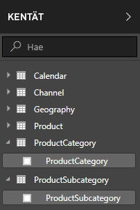

1.  Valitse kolmea **Enemmän vaihtoehtoja** -pistettä (...) tai napsauta hiiren kakkospainikkeella Kentät-luettelon **ProductSubcategory**-taulukkoa ja valitse **Uusi sarake**. Tämä luo uuden sarakkeen ProductSubcategory-taulukkoon.
    
    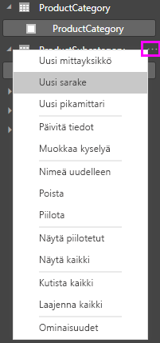
    
    Raporttipohjan yläosaan tulee näkyviin kaavarivi, johon voit nimetä sarakkeen ja kirjoittaa DAX-kaavan.
    
    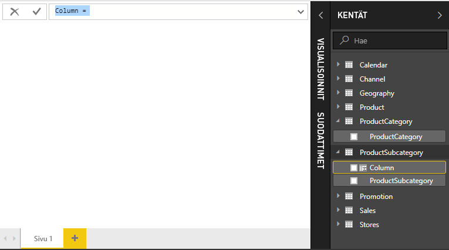
    
2.  Uuden sarakkeen nimi on oletusarvoisesti vain Sarake. Jos et nimeä sitä uudelleen, uusille sarakkeille annetaan nimeksi Sarake 2, Sarake 3 ja niin edelleen. Haluat varmasti sarakkeen olevan helpommin tunnistettava, joten koska **Sarake**-nimi on jo korostettu kaavarivillä, nimeä se uudelleen kirjoittamalla **ProductFullCategory** ja lisää sitten yhtäläisyysmerkki (**=**).
    
3.  Haluat uudessa sarakkeessa olevien arvojen alkavan ProductCategory-nimellä. Koska tämä sarake on erilaisessa, mutta liittyvässä taulukossa, voit käyttää apuna sen hakemisessa [RELATED](https://msdn.microsoft.com/library/ee634202.aspx) (SUHTEET) -funktiota.
    
    Kirjoita yhtäläisyysmerkin jälkeen kirjain **r**. Avattava valikko näyttää kaikki kirjaimella R alkavat DAX-funktiot. Kunkin funktion valitseminen näyttää sen vaikutuksen kuvauksen. Kirjoittaessasi ehdotusluettelo Skaalaa lähemmäs tarvitsemaasi funktiota. Valitse **RELATED** (SUHTEET) ja paina **Enter**-painiketta.
    
    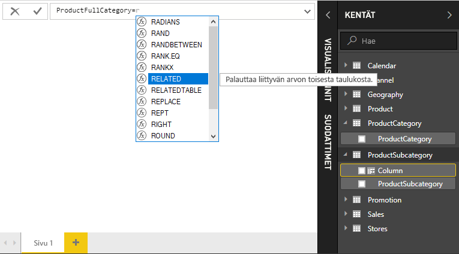
    
    Vasen sulkumerkki ilmestyy näkyviin yhdessä toisen ehdotusluettelon kanssa, joka sisältää RELATED-funktioon välitettävissä olevat liittyvät sarakkeet, sisältäen kuvauksia ja tietoja odotetuista parametreista. 
    
    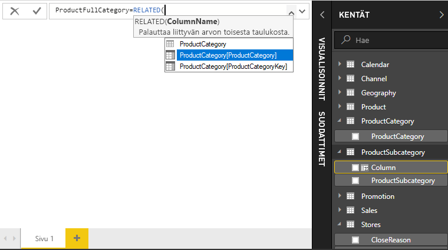
    
4.  Haluat **ProductCategory**-taulukon **ProductCategory**-sarakkeen. Valitse **ProductCategory [ProductCategory]**, paina **Enter**-painiketta ja kirjoita oikea sulkumerkki.
    
    > [!TIP]
    > Syntaksivirheitä aiheutuvat useimmin puuttuvasta tai väärään paikkaan sijoitetusta loppusulkeesta, vaikka joskus Power BI Desktop lisää sen puolestasi.
    
4. Haluat, että yhdysmerkit ja välilyönnit erottelevat ProductCategories- ja ProductSubcategories-arvot uusissa arvoissa, joten ensimmäinen lausekkeen loppusulkeen jälkeen lisää välilyönti, et-merkki (**&**), kaksinkertainen lainausmerkki (**”**), välilyönti, ajatusviiva (**-**), toinen välilyönti, toinen kaksinkertainen lainausmerkki ja toinen et-merkki. Kaavan pitäisi nyt näyttää tältä:
    
    `ProductFullCategory = RELATED(ProductCategory[ProductCategory]) & " - " &`
    
    > [!TIP]
    > Jos tarvitset lisää tilaa, laajenna kaavaeditoria valitsemalla kaavarivin oikealla puolella oleva alaspäin osoittava nuoli. Editorissa siirry seuraavalle riville painamalla **Alt- ja Enter**-näppäimiä ja siirry kohteesta toiseen käyttämällä **Tab**-näppäintä.
    
5.  Tee kaava valmiiksi kirjoittamalla avaava hakasulje (**[**) ja valitsemalla **[ProductSubcategory]**-sarake. 
    
    
    
    Sinun ei tarvinnut käyttää toista RELATED-funktiota ProductSubcategory-taulukon kutsumiseksi toisessa lausekkeessa, koska olet luomassa laskettua saraketta tähän taulukkoon. Voit syöttää [ProductSubcategory]-sarakkeeseen taulukon nimen etuliitteen (täydellinen) tai jättää sen ilman (ei täydellinen).
    
6.  Tee kaava valmiiksi painamalla **Enter**-näppäintä tai valitsemalla kaavarivin valintamerkin. Kaava vahvistetaan, ja **ProductFullCategory**-sarakkeen nimi näkyy Kentät-luettelon **ProductSubcategory**-taulukossa. 
    
    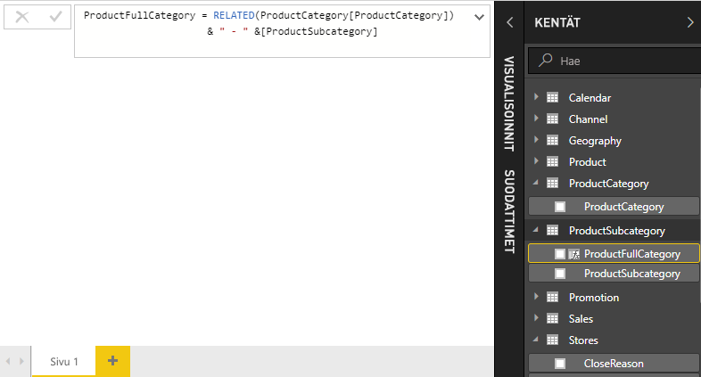
    
    >[!NOTE]
    >Power BI Desktopissa lasketut sarakkeet saavat kenttäluetteloon erityisen kuvakkeen, joka näyttää, että ne sisältävät kaavoja. Power BI -palvelussa (Power BI -sivusto) kaavoja ei voi muuttaa, joten lasketuissa sarakkeissa ei ole kuvakkeita.
    
## Uuden sarakkeen käyttäminen raportissa

Nyt voit käyttää uutta ProductFullCategory-saraketta SalesAmount-kaavion tarkasteluun ProductFullCategory-sarakkeen perusteella.

1. Valitse tai vedä **ProductFullCategory**-sarake **ProductSubcategory**-taulukosta raporttipohjalle, jos haluat luoda taulukon, jossa näkyvät kaikki ProductFullCategory-nimet.
   
   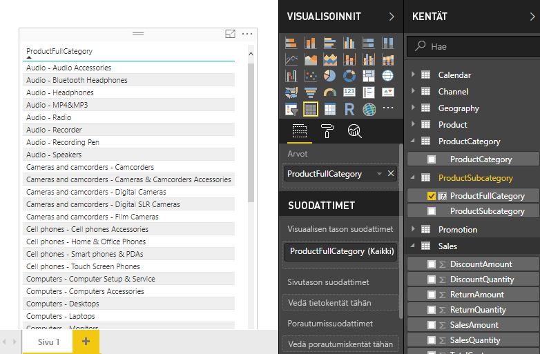
    
2. Valitse tai vedä **SalesAmount** -kenttä **Sales**-taulukosta taulukkoon, jos haluat näyttää kunkin ProductFullCategory-sarakkeen SalesAmount-arvon.
   
   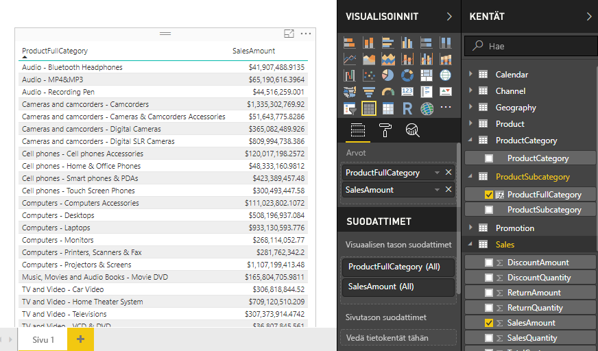
    
## IF-funktiota käyttävän lasketun sarakkeen luominen

Contoso Sales Sample sisältää sekä aktiivisten että passiivisten myymälöiden myyntitietoja. Voit varmistaa, että aktiivisen myymälän myynti on raportissa selvästi erillään passiivisen myymälän myynnistä, luomalla Active StoreName -kentän. Uudessa lasketussa Active StoreName -sarakkeessa kukin aktiivinen myymälä näkyy myymälän koko nimellä, kun taas passiiviset myymälät ryhmitellään yhteen ”Inactive”-kohtaan. 

Onneksi Stores-taulukossa on sarake nimeltä **Status**, jossa on arvot ”On” aktiivisille myymälöille ja ”Off” passiivisille myymälöille. Voimme käyttää niitä luomaan arvoja uutta Active StoreName-saraketta varten. DAX-kaava käyttää loogista [IF](https://msdn.microsoft.com/library/ee634824.aspx) (JOS) -funktiota testatakseen kunkin myymälän Status-tilan ja palauttaakseen tietyn arvon tuloksesta riippuen. Jos myymälän Status-tila on ”On” (Käytössä), kaava palauttaa myymälän nimen. Jos se on ”Off”, kaava määrittää Active StoreName -arvoksi ”Inactive”. 

1.  Luo **Stores**-taulukkoon uusi laskettu sarake ja anna sille kaavarivillä nimeksi **Active StoreName**.
    
2.  Merkin **=** jälkeen kirjoita **IF**. Ehdotusluettelo näyttää, mitä voit lisätä. Valitse **IF**.
    
    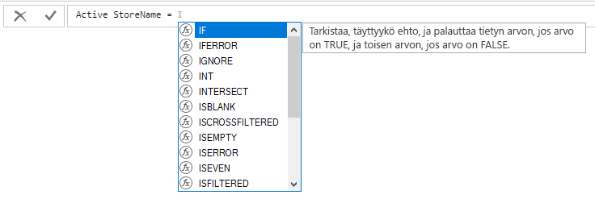
    
3.  IF-funktion ensimmäinen argumentti on looginen testi siitä, onko myymälän tila ”On”. Kirjoita avaava hakasulje **[**, joka luetteloi sarakkeet Myymälät-taulukosta, ja valitse **[Status]** (tila).
    
    ![Valitse [Status] (Tila)](media/desktop-tutorial-create-calculated-columns/if2.png)
    
4.  Kirjoita heti kohdan **[Status]** jälkeen **="On"** ja lisää sitten pilkku (**,**) lopettamaan argumentti. Työkaluvihje ehdottaa, että sinun on lisättävä arvo, joka palautetaan, kun tulos on TRUE.
    
    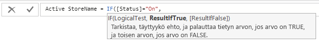
    
5.  Jos myymälän tila on ”On” (Käytössä), haluat näkyviin myymälän nimen. Kirjoita avaava hakasulje (**[**) ja valitse **[StoreName]**-sarake. Lisää sen jälkeen toinen pilkku. Työkaluvihje osoittaa, että sinun on nyt lisättävä arvo, joka palautetaan, kun tulos on FALSE. 
    
    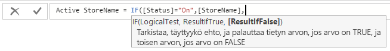
    
6.  Haluat arvon olevan *Inactive*, joten kirjoita **”Inactive”** ja täydennä sen jälkeen kaava painamalla **Enter**-painiketta tai valitsemalla valintamerkki kaavarivillä. Kaava vahvistetaan ja uuden sarakkeen nimi ilmestyy **Stores**-taulukkoon Kentät-luettelossa.
    
    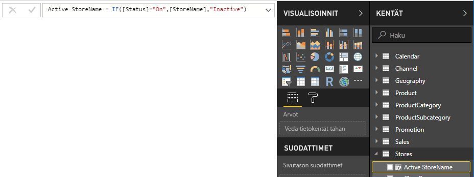
    
8.  Voit visualisoinneissa käyttää myös uutta Active StoreName -saraketta, aivan kuten mitä tahansa muuta kenttää. SalesAmounts by Active StoreName -taulukon näyttämiseksi valitse **Active StoreName** -kenttä tai vedä se pohjalle ja valitse **SalesAmount**-kenttä tai vedä se taulukkoon. Tämä taulukko näyttää aktiiviset kaupat erikseen nimen mukaan, mutta passiiviset myymälät on ryhmitelty yhdessä loppuun nimellä *Inactive*. 
    
    
    
## Opitut asiat
Laskettujen sarakkeiden avulla voit rikastaa tietojasi ja saada helpommin merkityksellisiä tietoja. Olet oppinut, miten luodaan laskettuja sarakkeita kenttäluettelossa ja kaavarivillä, käytetään ehdotusluetteloita ja työkaluvihjeitä kaavojen muodostamisen apuna, kutsutaan DAX-funktioita, kuten RELATED ja IF, sopivilla argumenteilla ja käytetään laskettuja sarakkeita raportin visualisoinneissa.

## Seuraavat vaiheet
Jos haluat tutustua tarkemmin DAX-kaavoihin ja siihen, miten laskettuja sarakkeita voi luoda edistyneemmillä kaavoilla, lue [DAX-perusteet Power BI Desktopissa](desktop-quickstart-learn-dax-basics.md). Tässä artikkelissa keskitytään DAX-peruskäsitteisiin, kuten syntaksiin ja funktioihin, ja annetaan tarkempaa tietoa kontekstista.

Muista lisätä [Data Analysis Expressions (DAX) -viite](https://msdn.microsoft.com/library/gg413422.aspx) suosikkeihin. Sieltä saat tarkempia tietoja DAX-syntaksista ja -operaattoreista sekä yli 200 DAX-funktiosta.

