# Opetusohjelma: Omien mittayksiköiden luominen Power BI Desktopissa
Voit luoda tehokkaimpiin kuuluvia tietojen analysointiratkaisuja Power BI Desktopissa käyttämällä mittayksiköitä. Mittayksiköt auttavat suorittamalla tiedoillesi laskutoimituksia samalla, kun käsittelet raporttejasi. Tässä opetusohjelmassa kerrotaan Power BI Desktopin mittayksiköistä ja siitä, kuinka voit luoda omia perusmittayksiköitä.

### Edellytykset
- Tämä opetusohjelma on tarkoitettu kehittyneempien mallien luomiseen Power BI -käyttäjille, joille Power BI Desktopin käyttö on jo tuttua. Edellytyksenä on, että osaat jo tuoda tietoja Nouda tiedot -toiminnon ja kyselyeditorin avulla, työskennellä useiden toisiinsa liitettyjen taulukoiden kanssa ja lisätä kenttiä raporttipohjaan. Jos olet vasta aloittamassa Power BI Desktopin käyttöä, muista tutustua [Power BI Desktopin käytön aloittaminen](desktop-getting-started.md) -resurssiin.
  
- Lataa [Contoson Sales Sample Power BI Desktopille](http://download.microsoft.com/download/4/6/A/46AB5E74-50F6-4761-8EDB-5AE077FD603C/Contoso%20Sales%20Sample%20for%20Power%20BI%20Desktop.zip) -tiedosto, joka sisältää fiktiivisen Contoso, Inc. -yrityksen online-myyntitietoja. Nämä tiedot on tuotu tietokannasta, joten et voi muodostaa yhteyttä tietolähteeseen tai tarkastella niitä kyselyeditorissa. Pura tiedosto omalle tietokoneellesi ja avaa se Power BI Desktopissa.

## Tietoa mittayksiköistä

Mittayksiköt luodaan useimmiten puolestasi automaattisesti. Valitse Contoso Sales Sample -tiedoston Kentät-ruudussa näkyvän **Sales**-taulukon **SalesAmount**-valintaruutu tai vedä **SalesAmount** raporttipohjaan. Näyttöön tulee uusi pylväskaaviovisualisointi, joka näyttää Sales-taulukon SalesAmount-sarakkeen kaikkien arvojen kokonaissumman.

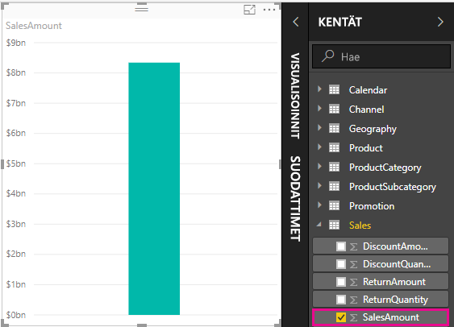

Kentät, jotka näkyvät Kentät-ruudussa sigma-kuvakkeella  merkittynä, ovat numeerisia, ja niiden arvot voidaan koostaa. Sen sijaan, että Power BI Desktop näyttäisi kaikki kaksi miljoonaa SalesAmount-arvoja sisältävää riviä, se havaitsi numeerisen tietotyypin ja loi ja laski mittayksikön tietojen koostamista varten. Summa on numeerisen tietotyypin oletuskooste, mutta voit helposti käyttää eri koosteita, kuten keskiarvo tai määrä. Koosteiden ymmärtäminen on keskeistä mittayksiköiden ymmärtämiselle, koska jokainen mittayksikkö suorittaa jonkinlaisen koostamisen. 

Jos haluat muuttaa kaavion koosteeksi keskiarvon Visualisoinnit-ruudun **Arvo**-alueella, napsauta **SalesAmount**-kohdan alanuolta ja valitse **Keskiarvo**. Visualisointi muuttuu kaikkien myyntiarvojen keskiarvoksi SalesAmount-kentässä.

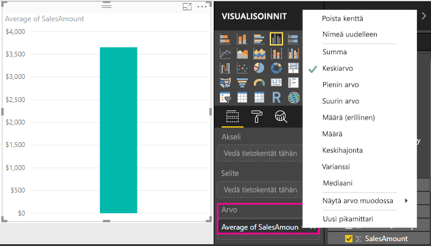

Voit muuttaa koosteen tyyppiä sen mukaan, minkälaisen tuloksen haluat, mutta kaikki koostetyypit eivät päde jokaiseen numeeriseen tietotyyppiin. Esimerkiksi SalesAmount-kentän osalta summa ja keskiarvo ovat järkeviä. Suurimmalla ja pienimmällä arvolla on myös paikkansa. Mutta Summa-arvo ei ole kovinkaan järkevä SalesAmount-kentässä, sillä vaikka sen arvot ovatkin numeerisia, ne ilmaisevat todellisuudessa valuuttaa.

Mittayksiköistä lasketut arvot muuttuvat vastauksena raportin kanssa tekemiesi toimien kanssa. Jos esimerkiksi vedät **RegionCountryName**-kentän **Geography**-taulukosta kaavioon, näkyviin tulevat kunkin maan keskimääräiset myyntimäärät.

Kun mittayksikön tulos muuttuu raportissa tekemiesi toimien vuoksi, toimesi ovat vaikuttaneet mittayksikön *kontekstiin*. Aina tehdessäsi toimia raportin visualisoinneille, muutat kontekstia, jossa mittayksikkö laskee ja näyttää tuloksensa.

## Omien mittayksiköiden luonti ja käyttö

Useimmissa tapauksissa Power BI laskee ja palauttaa arvoja automaattisesti valitsemiesi kenttien ja koosteiden tyyppien mukaan, mutta joissakin tapauksissa haluat ehkä luoda omia mittayksiköitä, jotka suorittavat monimutkaisempia ja yksilöllisempiä laskutoimituksia. Power BI Desktopilla voit luoda omia mittayksiköitä Data Analysis Expressions (DAX) -kaavan kielellä. 

DAX-kaavat käyttävät monia samoja funktioita, operaattoreita ja syntakseja kuin Excel-kaavat. DAX-funktiot on kuitenkin suunniteltu toimimaan relaatiotietojen kanssa ja suorittamaan dynaamisempia laskutoimituksia, kun teet toimia raporteissasi. DAX-funktioita on yli 200, ja ne tekevät kaikkea yksinkertaisista koosteista, kuten summa ja keskiarvo, monimutkaisiin tilasto- ja suodatusfunktioihin. Saatavilla on useita resursseja, joista saat lisätietoja DAX-kaavasta. Kun olet päässyt tämän opetusohjelman loppuun, muista tutustua resurssiin [DAX-perusteet Power BI Desktopissa](desktop-quickstart-learn-dax-basics.md).

Kun luot oman mittayksikön, se lisätään valitsemasi taulukon Kentät-luetteloon, ja sitä kutsutaan *mallimittayksiköksi*. Mallimittayksiköiden etuina ovat mm. se, että voit nimetä ne haluamallasi tavalla, jolloin ne ovat paremmin tunnistettavissa. Lisäksi voit käyttää niitä argumentteina muissa DAX-lausekkeissa ja laatia ne suorittamaan monimutkaisia laskutoimituksia hyvin nopeasti.

>[!TIP]
>Power BI Desktopin helmikuun 2018 versiosta alkaen monet yleiset laskutoimitukset ovat saatavilla **pikamittareina**, jotka kirjoittavat DAX-kaavat puolestasi valintaikkunaan antamiesi tietojen perusteella. Nämä nopeat ja tehokkaat laskutoimitukset sopivat erinomaisesti myös DAX:n opetteluun tai omien mittayksiköidesi alkuarvojen sijoittamiseen. Voit luoda pikamittareita tai tutustua niihin valitsemalla **Uusi pikamittari** -vaihtoehdon taulukon **Enemmän vaihtoehtoja** -luettelosta tai Aloitus-välilehden **Laskutoimitukset**-valintanauhasta. Lisätietoja pikamittareiden luonnista ja käytöstä saat artikkelista [Pikamittareiden käyttö](desktop-quick-measures.md).

### Mittayksikön luominen

Haluat analysoida nettomyyntiäsi vähentämällä alennukset ja palautukset myynnin kokonaismääristä. Olipa visualisointisi konteksti mikä tahansa, tarvitset mittayksikön, joka vähentää DiscountAmount- ja ReturnAmount-arvojen summan SalesAmount-summasta. Nettomyynnille ei ole kenttää Kentät-luettelossa, mutta käytössäsi on elementtejä, joilla voit luoda oman mittayksikön nettomyynnin laskemista varten. 

1.  Napsauta Kentät-ruudun **Sales**-taulukkoa hiiren kakkospainikkeella tai pidä hiiren osoitinta taulukon päällä ja valitse **Enemmän vaihtoehtoja** -ellipsi (...) ja sen jälkeen **Uusi mittayksikkö**. Tämä tallentaa uuden mittayksikön Sales-taulukkoon, josta se on helpompi löytää.
    
    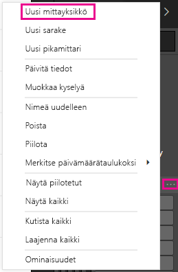
    
    Voit luoda uuden mittayksikön myös valitsemalla Power BI Desktopin valintanauhan Aloitus-välilehden Laskutoimitukset-ryhmästä **Uusi mittayksikkö** -vaihtoehdon.
    
    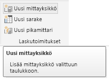
    
    >[!TIP]
    >Luodessasi mittayksikön valintanauhan kautta se voidaan luoda missä tahansa taulukossa, mutta se on helpompi löytää, jos luot sen paikkaan, jossa aiot käyttää sitä. Valitse tässä tapauksessa ensin Sales-taulukko, jotta se aktivoituu, ja valitse sitten **Uusi mittayksikkö**. 
    
    Raporttipohjan yläosaan tulee näkyviin kaavarivi, johon voit nimetä mittayksikön ja kirjoittaa DAX-kaavan.
    
    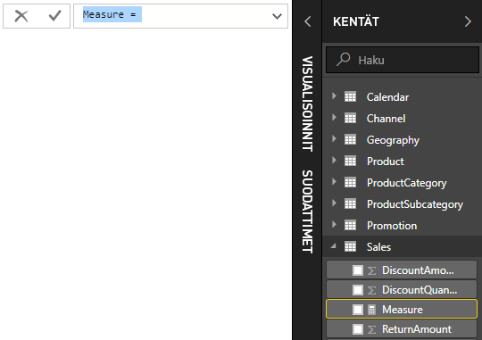
    
2.  Uuden mittayksikön oletusnimeksi annetaan yksinkertaisesti Mittayksikkö. Jos et nimeä sitä uudelleen, sitä seuraavat uudet mittayksiköt saavat nimen Mittayksikkö 2, Mittayksikkö 3 jne. Haluat mittayksiköiden olevan paremmin tunnistettavissa, joten korosta kaavarivin **Mittayksikkö**-kohta ja kirjoita sitten **Net Sales**.
    
3.  Nyt voit aloittaa kaavan kirjoittamisen. Ala kirjoittamaan yhtäläisyysmerkin jälkeen sanaa **Sum**. Kirjoittaessasi näkyviin tulee ehdotusluettelo, jossa näkyvät kaikki DAX-funktiot, jotka alkavat kirjoittamillasi kirjaimilla. Vieritä tarvittaessa alaspäin, valitse luettelosta **SUM** ja paina lopuksi Enter-näppäintä.
    
    
    
    Näkyviin tulee vasen sulkumerkki ja toinen avautuva ehdotusluettelo kaikista saatavilla olevista sarakkeista, jotka voit välittää SUM-funktioon.
    
    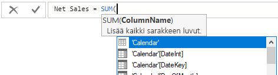
    
    Lausekkeet näkyvät aina vasemman ja oikean sulkumerkin välissä. Lauseke sisältää yhden argumentin välitettäväksi SUM-funktioon: SalesAmount-sarake. Ala kirjoittaa "SalesAmount", kunnes luettelossa on jäljellä vain yksi arvo: Sales(SalesAmount). Taulukon nimen edessä olevaa sarakkeen nimeä kutsutaan sarakkeen *täydelliseksi nimeksi*. Sarakkeiden täydelliset nimet helpottavat kaavojen lukemista. 
    
    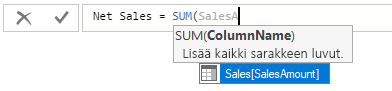
    
4. Valitse **Sales[SalesAmount]** ja kirjoita loppusulje.
    
    > [!TIP]
    > Syntaksivirheiden syynä on useimmiten puuttuvat tai väärin sijoitetut loppusulkeet.
    
    
    
5.  Kahden muun sarakkeen vähentäminen:
    1. Kirjoita ensimmäisen lausekkeen loppusulkeen jälkeen välilyönti, miinusoperaattori (**-**) ja toinen välilyönti. 
    2. Syötä toinen SUM-funktio ja ala kirjoittaa "DiscountAmount", kunnes voit valita **Sales[DiscountAmount]**-sarakkeen argumentiksi. Lisää loppusulje. 
    3. Kirjoita välilyönti, toinen miinusoperaattori, välilyönti, toinen SUM-funktio, jonka argumenttina on **Sales[ReturnAmount]** ja loppusulje.
    
    
    
6.  Vahvista valmis kaava painamalla Enter-näppäintä tai napsauttamalla kaavarivin valintamerkkiä. Vahvistettu mittayksikkö on nyt valmis käytettäväksi Sales-taulukon kenttäluettelossa. 
    
    
    
Jos kaavan syöttöä varten tarkoitettu tila on loppumassa tai haluat sen erillisille riveille, valitse kaavarivin oikeassa sivussa näkyvä alaspäin osoittava nuoli, jolloin saat lisää tilaa.

Voit erottaa kaavan osat eri riveille painamalla **Alt + Enter**, tai siirtää kohteita käyttämällä **sarkainta**.

### Oman mittayksikön käyttö raportissa
Voit nyt lisätä Net Sales -mittayksikön raporttipohjaan ja laskea nettomyynnin mille tahansa muille kentille, jotka lisäät raporttiin. Voit tarkastella maakohtaista nettomyyntiä seuraavasti:

1. Valitse **Net Sales** -mittayksikkö **Sales**-taulukosta tai vedä se raporttipohjaan.
    
2. Valitse **Geography**-taulukosta **RegionCountryName**-kenttä tai vedä sen kaavioon.
    
    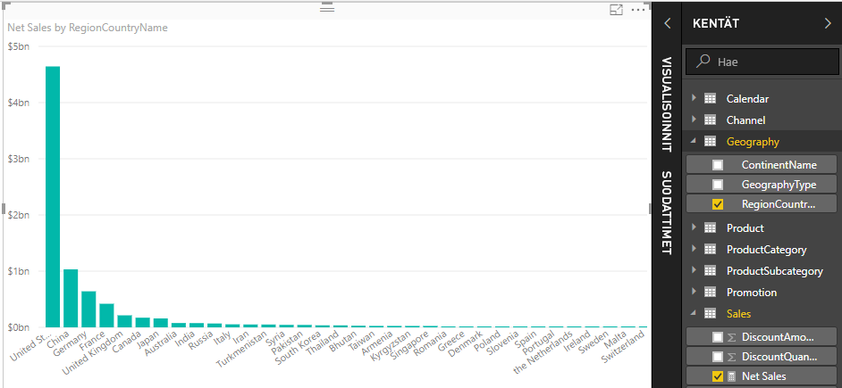
    
Kun haluat nähdä maakohtaisen nettomyynnin ja kokonaismyynnin välisen eron, valitse **SalesAmount**-kenttä tai vedä se kaavioon. 

Kaaviossa käytetään nyt kahta mittayksikköä: SalesAmount-mittayksikköä, joka laskettiin yhteen automaattisesti, ja luomaasi Net Sales -mittayksikköä. Kumpikin mittayksikkö laskettiin toisen kentän, RegionCountryName-kentän, kontekstissa.
    
### Mittayksikön käyttäminen osittajan kanssa

Voit lisätä osittajan suodattaaksesi lisää kalenterivuosittaista nettomyyntiä ja myyntimäärää.
    
1.  Napsauta kaavion vieressä olevaa tyhjää aluetta ja valitse sen jälkeen **Visualisoinnit**-kentästä **Taulukko**-visualisointi. Tämä luo tyhjän taulukkovisualisoinnin raporttipohjaan.
    
    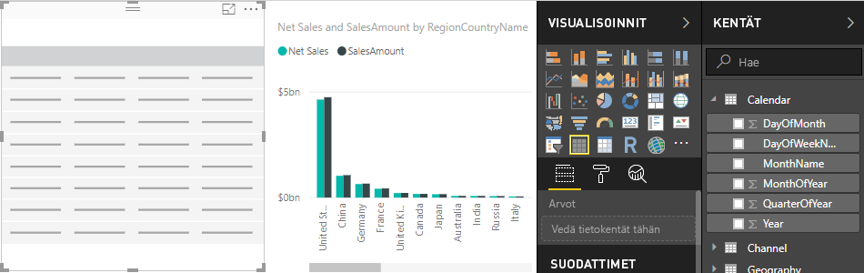
    
2.  Vedä **Calendar** (Kalenteri) -taulukon **Year** (Vuosi) -kenttä uuteen tyhjään taulukkovisualisointiin. Koska vuosikenttä on numeerinen, Power BI Desktop laskee sen arvot yhteen, mutta koosteena tämä ei ole kovinkaan järkevää. 
    
    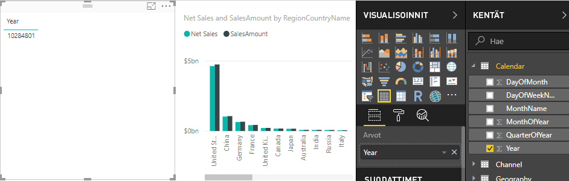
    
3.  Valitse Visualisoinnit-ruudun **Arvot**-kohdasta **Year** (Vuosi) -valinnan vieressä näkyvä alaspäin osoittava nuoli ja valitse avautuvasta valikosta **Älä tee yhteenvetoa**. Taulukko näyttää nyt vuodet erikseen lueteltuina.
    
    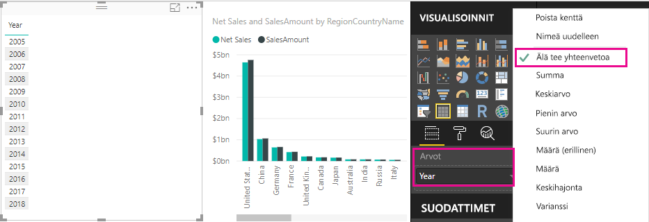
    
4.  Valitse Visualisoinnit-ruudun **Osittaja**-kuvake, jolloin taulukko muuttuu osittajaksi.

    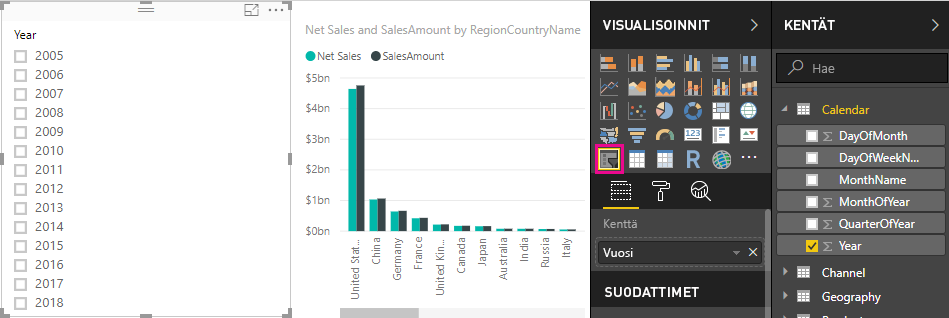
    
5.  Valitse mikä tahansa arvo **Year** (Vuosi) -osittajasta, jolloin **maakohtaisen nettomyynnin ja myyntimäärän** kaavio suodattuu sen mukaisesti. Net Sales (Nettomyynti)- ja SalesAmount (Myyntimäärä) -mittayksiköt laskevat tulokset uudestaan ja näyttävät ne valitun vuosikentän kontekstissa. 
    
    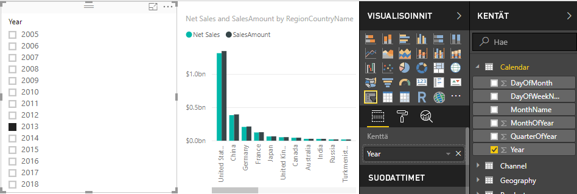

### Oman mittayksikön käyttö toisessa mittayksikössä

Haluat selvittää, minkä tuotteiden nettomyyntimäärä myytyä yksikköä kohti on korkein, joten tarvitset mittayksikön, joka jakaa nettomyynnin myytyjen yksiköiden määrällä. Voit luoda uuden mittayksikön, joka jakaa Net Sales (Nettomyynti) -mittayksikön Sales[SalesQuantity]-mittayksikön summalla.

1.  Luo Sales-taulukkoon uusi mittayksikkö nimeltä **Net Sales per Unit** (Nettomyynti yksikköä kohti).
    
2.  Ala kirjoittaa kaavariville **Net Sales** -sanaa. Ehdotusluettelo näyttää, mitä voit lisätä. Valitse **[Net Sales]**.
    
    
    
    Voit viitata mittayksiköihin myös vain kirjoittamalla avaavan hakasulkeen (**[**). Ehdotusluettelossa näkyvät vain kaavaan lisättävät mittayksiköt.
    
    
    
3.  Lisää välilyönti, jako-operaattori (**/**), toinen välilyönti, SUM-funktio ja kirjoita **Quantity** (Määrä). Ehdotusluettelo näyttää kaikki sarakkeet, joiden nimessä on sana Quantity. Valitse **Sales[SalesQuantity]**, kirjoita loppusulje ja vahvista kaava painamalla ENTER-näppäintä tai valitsemalla valintamerkki. Kaavan pitäisi näyttää tältä:
    
    `Net Sales per Unit = [Net Sales] / SUM(Sales[SalesQuantity])`
    
4. Valitse **Net Sales per Unit** -mittayksikkö Sales-taulukosta tai vedä se raporttipohjan tyhjään alueeseen. Kaavio näyttää nettomyyntimäärän yksikköä kohti kaikkien myytyjen tuotteiden osalta, mikä ei ole kovin informatiivista. 
    
    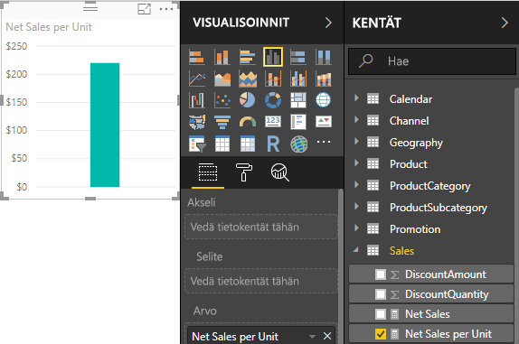
    
5. Voit muuttaa kaavion ulkoasua muuttamalla visualisointityypiksi **puukartan**.
    
    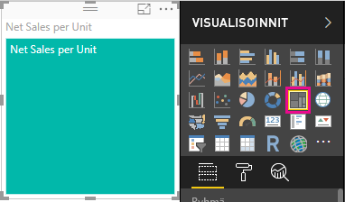
    
6. Valitse **Product Category** (Tuoteluokka) -kenttä tai vedä se puukarttaan tai Visualisoinnit-ruudun Ryhmä-kenttään. Nyt käytössäsi on hyödyllisiä tietoja!
    
    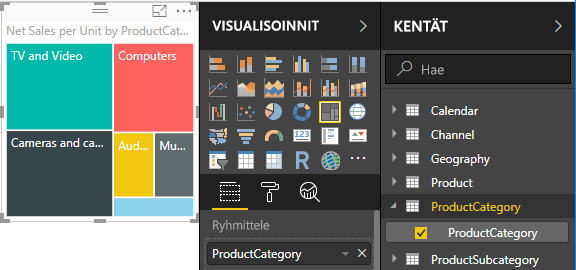
    
7. Yritä poistaa **ProductCategory**-kenttä ja vedä **ProductName**-kenttä kaavioon sen tilalle. 
    
    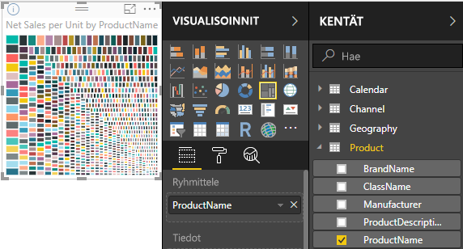
    
Ok, nyt vain leikimme, mutta lienet samaa mieltä, että tämä on hauskaa! Kokeile myös muita tapoja suodattaa ja muotoilla visualisointia.

## Opitut asiat
Mittayksiköiden avulla saat paljon merkityksellisiä tietoja omista tiedoistasi. Olet oppinut, kuinka voit luoda mittayksiköitä käyttämällä kaavariviä, miten voit nimetä ne järkevimmäksi havaitsemallasi tavalla ja kuinka voit hakea ja valita oikeat kaavan osat käyttämällä DAX-ehdotusluetteloita. Lisäksi olet tutustunut kontekstiin, jossa laskutoimitusten tulokset mittayksiköissä muuttuvat muiden kenttien tai kaavan muiden lausekkeiden mukaan.

## Seuraavat vaiheet
- Lisätietoja Power BI Desktopin pikamittareista, jotka tekevät puolestasi monia yleisiä mittarilaskutoimituksia, saat artikkelista [Pikamittareiden avulla voit suorittaa helposti yleisiä ja tehokkaita laskutoimituksia](desktop-quick-measures.md).
  
- Jos haluat tutustua tarkemmin DAX-kaavoihin ja siihen, miten voit luoda edistyneempiä mittayksiköitä, lue [DAX-perusteet Power BI Desktopissa](desktop-quickstart-learn-dax-basics.md). Tässä artikkelissa keskitytään DAX-peruskäsitteisiin, kuten syntaksiin ja funktioihin, ja annetaan tarkempaa tietoa kontekstista.
  
- Muista lisätä [Data Analysis Expressions (DAX) -viite](https://msdn.microsoft.com/library/gg413422.aspx) suosikkeihin. Sieltä saat tarkempia tietoja DAX-syntaksista ja -operaattoreista sekä yli 200 DAX-funktiosta.

