# Opetusohjelma: Facebook-analytiikka Power BI Desktopin avulla

Tässä opetusohjelmassa opit tuomaan tietoja Facebookista ja käyttämään niitä Power BI Desktopissa. Muodostat yhteyden Power BI:n Facebook-sivulle, tuot sieltä tietoja, teet muunnoksia tuotuihin tietoihin ja käytät tietoja raportin visualisoinneissa.

> [!WARNING]
> Facebook-sovelluksen käyttöoikeuksienrajoitusten vuoksi tässä artikkelissa kuvatut kytkentätoiminnot eivät tällä hetkellä toimi oikein. Teemme yhteistyötä Facebookin kanssa, jotta voimme palauttaa tämän toiminnon käyttöön mahdollisimman pian.

## Yhteyden muodostaminen Facebook-sivulle

Tässä opetusohjelmassa käytetään tietoja [Microsoft Power BI:n Facebook-sivulta](https://www.facebook.com/microsoftbi) ( *https://www.facebook.com/microsoftbi* ). Et tarvitse erityisiä tunnistetietoja yhteyden muodostamiseen ja tietojen tuomiseen tältä sivulta henkilökohtaista Facebook-tiliä lukuun ottamatta.

1. Avaa Power BI Desktop ja valitse **Nouda tiedot** **Aloitus**-valintaikkunasta tai valitse valintanauhan **Aloitus**-välilehdeltä **Nouda tiedot** ja sitten **Lisää...** .
   
2. Valitse **Nouda tiedot** -valintaikkunan **Online-palvelut**-ryhmästä **Facebook** ja valitse sitten **Yhdistä**.
   
   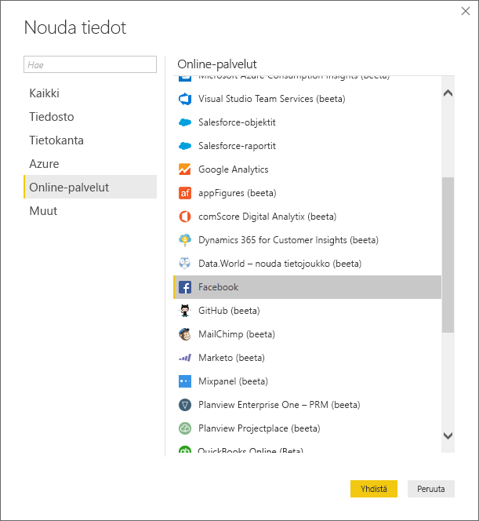
   
   Näyttöön tulee valintaikkuna, jossa varoitetaan kolmannen osapuolen palvelun käyttämisen riskeistä.
   
   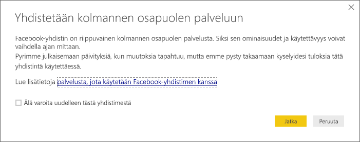
   
3. Valitse **Jatka**. **Facebook**-valintaikkuna tulee näkyviin.
   
4. Kirjoita tai liitä sivun nimi **microsoftbi** **Käyttäjänimi**-tekstiruutuun, valitse **Julkaisut** avattavasta **Yhteys**-luettelosta ja valitse sitten **OK**.
   
   
   
5. Tunnistetietoja pyydettäessä kirjaudu sisään Facebook-tilillesi ja salli Power BI:n käyttö tilisi kautta.
   
   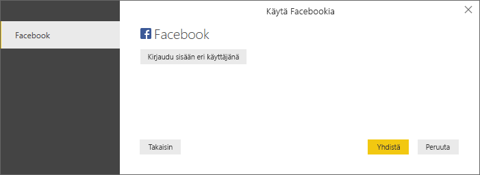

   Kun yhteys on muodostettu Power BI:n Facebook-sivulle, näet esikatselun sivun **Julkaisut**-tiedoista. 
   
   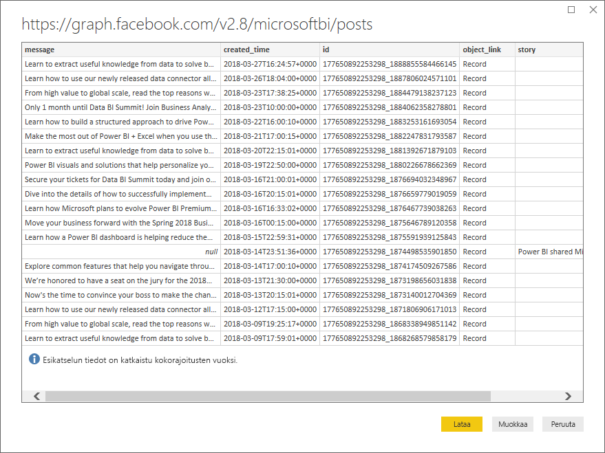
   
## Tuotujen tietojen muokkaaminen ja muuntaminen

Haluat nähdä ja näyttää, mitkä julkaisut ovat saaneet eniten kommentteja ajan mittaan, mutta huomaat **Julkaisut**-tietojen esikatselusta, että **created_time**-tietoja on vaikea lukea ja ymmärtää, eikä kommenttitietoja ole lainkaan. Sinun on muotoiltava ja siistittävä tietoja, jotta niistä saa kaiken irti. Voit muokata tietoja Power BI Desktopin **Power Query -editorin** avulla ennen niiden tuomista Power BI Desktopiin tai tuonnin jälkeen. 

### Päivämäärä/aika-sarakkeen jakaminen

Erota ensin **created_time**-sarakkeen päivämäärä- ja aika-arvot, jotta ne ovat helpommin luettavissa. 

1. Valitse Facebook-tietojen esikatselussa **Muokkaa**. 
   
   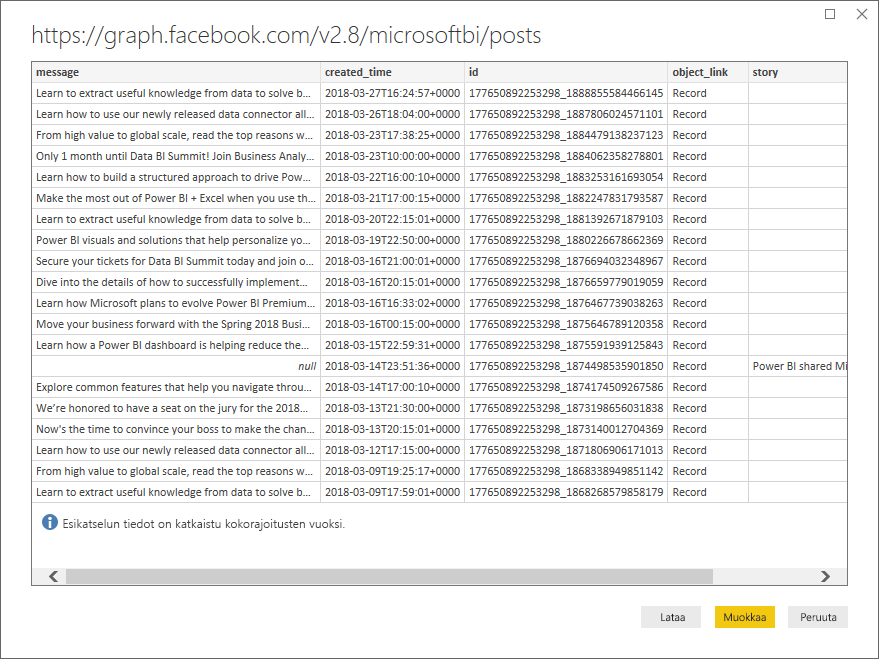
   
   Power BI Desktopin **Power Query -editori** avautuu uuteen ikkunaan ja näyttää tietojen esikatselun Power BI:n Facebook-sivulta. 
   
   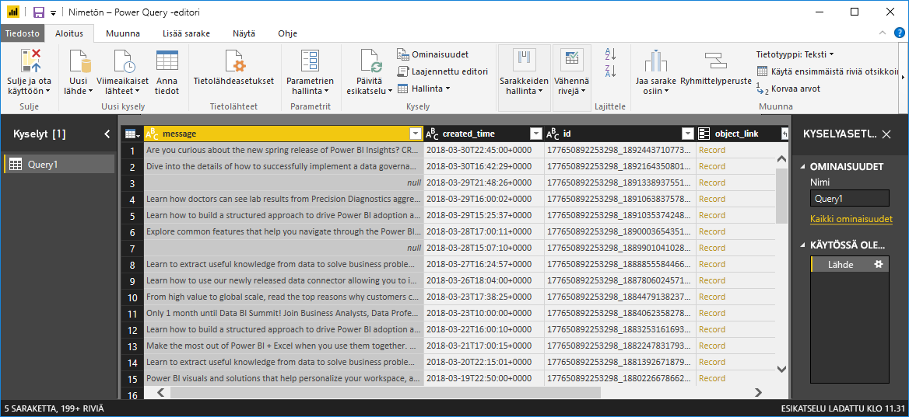
   
2. Valitse **created_time**-sarake. Huomaa, että se on tällä hetkellä tekstitietotyyppi, jonka merkiksi sarakeotsikossa on oranssi **ABC**-kuvake. Napsauta otsikkoa hiiren kakkospainikkeella ja valitse **Jaa sarake osiin > Erottimen mukaan** avattavasta luettelosta tai valitse **Jaa sarake > Erottimen mukaan** valintanauhan Aloitus-välilehden **Muunna**-kohdasta.  
   
   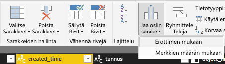
   
3. Valitse **Jaa sarake erottimen mukaan** -valintaikkunan avattavasta luettelosta **Mukautettu**, kirjoita **T** (merkki, joka on created_time-arvojen aikaosan alussa) syöttökenttään ja valitse **OK**. 
   
   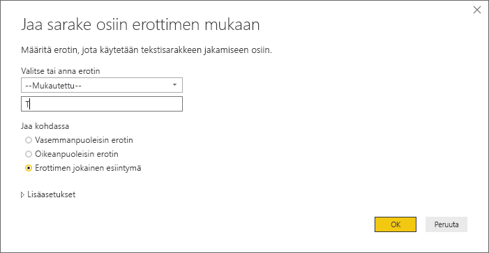
   
   Sarake jakautuu kahteen sarakkeeseen, jotka sisältävät merkkijonot ennen **T**-erotinta ja sen jälkeen, ja niille annetaan nimet **created_time.1** ja **created_time.2**. Huomaa, että Power BI on havainnut ja muuttanut tietotyypiksi automaattisesti **Päivämäärä** ensimmäisessä sarakkeessa ja **Aika** toisessa sarakkeessa ja muotoillut päivämäärä- ja aika-arvot helpommin luettaviksi.
   
4. Jos haluat nimetä sarakkeet uudelleen, kaksoisnapsauta sarakeotsikkoa tai valitse sarake ja sitten **Nimeä uudelleen** valintanauhan **Muunna**-välilehden **Mikä tahansa sarake** -ryhmässä ja kirjoita uudet sarakeotsikot **created_date** ja **created_time**.
   
   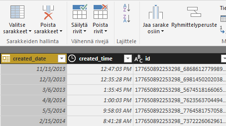
   
### Sisäkkäisen sarakkeen laajentaminen

Nyt kun päivämäärä- ja aikatiedot ovat sellaiset kuin haluat, voit näyttää kommenttitiedot laajentamalla sisäkkäisen sarakkeen. 

1. Valitse **object_link**-sarake ja avaa **Laajenna/koosta**-valintaikkuna valitsemalla -kuvake. Valitse **connections** ja sitten **OK**. 
   
   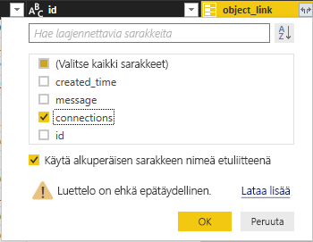
   
   Sarakeotsikoksi muuttuu **object_link.connections**.
2. Valitse uudelleen -kuvake **object_link.connections**-sarakkeen yläreunasta, valitse **comments** ja sitten **OK**. Sarakeotsikoksi muuttuu **object_link.connections.comments**.
   
3. Valitse -kuvake **object_link.connections.comments**-sarakkeen yläreunasta ja valitse tällä kertaa **Koosta** Laajenna-valintaikkunan sijaan. Valitse **# Count of id** ja valitse sitten **OK**. 
   
   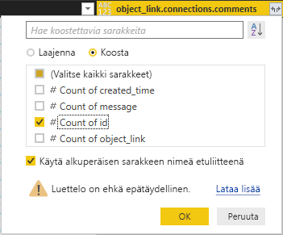
   
   Sarakkeessa näkyy nyt jokaisen viestin kommenttien määrä. 
   
4. Anna **Count of object_link.connections.comments.id** -sarakkeen uudeksi nimeksi **Kommenttien määrä**.
   
5. Valitse **Kommenttien määrä** -otsikon vieressä oleva alanuoli ja valitse **Lajittele laskevasti**, jolloin näet julkaisut järjestettyinä eniten kommentteja saaneista vähiten kommentteja saaneisiin. 
   
   
   
### Kyselyn vaiheiden tarkistaminen

Kun muotoilit ja muunsit tietoja **Power Query -editorissa**, kukin vaihe tallennettiin Power Query -editori-ikkunan oikealla puolella olevan **Kyselyasetukset**-ruudun **Käytössä olevat vaiheet** -alueelle. Voit palata takaisin käytössä oleviin vaiheisiin, jos haluat nähdä, mitä muutoksia olet tarkalleen tehnyt, ja muokata tai poistaa niitä tai järjestää ne tarvittaessa uudelleen (vaikka tämä voi olla riskialtista, koska edeltävien vaiheiden muuttaminen voi haitata myöhempiä vaiheita). 

Kun olet ottanut tietojen muunnokset käyttöön, Käytössä olevien vaiheiden pitäisi näyttää seuraavalta:
   
   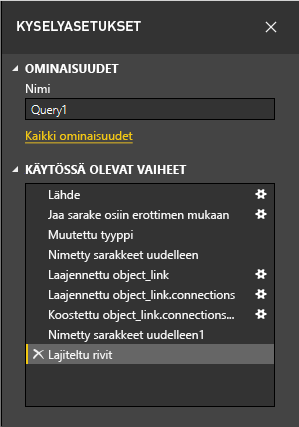
   
   >[!TIP]
   >Käytössä olevien vaiheiden pohjana ovat **Power Query -kielellä** eli **M**-kielellä kirjoitetut kaavat. Voit tarkastella ja muokata kaavoja valitsemalla **Laajennettu editori** valintanauhan Aloitus-välilehden **Kysely**-ryhmästä. 

### Muunnettujen tietojen tuominen

Kun olet tyytyväinen tietoihin, valitse **Sulje ja ota käyttöön** > **Sulje ja ota käyttöön** valintanauhan Aloitus-välilehdeltä, jolloin tiedot tuodaan Power BI Desktopiin. 
   
   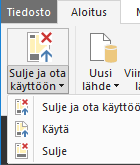
   
   Valintaikkunassa näkyy tietojen Power BI Desktop -tietomalliin lataamisen edistyminen. 
   
   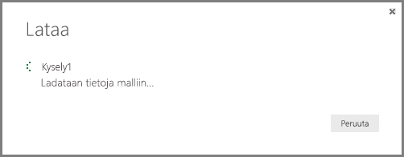
   
   Kun tiedot on ladattu, ne näkyvät raporttinäkymässä uutena kyselynä Kentät-luettelossa.
   
   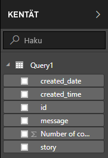
   
## Tietojen käyttäminen raportin visualisoinneissa 

Nyt kun olet tuonut tietoja Facebook-sivulta, voit nopeasti ja helposti saada merkityksellisiä tietoja tiedoistasi visualisointien avulla. Visualisoinnin luominen on helppoa; valitse kenttä tai vedä se **Kentät**-luettelosta raporttipohjaan.

### Palkkikaavion luominen

1. Valitse Power BI Desktop -raporttinäkymässä **viesti** kenttäluettelosta tai vedä se pohjaan. Pohjaan tulee taulukko, jossa näkyvät kaikki kansioviestit. 
   
   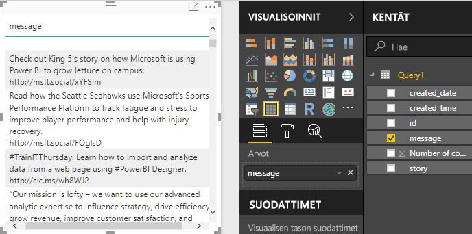
   
2. Kun taulukko on valittuna, valitse myös **Kommenttien määrä** Kentät-luettelosta tai vedä se taulukkoon. 
   
3. Valitse **Pinottu palkkikaavio** -kuvake Visualisoinnit-ruudusta. Taulukko muuttuu palkkikaavioksi, joka näyttää julkaisukohtaisen kommenttimäärän. 
   
   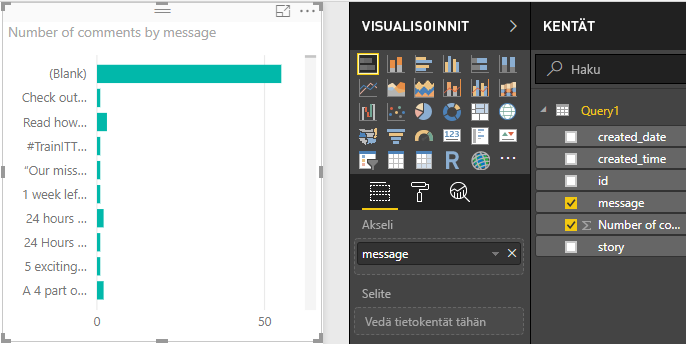
   
4. Valitse kolme pistettä (...) visualisoinnin oikeasta yläkulmasta ja lajittele taulukko sitten laskevaan järjestykseen kommenttien määrän mukaan valitsemalla **Lajittele kommenttien määrän mukaan**. 
   
   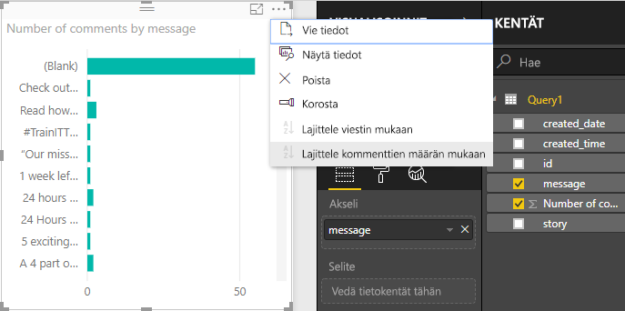
   
5. Huomaa, että useimmat kommentit liittyivät **tyhjiin** viesteihin (nämä viestit ovat voineet olla tarinoita, linkkejä, videoita tai muuta kuin tekstisisältöä). Jos haluat suodattaa tyhjän rivin pois, valitse **viesti (kaikki)** Visualisoinnit-ruudun alareunan **Suodattimet**-kohdasta, valitse **Valitse kaikki** ja sitten  **Tyhjä**, jolloin sen valinta poistuu. Suodattimet-kohdan merkinnäksi muuttuu **viesti ei ole (tyhjä)** , ja tyhjä rivi katoaa kaavion visualisoinnista. 
   
   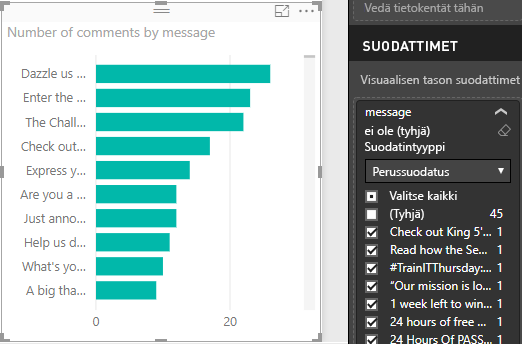
   
### Kaavion muotoileminen

Visualisointi muuttuu kiinnostavammaksi, mutta et näe paljon julkaisun tekstiä kaaviossa. Jos haluat näyttää enemmän julkaisun tekstiä:

1. Muuta kaavion koko mahdollisimman suureksi kaavion visualisoinnissa olevien kahvojen avulla. 
   
2. Kun kaavio on valittuna, valitse **muotoilukuvake** (maalitela) Visualisoinnit-ruudusta.
   
3. Valitse **Y-akselin** vieressä oleva alanuoli ja vedä **Enimmäiskoko**-kohdan vieressä oleva liukusäädin kokonaan oikealle (50 %). 
4. Pienennä myös **Tekstikoko** arvoon **10**, jotta tekstiä mahtuu enemmän.
   
   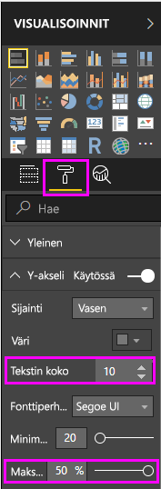
   
   Kaaviossa näkyy nyt enemmän julkaisun sisältöä. 
   
   
   
Kaavion X-akselilla (kommenttien määrä) ei näytä tarkkoja arvoja, ja se näyttää katoavan kaavion alareunaan. Päätät käyttää arvopisteiden otsikoita sen sijaan. 

1. Valitse muotoilukuvake ja valitse sitten **X-akselin** vieressä oleva liukusäädin ja siirrä se **Ei käytössä** -asentoon. 
   
2. Valitse **Arvopisteiden otsikot** -kohdan vieressä oleva liukusäädin ja siirrä se **Käytössä**-asentoon. Kaaviossa näkyy nyt kunkin julkaisun tarkka kommenttimäärä.
   
   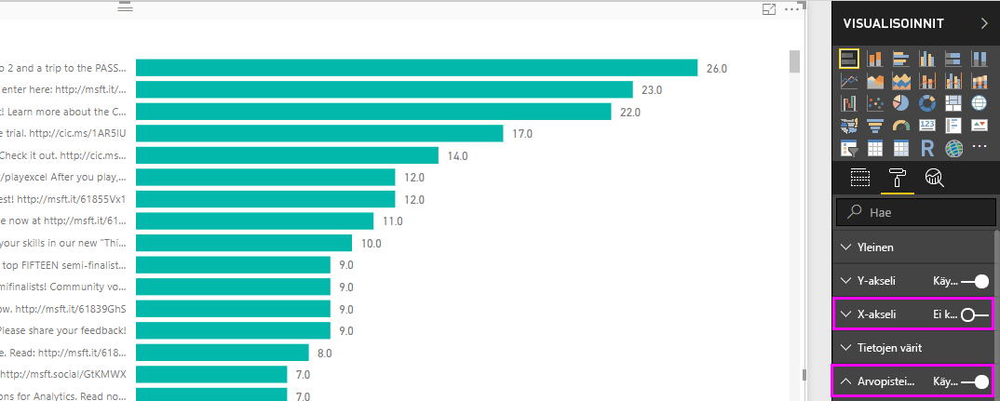
   
### Tietotyypin muokkaaminen

Näyttää paremmalta, mutta kaikissa arvopisteiden otsikoissa näkyy desimaalin tarkkuus **.0**, joka on häiritsevä ja harhaanjohtava, koska **Julkaisujen määrän** täytyy olla kokonaisluku. Sinun on muutettava **Julkaisujen määrä** -sarakkeen tietotyypiksi kokonaisluku.

1. Muokkaa tietotyyppiä napsauttamalla Kentät-luettelon **Kysely1**-kohtaa hiiren kakkospainikkeella tai siirtämällä hiiren osoitin sen päälle ja valitsemalla **Enemmän vaihtoehtoja** -ellipsi (...) ja sitten **Muokkaa kyselyä**. Voit myös valita **Muokkaa kyselyitä** valintanauhan Aloitus-välilehden **Ulkoiset tiedot** -alueelta ja sitten **Muokkaa kyselyitä** avattavasta luettelosta. Power BI Desktopin **Power Query -editori** avautuu erilliseen ikkunaan.
   
   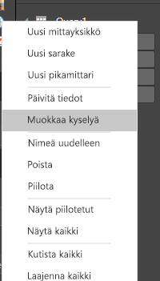     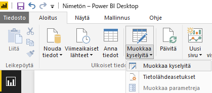
   
2. Valitse Power Query -editorissa **Kommenttien määrä** -sarake ja muuta tietotyypiksi **Kokonaisluku** jollakin seuraavista tavoista: 
   - Valitse **Kommenttien määrä** -sarakeotsikon vieressä oleva **1.2**-kuvake ja valitse **Kokonaisluku** avattavasta luettelosta.
   - Napsauta sarakeotsikkoa hiiren kakkospainikkeella ja valitse **Muuta tyyppi > Kokonaisluku**.
   - Valitse **Tietotyyppi: desimaaliluku** Aloitus-välilehden **Muunna**-ryhmästä, tai valitse **Muunna**-välilehden **Mikä tahansa sarake** -ryhmä ja valitse sieltä **Kokonaisluku**.
   
   Sarakeotsikon kuvakkeeksi muuttuu **123** osoittamaan Kokonaisluku-tietotyyppiä.
   
   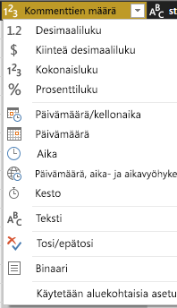
   
3. Ota muutokset käyttöön valitsemalla **Sulje ja ota käyttöön** tai vain **Ota käyttöön**, jolloin Power Query -editori-ikkuna pysyy auki. Kun muutokset ladataan, kaavion arvopisteiden otsikot muuttuvat kokonaisluvuiksi. 
   
   
   
### Päivämääräosittajan luominen

Haluat visualisoida julkaisujen saamien kommenttien määrän ajan kuluessa. Voit luoda osittajavisualisoinnin, jossa kaavion tiedot on suodatettu eri aikaväleihin. 

1. Napsauta pohjan tyhjää aluetta ja valitse **osittajakuvake** Visualisoinnit-ruudusta. Näyttöön avautuu tyhjä osittajavisualisointi. 
   
   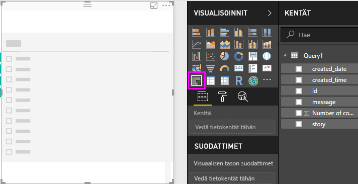
   
2. Valitse **created_date**-kenttä Kentät-luettelosta tai vedä se uuteen osittajaan. Osittaja muuttuu päivämääräalueen liukusäätimeksi kentän Päivämäärä-tietotyypin perusteella.
   
   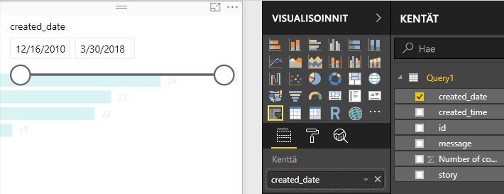
   
3. Valitse eri päivämääräalueet siirtämällä liukusäätimen kahvoja ja huomaa, miten kaavion tiedot suodatetaan vastaavasti. Voit myös valita osittajan päivämääräkentät ja kirjoittaa tietyt päivämäärät tai valita ne kalenteri-ponnahdusikkunasta.
    
   
   
### Visualisointien muotoilu

Päätät antaa kaaviolle paremmin kuvaavan ja kiinnostavan otsikon. 

1. Kun kaavio on valittuna, valitse **muotoilukuvake** ja laajenna **Otsikko** valitsemalla alanuolipainike.
2. Muuta **Otsikkoteksti**-kohtaan **Julkaisukohtaiset kommentit**. 
3. Valitse **Fontin väri** -kohdan alanuolipainike ja valitse sitten vihreä väri vastaamaan visualisoinnin vihreitä palkkeja.
4. Suurenna **Tekstin koko** -arvoksi **10** ja muuta **Fonttiperheeksi** **Segoe (lihavoitu)** .

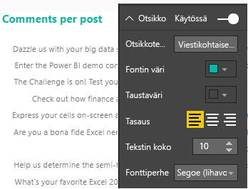

Voit muuttaa visualisointiesi ulkonäköä kokeilemalla muita muotoiluvaihtoehtoja ja -asetuksia. 

## Uusien visualisointien luominen

Kuten näet, on helppoa mukauttaa raporttiesi visualisointeja ja esittää tiedot haluamallasi tavalla. Kokeile esimerkiksi luoda tuotujen Facebook-tietojen avulla tämä viivakaavio, joka näyttää kommenttimäärän ajan kuluessa.

Power BI Desktop tarjoaa saumattoman kokemuksen alusta loppuun. Sen avulla voit hakea tietoja laajasta tietolähteiden joukosta ja muotoilla ne analyysitarpeidesi mukaan ja visualisoida tiedot monipuolisilla ja vuorovaikutteisilla tavoilla. Kun raportti on valmis, voit [ladata sen Power BI -palveluun](desktop-upload-desktop-files.md) ja luoda siihen perustuvia koontinäyttöjä, joita voit jakaa muiden Power BI -käyttäjien kanssa.

## Seuraavat vaiheet
* [Lue muita Power BI Desktop -opetusohjelmia](http://go.microsoft.com/fwlink/?LinkID=521937)
* [Katso Power BI Desktop -videoita](http://go.microsoft.com/fwlink/?LinkID=519322)
* [Käy Power BI -keskustelupalstalla](http://go.microsoft.com/fwlink/?LinkID=519326)
* [Lue Power BI -blogia](http://go.microsoft.com/fwlink/?LinkID=519327)

