# Opetusohjelma: Verkkosivun tietojen analysointi Power BI Desktopilla

Pitkäaikaisena jalkapallofanina haluat raportin UEFA Euroopan mestaruuskisojen voittajista. Power BI Desktopilla voit tuoda nämä tiedot verkkosivulta raporttiin ja luoda visualisointeja näyttämään tietoja. Tässä opetusohjelmassa opit miten Power BI Desktopilla:

- muodostetaan yhteys verkkotietolähteeseen ja siirrytään käytettävissä olevien taulukoiden välillä,
- muotoillaan ja muunnetaan tietoa Power Query -editorissa,
- annetaan kyselylle nimi ja tuodaan se Power BI Desktop -raporttiin,
- luodaan ja mukautetaan kartan ja ympyräkaavio visualisointeja.

## Yhteyden muodostaminen verkkotietolähteeseen

Voit saada UEFA voittajatiedot tulostaulukosta UEFA mestaruuskisojen Wikipedia-sivulta osoitteesta https://en.wikipedia.org/wiki/UEFA_European_Football_Championship. 

Verkkoyhteydet muodostetaan vain perustodentamista käyttämällä. Todentamista vaativat verkkosivustot eivät välttämättä toimi kunnolla verkkoyhdistimen kanssa.

Tietojen tuominen:

1. Power BI Desktopin **Koti** -valintanauhan välilehdeltä, avaa nuoli **Nouda tiedot**-kohdan vierestä ja valitse sitten **Verkko**.

   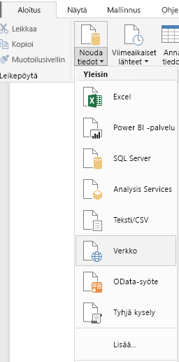 

   >[!NOTE]
   >Voit myös valita **Nouda tiedot** -kohteen itse tai valita **Nouda tiedot** Power BI Desktopin aloitusvalintaikkunasta. Valitse sitten **Verkko**  **Kaikki**- tai **Muut**-osiosta **Nouda tiedot** -valintaikkunasta, ja valitse sitten **Yhdistä**.

1. Liitä URL-osoite **Verkosta**`https://en.wikipedia.org/wiki/UEFA_European_Football_Championship`-valintaikkunan **URL** -tekstiruutuun ja valitse sitten **OK**.

    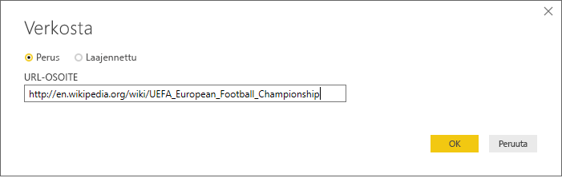

   Kun olet yhdistänyt Wikipedia-verkkosivuun, **Siirtymistoiminto**-valintaikkunassa näkyy luettelo sivun käytettävissä olevista taulukoista. Voit valita minkä tahansa taulukon nimen tarkastellaksesi sen sisältämiä tietoja. **Tulokset [muokkaa]** -taulukko sisältää haluamasi tiedot, vaikka ne eivät olekaan tarkalleen haluamassasi muodossa. Voit muotoilla uudelleen ja puhdistaa tiedot ennen niiden lataamista raporttiin.

   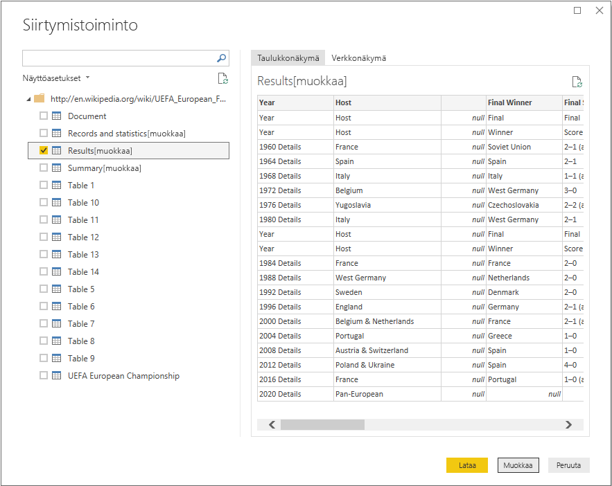

   >[!NOTE]
   >**Esikatselu**-ruutu näyttää viimeisimmän valitun taulukon, mutta kaikki valitut taulukot ladataan Power Query -editoriin, kun valitset **Muunna tietoja** tai **Lataa**.

1. Valitse **Tulokset [muokkaa]** -taulukko **Siirtymistoiminto**-luettelosta, ja valitse sitten **Muunna tiedot**.

   Taulukon esikatselu avautuu **Power Query -editoriin**, jossa voit soveltaa muunnoksia tietojen puhdistamiseksi.

   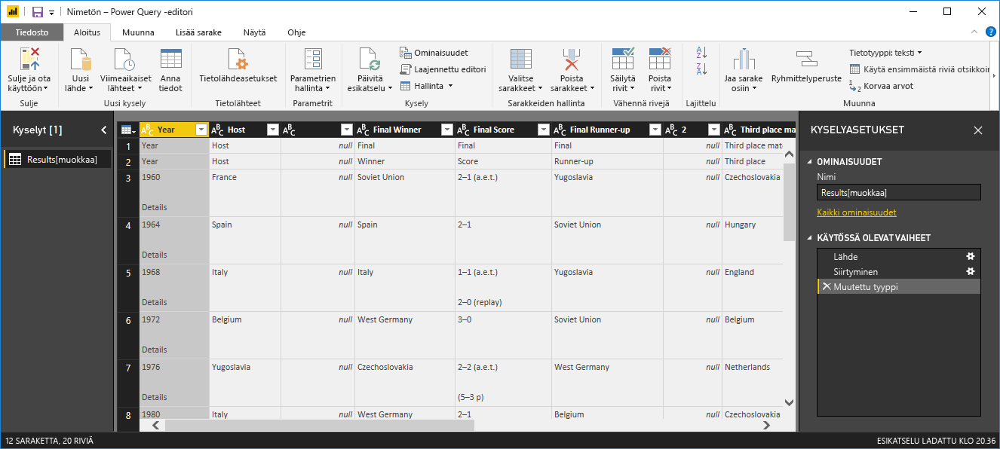

## Tietojen muotoileminen Power Query -editorissa

Haluat tehdä tietojen tarkastelemisesta helpompaa näyttämällä vain vuodet sekä voittajamaat. Voit käyttää Power Query -editoria tietojen muotoilemiseen ja puhdistamiseen.

Poista taulukosta ensin kaikki sarakkeet kahta saraketta lukuun ottamatta. Nimeä nämä sarakkeet prosessissa myöhemmin uudelleen (*Vuosi* ja *Maa*).

1. Valitse sarakkeet **Power Query -editorin** ruudukossa. Valitse useita kohteita valitsemalla Ctrl.

1. Napsauta hiiren kakkospainiketta ja valitse **Poista muut sarakkeet** tai valitse **Poista sarakkeet** > **Poista muut sarakkeet** **Hallitse sarakkeita** -ryhmästä **Aloitus**-valintanauhan välilehdeltä kaikkien muiden sarakkeiden poistamiseksi taulukosta.

   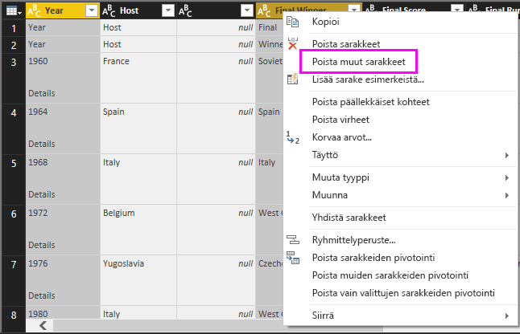

   tai

   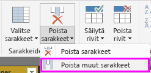

Poista seuraavaksi ylimääräinen *Tiedot*-sana ensimmäisen sarakkeen soluista.

1. Valitse ensimmäinen sarake.

1. Napsauta hiiren kakkospainiketta ja valitse **Korvaa arvot** tai valitse **Korvaa arvot** **Muunna**-ryhmän valintanauhan **Aloitus**-välilehdeltä. Tämä vaihtoehto löytyy myös **Mikä tahansa sarake** -ryhmästä **Muunna**-välilehdeltä.

   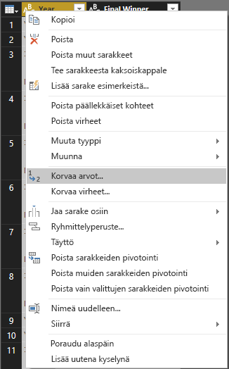 

   tai

   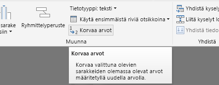

1. Kirjoita **Korvaa arvot** -valintaikkunassa **Tiedot**-teksti **Etsittävä arvo** -tekstiruutuun ja jätä **Korvaa arvolla** -tekstiruutu tyhjäksi. Valitse sitten **OK** poistaaksesi *Tiedot*-sanan tästä sarakkeesta.

   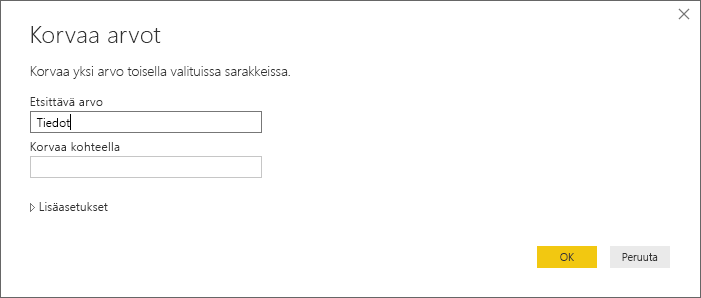

Jotkin solut sisältävät vain sanan ”Vuosi” vuosiarvojen sijaan. Voit suodattaa sarakkeen näyttämään vain rivit, jotka eivät sisällä sanaa ”Vuosi”.

1. Valitse sarakkeen suodattimen alanuoli.

1. Vieritä avattavaa valikkoa alaspäin ja tyhjennä **Vuosi**-vaihtoehdon vieressä oleva valintaruutu ja valitse sitten **OK**.

   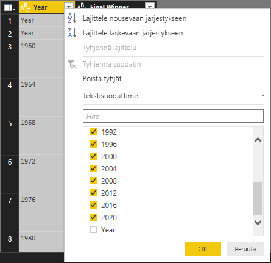

Koska etsit nyt vain finaalien voittajatietoja, voit nimetä toisen sarakkeen uudelleen **Maa**-sarakkeeksi. Sarakkeen uudelleennimeäminen:

1. Kaksoisnapsauta tai napauta ja pidä pohjassa toisen sarakkeen otsikkoa, tai
   - napsauta hiiren kakkospainikkeella sarakkeen otsikkoa ja valitse **Nimeä uudelleen**, tai
   - valitse *sarake ja valitse **Nimeä uudelleen** **Mikä tahansa sarake** -ryhmästä valintanauhan **Muunna**-välilehdeltä.

   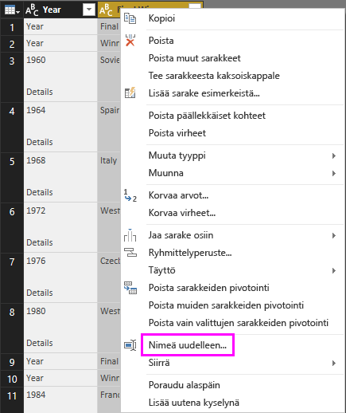 
  
   tai

   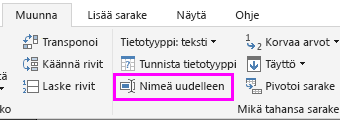

1. Syötä sana **Maa** otsikkoon ja paina **Enter** nimetäksesi sarakkeen uudelleen.

Voit myös suodattaa **Maa**-sarakkeesta pois rivit, jotka eivät sisällä käypiä arvoja, kuten ”2020”. Voit käyttää suodatinvalikkoa samalla tavalla kuin suodattaessasi **Vuosi**-sarakkeen arvoja, tai voit:

1. napsauttaa hiiren kakkospainikketta **Maa**-solun **2020**-rivillä, jonka on arvo *tyhjä*.

1. Valitse **Tekstisuodattimet** > **Ei ole yhtä suuri kuin**-pikavalikosta rivit, jotka sisältävät solun arvon.

   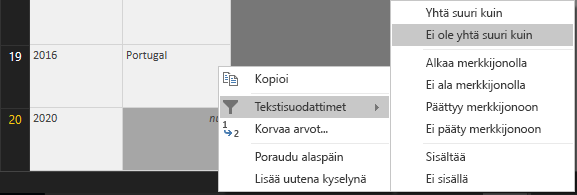

## Kyselyn tuominen raporttinäkymään

Nyt kun olet muotoillut tietoja haluamallasi tavalla, voit nimetä kyselysi ”Euroopan-mestaruus voittajat”-nimiseksi ja tuoda sen raporttiisi.

1. **Kyselyasetukset**-ruudun **Nimi**-tekstikenttään syötä **Euroopan-mestaruuskisojen voittajat**.

   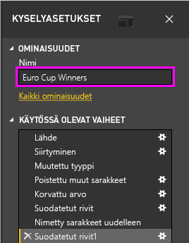

1. Valitse **Sulje ja ota käyttöön** > **Sulje ja ota käyttöön** **Koti** -valintanauhan välilehdeltä.

   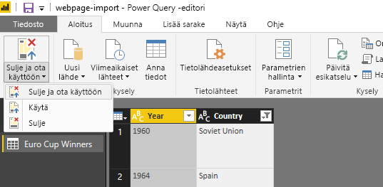

Kysely ladataan Power BI Desktopin *Raportti*-näkymään, jossa se näkyy **Kentät** -ruudussa.

   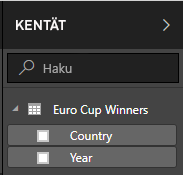

>[!TIP]
>Pääset aina takaisin Power Query -editoriin, jossa voit muokata ja hienosäätää kyselyäsi:
>- valitsemalla **Lisäasetuksista** kolme pistettä ( **...** ) **Euroopan-mestaruus voittajat** -kohdan vierestä**Kentät**-ruudusta ja valitsemalla **Muokkaa kyselyä**, tai
>- valitsemalla **Muokkaa kyselyitä** > **Muokkaa kyselyitä** **Ulkoiset tiedot** - ryhmästä raporttinäkymän **Koti** -valintanauhasta. 

## Visualisoinnin luominen

Luodaksesi tietoihin perustuvan visualisoinnin:

1. Valitse **Maa** -kenttä **Kentät**-ruudusta tai vedä se raporttipohjaan. Power BI Desktop tunnistaa tiedot maan niminä ja luo automaattisesti **Kartta** -visualisoinnin.

   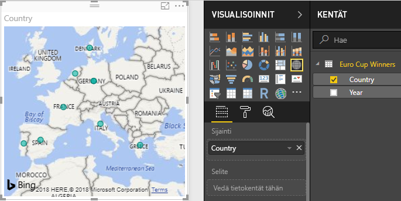

1. Suurenna karttaa vetämällä kulmien kahvoista, jotta kaikki maiden nimet ovat näkyvissä.  

   

1. Kartassa näkyvät kaikki identtiset arvopisteet jokaisesta maasta, jotka on voittanut Euro Cup -turnauksen. Saadaksesi kunkin arvopisteen koon kuvastamaan kuinka usein maan on voittanut, vedä **Vuosi**-kenttä **Vedä tietokentät tähän** -kohtaan **Koko**-valikon alla, **Visualisoinnit**-ruudun alaosassa. Kenttä muuttuu automaattisesti **Vuosien määrä** -mittariksi ja kartan visualisointi näyttää nyt niiden maiden arvopisteet suurempina, jotka ovat voittaneet useimpia turnauksia.

   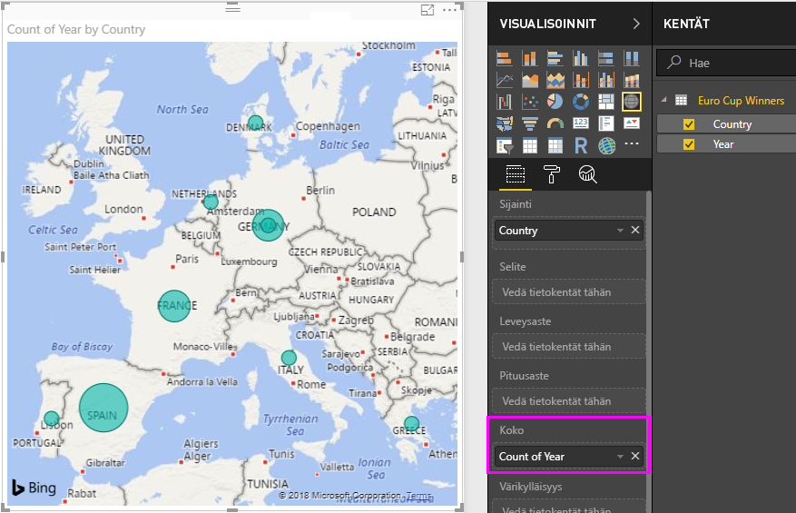

## Visualisointien mukauttaminen

Visualisointien luominen tietojen perusteella on siis hyvin helppoa. Helppoa on myös niiden mukauttaminen halutusti niin, että ne esittävät tiedot paremmin.

### Kartan muotoileminen

Voit muuttaa visualisoinnin ulkoasua valitsemalla sen ja valitsemalla sitten **Muotoile**-kuvakkeen (maalirulla) **Visualisoinnit**-ruudussa. Visualisointisi ”Saksa”-arvopisteet saattavat olla esimerkiksi harhaanjohtavia, koska Länsi-Saksa on voittanut kaksi turnausta ja Saksa yhden, ja kartta kerrostaa nämä kaksi arvopistettä sen sijaan, että ne erotettaisiin toisistaan tai lisättäisiin yhteen. Voit määrittää näille kahdelle pisteelle eri värit tämän seikan korostamiseksi. Voit myös antaa kartalle sitä paremmin kuvaavan ja kiinnostavamman otsikon.

1. Kun visualisointi on valittu, valitse **Muotoile**-kuvake ja sitten **Tietojen värit**, avataksesi tietojen värit -valikon.

   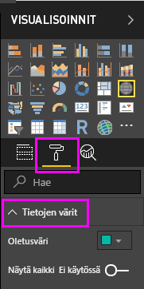

1. Aseta **Näytä kaikki** **Päällä**-tilaan, ja valitse sitten **Länsi-Saksa**-kohdan vieressä olevasta avautuvasta valikosta keltainen väri.

   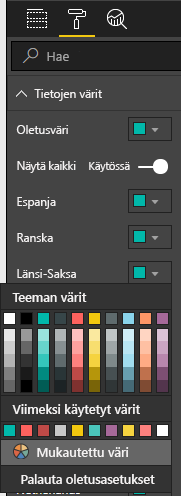

1. Valitse **Otsikko** avataksesi otsikon asetukset ja syötä **Otsikkoteksti**-kenttään nykyisen otsikon paikalle **Euroopan-mestaruus voittajat**.

1. Vaihda **Tekstin väri** punaiseksi, **Tekstikooksi** **12** ja **Fonttiperheeksi** **Segoe (lihavoitu)** .

   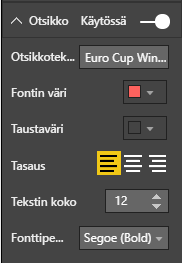

Kartta-visualisointi näyttää nyt tältä:

### Visualisointityypin muuttaminen

Voit muuttaa visualisoinnin tyyppiä valitsemalla sen ja valitsemalla sitten eri kuvakkeen **Visualisoinnit**-ruudun yläreunasta. Kartan visualisoinnista puuttuu esimerkiksi Neuvostoliiton ja Tšekkoslovakian tiedot, koska nämä maat ei ole enää olemassa maailman kartalla. Toinen visualisointityyppi, kuten puukaavio tai ympyräkaavio, voi olla tarkempi, koska siinä näkyvät kaikki arvot.

Jos haluat muuttaa kartan ympyräkaavioksi, valitse kartta ja valitse sitten **Ympyräkaavio**-kuvake **Visualisoinnit**-ruudussa.

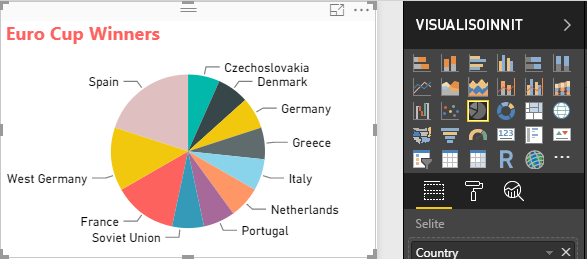

>[!TIP]
>- Voit käyttää **Tietojen värit** -muotoiluasetuksia ja tehdä ”Saksasta” ja ”Länsi-Saksasta” saman väriset. 
>- Ryhmitelläksesi eniten voittaneet maat yhteen ympyräkaaviossa, valitse kolme pistettä ( **...** ) visualisoinnin oikeassa yläkulmassa ja valitse sitten **Lajittele vuosien määrän mukaan**.

Power BI Desktop tarjoaa saumattoman kokemuksen alusta loppuun. Sen avulla voit hakea tietoja laajasta tietolähteiden joukosta ja muotoilla ne analyysitarpeidesi mukaan ja visualisoida tiedot monipuolisilla ja vuorovaikutteisilla tavoilla. Kun raportti on valmis, voit [ladata sen Power BI:hin](desktop-upload-desktop-files.md) ja luoda siihen perustuvia koontinäyttöjä, joita voit jakaa muiden Power BI -käyttäjien kanssa.

## Muuta aiheeseen liittyvää

* [Lue muita Power BI Desktop -opetusohjelmia](/power-bi/guided-learning/)
* [Katso Power BI Desktop -videoita](desktop-videos.md)
* [Käy Power BI -keskustelupalstalla](https://go.microsoft.com/fwlink/?LinkID=519326)
* [Lue Power BI -blogia](https://go.microsoft.com/fwlink/?LinkID=519327)

